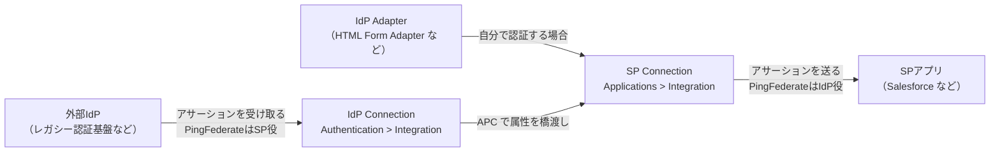
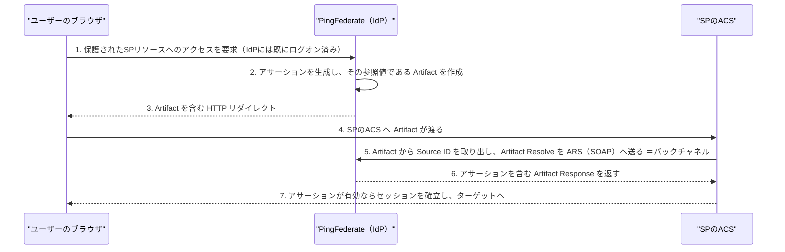

# 【勉強】Ping Identity — SSO／フェデレーション（SAML編）（2026-08-04）

## 今日のテーマ

Ping Identity で SAML SSO を組むとき、どこに何を設定するのかを押さえます。Entra ID 編・Okta 編と同じテーマですが、Ping は**オンプレの PingFederate** と**クラウドの PingOne** で設定の場所も用語も違うので、そこを整理するのが今日のゴールです。

## 概要 — Ping には SAML の入口が2つある

7/28 の全体像で見たとおり、Ping には老舗のオンプレ製品群（PingFederate など）とクラウドの PingOne があります。SAML SSO も、この2つで設定の作り方がまったく違います。

- **PingFederate** — 「フェデレーションサーバー」。**接続（Connection）**という単位で相手ごとに設定を作り込む。設定項目が非常に細かく、SAMLの仕様がほぼそのまま画面に出てくる。
- **PingOne** — クラウドの IDaaS。**アプリケーション（Application）**という単位で設定する。Okta や Entra ID の管理画面に近い感覚。

なお、後述するフェデレーションハブの解説ページには「**PingFederate bridges single sign-on (SSO) and single log-out (SLO) transactions between an identity provider (IdP) and a service provider (SP).**」とあります。IdP と SP の間に立つ仲介役にもなれる、というのが Ping らしいところです。

> **用語補足**
> - **IdP（Identity Provider）**: ユーザーを認証して「この人は本人です」という情報を発行する側。
> - **SP（Service Provider）**: その情報を受け取ってサービスを提供する側。多くの場合アプリ本体。
>
> PingFederate は IdP にも SP にもなれ、しかも**同時に両方**（フェデレーションハブ）にもなれます。

## 押さえる要点 — PingFederate 編

### 1. 作るのは「SP Connection」か「IdP Connection」か

ここが最初の分かれ道です。**自分が IdP として振る舞い、相手のアプリに SSO させたいなら「SP Connection」を作ります。**「相手の SP を記述する接続」だからです。逆に自分が SP 側で、外部の IdP から認証を受けるなら「IdP Connection」です。

- **SP Connection** → 管理コンソールの **Applications > Integration > SP Connections**
- **IdP Connection** → 管理コンソールの **Authentication > Integration > IdP Connections**

そしてこの2つを1台の中でつなぐと、**フェデレーションハブ（ブリッジング）**になります。つなぎ役は **APC（Authentication Policy Contract）** という、属性を橋渡しするための契約です。公式の手順は「①APC を作る → ②IdP Connection の Target Session Mapping に APC を追加 → ③SP Connection の Authentication Source Mapping に同じ APC を追加 → ④IdP 側と接続作業 → ⑤SP 側と接続作業」の5ステップです。

下図は、この「接続の向き」と、自分で認証する場合（IdP Adapter を使う場合）の関係を表したものです（公式にこの図はなく、公式の記述をもとに整理したものです）。



補足として、SP Connection に IdP Adapter インスタンスや APC を**複数**マップできますが、公式には「**PingFederate uses only one adapter instance or policy path to authenticate a user.**」と明記されています。実際に使われるのは1本だけ。そして「adapter や APC ごとに返す属性が違いうるので、**マッピングごとに attribute contract の埋め方を定義しなければならない**」とも書かれています。

### 2. Profile と Binding は別の概念

これは SAML 全般の話ですが、Ping のドキュメントが一番はっきり書いています。

> A SAML **profile** is the message-interchange scenario that you and your federation partner have agreed to use. SAML **binding**, by contrast, is the transport protocol of SAML messages.

- **Profile**（どういうシナリオか）= IdP-Initiated SSO / SP-Initiated SSO / IdP-Initiated SLO / SP-Initiated SLO
- **Binding**（どうやって運ぶか）= POST / Redirect / Artifact / SOAP

SAML Profiles タブでは SSO プロファイルを**少なくとも1つ**選ぶ必要があり、**SLO のオプションは SSO を選んだ後にしか有効化されません**。そして PingFederate はこの組み合わせで「**eight practical SSO scenarios**（8つの実用的な SSO シナリオ）」を定義しています。SP-initiated が6通り（POST-POST / Redirect-POST / Artifact-POST / POST-Artifact / Redirect-Artifact / Artifact-Artifact）、IdP-initiated が2通り（POST / Artifact）です。

いちばん一般的なのは **SP-initiated SSO—Redirect-POST**。SP が HTTP リダイレクト（302 または 303）で AuthnRequest を送り、IdP が HTML form の自動 POST でアサーションを返す流れです。ここは Entra ID 編・Okta 編で見たものと同じ骨格です。

### 3. Artifact バインディングという選択肢

Ping で新しく出てくるのが **Artifact** です。アサーション本体をブラウザ経由で運ぶのではなく、**参照値（Artifact）だけをブラウザ経由で渡し、実体はサーバー間の通信（バックチャネル）で取りに行く**方式です。



インフラ的に言えば、POST は「荷物そのものを客に持たせる」、Artifact は「引換券を客に持たせ、荷物は業者間の専用線で受け渡す」イメージです。アサーションがブラウザを通らないので、ブラウザ側に機密情報が露出しません。

**設定上の注意**：外向き（outbound）で Artifact を使うなら、内向き（inbound）の許可バインディングに **SOAP を含めなければなりません**。バックチャネルの取得要求が SOAP で飛んでくるからです。

> 注記：上図は公式の「IdP-initiated SSO—Artifact」（SAML 2.0）の Processing steps に沿っています。同じ手順は SAML 1.x の「SSO—Browser-Artifact」ページにも同一の内容で載っています。

### 4. Browser SSO の設定は「タブを順に埋める」作業

SP Connection の **Browser SSO** タブから **Configure Browser SSO** に入ると、SAML 2.0 では次の順で設定していきます。

| ステップ | 設定するもの |
| --- | --- |
| SAML Profiles | IdP-Initiated SSO / SP-Initiated SSO / 各SLO のどれを使うか |
| SSO token lifetime | Minutes Before / Minutes After。発行時刻の前後どれだけ有効とみなすか（どちらも既定5分） |
| Assertion Creation | Identity Mapping（名前の渡し方）、Attribute Contract（渡す属性）、Authentication Source Mapping（誰が認証するか） |
| Protocol Settings | ACS URL、SLO のURL、許可するバインディング、Artifact lifetime、Artifact resolver、署名ポリシー、暗号化ポリシー |

順序に制約があります。「**Before configuring Browser SSO protocol settings, you must first configure assertion configuration.**」＝ Assertion Creation を済ませないと Protocol Settings に進めません。

**Identity Mapping** の選択肢は3つです。

- **Standard** — username やメールアドレスなど、既知の属性でユーザーを識別して送る。SP 側は account mapping でローカルユーザーに突き合わせる。
- **Pseudonym** — 一意で不透明（opaque）な**永続的**識別子。IdP 側のユーザーIDには辿れない。SP は account linking に使える。
- **Transient** — **SSO のたびに違う識別子**になる。プライバシー重視の用途。

Standard を選ぶと Attribute Contract が必須になり、組み込みの `SAML_SUBJECT` が土台になります。追加属性は任意。逆に Pseudonym / Transient では「追加属性も含める」にチェックした場合のみ Attribute Contract 画面が出て、そのときは**少なくとも1つの属性が必須**です。

**署名ポリシー**は3択で、既定は **Sign Response As Required**（SAML 仕様が要求するとおりに response を署名）。他に **Always Sign Assertion**、両方の組み合わせがあります。そもそも「**Digital signing is required for SAML response messages sent from the identity provider (IdP) with the POST or redirect binding.**」＝ POST／Redirect で送る response は署名が必須です。

**暗号化ポリシー**は **None / The entire assertion / One or more attributes** の3択。アサーション全体を暗号化すると、名前識別子（SAML_SUBJECT）と他の属性の両方が暗号化されます。

### 5. メタデータを使うと楽

SAML なら、パートナーの**メタデータファイルのインポート**か**メタデータURLの指定**で設定を短縮できます。特に URL を指定した場合、PingFederate は自動更新を有効にして定期的にメタデータをチェックし、**署名検証用証明書・暗号鍵・連絡先の変更を検出すると接続を自動更新**します。チェック頻度の既定は **daily**（System > Protocol Metadata > Metadata Settings > Metadata Lifetime）。証明書ローテーションの運用負荷が下がるので、使えるなら使う価値があります。

なお、メタデータに必要な情報が含まれていれば **Attribute Contract も自動で埋まります**。

### 6. エンドポイントは固定

PingFederate のプロトコルエンドポイントは「**built into PingFederate and cannot be changed**」＝変更できません。主なものを覚えておくとログを読むときに役立ちます。

| 役割 | パス |
| --- | --- |
| Single Sign-on Service（SAML 2.0, IdP側） | `/idp/SSO.saml2` |
| Assertion Consumer Service（SAML 2.0, SP側） | `/sp/ACS.saml2` |
| Artifact Resolution Service（SOAP・バックチャネル） | `/idp/ARS.ssaml2` ／ `/sp/ARS.ssaml2` |
| Single Logout Service（SAML 2.0） | `/idp/SLO.saml2` ／ `/sp/SLO.saml2` |
| IdP-initiated SSO を開始するアプリ用URL | `/idp/startSSO.ping` |

`/idp/startSSO.ping` は、Okta のダッシュボードのアイコンに相当する「IdP 側から SSO を始める」入口です。主なパラメータは次のとおりで、**パラメータ名は大文字小文字を区別します**。

```
https://sso.example.com:9031/idp/startSSO.ping
  ?PartnerSpId=<相手SPのフェデレーションID>
  &TargetResource=<SSO後に飛ばしたいURL（URLエンコード必須）>
```

`TargetResource` は SAML 2.0 では **RelayState** として SP に渡されます。Okta の Default RelayState と同じ役目です。

## 押さえる要点 — PingOne 編

PingOne では **Applications > Applications** から「**+**」で追加し、Application Type に **SAML Application** を選びます。接続詳細は **Import Metadata / Import from URL / Manually Enter** の3択で、手入力なら最低限 **ACS URLs** と **Entity ID** を入れれば作成できます。作成後、詳細パネル上部のトグルを右（青）にして有効化します。

主な設定項目（Configuration タブ）：

| フィールド | 意味・既定値 |
| --- | --- |
| ACS URLs | アサーションのPOST先。最低1つ必須で、リストの先頭が既定。AuthnRequest に AssertionConsumerServiceURL が含まれる場合、その値はここに定義したURLのいずれかと一致していなければならない |
| Entity ID | アプリを引くための SP entity ID。必須で、環境（environment）内で一意 |
| Signing Key / 署名対象 | 署名に使う証明書と、署名対象（Sign Assertion が既定 / Sign Response / Sign Assertion & Response） |
| Signing Algorithm | RSA証明書なら RSA_SHA256/384/512、EC証明書なら SHA256/384/512_ECDSA（公式の説明文は "the algorithm to use for signing metadata"） |
| Encryption | アサーションの暗号化。SAML 2.0 アプリのみ。AES_128 / AES_256（推奨） |
| Subject NameID format | 既定は unspecified。他に emailAddress / persistent / transient |
| Assertion Validity Duration | アサーションの有効期間（秒） |
| Target Application URL | IdP-initiated SSO で SP に渡す target（＝RelayState）。設定するとそのアプリの既定 RelayState になる |
| Enforce Signed Authentication Request | 有効にすると署名済みの認証リクエストしか受け付けない |
| SLO Endpoint / SLO Binding / SLO Window | SLO の送信先とバインディング（既定 HTTP POST）、および有効期間（最小1時間・最大24時間、公式は「まず2時間から始めて調整」を推奨） |

**Attribute Mappings タブ**では SAML 属性名と PingOne 属性を対応づけます。この中の `saml_subject` はアサーション生成に必要な属性で、公式の式（PingOne Expression Language）のサンプル解説に「もし条件を満たさず `saml_subject` が null になると PingOne はリクエストを拒否する。**A SAML assertion can't be generated without this required attribute.**」と記されています。

アプリへのアクセス制御は **Access** タブで、**管理者ロールの要求**と**グループメンバーシップポリシー**を設定します。グループを2つ以上指定した場合、「いずれか1つ（Any）」か「すべて（All）」を選べます。

IdP メタデータは **Overview** タブの **Download Metadata** または **IDP Metadata URL** から取得します（カスタムドメイン設定済みの環境では Download Custom / Download Original の使い分けあり）。

逆に PingOne を SP 側にしたい（外部 IdP から SAML を受ける）場合は **Integrations > External IdPs** から SAML を追加します。

## 他製品との用語対応

同じ概念でもラベルが違うので、表で覚えるのが早いです。

| 概念 | PingFederate | PingOne | Okta（前回記事） |
| --- | --- | --- | --- |
| 相手SPの識別子 | Partner's Entity ID（Connection ID） | Entity ID | Audience URI (SP Entity ID) |
| アサーションのPOST先 | Assertion Consumer Service URL（Protocol Settings） | ACS URLs | Single sign-on URL |
| 渡す属性の定義 | Attribute Contract | Attribute Mappings | Attribute Statements |
| IdP-initiated時の遷移先（RelayState） | `/idp/startSSO.ping` の TargetResource パラメータ | Target Application URL | Default RelayState |

## つまずきやすいところ・注意点

すべて公式ドキュメントに明記されている制約です。

- **サーバー時刻の同期**：「SAML メッセージには小さな同期差を許容する時間の窓があるが、**wide disparities will result in assertion or request time-outs**」。NTP は必須です。
- **プロトコルごとに別接続、Connection ID は一意**：相手が複数プロトコルに対応していて複数使うなら、プロトコルごとに別の接続を作る必要があり、「**Each connection must use a unique (partner) connection ID.**」
- **ACS URL は最低1つ必要**。ただし「**if the request is signed, PingFederate can verify the signature instead. The ACS URL does not necessarily need to be listed here.**」という例外があります（ACS URL が動的に生成されるアプリ向け）。PingOne 側にも **Always accept ACS URL in signed SAML 2.0 AuthnRequest** という同趣旨のオプションがあります。
- **Artifact（外向き）を使うなら SOAP（内向き）を許可する**。忘れるとバックチャネルが通りません。
- **Require Authn Requests to be Signed は SP-initiated SSO を有効にしている場合のみ効く**。
- **Base URL は便宜機能**：General Info の Base URL を入れておくと、ACS などで先頭が `/` の相対パスで書けます。逆に入れていないと完全なURLが必要です。
- **属性名は大文字小文字を区別する**。相手が期待する名前と厳密に合わせます。`/idp/startSSO.ping` のパラメータ名も同様で、`TargetResource` の値は URL エンコードが必要です。
- **ローカルループバック接続では SLO を無効化する**：1台の PingFederate が IdP と SP を兼ねる構成では、SAML Profiles タブで IdP-Initiated SLO と SP-Initiated SLO を**無効にする**よう指示されています。ローカルにパートナー接続がある場合、logout request は不要で予期しない挙動を招きうるためです。
- **Connection Template は戻れない**：「**After you click Next, you cannot return to this window and make a different selection.**」やり直すには接続を作り直す必要があります。
- **`custom-name-formats.xml` を編集したら PingFederate の再起動が必要**。
- **PingOne の SLO は製品をまたがない**：SAML アプリ／IdP からのサインオフは、同じユーザーセッションでサインオンした **OIDC アプリや Microsoft 365 アプリのログアウトを発火させません**。逆方向も同様です。混在環境ではここが落とし穴になります。
- **PingOne の Application Catalog から作ったアプリ**は、**Enable Advanced Configuration** を押さないと Configuration タブの全設定にアクセスできません。

## 今日のまとめ

**重要用語ミニ辞書**

- **SP Connection / IdP Connection**：PingFederate で相手を記述する設定単位。自分が IdP なら SP Connection を作る。
- **APC（Authentication Policy Contract）**：認証ソースと接続の間で属性を橋渡しする契約。フェデレーションハブの要。
- **Profile と Binding**：Profile は「どういうシナリオか」（IdP/SP-initiated の SSO/SLO）、Binding は「どう運ぶか」（POST/Redirect/Artifact/SOAP）。
- **Artifact バインディング**：参照値だけをブラウザ経由で渡し、実体は SOAP のバックチャネル（ARS）で解決する方式。
- **Identity Mapping**：名前識別子の渡し方。Standard / Pseudonym / Transient の3択。
- **Attribute Contract**：接続で送ると合意した属性のセット。組み込みの `SAML_SUBJECT` が土台。
- **`saml_subject`**：PingOne 側の必須属性。null だとアサーションが生成されない。

**理解度チェック**

1. 自分（PingFederate）が IdP として社内アプリに SSO させたい。作るのは SP Connection か IdP Connection か。管理コンソールのどのメニューにあるか。
2. Artifact バインディングを外向きに使うとき、内向きの許可バインディングに何を含める必要があるか。なぜそれが必要か。
3. Identity Mapping の Pseudonym と Transient の違いは何か。SP 側で account linking に使えるのはどちらか。
4. PingOne で SAML アサーションが生成されない典型的な設定漏れは何か。

## 参考リンク

- [Federation roles | PingFederate 13.1](https://docs.pingidentity.com/pingfederate/13.1/introduction_to_pingfederate/pf_fed_roles.html)
- [Bridging an IdP to an SP | PingFederate 13.1](https://docs.pingidentity.com/pingfederate/13.1/introduction_to_pingfederate/pf_bridg_idp_to_sp.html)
- [Configure IdP Browser SSO | PingFederate 13.1](https://docs.pingidentity.com/pingfederate/13.1/administrators_reference_guide/help_spconnectionconfigtasklet_spbrowserssostate.html)
- [Choosing SAML 2.0 profiles | PingFederate 13.1](https://docs.pingidentity.com/pingfederate/13.1/administrators_reference_guide/help_spbrowserssotasklet_selectsamlprofilesstate.html)
- [SSO（8つのSSOシナリオ）| PingFederate 13.1](https://docs.pingidentity.com/pingfederate/13.1/introduction_to_pingfederate/pf_sso.html)
- [SP-initiated SSO—Redirect-POST | PingFederate 13.1](https://docs.pingidentity.com/pingfederate/13.1/introduction_to_pingfederate/pf_sp_initiated_sso_redir_post.html)
- [IdP-initiated SSO—POST | PingFederate 13.1](https://docs.pingidentity.com/pingfederate/13.1/introduction_to_pingfederate/pf_idp_initiated_sso_post.html)
- [SSO—Browser-Artifact | PingFederate 13.1](https://docs.pingidentity.com/pingfederate/13.1/introduction_to_pingfederate/pf_sso_browser_artifact.html)
- [Choosing allowable SAML bindings (SAML 2.0) | PingFederate 13.1](https://docs.pingidentity.com/pingfederate/13.1/administrators_reference_guide/help_spprotocolsettingstasklet_allowablesamlbindingsstate.html)
- [Setting Assertion Consumer Service URLs (SAML) | PingFederate 13.1](https://docs.pingidentity.com/pingfederate/13.1/administrators_reference_guide/help_spprotocolsettingstasklet_assertionconsumerservicestate.html)
- [Defining signature policy (SAML) | PingFederate 13.1](https://docs.pingidentity.com/pingfederate/13.1/administrators_reference_guide/help_spprotocolsettingstasklet_spsignaturepolicystate.html)
- [Selecting a SAML name ID type | PingFederate 13.1](https://docs.pingidentity.com/pingfederate/13.1/administrators_reference_guide/pf_select_saml_name_id_type.html)
- [Setting up an attribute contract | PingFederate 13.1](https://docs.pingidentity.com/pingfederate/13.1/administrators_reference_guide/help_assertioncreationtasklet_createattributecontractstate.html)
- [Managing authentication source mappings | PingFederate 13.1](https://docs.pingidentity.com/pingfederate/13.1/administrators_reference_guide/help_assertioncreationtasklet_idpadaptermappingstate.html)
- [Identifying the SP（General Info）| PingFederate 13.1](https://docs.pingidentity.com/pingfederate/13.1/administrators_reference_guide/help_spconnectionconfigtasklet_generalinfostate.html)
- [Importing SP metadata | PingFederate 13.1](https://docs.pingidentity.com/pingfederate/13.1/administrators_reference_guide/pf_importing_sp_metadata.html)
- [IdP protocol endpoints | PingFederate 13.1](https://docs.pingidentity.com/pingfederate/13.1/administrators_reference_guide/help_idp_protocol_endpoints.html)
- [SP protocol endpoints | PingFederate 13.1](https://docs.pingidentity.com/pingfederate/13.1/administrators_reference_guide/help_sp_protocol_endpoints.html)
- [IdP application endpoints | PingFederate 13.1](https://docs.pingidentity.com/pingfederate/13.1/developers_reference_guide/pf_idp_endpoints.html)
- [Federation planning checklist | PingFederate 13.1](https://docs.pingidentity.com/pingfederate/13.1/introduction_to_pingfederate/pf_fed_plan_checklist.html)
- [Adding an application | PingOne](https://docs.pingidentity.com/pingone/applications/p1_applications_add_applications.html)
- [Editing a SAML application | PingOne](https://docs.pingidentity.com/pingone/applications/p1_edit_application_saml.html)
- [SAML 2.0 single logout | PingOne](https://docs.pingidentity.com/pingone/applications/p1_saml_2_0_slo.html)
- [Initiating single sign-on | PingOne](https://docs.pingidentity.com/pingone/applications/p1_initiating_sso.html)
- [IdP metadata for SAML applications | PingOne](https://docs.pingidentity.com/pingone/applications/p1_downloadidpmetadataapps.html)
- [Application access control | PingOne](https://docs.pingidentity.com/pingone/applications/p1_application_access_control.html)
- [Adding a SAML identity provider | PingOne](https://docs.pingidentity.com/pingone/integrations/p1_add_identity_provider_saml.html)
- [Configuring a SAML application | Ping Workforce Use Cases](https://docs.pingidentity.com/solution-guides/workforce_use_cases/htg_config_saml_app.html)
- [IdP-initiated SSO—Artifact | PingFederate 13.1](https://docs.pingidentity.com/pingfederate/13.1/introduction_to_pingfederate/pf_idp_initiated_sso_artif.html)
- [Setting an SSO token lifetime | PingFederate 13.1](https://docs.pingidentity.com/pingfederate/13.1/administrators_reference_guide/help_spbrowserssotasklet_configassertionlifetimestate.html)
- [Configuring protocol settings | PingFederate 13.1](https://docs.pingidentity.com/pingfederate/13.1/administrators_reference_guide/help_spbrowserssotasklet_spprotocolsettingsstate.html)
- [Configuring XML encryption policy (SAML 2.0) | PingFederate 13.1](https://docs.pingidentity.com/pingfederate/13.1/administrators_reference_guide/help_spprotocolsettingstasklet_selectspxmlassertionencryptionstate.html)
- [Choosing an identity mapping method for IdP SSO | PingFederate 13.1](https://docs.pingidentity.com/pingfederate/13.1/administrators_reference_guide/help_assertioncreationtasklet_selectspaccountlinkingstate.html)
- [Choosing an SP connection type | PingFederate 13.1](https://docs.pingidentity.com/pingfederate/13.1/administrators_reference_guide/help_spconnectionconfigtasklet_connroleandprotocolstate.html)
- [Choosing an SP connection template | PingFederate 13.1](https://docs.pingidentity.com/pingfederate/13.1/administrators_reference_guide/help_spconnectionconfigtasklet_connectiontemplatestate.html)
- [PingOne Expression Language — Samples | PingOne](https://docs.pingidentity.com/pingone/pingone_expression_language/p1_pel_samples.html)
