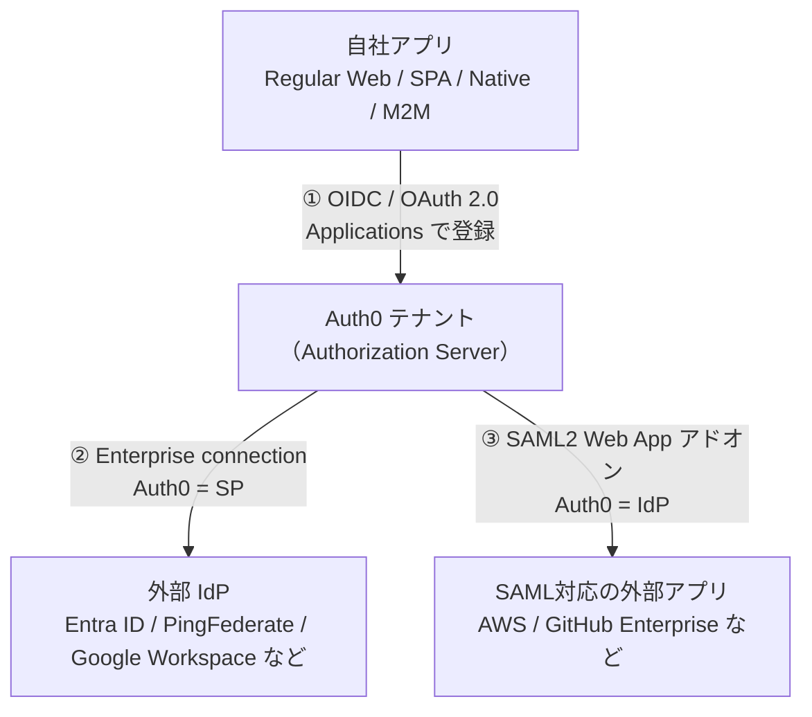
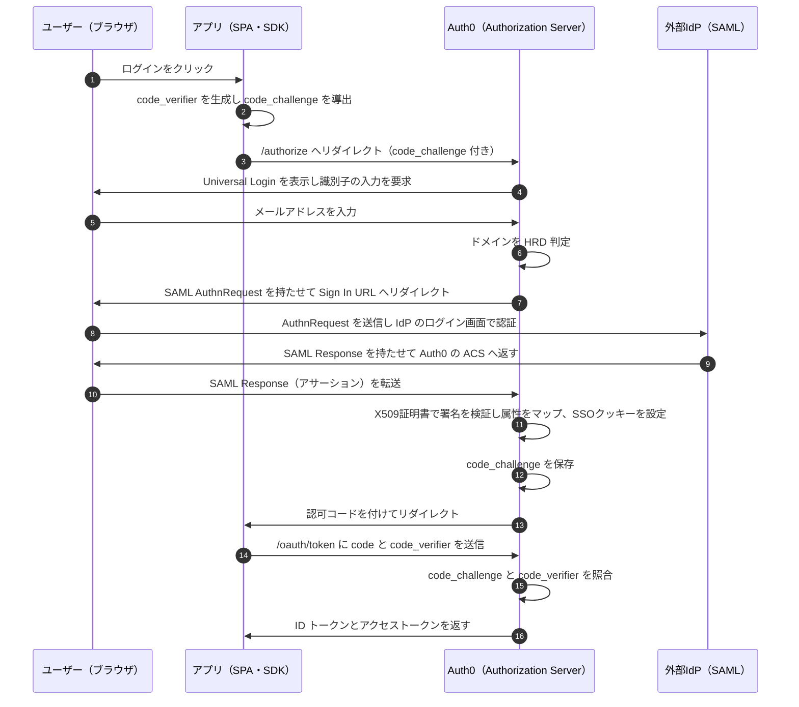

# 【勉強】Okta Customer Identity Cloud (Auth0) — SSO／フェデレーション（SAML編）（2026-08-05）

## 今日のテーマ

Auth0 で SSO を組むとき、**Auth0 が SP になる側**と**IdP になる側**で設定する場所がまったく違います。この「立ち位置の違い」を切り分けるのが今日のゴールです。

Entra ID 編・Okta 編・Ping 編と同じ SSO／フェデレーションのテーマですが、Auth0 は CIAM（顧客向け）製品なので前提が少し変わります。**自社アプリと Auth0 の間は OIDC／OAuth 2.0 を使うのが基本**（WS-Fed や SAML も使えますが本記事では扱いません）で、SAML が主役になるのはその外側の辺、という構造を押さえてください。

## 概要 — Auth0 には「3つの辺」がある

Auth0 を中心に置くと、つながる相手は3種類あります。設定画面も名前も別なので、まずここを分けます。

1. **アプリ ⇄ Auth0** — 自社アプリをつなぐ辺。Auth0 では **Application（アプリケーション）** として登録します。通常 OIDC／OAuth 2.0 を使います。
2. **Auth0 ⇄ 外部 IdP** — Entra ID や PingFederate など、外部の IdP に認証を委ねる辺。**Enterprise connection（エンタープライズ接続）** を作ります。このとき **Auth0 は SP** です。
3. **Auth0 ⇄ SAML 対応の外部アプリ** — AWS や GitHub Enterprise のような SAML アプリに Auth0 でログインさせる辺。**SAML2 Web App アドオン** を使います。このとき **Auth0 は IdP** です。

> **用語補足**
> - **IdP（Identity Provider）**: ユーザーを認証して「この人は本人です」という主張（アサーション）を発行する側。
> - **SP（Service Provider）**: その主張を受け取ってサービスを提供する側。
> - **Connection（接続）**: Auth0 における「ユーザーの置き場所／認証元」の定義。DB接続、ソーシャル接続、エンタープライズ接続などがある。
>
> Auth0 は SP にも IdP にもなれます。②と③を同時に有効にすれば、外部 IdP で認証したユーザーを SAML アプリに流す**中継役**にもなります。

下図は、この3つの辺とそれぞれで使うプロトコル・設定場所を整理したものです（公式にこの図はなく、公式の記述をもとに整理したものです）。



## 押さえる要点

### 1. アプリ側（①）— 4つの Application type

Auth0 にアプリを登録するとき、次の4種類から選びます。

- **Regular Web Application** — サーバー側でロジックを持つ従来型の Web アプリ（Express.js、ASP.NET など）
- **Single Page Web Application (SPA)** — ブラウザ側で UI を動かし、API 経由でサーバーと通信するアプリ（React、AngularJS + Node.js など）
- **Native Application** — iOS / Android などデバイス上でネイティブに動くモバイル／デスクトップアプリ
- **Machine to Machine (M2M) Application** — CLI、デーモン、IoT、バックエンドサービスなど非対話型のもの

公式はこの **application type** とは別軸で、**client secret を安全に保管できるか（confidential）／できないか（public）** という **credential security** の分類を定義しています（OAuth 2.0 の定義に沿ったもの）。型がそのまま public / confidential を決めるわけではありませんが、実務上は連動します。SPA はソースがブラウザに全部見えるので secret を持てません。ネイティブアプリも逆コンパイルされれば secret が露出します。

だから public なアプリでは **Authorization Code Flow with PKCE** を使います。SDK が毎回ランダムな `code_verifier` を作り、そこから `code_challenge` を導出して `/authorize` に送る。認可コードを盗まれても、`code_verifier` がないとトークンに交換できない、という仕組みです（RFC 7636）。

なお公式ドキュメントは、リダイレクト捕捉のためのカスタム URI スキーム（`MyApp://` のような形）の利用を**強く非推奨**としています。悪意あるアプリが認可コードを受け取れてしまうためです。

### 2. Auth0 が SP になる側（②）— Enterprise connection

外部 IdP に認証を委ねる場合、**Dashboard > Authentication > Enterprise** で接続を作ります。SAML の場合、IdP 側から集めるのは3つです。

| 項目 | 中身 |
| --- | --- |
| Sign In URL | SAML 認証リクエストの送信先。IdP の SSO エンドポイント |
| Sign Out URL | SAML ログアウトリクエストの送信先。SLO エンドポイント |
| X509 Signing Certificate | IdP が署名したアサーションを Auth0 が検証するための公開鍵証明書（`.pem` / `.cer`） |

Auth0 は **SAML 1.1 / SAML 2.0 に準拠した IdP すべて**をサポートすると明記されています。個別の手順ページがあるのは ADFS、Okta、OneLogin、PingFederate、Salesforce、SiteMinder、SSOCircle です。

設定時にハマりやすいのが **User ID Attribute**。SAML トークン内のどの属性を Auth0 の `user_id` にマップするかを指定します。未設定の場合は次の順で探しに行きます。

1. `http://schemas.xmlsoap.org/ws/2005/05/identity/claims/nameidentifier`
2. `.../claims/upn`
3. `.../claims/name`

Management API で作る場合、接続の種類は `strategy` で指定します。SAML なら `samlp`、OIDC なら `oidc`、Entra ID（Azure AD）は `waad`、PingFederate は `pingfederate`、Google Workspace は `google-apps` です。

```json
{
  "strategy": "samlp",
  "name": "example-samlp-connection",
  "options": {
    "signInEndpoint": "https://example.com/samlp/login",
    "signOutEndpoint": "https://example.com/samlp/logout",
    "signingCert": "{X509_CERTIFICATE_IN_BASE64}",
    "signSAMLRequest": true,
    "signatureAlgorithm": "rsa-sha256",
    "digestAlgorithm": "sha256",
    "protocolBinding": "urn:oasis:names:tc:SAML:2.0:bindings:HTTP-Redirect"
  }
}
```

### 3. Auth0 が IdP になる側（③）— SAML2 Web App アドオン

こちらは接続ではなく**アプリケーションの設定**です。**Dashboard > Applications > Applications** で対象アプリを開き、**Addons** タブの **SAML2 Web App** をオンにします。Settings タブで SAML レスポンスを受け取る **Application Callback URL** を設定し、**Usage** タブから IdP 側のメタデータ（相手アプリに渡す情報）を取得します。**Debug** ボタンでパラメータの妥当性をテストできます。

制限がひとつあり、**SAML2 Web App アドオンは passive な SAML リクエスト（`isPassive=true`）をサポートしません**。

### 4. Identifier First と Home Realm Discovery

複数の Enterprise connection がある場合、ユーザーをどの IdP に飛ばすかを判定する必要があります。これが **Home Realm Discovery（HRD）** です。

**Dashboard > Authentication > Authentication Profile** で、次の3つから選びます。

- **Identifier + Password** — 識別子とパスワードを同じ画面で入力
- **Identifier First** — 先に識別子だけ入力。ドメインが Enterprise connection の登録ドメインと一致すればその IdP のログイン画面へリダイレクト、一致しなければパスワード入力へ
- **Identifier First + Biometrics** — 上に加えて、WebAuthn + デバイス生体認証に対応した端末なら登録を促し、次回以降それを使える

ドメインは各 Enterprise connection の **Login Experience** タブで登録し、**最大1000ドメイン**まで設定できます。

なお、この2段階方式は **New Universal Login Experience** でのみ動作します。

## 認証の流れ（②を経由するケース）

Identifier First + SAML の Enterprise connection + PKCE を使う SPA、という組み合わせの流れです。SAML のメッセージは Auth0 と IdP が直接やりとりするのではなく、HTTP-Redirect（URL パラメータ）または HTTP-POST（HTML フォーム）バインディングで**ユーザーのブラウザを経由**します。図でもそのように描いています。



## つまずきやすいところ・注意点

**セッションは最大3つある。** 公式は SSO 時に「アプリが保持するローカルセッション」「Authorization Server のセッション（SSO 有効時）」「IdP のセッション（外部 IdP でログインした場合）」の**最大3つ**が存在しうると説明しています。アプリからログアウトしたのにまたすぐ入れてしまう場合、たいてい上位のセッションが生きています。どの層のセッションを切るのかを意識して設計してください。

**Auth0 側のログアウトだけでは IdP セッションは残る。** 上の3層の話の帰結です。公式は、`federated` パラメータを付けずにログアウトした場合 IdP のセッションは残ると説明しています。IdP のセッションまで切りたいなら `/oidc/logout?federated` のように **`federated` パラメータを指定**し、加えて接続側の Sign Out URL 設定と IdP 側の対応が必要になります。

**接続を作っただけでは使えない。** Enterprise connection は**アプリケーションに対して有効化**する必要があります。接続の **Applications** タブで、どのアプリで使えるかを確認できます。逆に、テナントに新しいアプリを作ると既定ではテナントの全接続が有効になるので、絞りたい場合は明示的に設定を変えます。

**「アクティブな Enterprise connection」の定義に注意。** 当月内に「アプリで有効化されている」かつ「ログイン等のユーザーアクティビティがあった」の**両方**を満たす接続がアクティブと数えられます。片方だけではカウントされません（Okta Workforce 接続はアクティブ接続数の上限にカウントされません）。なお Enterprise connection 自体の利用可否はプランや契約に依存します。

**SAML のデバッグは手順が決まっている。** 公式は、テストごとにブラウザの履歴・Cookie・キャッシュをクリアすること、Cookie と JavaScript を有効にすること、HAR ファイルを取得して SAML アサーションをデコードして中身を見ることを挙げています。接続の「…」メニューの **Try** で単体テストもできます。

**Identifier First を使うなら LoginHint が効く。** SAML の AuthnRequest テンプレートには `@@LoginHint@@` という変数があり、Identifier First を使っている場合、ユーザーが入力したメールアドレスを IdP 側のログインフォームに事前入力させるために渡せます。

## 今日のまとめ

**重要用語ミニ辞書**

- **Connection** — Auth0 における認証元の定義。DB／ソーシャル／エンタープライズがある
- **Enterprise connection** — 外部の federated IdP に認証を委ねる接続。Auth0 が SP になる
- **SAML2 Web App アドオン** — Auth0 を SAML IdP として振る舞わせるアプリ側の設定
- **HRD（Home Realm Discovery）** — 入力されたメールのドメインから、どの IdP に飛ばすかを決める仕組み
- **PKCE** — client secret を持てない public クライアント向けに、`code_verifier` / `code_challenge` で認可コードの横取りを防ぐ拡張（RFC 7636）
- **SSO クッキー** — Auth0 が Authorization Server 側のセッションを保持するためのクッキー。2回目以降のログイン画面をスキップさせる
- **Application type** — Regular Web / SPA / Native / M2M の4種。これとは別軸に **credential security**（confidential / public）の分類がある

**理解度チェック**

1. Entra ID のユーザーに自社の SPA へログインさせたい。Auth0 で作るのは Enterprise connection か SAML2 Web App アドオンか。そのとき Auth0 は SP か IdP か。
2. SAML Enterprise connection を作るとき、IdP 側から集めるべき3つの情報は何か。
3. アプリからログアウトしたのに再ログインで認証画面が出ない。疑うべきセッションの層を3つ挙げられるか。

## 参考リンク

- [Auth0 Enterprise Connections](https://auth0.com/docs/authenticate/enterprise-connections)
- [Configure Auth0 as SAML Service Provider](https://dev.auth0.com/docs/authenticate/protocols/saml/saml-sso-integrations/configure-auth0-saml-service-provider)
- [Enable SAML2 Web App Addon](https://dev.auth0.com/docs/authenticate/protocols/saml/saml-sso-integrations/enable-saml2-web-app-addon)
- [Single Sign-On](https://dev.auth0.com/docs/authenticate/single-sign-on)
- [Configure Identifier First Authentication](https://auth0.com/docs/authenticate/login/auth0-universal-login/identifier-first)
- [Applications in Auth0](https://dev.auth0.com/docs/get-started/applications)
- [Authorization Code Flow with Proof Key for Code Exchange (PKCE)](https://dev.auth0.com/docs/get-started/authentication-and-authorization-flow/authorization-code-flow-with-pkce)
- [Log Users Out of Identity Providers](https://auth0.com/docs/authenticate/login/logout/log-users-out-of-idps)

> `dev.auth0.com` を指しているリンクは、`auth0.com/docs` の同一パスでも同じ内容が読めます。
