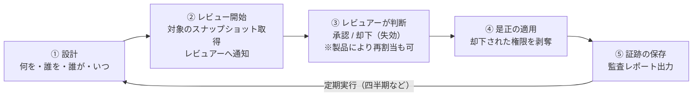
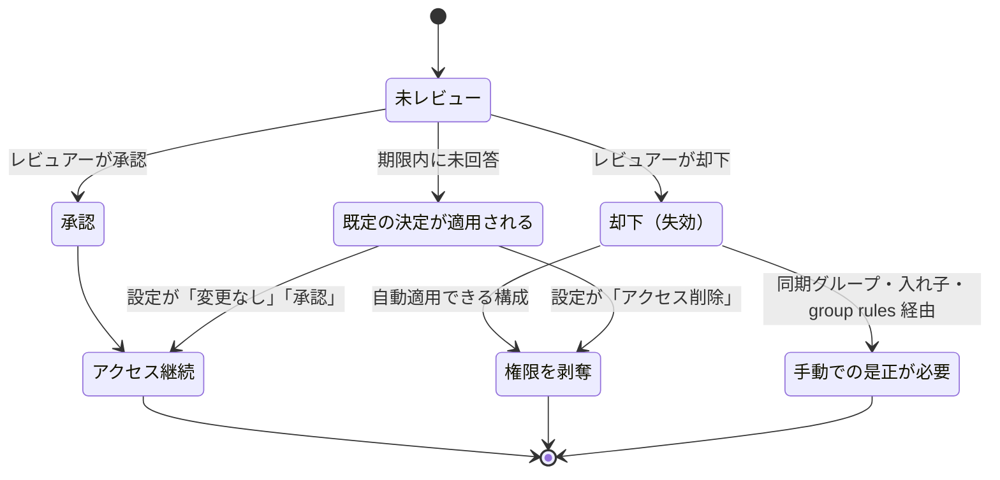

# 【勉強】IGA（アイデンティティガバナンス＆管理）— アクセスレビュー／アクセス認証（2026-08-06）

## 今日のテーマ

IGAの中核機能である **アクセスレビュー／アクセス認証（Access Review / Access Certification）** を学ぶ。前回の「IGA概要」でGovernance側の代表機能として名前だけ挙げたものを、今日は「実際にどう回るのか」という運用の粒度まで下ろす。

## 概要 — アクセスレビューとは何をするものか

アクセスレビューは、**すでに付与されている権限を定期的に人間の目で見直し、不要なものを剥奪する「権限の棚卸し」の仕組み**。

インフラ出身の感覚に寄せると、サーバの `/etc/passwd` や sudoers を半年に一度並べて「この人、まだこのサーバいる？」と担当者に確認して回る作業に近い。それをSaaS・グループ・ロール・アプリ権限まで含めて、製品側が対象抽出・依頼メール送信・結果の自動適用・証跡保存まで面倒を見てくれる、と考えると分かりやすい。

なぜ必要かというと、**権限は放っておくと増える一方だから**。プロビジョニングの自動化を入れても、異動時に旧部署の権限が剥がれ残る、プロジェクト用に一時付与した権限が終了後も残る、といったことが起きる。これが前回出てきた **権限クリープ（privilege creep）**。付与のプロセスをいくら整えても、付与「後」を見る仕組みがないと止まらない。

## 押さえる要点 — レビューの流れ

製品によって名前は違うが（Microsoft Entra ID は「アクセスレビュー」、Okta Identity Governance は「アクセス認証（Access Certifications）」の「キャンペーン」）、流れの骨格は共通している。

上の図は、レビュー1周分のライフサイクル。①〜⑤を定期的に回し続けるのがアクセスレビューの本体。

**① 設計フェーズで決めること**（ここが実務の8割）

- **何をレビューするか（対象リソース）**：グループのメンバーシップ、アプリケーションへの割り当て、特権ロール、アクセスパッケージなど。Entra ID では PIM 経由で Entra ロールや Azure リソースロールもレビュー対象にできる。
- **誰の権限をレビューするか（スコープ）**：全ユーザーか、ゲストユーザーのみか、など。
- **誰がレビューするか（レビュアー）**：指定したユーザー／グループ、グループ所有者、**上長（マネージャー）**、あるいは **本人によるセルフレビュー**。なお Entra ID のアプリケーションのレビューでは「アプリ所有者」をレビュアーに選ぶ選択肢はない（アプリには必ずしも所有者がいないため）。Entra ID では、レビュアーに「上長」または「グループ所有者」を選んだ場合に限り **フォールバックレビュアー**（代替レビュアー）を指定でき、上長が未設定のユーザーやグループに所有者がいない場合に代わってレビューを担当する。
- **どのくらいの頻度・期間で回すか**：一度きりか、週次／月次／四半期／年次の繰り返しか。

**② レビュアーの判断を助ける仕掛け（推奨・レコメンデーション）**

対象が数百件になると、レビュアーは中身を見ずに全部「承認」を押しがちになる（いわゆるラバースタンプ問題）。これを防ぐため、製品側が判断材料を提示する。

- Entra ID の **非アクティブユーザー推奨**：直近30日間テナントにサインインしていないユーザーに「拒否（Deny）」を推奨する。アプリケーション割り当てのレビューでは、テナント全体ではなくそのアプリでの最終アクティビティを見る。サインイン日時はレビュー開始時点で評価され、レビュー期間中は更新されない。
- Entra ID の **User-to-Group Affiliation**：組織のレポートライン上の距離から「このグループの他メンバーと縁が薄い」ユーザーを機械学習で検出し、拒否を推奨する。マネージャー属性が必要で、600人を超えるグループは非対応。Microsoft Entra ID Governance ライセンスが必要。
- Okta では **Governance Analyzer** の推奨・インサイトや、大量の項目を効率的に処理する **Smart Review** が用意されている。

**③ 多段レビュー（Multi-stage / Multilevel）**

「まずリソース所有者が見て、次に上長が見る」といった段階的なレビューも組める。Entra ID のアクセスレビューは **最大3段階** をサポートする。Okta は **1次／2次の2段階（multilevel reviews）** で、1次レビュアーの「承認だけ」を2次に送るか「承認と失効の両方」を送るかを選べる。2次に送られなかった項目は1次レビュアーが最終レビュアーになる。

**④ 是正（Remediation）の適用タイミング — ここが製品差の出るところ**

上の図は、レビュー対象1件（ユーザー×リソースの組）が辿る状態遷移。「未回答」の扱いを設計時に決めておく必要がある点が重要。

- **Entra ID**：レビュアーが判断を提出しても、**アクセスの変更はレビュー終了日まで適用されない**。10日間のレビューの初日に決定しても、反映は終了後。「結果をリソースに自動適用する」を有効にしていれば終了日後に自動で適用され（管理者がレビューを途中で「停止」した場合も、その時点で自動適用が走る）、無効なら管理者が手動で適用する。未回答ユーザーには、管理者が設定した既定の決定（変更なし／承認／削除／推奨に従う）が適用される。
- **Okta**：レビューが1段階のみのキャンペーンでは、**レビュアーが承認／失効した直後に是正処理が始まる**。多段レビューの場合は「最終レビュアー」の決定に対して是正が走る（どの決定が2次に送られるかの設定によって、誰が最終レビュアーになるかが変わる）。是正の中身（承認時／失効時／未回答時にそれぞれ何をするか）はキャンペーン作成時の Remediation 設定で決められ、Okta Workflows で ServiceNow へのチケット起票や通知送信などにカスタマイズもできる。

同じ「アクセスレビュー」でも適用タイミングの前提が違うので、複数製品を触るときは必ず確認する。

## つまずきやすいところ・注意点

- **決定しても剥奪できないケースがある**。Entra ID では、オンプレミスの Windows Server Active Directory から同期されたグループは Entra ID 側で管理できないためメンバーシップを変更できない。入れ子グループ（ネストされたグループ）経由のメンバーは、そのネストグループから外されないのでアクセスが残る。動的グループもルールで決まるため、レビューの決定でメンバーシップは変わらない。
- Okta でも同様に、**グループルールやアプリ由来グループ（app-sourced group）経由の割り当ては手動での是正が必要**になる。是正ステータスが「Manual Remediation Required」と出る。
- **グループから外す前に、そのグループが何を配っているか確認する**。Okta のドキュメントも明示しているとおり、アプリ・管理者ロール・サインオンポリシーがグループ経由で割り当てられていることが多く、グループから外すとそれら全部が一度に剥がれる。
- **レビューは開始時点のスナップショット**。Entra ID では、レビュー開始後にユーザー割り当てやグループメンバーシップが変わっても、その回のレビューには反映されない。次の回で拾われる。
- **ラバースタンプに注意**。全承認されたレビューは、証跡としては残るがリスクは何も減っていない。推奨表示・多段レビュー・対象の絞り込みで、レビュアー1人あたりの判断件数を現実的な数に抑える設計が要る。
- **ライセンスを先に確認する**。Entra ID のアクセスレビューは Microsoft Entra ID Governance または Microsoft Entra Suite のサブスクリプションを必要とする（一部機能は Microsoft Entra ID P2 でも動作する）。Okta の Access Certifications も Okta Identity Governance の機能。

## 今日のまとめ

**重要用語ミニ辞書**

- **アクセスレビュー / アクセス認証（Certification）**：付与済み権限を定期的に見直して剥奪する棚卸し。Okta では「キャンペーン」という単位で実行する。
- **レビュアー**：判断する人。指定ユーザー／グループ所有者／上長／本人（セルフレビュー）から選ぶ。
- **フォールバックレビュアー**：レビュアーに上長／グループ所有者を指定したとき、上長が未設定・グループに所有者なしといった理由で主レビュアーが決まらない場合の代替レビュアー。
- **是正（Remediation）**：レビュー結果に基づいて実際に権限を剥奪する処理。
- **自動適用（Auto apply）**：レビュー終了後に決定を自動でリソースへ反映する設定（Entra ID）。
- **権限クリープ**：異動や一時付与の積み重ねで権限が溜まっていく現象。アクセスレビューが直接狙う相手。

**理解度チェック**

1. アクセスレビューが必要になる理由を「権限クリープ」という言葉を使って説明できる？
2. Entra ID と Okta で、レビュアーの決定が実際の権限剥奪に反映されるタイミングはどう違う？
3. レビューで「却下」しても権限を自動で剥奪できないのは、どんな構成のとき？

## 参考リンク

- What are access reviews?（Microsoft Learn 公式）: [https://learn.microsoft.com/en-us/entra/id-governance/access-reviews-overview](https://learn.microsoft.com/en-us/entra/id-governance/access-reviews-overview)
- Access reviews - FAQs（Microsoft Learn 公式）: [https://learn.microsoft.com/en-us/entra/id-governance/access-reviews-faqs](https://learn.microsoft.com/en-us/entra/id-governance/access-reviews-faqs)
- Complete an access review of groups and applications（Microsoft Learn 公式）: [https://learn.microsoft.com/en-us/entra/id-governance/complete-access-review](https://learn.microsoft.com/en-us/entra/id-governance/complete-access-review)
- Create an access review of groups or applications（Microsoft Learn 公式）: [https://learn.microsoft.com/en-us/entra/id-governance/create-access-review](https://learn.microsoft.com/en-us/entra/id-governance/create-access-review)
- Review recommendations for Access reviews（Microsoft Learn 公式）: [https://learn.microsoft.com/en-us/entra/id-governance/review-recommendations-access-reviews](https://learn.microsoft.com/en-us/entra/id-governance/review-recommendations-access-reviews)
- Using multi-stage reviews（Microsoft Learn 公式）: [https://learn.microsoft.com/en-us/entra/id-governance/using-multi-stage-reviews](https://learn.microsoft.com/en-us/entra/id-governance/using-multi-stage-reviews)
- Plan a Microsoft Entra access reviews deployment（Microsoft Learn 公式）: [https://learn.microsoft.com/en-us/entra/id-governance/deploy-access-reviews](https://learn.microsoft.com/en-us/entra/id-governance/deploy-access-reviews)
- Campaigns（Okta 公式ヘルプ）: [https://help.okta.com/oie/en-us/content/topics/identity-governance/access-certification/campaigns.htm](https://help.okta.com/oie/en-us/content/topics/identity-governance/access-certification/campaigns.htm)
- Create resource campaigns（Okta 公式ヘルプ）: [https://help.okta.com/oie/en-us/content/topics/identity-governance/access-certification/iga-ac-create-campaign.htm](https://help.okta.com/oie/en-us/content/topics/identity-governance/access-certification/iga-ac-create-campaign.htm)
- Understand remediation（Okta 公式ヘルプ）: [https://help.okta.com/oie/en-us/content/topics/identity-governance/access-certification/remediation.htm](https://help.okta.com/oie/en-us/content/topics/identity-governance/access-certification/remediation.htm)
