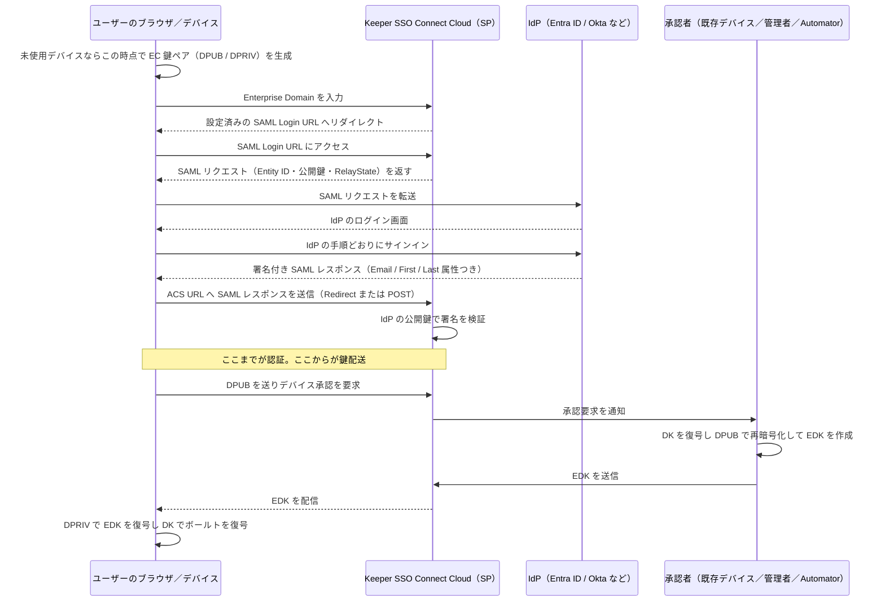
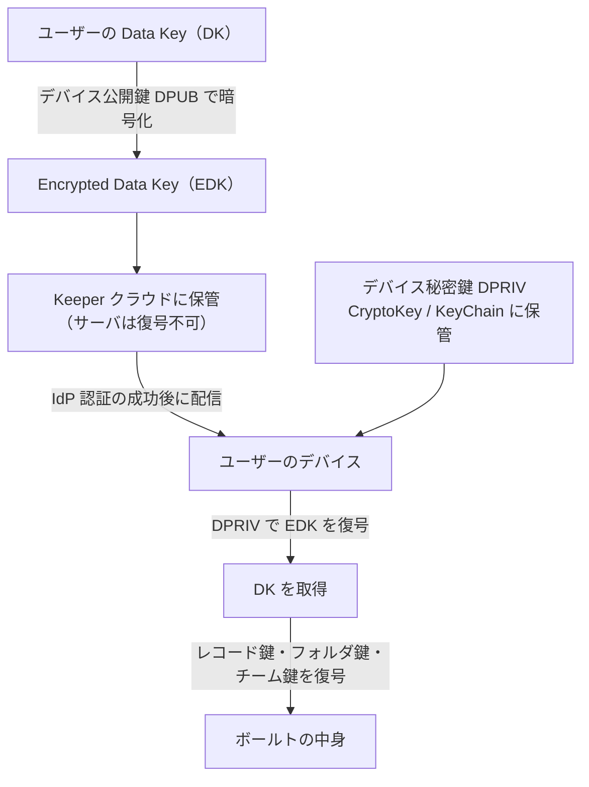

# 【勉強】Keeper — SSO／フェデレーション（SSO Connect Cloud 編）（2026-08-07）

## 今日のテーマ

Keeper を SAML 2.0 の IdP と連携させる仕組み、**Keeper SSO Connect Cloud** を学びます。ポイントは「SSO でログインしたのに、なぜそれだけではボールト（保管庫）が開かないのか」です。

## 概要

Keeper SSO Connect Cloud は、Keeper Enterprise に含まれるクラウド型の SAML 2.0 サービスです。Entra ID、Okta、Google Workspace、Ping Identity、OneLogin、JumpCloud など、SAML 2.0 対応の IdP と連携できます。SAML の用語でいうと **Keeper 側が SP（サービスプロバイダ）** で、IdP が認証を担当します。

ここまでは他の SaaS の SSO と同じです。違うのは Keeper が**ゼロ知識（Zero Knowledge）アーキテクチャ**である点です。ゼロ知識とは「暗号化・復号はすべて利用者のデバイス上で行い、サーバは平文も復号鍵も持たない」という設計思想のこと。つまり Keeper のサーバは、SAML アサーションを検証して「この人は本人だ」と判断できても、その人のボールトを復号する鍵は持っていません。

インフラの感覚でいうと、認証（誰であるか）と**鍵配送**（どうやってその人のデバイスに復号鍵を届けるか）が別レイヤーになっている、と捉えると分かりやすいです。SSO Connect Cloud の設計はこの二層構造がすべてです。

なお Keeper には自社サーバでホストする **SSO Connect On-Prem** もありますが、公式は多くの顧客に Cloud 版を推奨しています。

## 押さえる要点

- **鍵の階層** — ユーザーごとに **Data Key（DK）** が1つあり、これでレコード鍵・フォルダ鍵・チーム鍵などを復号します。DK 自体は、**デバイスごとに生成される EC（楕円曲線）公開鍵**で暗号化され、**Encrypted Data Key（EDK）** としてクラウドに保管されます。デバイスが10台あれば EDK も10個保管されます。
- **デバイス秘密鍵（DPRIV）はデバイスから出ない** — Chromium 系ブラウザではエクスポート不可の CryptoKey として、iOS / Mac では KeyChain に保管されます。
- **DPRIV だけ盗んでも復号できない** — 公式は「デバイス秘密鍵はボールトデータの暗号化・復号に直接は使われず、IdP 認証成功後に別の（保存されない）鍵が復号に使われる。ローカルの DPRIV をオフラインで抜き出してもボールトは復号できない」と明記しています。
- **デバイス承認（Device Approval）は必須要素** — 未登録デバイスからログインすると、そのデバイスの公開鍵に対して DK を再暗号化して届ける「鍵交換」が必要になります。これがデバイス承認の正体で、単なる本人確認の追加ステップではありません。
- **「デバイス」にはブラウザプロファイルも含む** — シークレット／プライベートモードは起動のたびに新しいデバイスとして扱われ、毎回承認が必要になります。
- **承認方法は4種類** — ①Keeper Push（既存デバイスへのプッシュ通知）②管理コンソールからの管理者承認（Approve Devices 権限）③**Keeper Automator** による自動承認（公式が preferred と位置づける方法。ただし導入自体は任意）④Commander CLI による半自動承認。
- **Keeper Automator は自社でホストする** — ゼロ知識を守るため、鍵の再暗号化を行うサービスは Keeper ではなく企業側が運用します。Docker、Kubernetes、Windows サービス、Azure Container Apps、AWS ECS、GCP Cloud Run などで動かせます。デバイス承認のほかチーム承認・チームへのユーザー割り当ても扱います。
- **ログインフローは3種類** — SP-initiated（Enterprise Domain 入力）、SP-initiated（メールアドレス入力）、IdP-initiated のすべてに対応します。

## ログインから復号までの流れ

SP-initiated ログイン（Enterprise Domain 入力）の場合の流れです。前半が SAML 認証、後半が Keeper 固有の鍵配送であることに注目してください。SAML のリダイレクトはすべてユーザーのブラウザを経由します。

鍵の関係を整理すると次のようになります。

## 設定のイメージ

管理コンソール（US なら `https://keepersecurity.com/console`、日本リージョンは `https://keepersecurity.jp/console`）での大まかな手順です。

1. **ルートノード配下にノードを新規作成する。** SSO ユーザーとプロビジョニングはルート以外の専用ノードに置く必要があります。
2. そのノードの **Provisioning** タブで **Add Method** → **Single Sign-On with SSO Connect Cloud** を選択。
3. **Configuration Name**（管理用の内部名）と **Enterprise Domain**（利用者がログイン時に入力する文字列）を入力。**Just-In-Time プロビジョニング**は既定で有効です。Keeper Bridge でプロビジョニングする場合は無効にします。
4. IdP のメタデータ XML をアップロードし、**IDP Type** を選択（一覧にない場合は GENERIC）。
5. 属性マッピングを設定。既定で **Email / First / Last** の3つが必要です。
6. Keeper 側の **Entity ID** と **ACS URL**（必要なら SLO エンドポイント）を View 画面から取得し、IdP のアプリ設定に登録。

## つまずきやすいところ

- **ルートノードにユーザーがいると SSO にならない。** ルートノードのままではマスターパスワードを求められます。既存ユーザーは SSO 設定済みノードへ移動が必要で、しかも**管理者は自分自身を移動できません**（別の管理者に依頼する）。
- **属性名は大文字小文字を区別する。** 既定の `First` / `Last` / `Email` と厳密に一致させます。
- **メールアドレスだけでログインさせたい場合はドメイン予約が必要。** Just-In-Time プロビジョニングの有効化に加え、自社ドメインが Keeper に予約されていないと IdP へルーティングされません。gmail.com のような個人用ドメインは予約できません。
- **NameID フォーマット**は `emailAddress` か `unspecified` に対応しています。
- **Automator を入れると承認の摩擦はゼロになるが、その分 IdP 側の堅牢化が前提になる。** 人間の承認というブレーキが外れるため、IdP の MFA や条件付きアクセスが実質的な最終防衛線になります。

## 今日のまとめ

**ミニ辞書**

| 用語 | 意味 |
| --- | --- |
| SP（サービスプロバイダ） | SAML でリソースを提供する側。ここでは Keeper |
| ACS URL | IdP が SAML レスポンスを送り込む SP 側のエンドポイント |
| DK（Data Key） | ユーザーごとの鍵。レコード鍵やフォルダ鍵を復号する大元 |
| DPRIV / DPUB | デバイスごとの EC 秘密鍵／公開鍵 |
| EDK（Encrypted Data Key） | DPUB で暗号化された DK。クラウドに保管される |
| デバイス承認 | 新デバイスへ EDK を届ける鍵交換の処理 |
| Keeper Automator | デバイス承認・チーム承認などの暗号処理を自動化する自社ホスト型サービス |

**理解度チェック**

1. IdP で SSO 認証に成功しただけでは、なぜ新しい PC でボールトを開けないのか。
2. Keeper のサーバが EDK を保管していても、ゼロ知識が保たれるのはなぜか。
3. Keeper Automator を Keeper 社ではなく企業側でホストしなければならない理由は何か。

## 参考リンク

- [Keeper SSO Connect Cloud](https://docs.keeper.io/sso-connect-cloud)
- [Overview | SSO Connect Cloud](https://docs.keeper.io/sso-connect-cloud/overview)
- [Security and User Flow | SSO Connect Cloud](https://docs.keeper.io/sso-connect-cloud/security-and-user-flow)
- [Admin Console Configuration | SSO Connect Cloud](https://docs.keeper.io/sso-connect-cloud/admin-console-configuration)
- [Device Approvals | SSO Connect Cloud](https://docs.keeper.io/sso-connect-cloud/device-approvals)
- [Keeper Automator Service](https://docs.keeper.io/sso-connect-cloud/device-approvals/automator)
- [Other SAML 2.0 Providers](https://docs.keeper.io/sso-connect-cloud/identity-provider-setup/generic-saml-2.0)
- [Domain Reservation | Enterprise Guide](https://docs.keeper.io/enterprise-guide/domain-reservation)
- [SSO / SAML Authentication | Enterprise Guide](https://docs.keeper.io/enterprise-guide/sso-saml-integration)
