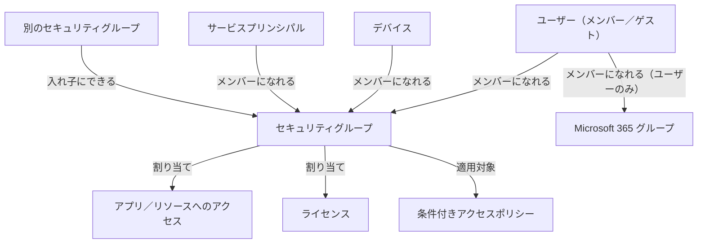
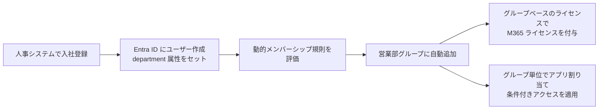

# 【勉強】Microsoft Entra ID — ユーザー／グループ管理（2026-08-10）

## 今日のテーマ

Entra ID の「ユーザー」と「グループ」というオブジェクトを整理し、グループを使ってアクセス権・ライセンス・管理権限をまとめて配る仕組みを理解します。前回までの SSO／フェデレーション編が「誰かを外のアプリに通す」話だったのに対して、今日は「そもそも誰がテナントにいて、どうまとめるか」という土台の話です。

## 概要

オンプレの Active Directory では、ユーザーを OU（組織単位）に置き、セキュリティグループに入れ、グループに ACL を付ける、という流れが基本でした。Entra ID にも似た考え方はありますが、そのまま同じではありません。

大きな違いが二つあります。一つは、Entra ID にはディレクトリを階層で区切る OU がないこと。代わりに **管理単位（Administrative Unit、AU）** という別の仕組みで「管理権限のスコープ」を切ります。もう一つは、グループのメンバーシップを属性から自動計算できること（動的メンバーシップグループ）です。手で入れる／抜くという運用を減らせます。

## 押さえる要点

### ユーザーの種別：メンバーとゲスト

Entra ID のユーザーには `userType` という属性があり、値は `Member` か `Guest` です。

- **メンバーユーザー**：既定でディレクトリ内のユーザー・グループをほぼ読み取れ、アプリケーションの登録やセキュリティグループの作成もできます。典型的には、テナントにネイティブに作られた「社員」です。
- **ゲストユーザー**：既定の権限は制限されており、全ユーザーの列挙はできません。典型的には、B2B コラボレーションで招待された外部ユーザーです。

ここで一つ注意が要ります。`userType` は**サインインの経路（内部の資格情報か、外部 IdP か）とは独立した属性**で、「そのユーザーとホスト組織の関係」だけを表します。したがって「外部から招いたがメンバー権限を持つユーザー（external member）」も「内部の資格情報を持つがゲスト扱いのユーザー（internal guest）」も存在しえます。「Member = 社内」「Guest = 社外」は典型例であって定義ではありません。

ゲストの既定権限はさらに三段階で調整できます。「メンバーと同じ」「制限付き（既定。非表示でないグループのメンバーシップは見える）」「厳しく制限（どのグループのメンバーシップも見えない）」の三つです。外部ユーザーを多く招く環境では、ここを既定のままにしない判断が要ります。

なお `userType` は後から変更できますが、この属性は「その人と組織の関係」を表すものなので、関係そのものが変わったときだけ変えるのが原則です。

### グループの種別とメンバーシップの種別

Entra 管理センターで扱うグループは 2 種類です。

| | セキュリティグループ | Microsoft 365 グループ |
| --- | --- | --- |
| 目的 | 共有リソースへのアクセス管理 | コラボレーション（共有メールボックス、Teams など） |
| メンバーになれるもの | ユーザー、デバイス、サービスプリンシパル、他のセキュリティグループ、組織の連絡先 | ユーザーのみ |
| 入れ子 | 可能 | 不可 |



上の図は「何がセキュリティグループのメンバーになれるか」と「グループを何に使えるか」を表したものです。

メンバーシップの種別は 3 つあります。**割り当て済み**（手で入れる）、**動的ユーザー**、**動的デバイス**。動的グループの規則は「ユーザーだけ」か「デバイスだけ」のどちらかで、両方を混ぜた規則は作れません。またデバイス用の規則からデバイス所有者のユーザー属性を参照することもできません。

### 動的メンバーシップの規則

規則は `<プロパティ> <演算子> <値>` という式で書きます。

```text
user.department -eq "営業部"
```

複数の式は `-and` / `-or` / `-not` でつなげます。

```text
(user.department -eq "営業部") -and (user.userType -eq "Member")
```

- 使えるプロパティは `department`、`jobTitle`、`city`、`country`、`usageLocation`、`employeeId`、`extensionAttribute1`〜`15` など。
- 規則本文は 3,072 文字まで。
- テナントあたりの動的メンバーシップグループは最大 15,000 個。この数は動的な管理単位、および Entitlement Management の自動割り当てポリシー由来のグループと**合算**されます。
- 動的メンバーシップには、動的グループのメンバーとなるユニークユーザー 1 人につき **Microsoft Entra ID P1**（または Intune for Education）ライセンスが必要です。デバイスには不要です。

### 管理単位（Administrative Unit）

AU は、管理者ロールの適用範囲をテナント全体ではなく一部のオブジェクトに絞るための入れ物です。「大阪支社のヘルプデスク管理者は、大阪支社のユーザーのパスワードだけリセットできる」といった委任ができます。AU にはユーザー、グループ、デバイスを入れられます。AU 管理者には P1 ライセンスが必要です（通常の AU なら、AU のメンバー側は Free で足ります）。

AU のメンバーは動的メンバーシップ規則で自動的に埋めることもできますが、ここには制約があります。**動的 AU で扱えるのはユーザーまたはデバイスだけで、グループを動的に追加することはできません。** 1 つの動的 AU に複数のオブジェクト種別を混在させることもできません。また動的 AU では、メンバー側にも P1 ライセンスが必要になります。

さらに強い **制限付き管理単位（Restricted Management AU）** もあります。ここに入れたオブジェクトは、その AU にスコープを持つ管理者しか変更できません。グローバル管理者ですら、自分をその AU スコープのロールに割り当てない限り変更できない（そしてその割り当ては監査ログに残る）のが特徴です。役員アカウントの保護などが典型的な用途です。制限には次のようなものがあります。

- 「制限付き」の設定は**作成時にしか指定できず、後から変更できない**。
- Microsoft 365 グループ、メール有効セキュリティグループ、配布グループはメンバーにできない（通常の AU なら可能）。
- 中のオブジェクトは、アクセスレビュー、Entitlement Management、PIM、ライフサイクルワークフローといった ID ガバナンス機能の対象にできない。
- テナントあたり最大 100 個。

### ロール割り当て可能なグループ

Entra ID のロール（ヘルプデスク管理者など）をグループに割り当てるには、グループ作成時に `isAssignableToRole` を `true` にしておく必要があります。

- この属性は**不変**で、既存グループを後から変換することはできません。
- メンバーシップは**割り当て済みのみ**。動的メンバーシップは使えません（属性を書き換えられると意図せず権限が昇格してしまうため）。
- 入れ子にできません。テナントあたり最大 500 個。作成には特権ロール管理者以上が必要。P1 ライセンスが必要です。

### グループベースのライセンス

グループにライセンスを割り当てると、メンバーに自動で行き渡ります。動的グループと組み合わせると「入社したら自動的にライセンスが付く」が実現できます。



この図は、属性を起点にライセンスとアクセスが自動で決まっていく流れを表したものです。

## つまずきやすいところ

- **グループベースのライセンスは入れ子グループに対応していません。** 入れ子構造のグループにライセンスを割り当てても、第一階層のメンバーにしか付きません。
- **入れ子セキュリティグループの扱いに注意。** 既存のセキュリティグループを別のセキュリティグループに入れた場合、共有リソースやアプリケーションにアクセスできるのは親グループの「メンバー」であるという点を、Microsoft のドキュメントは明示的に注意しています。グループを入れ子にしても、アプリ側が想定どおりに解決してくれるとは限りません。
- **ライセンス付きグループ間でユーザーを移すときは順番が大事。** 先に移動先グループへ追加し、ライセンスが付いたのを確認してから、元のグループから外します。逆順にすると、処理が終わるまでユーザーが一時的に無ライセンス状態になります。
- **usageLocation の設定漏れ。** グループベースのライセンスでは、場所が未設定のユーザーはテナントの場所を継承します。国によって使えないサービスがあるため、ユーザー作成フローの中で明示的に設定しておくのが推奨です。
- **静的グループを動的グループに変換すると、規則に合わないメンバーは外れます。** アクセス制御に使っているグループなら、規則の処理が終わるまで元のメンバーがアクセスを失う可能性があります。事前にテストしましょう。
- **動的規則に使う属性の書き込み権限を確認する。** オンプレ AD から同期している属性の中には、ユーザー自身が書き換えられる設定になっているものがあります。その属性を機密リソースへのアクセス制御に使うと、グループの安全性はその書き込み制御の強さまでしか担保されません。

## 今日のまとめ

**用語ミニ辞書**

- **userType**：ユーザーとホスト組織の関係を表す属性。値は `Member` か `Guest` で、既定権限が変わる。サインイン経路（内部／外部）とは独立している。
- **セキュリティグループ／Microsoft 365 グループ**：前者はアクセス管理用でユーザー・デバイス・サービスプリンシパル・グループを入れられる。後者はコラボレーション用でユーザーのみ。
- **動的メンバーシップグループ**：属性ベースの規則でメンバーが自動増減するグループ。P1 が必要。
- **管理単位（AU）**：管理者ロールの適用範囲をオブジェクトの部分集合に絞る入れ物。OU とは違い、ディレクトリの階層構造ではない。
- **制限付き管理単位**：中のオブジェクトを、その AU スコープの管理者以外は変更できないようにする AU。作成後に設定変更不可。
- **ロール割り当て可能グループ**：`isAssignableToRole=true` で作成した、Entra ID ロールを割り当てられるグループ。動的メンバーシップ・入れ子は不可。

**理解度チェック**

1. Microsoft 365 グループのメンバーにできるオブジェクトは何か。セキュリティグループとの違いを 2 つ挙げられますか。
2. ロール割り当て可能なグループで動的メンバーシップが禁止されているのはなぜですか。
3. 制限付き管理単位に役員アカウントを入れたあと、グローバル管理者がそのアカウントのパスワードをリセットしたい場合、何をする必要がありますか。

## 参考リンク

- [Learn about group types, membership types, and access management](https://learn.microsoft.com/entra/fundamentals/concept-learn-about-groups)
- [Manage rules for dynamic membership groups in Microsoft Entra ID](https://learn.microsoft.com/entra/identity/users/groups-dynamic-membership)
- [What are the default user permissions in Microsoft Entra ID?](https://learn.microsoft.com/entra/fundamentals/users-default-permissions)
- [Restrict guest access permissions in Microsoft Entra ID](https://learn.microsoft.com/entra/identity/users/users-restrict-guest-permissions)
- [Restricted management administrative units in Microsoft Entra ID](https://learn.microsoft.com/entra/identity/role-based-access-control/admin-units-restricted-management)
- [Use Microsoft Entra groups to manage role assignments](https://learn.microsoft.com/entra/identity/role-based-access-control/groups-concept)
- [Assign or unassign licenses to a group in the Microsoft 365 admin center](https://learn.microsoft.com/entra/identity/users/licensing-groups-assign)
- [Change static groups to dynamic membership groups in Microsoft Entra ID](https://learn.microsoft.com/entra/identity/users/groups-change-type)
- [Understand and manage the properties of B2B guest users](https://learn.microsoft.com/entra/external-id/user-properties)
- [Administrative units in Microsoft Entra ID](https://learn.microsoft.com/entra/identity/role-based-access-control/administrative-units)
- [Microsoft Entra service limits and restrictions](https://learn.microsoft.com/entra/identity/users/directory-service-limits-restrictions)
