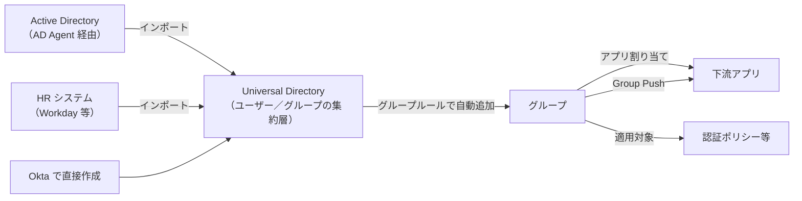
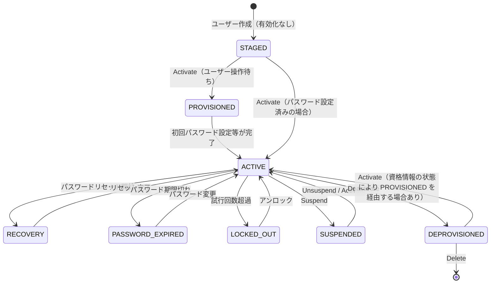

# 【勉強】Okta Workforce Identity Cloud — ユーザー／グループ管理（2026-08-11）

## 今日のテーマ

Okta Workforce Identity Cloud（以下 WIC）で、ユーザーとグループがどこにどう保持され、どうやって自動で動くのかを整理します。昨日の Entra ID 編と同じテーマの Okta 版です。同じ「ユーザーとグループ」でも、Okta は考え方の重心がだいぶ違うところにあります。

## 概要

Okta でユーザーとグループを保持している層が **Universal Directory（UD）** です。Okta 内で直接作ったユーザーも、Active Directory や LDAP、HR システム（Workday など）から取り込んだユーザーも、最終的にはすべて UD の上に載ります。

インフラ出身の感覚だと「AD の代わりのディレクトリ」と考えたくなりますが、少しずれます。UD は置き換えというより **集約層** です。AD を残したまま、そこから取り込んだユーザーを UD に集め、他のソースの情報と合成し、下流のアプリへ配る。ここで効いてくるのが、次に見るプロファイルとマッピングです。



上の図は、ユーザーがどこから入ってきて、グループを経由してどこへ流れていくかの全体像です。

## 押さえる要点

### 1. プロファイル＝スキーマ

Okta の「プロファイル」は、そのオブジェクトが持てる属性の定義、つまりスキーマです。Profile Editor（管理コンソール）または Schema API で編集します。種類は次のとおりです。

- **Okta ユーザープロファイル**：全ユーザー共通の入れ物。Okta は既定で 31 個の base 属性を定義しています。base 属性のうち管理者が変更・削除できるのは First Name と Last Name だけで、これも「必須／任意」の切り替えができるという意味です（Okta をソースとするユーザーが対象）。足りない属性はカスタム属性として自由に足せます。
- **アプリユーザープロファイル**：アプリごとに、Okta が読み書きできる属性の一覧。ここが重要な制約で、**任意の名前でカスタム属性を新規作成することはできません**。追加できるのは、Okta がアプリやディレクトリに問い合わせて動的に生成する「定義済みリスト」の属性だけです。どの属性をサポートするかはアプリ側が決めます。
- **グループプロファイル**：グループにも属性があります。base は Name と Description の 2 つで、こちらはカスタム属性を追加できます。
- **カスタムユーザータイプ**：社員と業務委託で必要な属性が違う、といった場合に、別のユーザータイプ（別スキーマ）を用意できます。

なお、**Okta ユーザープロファイル**のカスタム属性名には予約語が使えません。`id` `profile` `status` `created` `activated` `lastLogin` `lastUpdated` `type` `password` `credentials` などが該当します。グループプロファイルには別の予約語リスト（`groupType` `objectSid` `dn` など）があります。

### 2. マッピングとプロファイルソーシング

属性の流れは 2 方向あり、どちらも「マッピング」として明示的に定義します。

- **App → Okta**：アプリ側を正としてインポートする向き。HR の `mobilePhone` を Okta の `mobilePhone` に取り込む、など。
- **Okta → App**：Okta 側を正としてプロビジョニングする向き。Okta の `department` を Salesforce の `department` に流す、など。

ここで押さえておきたい概念が **プロファイルソース**です。ルールはシンプルで、**あるユーザーのプロファイルソースは、常に 1 つだけ**です。候補が複数ある場合（AD と Workday の両方から来ている等）は優先順位を付けて、どちらを正とするか決めます。

そのうえで、属性ごとに例外を作れます。属性単位のソース指定には次の 3 つがあります。

| 設定 | 意味 |
| --- | --- |
| Inherit from profile source（既定） | プロファイルソースをその属性のソースにする |
| Inherit from Okta | Okta をその属性のソースにする |
| Override profile source | 別のプロファイルソースでその属性を上書きする |

「プロファイル全体は Workday が正。ただし電話番号だけは AD を見る」といった構成は、この組み合わせで作ります。

### 3. ユーザーのライフサイクル状態

Okta のユーザーには状態があり、これが「何ができるか」と「管理者が次に何をすべきか」を表します。API 上の値は次の 8 つです。

- `STAGED`：作られたが、まだ有効化されていない
- `PROVISIONED`：有効化処理は走ったが、ユーザー側の操作（初回パスワード設定など）待ち
- `ACTIVE`：通常状態。割り当てられたアプリを使える
- `RECOVERY`：パスワードリセット中
- `PASSWORD_EXPIRED`：パスワード期限切れ
- `LOCKED_OUT`：パスワード試行回数超過などによるロックアウト
- `SUSPENDED`：一時停止。サインインできないが、設定は保持される
- `DEPROVISIONED`：無効化済み

状態は管理コンソールの People ページの Status 列と、各ユーザーのプロファイルページに表示されます。ここで注意したいのが、**コンソールの表示ラベルと API の値は名前が違う**ことです。`PROVISIONED` は「Pending user action」、`RECOVERY` は「Password reset」、`DEPROVISIONED` は「Deactivated」と表示されます。ログや API を見る人とコンソールを見る人で話が噛み合わないことがあるので、対応関係を覚えておくと役に立ちます。

操作としては、Staged なら Status 列の Activate から有効化でき、Suspended や Deactivated ならユーザーのプロファイルページから Activate できます。



上の図は、ユーザー状態がどう遷移するかを表したものです。「無効化（DEPROVISIONED）と削除は別物」という点が、運用上いちばん効いてきます。

### 4. グループ

グループは、管理コンソールの Directory > Groups で扱います。グループには **ソースタイプ** があり、Okta 内で作られたグループと、アプリやディレクトリから取り込まれたグループ（AD、LDAP、HR アプリなど）が区別されます。一覧画面ではこのソースタイプで絞り込めます。

Okta のグループで最初に驚くのが、**入れ子（ネスト）に対応していない**ことです。AD の入れ子グループを取り込むと、Okta 側では階層は再現されず、ユーザーが所属する全グループにそれぞれ直接メンバーとして追加される、という形にフラット化されます。

### 5. グループルール

**グループルール**は、ユーザーの属性を条件に、グループへ自動で追加する仕組みです。Entra ID の動的メンバーシップグループに相当します。

- 条件は「基本条件」か **Okta Expression Language** で書きます。基本条件で使えるのは文字列属性のみです。
- 1 つの org で作れるルールの上限は **2000** です。
- **管理者グループ（admin グループ）への割り当てにはグループルールを使えません。** 逆方向の制約もあり、すでにグループルールのターゲットになっているグループに管理者権限を付与することもできません。
- ルールで user status を指定した場合はその状態のユーザーだけが対象になり、**指定しない場合は Active なユーザーだけ**が対象になります。Pending や Inactive の状態にあるユーザーはグループルールでは動きません。
- Workday や AD の属性を条件に使いたい場合は、**先に Okta ユーザープロファイルの属性へマッピングしておく必要があります**。マッピングしていない属性はルールから参照できません。

設定の流れは次のようなイメージです。

1. Directory > Groups で対象グループを作る
2. Directory > Groups > Rules > Add rule
3. 条件を書く（Okta Expression Language の例）
   ```
   user.department == "Sales" AND user.countryCode == "JP"
   ```
4. 追加先グループを選ぶ
5. ルールを作成し、有効化する

### 6. Group Push

**Group Push** は、Okta のグループとそのメンバーシップを、プロビジョニング対応の下流アプリへ押し出す機能です。「Okta 側でグループを作れば、アプリ側にも同じグループができる」という動きになります。

前提条件がひとつあり、ここでよく詰まります。**押し出すグループのメンバーは、事前にその対象アプリへ割り当て・プロビジョニング済みでなければなりません。** Group Push はメンバーシップを同期する機能であって、アプリへの割り当てそのものを行う機能ではない、と理解しておくと整理しやすいです。

そして Okta は、**同一のグループをアプリ割り当てと Group Push の両方に使うことをサポートしていません**（推奨しない、ではなく非サポートです）。アプリ割り当て用のグループと、Group Push 用のグループを、それぞれ別に作る必要があります。

また、Okta 側を正とするため、対象アプリ側でそのグループを直接変更してはいけません。Okta 側で無効化されたユーザーは Group Push の更新に含まれないので、その場合は再有効化してから push し直します。

## つまずきやすいところ・注意点

- **無効化してもグループからは外れない。** Deactivate したユーザーはアプリへのアクセスを失いますが、グループのメンバーシップは残ります。「グループ一覧に名前があるから有効なはず」と判断しないこと。
- **グループルールは既定で Active のユーザーしか見ない。** 入社処理の途中（Staged や Pending）の段階でグループに入っていないのは、多くの場合これが理由です。
- **属性はマッピングしてからでないとルールで使えない。** AD の属性名をそのままルールに書いても動きません。
- **入れ子グループの取り込みには落とし穴がある。** 親グループが AD の OU / LDAP オブジェクトフィルタの対象範囲にあっても、子グループが範囲外だと、Okta は通常のインポート時にその子グループを検出できず、親グループのメンバーシップを正しく解決できません。範囲設計は親子まとめて考える必要があります。なお JIT プロビジョニングはフラットなメンバーシップだけを見るため、この場合でも親グループへ正しく解決されます。「JIT では入るのにインポートでは入らない」という食い違いが起きたら、まずここを疑うとよさそうです。
- **入れ子由来のメンバーは Okta から外せない。** Okta 側でグループから外せるのは直接メンバーだけです。
- **プロファイルソースは 1 ユーザーにつき 1 つ。** 「Workday も AD も両方が正」という構成は作れません。属性単位の上書きで表現します。
- **アプリユーザープロファイルには任意のカスタム属性を作れない。** 追加できるのはアプリがサポートする属性だけで、アプリが持っていない属性は流せません。

## 今日のまとめ

### 重要用語ミニ辞書

| 用語 | 意味 |
| --- | --- |
| Universal Directory（UD） | Okta がユーザー・グループを集約して保持する層 |
| プロファイル | ユーザー／グループ／アプリユーザーが持てる属性の定義（スキーマ） |
| プロファイルソース | そのユーザーのプロファイルの正となるシステム。1 ユーザーにつき常に 1 つ |
| マッピング | App → Okta / Okta → App の属性変換ルール |
| グループソースタイプ | グループがどこ由来か（Okta / AD / LDAP / アプリ 等）の区別 |
| グループルール | 属性条件でグループへ自動追加する仕組み。org あたり最大 2000 |
| Okta Expression Language | グループルールやマッピングで使う式言語 |
| Group Push | Okta のグループとメンバーシップを下流アプリへ押し出す機能 |

### 理解度チェック

1. あるユーザーの部署が Workday で「営業」に変わった。この変更が Okta のグループメンバーシップに反映されるまでに、どんな設定が揃っている必要があるか。
2. Deactivate したユーザーがグループ一覧にまだ表示されている。これは異常か、正常か。理由も含めて説明できるか。
3. Group Push を設定したのに、あるユーザーだけ下流アプリのグループに現れない。まず確認すべき点を 2 つ挙げられるか。

## 参考リンク

- [Universal Directory | Okta Developer](https://developer.okta.com/docs/concepts/universal-directory/)
- [Profile types | Okta](https://help.okta.com/oie/en-us/content/topics/users-groups-profiles/usgp-about-profiles.htm)
- [View user profiles | Okta](https://help.okta.com/en-us/content/topics/users-groups-profiles/usgp-view-user-profile.htm)
- [Reserved attributes | Okta](https://help.okta.com/oie/en-us/content/topics/users-groups-profiles/usgp-reserved-attributes.htm)
- [Add custom attributes to apps, directories, and identity providers | Okta](https://help.okta.com/en-us/content/topics/users-groups-profiles/usgp-add-custom-attribute.htm)
- [Custom user types in Universal Directory | Okta](https://help.okta.com/en-us/content/topics/users-groups-profiles/usgp-usertypes-about.htm)
- [Profile sourcing | Okta](https://help.okta.com/oie/en-us/content/topics/users-groups-profiles/usgp-about-profile-sourcing.htm)
- [Prioritize profile sources | Okta](https://help.okta.com/oie/en-us/content/topics/users-groups-profiles/usgp-prioritize-profile-source.htm)
- [Define the attribute profile source | Okta](https://help.okta.com/oie/en-us/content/topics/users-groups-profiles/usgp-define-attribute-profile-source.htm)
- [Map profile attributes | Okta](https://help.okta.com/oie/en-us/content/topics/users-groups-profiles/usgp-map-profile-attribute.htm)
- [User account status | Okta](https://help.okta.com/en-us/content/topics/users-groups-profiles/usgp-end-user-states.htm)
- [Activate user accounts | Okta](https://help.okta.com/oie/en-us/content/topics/users-groups-profiles/usgp-activate-user-account.htm)
- [Suspend user accounts | Okta](https://help.okta.com/en-us/content/topics/users-groups-profiles/usgp-suspend.htm)
- [Deactivate and delete user accounts | Okta](https://help.okta.com/en-us/content/topics/users-groups-profiles/usgp-deactivate-user-account.htm)
- [UserStatus (Okta Java SDK API)](https://developer.okta.com/okta-sdk-java/apidocs/com/okta/sdk/resource/model/UserStatus.html)
- [About groups | Okta](https://help.okta.com/en-us/content/topics/users-groups-profiles/usgp-about-groups.htm)
- [Okta group source types | Okta](https://help.okta.com/en-us/content/topics/users-groups-profiles/usgp-group-types.htm)
- [Group rules | Okta](https://help.okta.com/oie/en-us/content/topics/users-groups-profiles/usgp-about-group-rules.htm)
- [Create group rules | Okta](https://help.okta.com/oie/en-us/content/topics/users-groups-profiles/usgp-create-group-rules.htm)
- [Okta group rule limitations and restrictions | Okta Support](https://support.okta.com/help/s/article/okta-group-rule-limitations-and-restrictions)
- [Group Push | Okta](https://help.okta.com/en-us/content/topics/users-groups-profiles/usgp-about-group-push.htm)
- [Group Push prerequisites | Okta](https://help.okta.com/en-us/content/topics/users-groups-profiles/usgp-group-push-prerequisites.htm)
- [App assignments and Group Push | Okta](https://help.okta.com/oie/en-us/content/topics/users-groups-profiles/app-assignments-group-push.htm)
- [Import groups from Active Directory | Okta](https://help.okta.com/oie/en-us/content/topics/directory/ad-agent-import-groups.htm)
- [Okta Handling of Active Directory Nested Groups | Okta Support](https://support.okta.com/help/s/article/How-does-Okta-handle-nested-groups?language=en_US)
