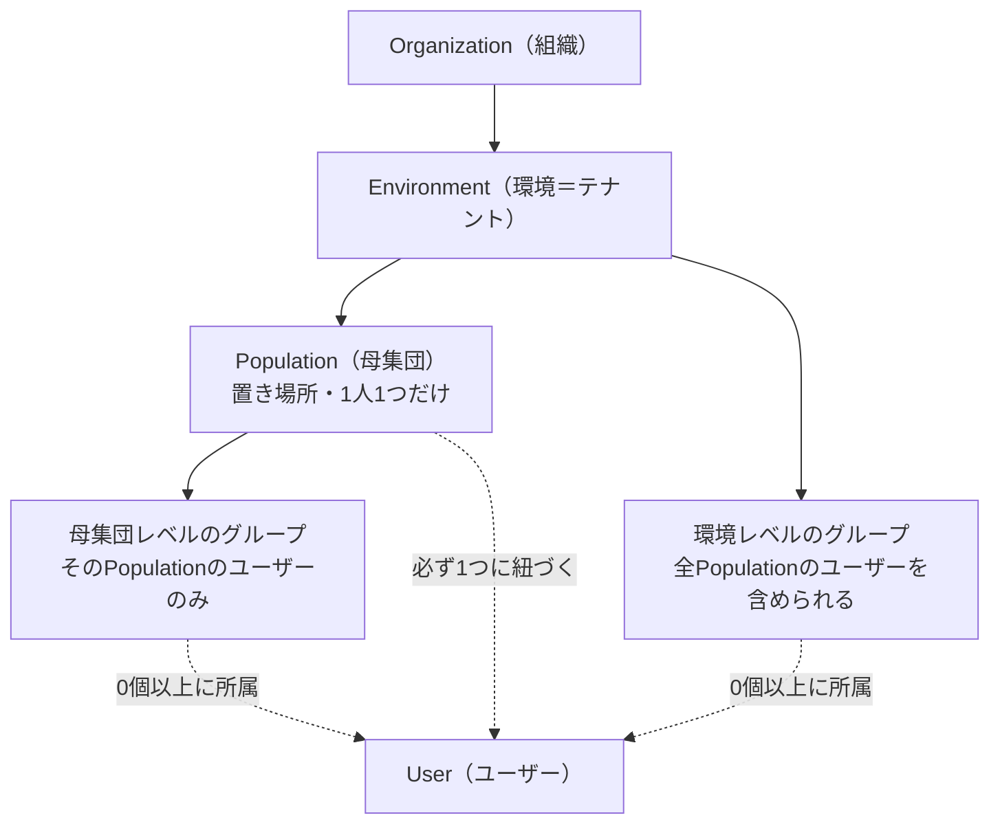
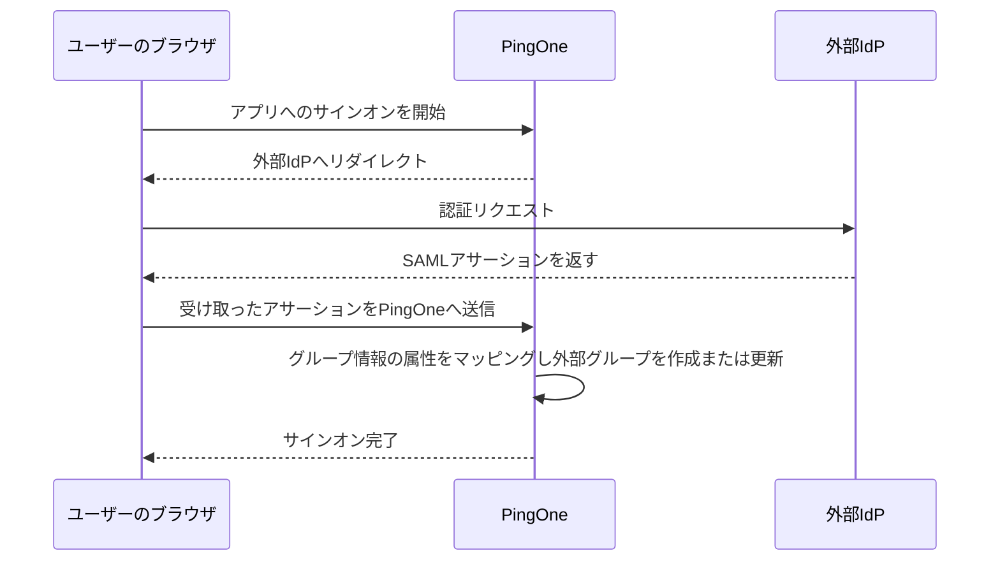

# 【勉強】Ping Identity — ユーザー／グループ管理（2026-08-12）

## 今日のテーマ

PingOne でユーザーとグループをどう整理するかを押さえます。8/10 の Entra ID 編、8/11 の Okta 編と同じテーマですが、**Ping には「Population（母集団）」という他社にない箱がある**ので、そこが今日の山場です。

## 概要 — グループの前に「Population」がある

Entra ID も Okta も、ユーザーをまとめる箱は基本的に「グループ」ひとつでした。PingOne は違います。**Population と Group という2種類の箱**があり、役割がはっきり分かれています。

- **Population（母集団）** — ユーザーの「置き場所」。公式ドキュメントは「A population defines a set of users, similar to an organizational unit (OU).」と説明しています。ディレクトリの OU に近い感覚です。**1人のユーザーは必ずどれか1つの Population にだけ属します。**
- **Group（グループ）** — ユーザーの「くくり方」。アプリへのアクセス制御に使います。**1人のユーザーは複数のグループに属せます。**

Population と Group はどちらも Environment（環境＝テナント）の単位で管理されます。ただしグループは作成時に Population を指定でき、指定すると「母集団レベルのグループ」としてその Population に属します（Population の詳細画面にも Groups タブがあります）。指定しなければ「環境レベルのグループ」です。

上図は Population とグループの関係を表したものです。ユーザーは必ず1つの Population に紐づき、グループには0個以上所属します。なお公式は「Users are associated with populations instead of being defined within a population.（ユーザーは Population の中に定義されるのではなく、Population に関連付けられる）」とも書いていて、Population はあくまで「所属先」という位置づけです。

## 押さえる要点

### 1. Population — ユーザーを作る前に必ず1つ要る

- 「**All users are assigned to a population, and you must have at least one population before you can create users.**」つまり Population がゼロの環境ではユーザーを1人も作れません。
- 既定の Population を指定でき、API やコンソールで Population を明示せずにユーザーを作ると、そこに入ります。
- Population 単位で割り当てられる主なもの: **パスワードポリシー**、**既定の IdP**、そして**管理者ロールのスコープ**（「この Population の Identity Admin」という絞り方ができる）。※サインオンポリシーについては、Introduction のページに「Population に割り当てられる」旨の記述がある一方、Managing populations 側に該当する設定項目の説明がなく、**公式内で記述が食い違っています**。実機で確認したい項目です。
- **Population 間の移動は可能**です。Directory > Users からユーザーの Profile タブで Population を変更します（Identity Data Admin ロールが必要）。
- **Population を消すには、先に中のユーザーを全部出す必要があります。**「You must remove all users from a population before you can delete it.」削除には Environment Admin ロール（または同等権限のカスタムロール）が必要です。

### 2. Group — 「環境レベル」か「母集団レベル」か

グループを作るとき、Population を指定するかどうかで性質が変わります。

- **環境レベルのグループ** — 環境内のどの Population のユーザーでも入れられる。
- **母集団レベルのグループ** — その Population のユーザーしか入れられない。作成時に Population を選ぶとこちらになります。

そして重要な制約が2つあります。**作成後にグループを別の Population へ移したり、母集団レベル⇄環境レベルへ移すことはできません。** また、**ユーザーを Population から外すと、対応する母集団レベルのグループからも自動的に外れます。**

上限は、1環境あたりグループ 100,000 個、1グループのユーザー数は無制限、1ユーザーが所属できるグループは 10,000 個までです。ただし公式は「ID トークンのサイズ制限のため、トークンに載って返るグループ数はこれより少なくなることがある」と補足しています。

### 3. static と dynamic — 動的グループの作り方

- **static group** — 手でメンバーを足し引きする。
- **dynamic group** — フィルタ（ルール）でメンバーが決まる。属性が条件に合えば自動で入り、合わなくなれば自動で抜けます。

フィルタの書き方は2モードあります。

- **Basic モード** — 「属性 / 演算子 / 値」を GUI で組み立てる。演算子は **Equals / Starts with / Ends with / Contains** の4つだけ（Boolean 属性は Equals のみ）。条件ブロックは **All（AND）／Any（OR）**で結合します。同じ条件ブロック内では論理演算子を混ぜられません。
- **Advanced (SCIM) モード** — SCIM フィルタ式を直接書く。Basic で組んだ条件は SCIM 式として表示されますが、複雑な SCIM 式は Basic では表示しきれません。

動的グループの落とし穴として、**手動でメンバーを「追加」はできるが、「削除」はできません。** 抜きたければフィルタか属性のほうを直す必要があります。

### 4. nested group — 入れ子で権限が継承される

グループを他のグループのメンバーにできます。継承されるのは「**membership and application access**（メンバーシップとアプリケーションアクセス）」です。

公式の例では、Group A に Group B、Group B に Group C をネストすると、A が App1、B が App1+App2、C が App1+App2+App3 にアクセスできる、という広がり方をします。

- **環境レベルのグループを母集団レベルのグループの中にネストすることはできません。**
- ネストは循環参照も作れてしまいます（C の下に A を入れると3グループ全部が全アプリにアクセスできる）。事故のもとなので注意。
- 上限は「1グループあたり 250」で、これは**階層の深さと各階層のグループ数の組み合わせの合計**として数えられます。「深さ N 段まで」という数え方ではありません。

### 5. ロールは static グループにしか付けられない

これは覚えておく価値があります。公式の理由付きの記述です。

> **For security reasons, you can assign roles to static groups but not to dynamic groups.** Dynamic groups include members based on a filter or rule. Users could be added to a dynamic group unintentionally and could inherit role assignments you don't want to give them.

動的グループは属性が変わっただけで人が入ってくるので、管理者権限を配る器にすると危険、という判断です。

### 6. 外部グループと JIT プロビジョニング

外部 IdP や LDAP ゲートウェイ由来のグループは **external group** になり、Groups ページで「Just-in-time」バッジが付きます。**JIT グループプロビジョニングは認証処理の一部として起こります**（管理コンソールの Provisioning ページで設定する同期とは別物です）。

公式は、グループ情報の取り込み元として **SAML アサーション／ID トークン／UserInfo レスポンス**の3つを挙げています。下図はこのうち **SAML の場合**の流れです。

ここで押さえたいのは、**SAML のリダイレクトは IdP と PingOne が直接やりとりしているのではなく、ユーザーのブラウザを経由している**という点です。一方で OIDC の場合、ブラウザ経由で PingOne に渡るのは認可コードで、ID トークンや UserInfo レスポンスは **PingOne が IdP を直接呼び出して取得します**（バックチャネル）。フロントチャネルとバックチャネルが混在する、と理解しておくと混乱しません。

取り込みのタイミングも設定できます。外部 IdP の場合は「一度だけ」か「サインオンのたび」かを選べます。LDAP ゲートウェイの場合は既定が一度だけで、**Update PingOne user attributes as users sign on** を有効にするとサインオンのたびに更新されます。

外部グループの制約:

- **PingOne 側から外部グループにユーザーを直接追加することはできません。** 削除はできますが、次回の同期で戻ってくる可能性があります。
- **グループの表示名（Group Display Name）を PingOne 側で変更することもできません。**
- 外部側でグループ名が変わると、PingOne は**別の新しいグループとして扱います**（旧グループから外れ、新グループに入る）。
- LDAP ゲートウェイ経由の場合、ネストされたグループは**直接所属しているグループだけ**がプロビジョニングされます（A → B → User なら B のみ）。

### 7. ユーザー属性

Directory > User Attributes で、環境に保持する属性を定義します。カスタム属性は2種類です。

- **Declared** — 文字列属性。一意性の強制、複数値、列挙値、正規表現バリデーションを設定できます。
- **JSON** — 構造化属性。アクセストークンに複雑な情報を載せたいときに使います。複数値と JSON スキーマによるバリデーションを設定できます。

上限は**文字列属性 200 個、JSON 属性 200 個**、そして**ユーザープロファイル全体で 16KB** です。なお、**一度「複数値」にした属性は単一値に戻せません。**

## 手順のイメージ

管理コンソールの **Directory** メニューには **Users / Groups / Populations / User Attributes / Administrator Roles** の5ページがあります。典型的な流れは次のとおりです。

1. **Directory > Populations** で Population を1つ以上作る（ユーザー作成の前提）。
2. **Directory > Users** でユーザーを作成、または LDAP ゲートウェイ／外部 IdP から取り込む。
3. **Directory > User Attributes** で、部署コードなど自社で必要な属性を追加する。
4. **Directory > Groups** でグループを作る。Population を指定すれば母集団レベル、指定しなければ環境レベル。
5. アクセス制御に使うグループは **static**、名簿の自動維持に使うグループは **dynamic** と使い分ける。
6. 管理者権限を配るグループは必ず **static** にする。

## つまずきやすいところ

- **Population を「グループの一種」だと思うと必ず混乱します。** Population は排他的な置き場所、Group は重複可能なくくり、と役割で覚えるのが早道です。
- **グループは後から Population を変更できません。** 設計を間違えると作り直しになるので、最初に「このグループは全社横断か、特定 Population 限定か」を決めてください。
- **動的グループからは手で人を抜けません。** 「1人だけ例外的に外したい」という運用要求が来たら、そのグループは static にすべきというサインです。
- **ネストは循環参照を作れてしまいます。** 意図しないアプリアクセスの拡大につながるので、ネスト構造は図に描いて管理するのが安全です。
- **ロールをグループに付けると、自分でそのグループを出入りできなくなります**（「You can't add or remove yourself from a group that has roles assigned to it.」）。管理者グループの設計時は注意してください。

## 今日のまとめ

**ミニ辞書**

| 用語 | 意味 |
| --- | --- |
| Environment（環境） | PingOne のテナント。ユーザー、アプリ、設定を隔離する単位 |
| Population（母集団） | ユーザーの排他的な置き場所。ディレクトリの OU に近い。1人1つだけ |
| Group（グループ） | アクセス制御用のくくり。1人が複数所属可。static / dynamic がある |
| 環境レベル / 母集団レベル グループ | 前者は環境内の全 Population のユーザーを入れられる。後者はその Population のみ |
| dynamic group | フィルタでメンバーが自動決定されるグループ。ロールは割り当て不可 |
| nested group | 別グループのメンバーになっているグループ。メンバーシップとアプリアクセスを継承 |
| external group | 外部 IdP / LDAP ゲートウェイ由来のグループ。PingOne から直接メンバー追加不可 |
| JIT グループプロビジョニング | 認証処理の中でグループ情報を取り込む仕組み |

**理解度チェック**

1. 「営業部のユーザー全員をまとめたい」とき、Population と Group のどちらを使うべきでしょうか。またその理由は？
2. 動的グループに管理者ロールを割り当てられないのはなぜですか。公式が挙げている理由を説明してください。
3. 母集団レベルのグループを作った後、「やっぱり全社横断で使いたい」となりました。どうすればよいでしょうか。

## 参考リンク

- [About groups and populations | PingOne](https://docs.pingidentity.com/pingone/directory/p1_groups_vs_populations.html)
- [Populations | PingOne](https://docs.pingidentity.com/pingone/directory/p1_populations.html)
- [Managing populations | PingOne](https://docs.pingidentity.com/pingone/directory/p1_manage_populations.html)
- [Groups | PingOne](https://docs.pingidentity.com/pingone/directory/p1_groups.html)
- [Creating a group | PingOne](https://docs.pingidentity.com/pingone/directory/p1_create_group.html)
- [Creating a nested group | PingOne](https://docs.pingidentity.com/pingone/directory/p1_create_nested_group.html)
- [Managing group membership | PingOne](https://docs.pingidentity.com/pingone/directory/p1_add_members_to_group.html)
- [Just-in-time provisioning of external groups | PingOne](https://docs.pingidentity.com/pingone/directory/p1_provision_external_groups.html)
- [Moving a user to a different population | PingOne](https://docs.pingidentity.com/pingone/directory/p1_changeuserpopulation.html)
- [User attributes | PingOne](https://docs.pingidentity.com/pingone/directory/p1_user_attributes.html)
- [Adding user attributes | PingOne](https://docs.pingidentity.com/pingone/directory/p1_adduserattributes.html)
- [Directory | PingOne](https://docs.pingidentity.com/pingone/directory/p1_directories_menu.html)
- [Platform limits | PingOne](https://docs.pingidentity.com/pingone/getting_started_with_pingone/p1_platform_limits.html)
- [Introduction to PingOne | PingOne](https://docs.pingidentity.com/pingone/introduction_to_pingone/p1_introduction.html)
