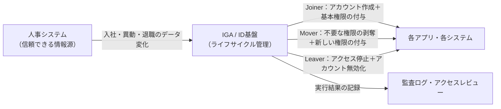
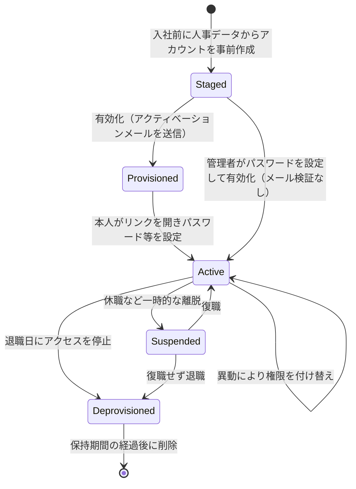

# 【勉強】IGA（アイデンティティガバナンス＆管理）— アイデンティティライフサイクル管理（Joiner／Mover／Leaver）（2026-08-14）

## 今日のテーマ

人が入社し、異動し、退職するのに合わせて、アカウントとアクセス権を自動で作り・付け替え・止める仕組み。IGAの世界では **JML（Joiner / Mover / Leaver）** と呼ばれる、いちばん土台になる考え方を学びます。

## 概要

サーバー運用をしていると、「新入社員が来たのでアカウントを作る」「異動したので権限を直す」「退職したので消す」という作業を手で回した経験があると思います。IGAにおける**アイデンティティライフサイクル管理**は、この一連の作業を人事情報を起点に自動化するものです。

ポイントは、アカウントの作成・変更・削除の判断を「情シスへの依頼」ではなく、**人事システム（Authoritative Source／信頼できる情報源）のデータ変化**に委ねるところにあります。Microsoft は Joiner / Mover / Leaver を、それぞれ「アクセスが必要になった人」「組織内の境界を越えて移動し、追加の／異なるアクセス権が必要になる人」「アクセスが不要になった人」と定義しています。

上の図は、人事システムを起点にIGAが各システムへ変更を流し込み、その結果が監査ログとして残るまでの流れを表しています。

## 押さえる要点

- **Joiner（入社）** — デジタルID（アカウント）の新規作成と、職種・部署に応じて自動で付く権限の付与。この「所属していれば当然もらえる権限」を **バースライト（Birthright）アクセス** と呼びます。初回サインインのための資格情報の受け渡しもここに含まれます。Entra ID Governance では、入社日の前に一時アクセスパス（TAP）を生成して上長にメールで渡す、といった構成が可能です。
- **Mover（異動）** — 部署・役職・上長といった属性の変化をトリガーに、権限を付け替えます。**足す処理だけでなく、引く処理を必ず設計する**のがここの肝です。
- **Leaver（退職）** — アクセスの停止。グループからの削除、ライセンスの剥奪、アカウントの無効化、そして一定期間後の削除、という段階を踏むのが一般的です。
- **ライフサイクル状態（Lifecycle State）** — 「今このIDはどの状態か」を表す値。SailPoint Identity Security Cloud では既定で「Active」「Inactive」の2つが用意されます。IDがどの状態かは `cloudLifecycleState` 属性の値で判定されますが、この値は状態の**技術名**（表示名の横に括弧書きで表示され、既定状態では `active` / `inactive` のような小文字）と一致している必要があり、**大文字小文字も区別されます**。表示名のつもりで `Active` と入れると一致しません。Okta ではユーザーの状態として `STAGED` `PROVISIONED` `ACTIVE` `SUSPENDED` `DEPROVISIONED` などが定義されています。
- **HR駆動プロビジョニングとワークフローは別物** — アカウント本体の作成や属性更新はプロビジョニング機能が担い、メール送信や資格情報の生成といった付随タスクの自動化はライフサイクルワークフローが担う、という役割分担になっています。

この図は、IDが取りうる状態と、どのイベントで次の状態へ移るかを表しています。状態名はOktaのユーザーステータスの呼び方に寄せていますが、遷移そのものは一般的なライフサイクル設計の例であり、すべてがOktaの自動処理というわけではありません（特に「保持期間の経過後に削除」は運用側で設計する部分です）。

## 設定のイメージ

Entra ID Governance のライフサイクルワークフローは、次の3つの部分から構成されます。

1. **一般情報** — ワークフローの表示名と説明。
2. **タスク** — 実行される処理そのもの。退職側の組み込みタスクには「選択したグループからユーザーを削除」「ユーザーアカウントを無効化」「ライセンスを削除」「ユーザーアカウントを削除」などがあります。
3. **実行条件** — いつ（トリガー）、誰に対して（スコープ）実行するか。トリガーには `employeeHireDate`（入社日）や `employeeLeaveDateTime`（退職日）といった日付属性が使えます。

組み込みタスクで足りない処理は、**カスタム拡張**から Azure Logic Apps などの外部システムを呼び出して補います。なお、この機能の利用には Microsoft Entra ID Governance または Microsoft Entra Suite のライセンスが必要です。

## つまずきやすいところ

- **Moverで「引く」処理を忘れる** — 足す処理だけを組むと、異動のたびに権限が積み上がっていきます。Microsoft も営業からマーケティングへの異動例で、「営業で持っていた不要な権限の削除」と「マーケティングでの新しい権限の付与」の両方が必要だと明記しています。SailPoint では、前の状態で付与されたアクセスプロファイルは次の状態へ移った時点で自動的に取り消される、という挙動になっています。
- **無効化と削除を同一視する** — 退職即削除にすると、監査やフォレンジックのためにIDを残しておきたいケースで困ります。Entra ID では削除したユーザーも既定で30日間は復元可能な状態（ソフト削除）で保持され、30日を過ぎると完全に削除されます。まず無効化、猶予期間の後に削除、という2段構えが基本です。
- **属性のマッピングを詰めきれていない** — トリガーに使う日付属性や部署コードが人事側から流れてこなければ、ワークフローは動きません。自動化の前に、まず属性の流れを固めることが先決です。
- **休眠アカウントの扱い** — 退職手続きに乗らないまま放置されるIDもあります。Entra ID Governance にはサインイン非アクティブ日数をトリガーに無効化・削除を走らせる仕組みがあります。

## 今日のまとめ

**ミニ辞書**

| 用語 | 意味 |
| --- | --- |
| JML | Joiner / Mover / Leaver。入社・異動・退職に沿ったIDの3つの節目 |
| Authoritative Source | IDの正しい情報の出どころ。多くの場合は人事システム |
| バースライトアクセス | 所属や職種に応じて自動的に付与される基本的なアクセス権 |
| ライフサイクル状態 | IDが今どの段階にあるかを表す値。状態の変化が処理のトリガーになる |
| デプロビジョニング | 付与済みのアカウントやアクセス権を取り消す処理 |

**理解度チェック**

1. Mover の処理で、権限を「付与する」だけでは不十分なのはなぜでしょうか。
2. 退職時にアカウントをすぐ削除せず、まず無効化してから期間を空けて削除するのはなぜでしょうか。
3. JMLの自動化を人事システム起点で組むと、情シスへの依頼ベースの運用と比べて何が変わるでしょうか。

## 参考リンク

- [Govern the employee and guest lifecycle with Microsoft Entra ID Governance](https://learn.microsoft.com/entra/id-governance/scenarios/govern-the-employee-lifecycle)
- [Understanding lifecycle workflows - Microsoft Entra ID Governance](https://learn.microsoft.com/entra/id-governance/understanding-lifecycle-workflows)
- [Microsoft Entra ID Governance deployment guide for employee lifecycle automation](https://learn.microsoft.com/entra/architecture/governance-deployment-employee-lifecycle)
- [Introduction to Microsoft Entra ID Governance deployment guide](https://learn.microsoft.com/entra/architecture/governance-deployment-intro)
- [Manage inactive users using Lifecycle Workflows](https://learn.microsoft.com/entra/id-governance/lifecycle-workflow-inactive-users)
- [Restore or remove a recently deleted user in Microsoft Entra ID](https://learn.microsoft.com/entra/fundamentals/users-restore)
- [Setting Up Lifecycle States - SailPoint Identity Security Cloud](https://documentation.sailpoint.com/saas/help/provisioning/lifecycle.html)
- [User account status - Okta](https://help.okta.com/en-us/content/topics/users-groups-profiles/usgp-end-user-states.htm)
- [User Lifecycle - Okta Management API](https://developer.okta.com/docs/api/openapi/okta-management/management/tags/userlifecycle)
