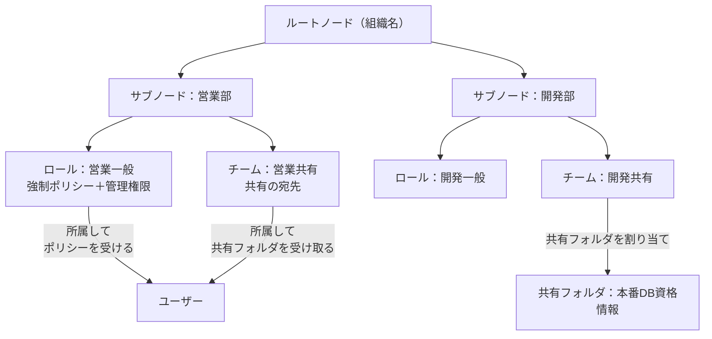
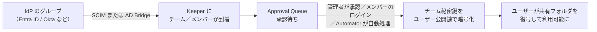

# 【勉強】Keeper — ユーザー／グループ管理（2026-08-17）

## 今日のテーマ

Keeper Enterprise で人と権限をどう整理するか、**ノード／ロール／チーム**の3つの箱を学びます。Entra ID・Okta・Ping・Auth0 で見てきた「ユーザーとグループ」に相当する話ですが、Keeper にはゼロ知識アーキテクチャ由来の独自の作法があります。

## 概要

Keeper の管理コンソールには、役割の違う3つの器があります。

- **ノード（Node）** — 組織構造そのもの。公式は Active Directory の組織単位（OU）に例えています。拠点・部門・事業部など、好きな軸でツリーを作れます。
- **ロール（Role）** — 職務に応じた**ポリシーと権限**の束。Keeper では RBAC の中心はロールで、末端ユーザーのボールト体験を縛る「Enforcement Policies（強制ポリシー）」と、管理コンソールでの操作権限である「Administrative Permissions（管理権限）」の2種類を持ちます。
- **チーム（Team）** — **共有のためのまとまり**。他社製品の「グループ」に一番近いのはこれですが、Keeper のチームは権限グループではなく、共有フォルダを配る宛先です。

ここが Keeper 特有で最初に混乱するところです。他の IdP なら「グループに入れる → 権限が付く」ですが、Keeper では**権限（ポリシー）はロール、認証情報の配布はチーム**と役割が分かれています。ロールをチームに割り当てることもできるので両者は接続できますが、器としては別物です。

3つの関係を図にすると次のようになります。

## 押さえる要点

### ノード

- **既定ではルートノードだけが存在する。** 小規模なら root だけで運用でき、大規模なら拠点や部門でサブノードを切ります。
- **SSO を使うならサブノードが必須。** SSO Connect Cloud のプロビジョニングはルート以外のノードに設定するため、ルートに作られたユーザーは対象サブノードへ移す必要があります（前回の記事で扱った通り）。
- **ノード分離（Node Isolation）** — ノード分離を有効にすると、**並列（兄弟）ノードのユーザー名とチーム名が共有時の入力補完に出なくなります**。ただし親ノードのユーザー／チームは引き続き見えます。つまり分離は「横方向の目隠し」であり、上下方向の遮断ではありません。
- **分離の有効化は管理コンソールの画面からはできない。** 公式は Commander CLI（`enterprise-node <ノード> --toggle-isolated`）を使うか、Keeper サポートにチケットを起票する、と案内しています。

### ロール

- **強制ポリシー（Enforcement Policies）** — マスターパスワードの複雑さ、2FA の要求、共有の可否、エクスポートの可否など、ユーザーのボールト側の挙動を縛る設定です。
- **管理権限（Administrative Permissions）** — 管理コンソールで何をできるかの権限。Manage Users（ユーザーの追加・削除・編集）、Manage Roles（ロールの追加・削除・編集）、Manage Teams（チームの作成・削除・メンバー追加）などがあり、これが**委任管理（Delegated Administration）** の実体です。
- **管理権限はノード単位で与える。** ロールの管理権限設定で「+ Add Managing Node」を押し、管理対象ノードを指定します。**Cascade Node Permissions** にチェックを入れるとそのノードとすべての配下サブノードに権限が及び、外すとそのノードだけに限定されます。
- **複数ロールに所属した場合は「最も制限が強い方」が勝つ。** 公式は「ロールAが誰にも共有を許さず、ロールBが社外への共有だけを禁じている場合、そのユーザーは誰にも共有できない」という例を挙げています。すべてのロールの強制条件を同時に満たす必要がある、という考え方です（ポリシーの種類によって挙動が変わる場合もあるとされています）。
- **ロールはチームにも割り当てられる。** ただし**管理者ロール（管理権限を持つロール）はチームに割り当てられません。** チーム経由でうっかり管理者権限が広がるのを防ぐための制限です。
- ロールは作成時に所属ノードを選びます。作成後の設定でサブノードへの可視化を有効にすると、サブノードのユーザーにも割り当てられるようになります（既定は無効。Commander CLI では `--visible-below` に相当）。

### チーム

- **チームの目的は共有。** 公式は「レコードやフォルダを論理的なまとまりに共有できるようにするため」と説明しています。管理者はチームを作り、制限を設定し、ユーザーを追加します。
- **チーム制限は共有フォルダの設定より強い。** Restrict Sharing（チームに共有されたレコードを再共有させない）、Restrict Edit（閲覧・利用はできるが編集させない）などがあり、これらは**共有フォルダ側の権限設定を上書きします**。
- **チームは共有フォルダに追加できる。** これにより、IdP から SCIM や Keeper AD Bridge でチームのメンバーを流し込むだけで、資格情報の配布までが自動化されます。ここが Keeper のグループ管理の勘所です。

## チーム承認とゼロ知識

Keeper でチーム管理をやると必ずぶつかるのが **Approval Queue（承認キュー）** です。SCIM や AD Bridge で作られたチーム、およびチームへのユーザー割り当ては、いったん承認待ちの状態に入ります。

理由は暗号にあります。チームが作られるとき、チームには**公開鍵／秘密鍵のペア**が生成されます。ユーザーをチームに入れるときは、**チームの秘密鍵をそのユーザーの公開鍵で暗号化**して渡します。これでユーザーはチームの共有フォルダ鍵・レコード鍵を復号できるようになります。

そしてゼロ知識である以上、この暗号化はサーバではできません。**管理コンソール、ボールト、Commander CLI、Automator といった認証済みのクライアント側**で実行する必要があります。だから「承認」という人手（または Automator）を挟むステップが残るわけです。

承認の担い手は管理者だけではありません。公式によれば、**そのチームのメンバー（管理者を含む）の誰かが Web ボールトやデスクトップアプリにログインすれば承認は自動的に完了します**。とはいえ誰がいつログインするかに依存するので、確実に自動化したいなら Automator を使います。

Keeper Automator は自社でホストする軽量サービスで、デバイス承認に加えてチーム承認とチームへのユーザー割り当ても処理します。バージョン 3.3 以降では、チームの作成・チームへのユーザー割り当て・ユーザー承認の自動化に対応しています。

## 設定のイメージ

管理コンソールでの大まかな流れです。

1. **Admin > Nodes** でツリーを作る。「Add Node」でノード名と配置先の親ノードを指定します。ルートノードは既定で組織名になっています。
2. **Roles タブ**で目的のノードに移動し、「+」からロールを作成。ノードを確認してロール名を入力します。
3. 作ったロールで **Enforcement Policies** を設定し、ユーザーを割り当て、必要なら **Administrative Permissions** で管理対象ノードと Cascade の有無を決めます。
4. **Teams タブ**でチームを作成し、制限（Restrict Sharing / Restrict Edit など）を設定してメンバーを追加します。
5. ボールト側で共有フォルダを作り、そこに**チーム**を追加する。以降のメンバー増減は IdP 側のグループ操作だけで反映されます。
6. SCIM や AD Bridge を使う場合は **Approval Queue** を確認し、承認するか Automator を導入します。

## つまずきやすいところ

- **「グループ＝チーム」と思い込むと権限設計を間違える。** チームは共有の宛先であって、パスワードポリシーや 2FA 要求はロール側です。IdP のグループを1対1でチームに落とすだけでは、ポリシーがまったく効いていない状態になり得ます。
- **チームを作っただけでは使えない。** 鍵交換が済むまで、ユーザーは共有フォルダを開けません。「SCIM は成功しているのに使えない」の典型パターンです。ただし前述のとおりメンバーの誰かがログインすれば解消するため、恒久的に止まるわけではありません。
- **管理者ロールはチームに割り当てられない。** 委任管理を配りたいときは、ロールに直接ユーザーを割り当てます。
- **Cascade Node Permissions の入れ忘れ／入れすぎ。** 外せばそのノード限定、入れれば配下全部。ルートに置いて Cascade を入れると事実上の全社管理者になります。
- **ノード分離は横方向だけ。** 親ノードのユーザーとチームは見えたままなので、「分離したのに見える」は仕様です。加えて、対象ノードへの管理権限を持つ Share Admin ロールのユーザーは、分離していても入力補完に出ます。
- **ユーザーの状態（Status）の違いを押さえる。** Invited（招待済みで未セットアップ）、Active（アカウント作成済み）、Locked（手動または AD Bridge / SCIM により停止）、Locked by IdP（連携先 IdP 側で無効化された）。退職者対応では、まず Lock Account でロックしてから Transfer Account でレコードと共有フォルダを引き継ぎ先ユーザーへ移します（対象ユーザーのロールで Account Transfer が有効で、実行する管理者に権限がある場合）。転送後、そのアカウントは削除されます。

## 今日のまとめ

**ミニ辞書**

| 用語 | 意味 |
| --- | --- |
| ノード（Node） | 組織構造のツリー。AD の OU に相当する |
| ノード分離 | 兄弟ノードのユーザー・チームを共有候補から隠す設定。親ノードは見える |
| ロール（Role） | ポリシーと権限の束。RBAC の中心 |
| Enforcement Policies | ユーザーのボールト側の挙動を縛る強制ポリシー |
| Administrative Permissions | 管理コンソールでの操作権限。委任管理の実体 |
| Cascade Node Permissions | 管理権限を配下サブノードまで及ぼす設定 |
| チーム（Team） | 共有フォルダを配る宛先のまとまり。公開鍵／秘密鍵を持つ |
| Approval Queue | SCIM / Bridge で来たチーム・メンバーが鍵交換を待つ場所 |

**理解度チェック**

1. IdP のグループを SCIM で Keeper のチームに同期しただけでは、なぜパスワードポリシーが適用されないのか。
2. チームへのユーザー割り当てに承認が必要なのは、Keeper のどの設計思想から来ているか。
3. ある管理者に「開発部ノードとその配下だけを管理させたい」とき、ロールのどの設定をどう構成するか。

## 参考リンク

- [Nodes and Organizational Structure | Enterprise and MSP Guide](https://docs.keeper.io/enterprise-guide/nodes-and-organizational-structure)
- [Roles, RBAC, and Permissions | Enterprise and MSP Guide](https://docs.keeper.io/enterprise-guide/roles)
- [Enforcement Policies | Enterprise and MSP Guide](https://docs.keeper.io/enterprise-guide/roles/enforcement-policies)
- [Delegated Administration | Enterprise and MSP Guide](https://docs.keeper.io/enterprise-guide/delegated-administration)
- [Teams | Enterprise and MSP Guide](https://docs.keeper.io/enterprise-guide/teams)
- [Team and User Approvals | Enterprise and MSP Guide](https://docs.keeper.io/enterprise-guide/user-and-team-provisioning/approval-queue)
- [User Management and Lifecycle | Enterprise and MSP Guide](https://docs.keeper.io/enterprise-guide/user-management-and-lifecycle)
- [Account Transfer Policy | Enterprise and MSP Guide](https://docs.keeper.io/enterprise-guide/account-transfer-policy)
- [Shared Folders | Enterprise and MSP Guide](https://docs.keeper.io/enterprise-guide/sharing/folders)
- [Keeper Automator Service | SSO Connect Cloud](https://docs.keeper.io/sso-connect-cloud/device-approvals/automator)
- [Keeper Admin Console Overview | Enterprise and MSP Guide](https://docs.keeper.io/enterprise-guide/getting-started-with-keeper-admin-console)
- [Enterprise Management Commands | Commander CLI](https://docs.keeper.io/keeperpam/commander-cli/command-reference/enterprise-management-commands)
