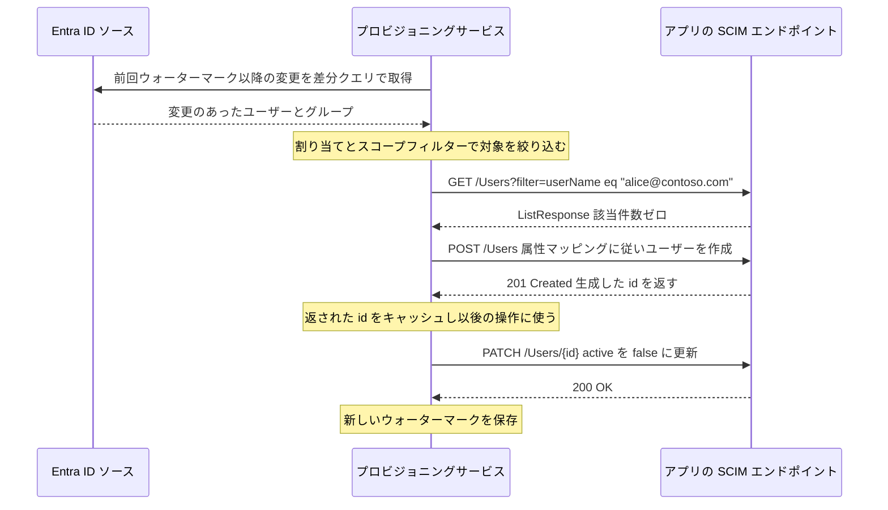
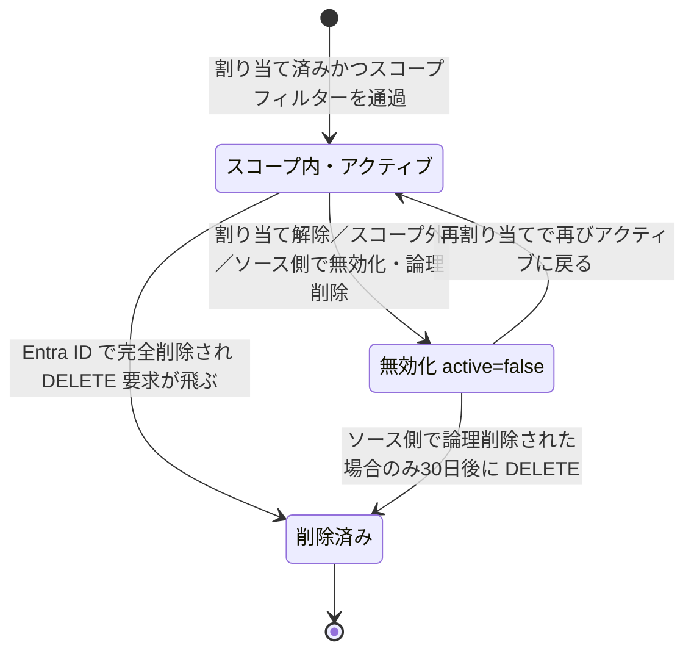

# 【勉強】Microsoft Entra ID — プロビジョニング（SCIM）（2026-08-18）

## 今日のテーマ

Entra ID から SaaS アプリへユーザーアカウントを自動で作り、変更し、消す仕組み。Entra ID のアプリプロビジョニングと、その土台となる SCIM 2.0 を学びます。

## 概要

**プロビジョニング**とは、ユーザーが使うアプリ側にアカウントを作ること。**デプロビジョニング**はその逆で、退職や異動でアクセスが不要になったアカウントを無効化・削除することです。手作業でやると必ず取り残しが出ます。特に消し忘れたアカウントは、そのまま不正アクセスの入口になります。

Entra ID の **Microsoft Entra プロビジョニングサービス**は、これを自動化するマネージドサービスです。アプリベンダーが提供する **SCIM 2.0** のユーザー管理 API エンドポイントに接続し、Entra ID 上のユーザー／グループの変化をアプリ側に反映し続けます。

SCIM（System for Cross-domain Identity Management）は、ユーザーやグループを表す JSON スキーマと、その CRUD 操作を定義した REST の標準規格です。SCIM 2.0 は3本の RFC で構成され、要件定義が RFC 7642、スキーマ定義が RFC 7643、プロトコルが RFC 7644 です。「ユーザーとは `userName` と `name.givenName` と `active` を持つオブジェクトである」といった共通の型を決めておくことで、IdP とアプリの組み合わせごとに専用連携を作らずに済みます。ギャラリーにある多くのアプリのプロビジョニングコネクタは SCIM ベースで実装されています。

なお SAML/OIDC の SSO は「ログインさせる」仕組みであり、アカウントそのものは作りません。SSO とプロビジョニングは別レイヤーの機能で、両方そろって初めて「入社したら自動でアカウントができ、SSO でログインでき、退職したら自動で止まる」状態になります。

## 押さえる要点

### 1. 初回サイクルと増分サイクル

プロビジョニングサービスは、ジョブを開始すると **初回サイクル（initial cycle）** を1回走らせ、その後は **増分サイクル（incremental cycle）** を延々と繰り返します。

- **初回サイクル**：ソース（Entra ID）から対象ユーザー／グループを全件読み、スコープで絞り、ターゲット側を検索して、いなければ作成・いれば更新する。最後に **ウォーターマーク**（どこまで処理したかの目印）を保存する。
- **増分サイクル**：前回のウォーターマーク以降に変更のあったオブジェクトだけを Microsoft Graph の差分クエリ（delta query）で取得して処理する。実行間隔は既定で約 **40分**（アプリごとのチュートリアルで定義される値で、管理者は変更できません）。

つまり「Entra ID でユーザーを直したのにアプリに反映されない」場合、まず疑うべきは設定ミスではなく、単に次のサイクルがまだ来ていないことです。

以下は Entra ID がアプリの SCIM エンドポイントに投げる代表的な要求を並べたものです（実際の1サイクルで作成と無効化が連続するわけではなく、要求の種類を示すための図です）。



### 2. スコープ（誰を同期するか）

対象者の決め方は2通りあり、併用できます。

- **割り当てベース**：エンタープライズアプリケーションにユーザー／グループを割り当て、スコープを「割り当てられたユーザーとグループのみ同期」にする。SSO の割り当てと同じ画面を使えるので、アクセス管理とプロビジョニングを一元化できるのが利点です。グループでの割り当てには Microsoft Entra ID P1 または P2 が必要です。
- **属性ベース（スコープフィルター）**：`department EQUALS sales` のように属性値で条件を書く。Workday などの人事システムを起点にした受信（インバウンド）プロビジョニングでは、こちらが主な手段になります。

### 3. 属性マッピングとマッチング属性

Entra ID 側の属性をアプリ側のどの属性に流すかを定義します。既定のマッピングが用意されており、変更・削除・追加ができます。よくある対応は次のとおりです（実際の既定値はギャラリーアプリごとに異なるため、あくまで典型例として押さえてください）。

| Entra ID 属性 | SCIM 属性 |
| --- | --- |
| userPrincipalName | userName |
| givenName | name.givenName |
| surname | name.familyName |
| mail | emails[type eq "work"].value |

特に重要なのが **マッチング属性**（「この属性を使用してオブジェクトを照合する」）です。これはターゲット側の既存アカウントと突き合わせる鍵になる属性で、ここを誤ると同じ人のアカウントが二重にできます。値を加工したい場合は式マッピング（expression mapping）が使え、式は最大10,000文字です。

### 4. デプロビジョニング

Entra ID は「無効化（soft delete）」と「削除（hard delete）」を区別します。SCIM アプリに対する無効化は、ユーザーの `active` プロパティを `false` にする要求です。



Entra ID でユーザーを削除すると、まず論理削除（ごみ箱）になり、**30日後**に完全削除されます。この完全削除のタイミングでアプリ側に DELETE 要求が送られます。すぐ消したい場合は手動で完全削除すれば、その時点で DELETE が飛びます。

ただし**割り当て解除でスコープから外れたユーザーは別扱い**です。この場合サービスは無効化要求を送った時点でそのユーザーの管理をやめるため、その後 Entra ID 側で論理削除されても DELETE は送られません。なお DELETE を飛ばすには、マッピング画面の「ターゲット オブジェクトのアクション」で Delete が有効になっている必要があります。逆にスコープ外になったユーザーに何もしてほしくない場合は、`skip out-of-scope deletions` を有効にします。

## 設定のイメージ

1. Microsoft Entra 管理センターに、**アプリケーション管理者**以上のロールでサインインする。
2. **Entra ID > エンタープライズ アプリケーション**から対象アプリを開く（ギャラリーにないアプリは「独自のアプリケーションの作成」から追加）。
3. **プロビジョニング**を開き、モードを「自動」にして、テナントの URL（SCIM エンドポイント）とシークレットトークンを入力し、**接続テスト**で疎通を確認する。
4. **マッピング**でユーザー／グループの属性対応とマッチング属性を確認する。
5. **スコープフィルター**で対象を絞る。
6. **オンデマンドプロビジョニング**でテストユーザー1名を指名して試す。通常30秒未満で結果が返り、失敗すれば理由がその場で分かります。
7. 問題なければプロビジョニング状態を **オン** にする。オンにした時点で初回サイクルが始まり、完了まで20分から数時間かかります（ディレクトリの規模とスコープ内のユーザー数による）。
8. **プロビジョニングログ**で結果を確認する。

自前でアプリ側に SCIM エンドポイントを実装する場合、Entra ID 側の要件として最低限これらを満たす必要があります。

- HTTPS で公開し、レスポンスヘッダーは `Content-Type: application/scim+json` にする。
- すべてのリソースに `id` プロパティを返す（0件の `ListResponse` は例外）。
- 検索は `ListResponse` で返す。Entra ID が使うフィルター演算子は `eq` と `and` だけ。
- 受け取った値を勝手に整形せず、送られた形のまま保存・返却する。
- グループ対応は任意だが、対応するなら `PATCH` が必須で、`displayName` が一意である必要がある。

```http
POST /Users HTTP/1.1
Content-Type: application/scim+json

{
  "schemas": ["urn:ietf:params:scim:schemas:core:2.0:User"],
  "userName": "alice@contoso.com",
  "name": { "givenName": "Alice", "familyName": "Yamada" },
  "active": true
}
```

## つまずきやすいところ

- **入れ子グループは展開されない。** プロビジョニングサービスが読めるのは、アプリに直接割り当てられたグループの「直接のメンバー」だけです。親グループを割り当てても、その配下の子グループのメンバーは同期されません。SSO の割り当てでも同じ制約があります。
- **値が空（null）の属性は送られない。** ソース側で空の属性はスキップされるため、ターゲットで必須になっている属性が空だと作成に失敗します。
- **無効化されたユーザーは新規プロビジョニングできない。** Entra ID 側でアクティブである必要があります。
- **検疫（quarantine）に注意。** 資格情報の失効などでターゲットへの呼び出しがほぼ全て失敗すると、ジョブは検疫状態になり、増分サイクルの頻度が段階的に下げられて最終的には1日1回になります。**4週間を超えて**検疫のままだとジョブは無効化されます。管理センターでメール通知を設定しておくと気づけます。
- **マッピングやスコープフィルターを変更すると初回サイクルが再実行される。** ウォーターマークが消え、全オブジェクトが再評価されるため、大規模テナントでは時間がかかります。設定変更は影響を見積もってから。
- **スコープフィルターに使えない属性がある。** `appRoleAssignments`、`userType`、`manager`、日付型の属性（startDate、endDate など）はスコープフィルターとして利用できません。
- **`addresses`・`emails`・`phoneNumbers` の多値属性は `type eq "work"` しか処理されない。** `emails[type eq "home"]` などのマッピングはスキップされます。

## 今日のまとめ

### ミニ辞書

- **SCIM 2.0**：ユーザー／グループの表現と CRUD 操作を定義した REST の標準規格。RFC 7642（要件）／7643（スキーマ）／7644（プロトコル）の3本からなる。
- **プロビジョニングサービス**：Entra ID が提供する同期エンジン。アプリの SCIM エンドポイントを呼び出して同期する。
- **初回サイクル / 増分サイクル**：全件処理と差分処理。増分サイクルは既定で約40分間隔、管理者は変更できない。
- **ウォーターマーク**：どこまで処理したかを示す目印。増分サイクルの開始点になる。
- **スコープ**：同期対象の決め方。割り当てベースと属性ベース（スコープフィルター）がある。
- **マッチング属性**：ターゲット側の既存アカウントと突き合わせる鍵になる属性。
- **デプロビジョニング**：アクセス不要になったアカウントの無効化・削除。SCIM では `active` を `false` にする。
- **検疫（quarantine）**：エラー率が高いジョブが入る状態。4週間を超えて続くとジョブが無効化される。

### 理解度チェック

1. Entra ID でユーザーの部署を変更してから、SaaS アプリ側に反映されるまでに時間差が生じるのはなぜか。おおよそどれくらいの待ち時間を見込むべきか。
2. Entra ID でユーザーを削除したとき、アプリ側にはすぐ DELETE 要求が送られるか。送られないとしたら、いつ送られるか。
3. アプリに「営業部グループ」を割り当てたのに、その中の「営業1課グループ」のメンバーが同期されない。原因は何か。

## 参考リンク

- [How Application Provisioning works in Microsoft Entra ID](https://learn.microsoft.com/entra/identity/app-provisioning/how-provisioning-works)
- [Tutorial: Develop and plan provisioning for a SCIM endpoint in Microsoft Entra ID](https://learn.microsoft.com/entra/identity/app-provisioning/use-scim-to-provision-users-and-groups)
- [Scoping users or groups to be provisioned with scoping filters](https://learn.microsoft.com/entra/identity/app-provisioning/define-conditional-rules-for-provisioning-user-accounts)
- [Managing user account provisioning for enterprise apps](https://learn.microsoft.com/entra/identity/app-provisioning/configure-automatic-user-provisioning-portal)
- [On-demand provisioning in Microsoft Entra ID](https://learn.microsoft.com/entra/identity/app-provisioning/provision-on-demand)
- [Known issues for provisioning in Microsoft Entra ID](https://learn.microsoft.com/entra/identity/app-provisioning/known-issues)
- [Customize attribute mappings for provisioning](https://learn.microsoft.com/entra/identity/app-provisioning/customize-application-attributes)
- [Skip deletion of out of scope users](https://learn.microsoft.com/entra/identity/app-provisioning/skip-out-of-scope-deletions)
- [RFC 7643 - SCIM: Core Schema](https://datatracker.ietf.org/doc/html/rfc7643)
- [RFC 7644 - SCIM: Protocol](https://datatracker.ietf.org/doc/html/rfc7644)
