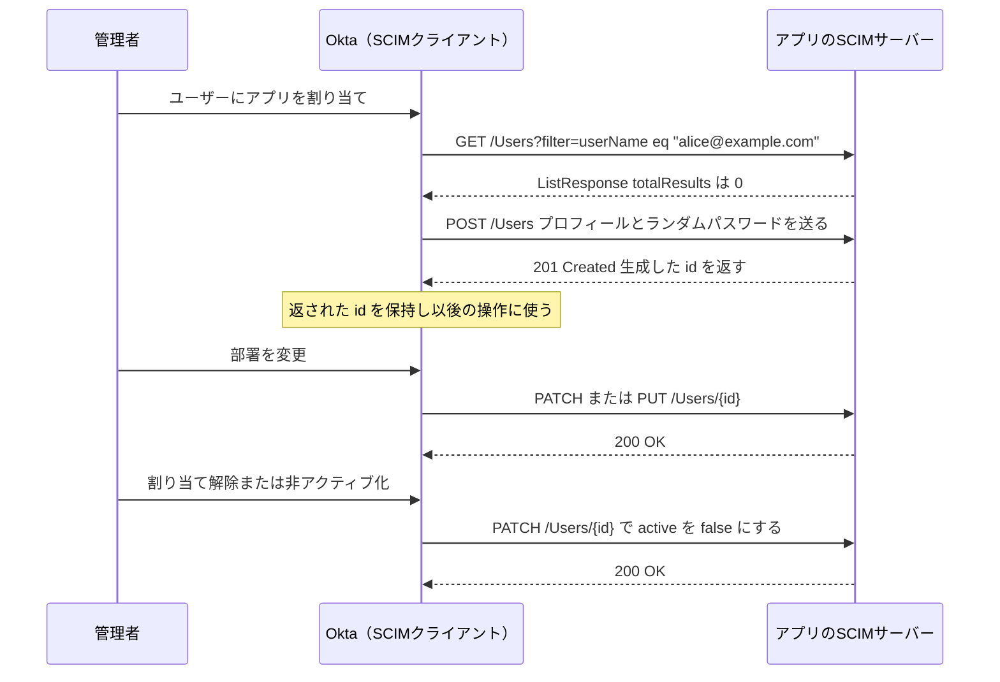
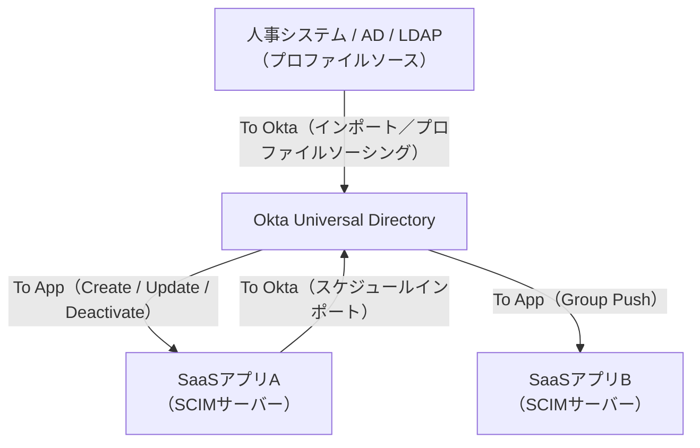

# 【勉強】Okta Workforce Identity Cloud — プロビジョニング（SCIM）（2026-08-19）

## 今日のテーマ

Okta から SaaS アプリへアカウントを自動で作り、更新し、止める仕組み。Okta Lifecycle Management（LCM）と、その土台になる SCIM 連携を学びます。昨日の Entra ID 編と同じテーマなので、同じ SCIM を使いながら設計思想がどう違うかにも注目してください。

## 概要

**プロビジョニング**はアプリ側にユーザーアカウントを作ること、**デプロビジョニング**は不要になったアカウントを止めることです。Okta でこれを担うのが **Okta Lifecycle Management（LCM）** で、SCIM を使って Okta とクラウドアプリ／オンプレアプリの間でアカウント操作を実行します。

役割分担がはっきりしています。**Okta が SCIM クライアント**、**アプリ側が SCIM サーバー**です。Okta がアプリの SCIM エンドポイントに HTTP 要求を投げ、アプリがそれを受けてアカウントを作る、という一方向の呼び出し関係になります。Okta は **SCIM 2.0 と SCIM 1.1 の両方**に対応しています。Entra ID のプロビジョニングサービスが SCIM 2.0 を前提にしているのと比べると、古いアプリを抱えている環境では Okta のほうが選択肢が広いことになります。

SCIM（System for Cross-domain Identity Management）は、ユーザーとグループを表す JSON スキーマと、それに対する CRUD 操作を定める REST の標準規格でした。Okta のドキュメントも操作を CRUD で説明しますが、Delete のところだけ **Deactivate** という言い方をします。ここが Okta の設計を理解する鍵になります。

## 押さえる要点

### 1. 削除ではなく無効化（ソフトデリート）

Okta は **DELETE 要求を送りません**。管理者が Okta 側でユーザーをデプロビジョニングすると、アプリ側のユーザーリソースは `active=false` に更新されます。産休明けや契約社員の再雇用のように後で戻ってくる可能性を考えて、データを残したままアクセスだけを止める設計です。

さらに踏み込んだ挙動があります。**Okta で非アクティブ化済みのユーザープロフィールを完全に削除しても、アプリ側には何も送られません。** 最初の非アクティブ化の時点ですでに `active=false` になっているため、Okta は改めて削除要求を出さないのです。

Entra ID は論理削除から30日後に DELETE をアプリへ送るので、ここは正反対と言っていい差です。「Okta で消したのにアプリ側にアカウントが残っている」のは不具合ではなく仕様です。アプリ側の物理削除が必要なら、アプリ側の運用でやることになります。

以下は割り当てから無効化までに Okta がアプリへ投げる代表的な要求です。



### 2. To App と To Okta の2方向

Okta のプロビジョニング設定画面は **To App**、**To Okta**、**API Integration** の3つに分かれています。中心になるのは前の2つです。

- **To App（Okta-sourced）**：Okta の情報をアプリへ押し出す。有効化する項目は **Create Users**（アカウント作成）、**Update User Attributes**（属性更新）、**Deactivate Users**（非アクティブ化）が基本です。
- **To Okta（App-sourced／プロファイルソーシング）**：アプリや人事システム側の情報を Okta へ取り込む。インポートで実現します。

どちらが真実の源（source of truth）かを決めるのがこの設定です。プロファイルソーシングを有効にすると、そのアプリが Okta ユーザーの属性とライフサイクル状態を支配します。たとえば AD 側でユーザーが無効になれば、次のインポートで Okta 側も非アクティブになります。



To App は割り当てや属性変更をきっかけに Okta 側から押し出されます。一方 To Okta のインポートは、手動実行か、**1時間ごと／1日ごと／1週間ごと**のスケジュール実行です。Entra ID の「約40分間隔の増分サイクル」に相当する固定周期は Okta にはありません。押し出しはイベント駆動、取り込みはスケジュール、と分けて覚えるのが実務的です。

### 3. 既存アカウントとの突き合わせ

新規作成の前に、Okta はアプリ側に同じ人がいないかを確認します。使う要求はこれだけです。

```http
GET /Users?filter=userName eq "alice@example.com"
```

SCIM 仕様には豊富なフィルター演算子がありますが、**Okta が使うのは `eq` だけ**です。アプリ側が `eq` フィルターに応答できないと、突き合わせができず重複アカウントの温床になります。自前実装で最初につまずくのがここです。

### 4. Group Push

**Group Push** は Okta のグループとそのメンバーを、プロビジョニング対応アプリへ押し出す機能です。押し出し方は **名前指定**（個別に選ぶ）と **ルール指定**（グループ名やグループ説明の文字列で一致させる）の2通りがあります。

注意点が2つあります。1つ目、Group Push は Okta 側にグループを作る機能ではありません。方向は Okta からアプリへの一方通行で、アプリ側でグループを直接いじると不整合を起こします。2つ目、**アプリの割り当てに使っているグループを、そのまま Group Push に使うことはサポートされていません。** 押し出し用に別のグループを用意する必要があります。ここは設計時に忘れると後から作り直しになります。

## 設定のイメージ

OIN（Okta Integration Network）のアプリを使う場合の流れです。

1. Admin Console で **Applications > Applications** から対象アプリを開き、**Provisioning** タブを選ぶ。
2. **Configure API Integration** をクリックし、**Enable API integration** を有効にする。
3. 認証情報を入力し、**Test API Credentials** で疎通を確認する。認証方式は **Basic Auth**、**HTTP Header**（ベアラートークン）、**OAuth 2.0** から選びます。
4. **Settings > To App** で Create Users / Update User Attributes / Deactivate Users を有効にする。
5. **Profile Editor** で属性マッピングを確認・調整する。
6. 必要なら **Push Groups** タブで Group Push を設定する。
7. ユーザーまたはグループにアプリを割り当てる。**割り当てが実際の作成トリガー**です。

自前アプリに SCIM サーバーを実装する場合、Okta 側の要件として最低限これらを満たす必要があります。

- 一貫したベース URL を用意する（例：`https://api.example.com/scim/v2`）。
- `userName`、`name.givenName`、`name.familyName`、`active` のコア属性をマッピングできるようにする。
- `GET /Users` で `eq` 演算子に対応する。
- ページングのため `startIndex`、`count`、`totalResults` に対応する。
- **60秒以内に応答する**。超えると Okta がソケットを閉じます。
- メールや電話番号など多値属性は必ず配列で返す。

## つまずきやすいところ

- **PATCH と PUT のどちらになるかは作り方で決まる。** OIN カタログのテンプレートから作った連携は既定で **PATCH**、App Integration Wizard（Classic experience）で作った連携は既定で **PUT** です。しかも AIW 製の連携は PATCH に変更できません。自前実装では両方を想定しておくのが安全です。
- **AIW で作った連携ではプロファイルソーシングが使えない。** 必要な場合は OIN カタログの SCIM テンプレートから作る必要があります。
- **AIW で SCIM を足せるのは SAML か SWA の連携のみ。** OIDC 連携への SCIM 追加は現時点でサポートされていません。
- **`active` は他の属性と挙動が違う。** 一度アプリ側で `active=false` になったユーザーは、フルインポートでも Okta に取り込まれません。Okta が真実の源であっても、プロファイルプッシュでアプリ側の `active` を上書きすることはできません。
- **インポートセーフガード。** インポートによって一定割合以上のユーザーが割り当て解除されそうになると、インポートが止まります。アプリレベル・組織レベルとも既定で有効、しきい値は **20%** です。人事システムの CSV 取り込みをミスったときに大量のデプロビジョニングを防いでくれる安全装置ですが、逆に「正当な大量整理」も止まるので存在を知っておく必要があります。
- **既に同名ユーザーがいると Create Users は作らない。** Okta 側で指定したユーザー名がアプリ側に存在すると、アカウントは作られません。
- **HTTP 429 は Okta が自動でリトライする。** `Retry-After` ヘッダーに秒数（整数）があればその秒数、なければ既定で5分待ちます。失敗が続くと待ち時間を倍々にする指数バックオフになり、**最大10回**で打ち切って恒久的な失敗になります。HTTP-date 形式の `Retry-After` は解釈されず5分扱いになる点も要注意です。
- **Okta が使わない SCIM 機能がある。** POST による検索、Bulk 操作、`/Me`、`/ServiceProviderConfig`、`meta.lastModified` によるフィルターは利用されません。`/Schemas` と `/ResourceTypes` はエンタイトルメント対応の SCIM 2.0 でのみ使われます。

## 今日のまとめ

### ミニ辞書

- **Okta Lifecycle Management（LCM）**：Okta のプロビジョニング／デプロビジョニング機能群。
- **SCIM クライアント / SCIM サーバー**：Okta がクライアント、連携先アプリがサーバー。Okta が要求を送る側。
- **To App / To Okta**：Okta からアプリへ押し出す方向と、アプリから Okta へ取り込む方向。
- **プロファイルソーシング**：外部アプリを真実の源にし、Okta の属性とライフサイクル状態をそこから導く設定。
- **ソフトデリート**：削除ではなく `active=false` にする方式。Okta のデプロビジョニングはこれ。
- **Group Push**：Okta のグループとメンバーをアプリへ押し出す機能。名前指定とルール指定がある。
- **インポートセーフガード**：インポートで大量の割り当て解除が起きそうなときに止める安全装置。既定20%。
- **OIN（Okta Integration Network）**：Okta が用意する連携アプリのカタログ。

### 理解度チェック

1. Okta で退職者のユーザープロフィールを完全に削除した。連携先の SaaS アプリのアカウントはどうなるか。
2. 自前アプリに SCIM サーバーを実装したところ、同じ人のアカウントが2つできてしまった。まず疑うべき実装上の不足は何か。
3. 「営業部グループ」をアプリに割り当てている。このグループをそのまま Group Push の対象にしてよいか。だめならどうするか。

## 参考リンク

- [Provision apps（Okta Lifecycle Management）](https://help.okta.com/en-us/Content/Topics/Apps/Provisioning_Deprovisioning_Overview.htm)
- [Understanding SCIM | Okta Developer](https://developer.okta.com/docs/concepts/scim/)
- [SCIM integration concepts and requirements | Okta Developer](https://developer.okta.com/docs/concepts/scim/faqs/)
- [Configure provisioning for an app integration](https://help.okta.com/en-us/content/topics/provisioning/lcm/lcm-provision-application.htm)
- [Add SCIM provisioning to app integrations](https://help.okta.com/en-us/content/topics/apps/apps_app_integration_wizard_scim.htm)
- [Group Push](https://help.okta.com/en-us/content/topics/users-groups-profiles/usgp-about-group-push.htm)
- [Lifecycle of a provisioned user](https://help.okta.com/en-us/Content/Topics/provisioning/lcm/lcm-provisioning-workflow.htm)
- [RFC 7643 - SCIM: Core Schema](https://datatracker.ietf.org/doc/html/rfc7643)
- [RFC 7644 - SCIM: Protocol](https://datatracker.ietf.org/doc/html/rfc7644)
