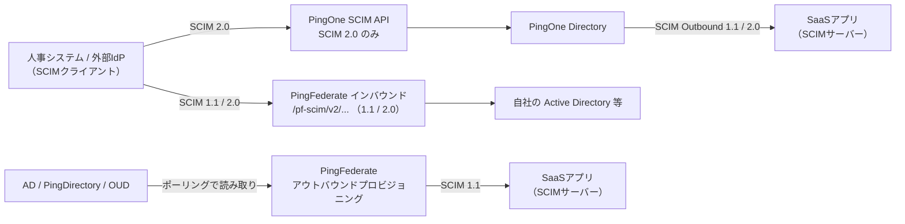
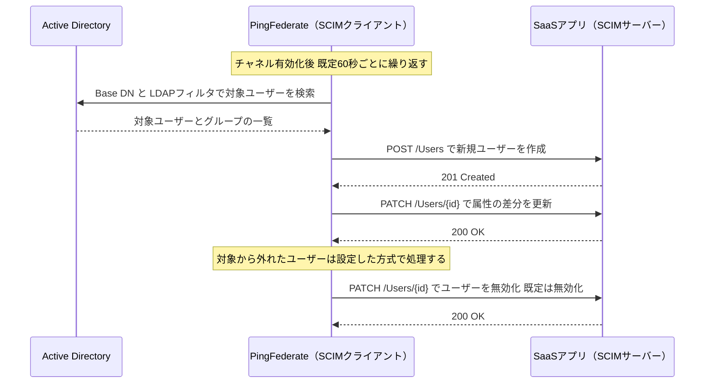

# 【勉強】Ping Identity — プロビジョニング（SCIM）（2026-08-20）

## 今日のテーマ

Ping Identity でアカウントを自動的に作り、更新し、止める仕組みを学びます。Entra ID 編（8/18）、Okta 編（8/19）と同じテーマですが、Ping はここが一番ややこしい製品です。**PingOne（クラウド）と PingFederate（自社で動かすフェデレーションサーバー）で、対応する SCIM のバージョンも設定場所もまったく別物**だからです。今日はその整理が主目的になります。

## 概要

**SCIM（System for Cross-domain Identity Management）** は、ユーザーとグループを JSON で表現し、REST で作成・更新・削除するための標準規格でした。SCIM を話す側を **SCIM クライアント**、エンドポイントを公開して受ける側を **SCIM サーバー** と呼びます。

Ping では、この「どちらの役をやるか」が製品と向きで4通りに分かれます。

- **PingOne のアウトバウンド** — PingOne が SCIM クライアントになり、SaaS 側のエンドポイントを叩く。SCIM 1.1 と 2.0 の両方に対応。
- **PingOne のインバウンド** — PingOne 自身が SCIM 2.0 のサーバーになる（PingOne SCIM API）。人事システムなど外部から PingOne へ書き込む経路。
- **PingFederate のアウトバウンド** — PingFederate が SCIM クライアントになる。**SCIM 1.1 のみ**。
- **PingFederate のインバウンド** — PingFederate が `/pf-scim/v2/...` を公開して SCIM サーバーになる。SCIM 1.1 と 2.0 に対応。

図にすると次のようになります。左から右へアカウント情報が流れる向きで並べています。

Entra ID や Okta が「1つのサービスの中に方向の設定がある」のに対し、Ping は**製品そのものが分かれている**ところが違いです。

## 押さえる要点

### 1. PingOne のアウトバウンド — 「コネクション」と「ルール」の2階建て

PingOne の管理コンソールでは **Integrations > Provisioning** から作ります。New Connection → Identity Store → **SCIM Outbound** タイルを選ぶと、汎用の SCIM コネクションができます。

設定するのは接続情報です。

- **SCIM Base URL**（例: `https://scim-example.com/v2/`）
- **Users Resource** / **Groups Resource**（`Users`、`Groups` といったリソース名）
- **SCIM Version**（1.1 または 2.0）
- **Authentication Method** — None / Basic Authentication / OAuth 2 Bearer Token / OAuth 2 Client Credentials。公式ドキュメントは「可能なら OAuth 2 系を使うこと、Basic はセキュリティが限定的」と明記しています。

ここまでは「どこへ繋ぐか」だけです。**誰を送るか・何を送るかは別オブジェクトの「Rules（ルール）」で決めます。** ルールは Source（元）、Target（先）、User Filter、Attribute Mapping、Group Provisioning から構成されます。User Filter は SCIM のフィルタ式（RFC 7644 準拠）で、`userName Eq "%s"` のように書き、`%s` に User Identifier の値が入ります。

この2階建てが Ping の特徴です。コネクションを1つ作れば、ルールを複数ぶら下げて対象者ごとに違うマッピングを流せます。

### 2. 削除の扱いは選べる

PingOne のルールには Actions セクションがあり、**Allow Users to be Deprovisioned** を有効にすると **Remove Action** で **Delete** か **Disable** を選べます。ルール自体を削除したときの挙動（Deprovision on rule deletion）も設定できます。

Okta が問答無用で「無効化のみ、DELETE は送らない」だったのと比べると、Ping は設計者に選ばせる方針です。

PingFederate 側にも同じ思想があり、Provisioning Target の設定で、対象から外れたユーザーを**無効化するか削除するか**を選べます（既定は無効化）。※画面上のラベルは製品バージョンによって Deprovision Method / Remove User Action などの表記ゆれがあるようなので、実機で要確認。

### 3. PingFederate のアウトバウンドは「ポーリング型」

ここが Entra ID・Okta と最も感覚の違うところです。PingFederate のアウトバウンドプロビジョニングは、**LDAP ディレクトリを定期的に読みに行って差分を見つけ、SaaS へ反映する**方式です。

- 対応するソースは **PingDirectory（PingDS）/ Microsoft Active Directory / Oracle Unified Directory** など、LDAP ディレクトリです。
- 設定場所は **Applications > Integration > SP Connections** から対象の接続を開き、**Outbound Provisioning** タブの **Configure Provisioning** へ進みます（アウトバウンドプロビジョニングを有効にした接続でだけ表示されます）。
- 実際のマッピング単位は **Channel（チャネル）** で、Channel の Source Location タブで Base DN・Group DN・LDAP フィルタを指定して対象を絞ります。
- チャネルを有効化すると、**synchronization frequency（既定 60 秒）** が経過するたびに同期が走ります。

つまり「AD にユーザーを作る → ほどなく SaaS 側にも生える」という運用になります。インフラ出身なら、cron で回す同期スクリプトの高機能版だと思うと腑に落ちるはずです。

PATCH を使うか PUT を使うかは、Provisioning Target の **SCIM SP Supports Patch Updates**（既定で有効）で決まります。相手が PATCH に対応していなければオフにします。

### 4. PingFederate のインバウンドエンドポイント

PingFederate を SCIM サーバーとして立てる場合、SCIM 2.0 では次の5つのエンドポイントが `https://<PFサーバー>:<ポート>/pf-scim/v2/` の下に公開されます。

| エンドポイント | 用途 |
| --- | --- |
| `/Users` | ユーザーの作成・取得・更新・削除／無効化 |
| `/Schemas` | サポートするスキーマの取得 |
| `/ServiceProviderConfig` | SCIM 2.0 対応内容の公開 |
| `/ResourceTypes` | リソース種別の一覧 |
| `/.search` | POST によるリソース検索 |

認証は HTTP Basic またはクライアント証明書（相互 TLS）です。**DELETE を受けたときに本当に消すか無効化するかは、該当 IdP Connection の Delete/Disable Users タブにある「SCIM DELETE message behavior」で決まります。**

## つまずきやすいところ

- **PingFederate のアウトバウンドは SCIM 1.1 のみ。** 相手の SaaS が SCIM 2.0 しか受け付けないなら、PingFederate の標準アウトバウンドでは繋がりません。PingOne 側（1.1 / 2.0 両対応）を使う判断になります。ここは Ping を触り始めて最初に踏む地雷です。
- **PingFederate のインバウンド SCIM 2.0 はユーザーのみ。** グループの CRUD には対応していません（SCIM 1.1 のインバウンドはユーザー・グループとも対応）。
- **PingOne への取り込みに SCIM Outbound コネクションを使わない。** 公式ドキュメントは「SCIM コネクションはアウトバウンド専用として使い、PingOne へのインバウンドには PingOne SCIM API（`https://scim-api.pingone.com/environments/{envID}/v2/`、EU は `scim-api.pingone.eu`）を使うこと」と案内しています。
- **Unique User Identifier は SP Connection 作成後に変更できません。** 変えたければ接続を作り直しになります。また、同じターゲットに複数の SP Connection を向ける場合、Unique User Identifier は接続間で共通になります（後から作る接続が最初の設定を引き継ぎます）。
- **複数値属性の扱いに制限がある。** PingOne は複数値属性を持たないため、email や phone のような属性は type ごとに1つしか保持できず、最初の値だけが使われます。
- **チャネルの重複に注意。** 同じグループ名を持つチャネルが複数あると互いに上書きし合います。

## 今日のまとめ

**用語ミニ辞書**

- **SCIM クライアント / SCIM サーバー** — リクエストを送る側と、エンドポイントを公開して受ける側。Ping では製品と向きで役が入れ替わる。
- **コネクション（PingOne）** — 「どこへ繋ぐか」の接続情報。Base URL と認証方式。
- **ルール（PingOne）** — 「誰を、どうマッピングして送るか」。User Filter と Attribute Mapping を持つ。
- **チャネル（PingFederate）** — ソース属性とターゲット属性のマッピング単位。1接続に複数のチャネルを持てる。
- **デプロビジョニング方式** — 対象から外れたユーザーを無効化（既定）するか削除するかの選択。PingOne はルールの Remove Action、PingFederate は Provisioning Target 側で指定する。
- **synchronization frequency** — PingFederate アウトバウンドの同期間隔。既定 60 秒。

**理解度チェック**

1. SaaS 側が SCIM 2.0 しか対応していないとき、PingFederate の標準アウトバウンドプロビジョニングで連携できますか。できない場合、Ping 製品群のどこで代替しますか。
2. PingOne で「営業部のユーザーだけを Zscaler に送る」設定は、コネクションとルールのどちらに書きますか。
3. PingFederate のアウトバウンドは AD の変更をどうやって知りますか。Webhook のような通知でしょうか。

## 参考リンク

- [System for Cross-domain Identity Management (SCIM) | PingFederate Server](https://docs.pingidentity.com/pingfederate/13.0/introduction_to_pingfederate/pf_scim.html)
- [SCIM 2.0 inbound provisioning endpoints | PingFederate Server](https://docs.pingidentity.com/pingfederate/13.0/developers_reference_guide/pf_scim_20_inbound_provisioning_endpoints.html)
- [Configuring outbound provisioning | PingFederate Server](https://docs.pingidentity.com/pingfederate/13.0/administrators_reference_guide/help_spconnectionconfigtasklet_saasprovisioningstate.html)
- [Managing channels | PingFederate Server](https://docs.pingidentity.com/pingfederate/13.0/administrators_reference_guide/help_saasmanagementtasklet_saasmanagementstate.html)
- [Specifying a source location | PingFederate Server](https://docs.pingidentity.com/pingfederate/13.0/administrators_reference_guide/pf_specifying_source_location.html)
- [Defining a provisioning target | PingFederate Server](https://docs.pingidentity.com/pingfederate/13.1/administrators_reference_guide/pf_defining_provisioning_target.html)
- [Creating a SCIM connection | PingOne](https://docs.pingidentity.com/pingone/integrations/p1_create_scim_connection.html)
- [Provisioning | PingOne](https://docs.pingidentity.com/pingone/integrations/p1_provisioning.html)
- [Rules | PingOne](https://docs.pingidentity.com/pingone/integrations/p1_rules_provisioning.html)
- [SCIM certified provisioners | PingOne](https://docs.pingidentity.com/pingone/integrations/p1_scim_certified_provisioners.html)
