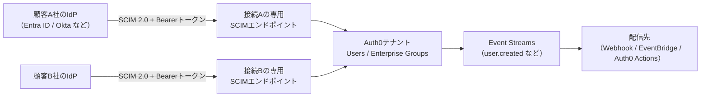
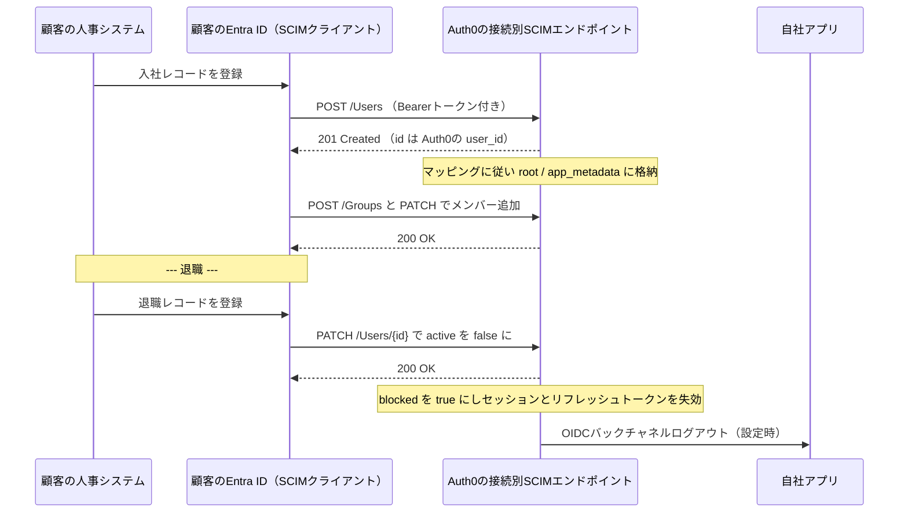

# 【勉強】Okta Customer Identity Cloud (Auth0) — プロビジョニング（SCIM）（2026-08-21）

## 今日のテーマ

Auth0 の SCIM プロビジョニングを学びます。Entra ID 編（8/18）、Okta 編（8/19）、Ping 編（8/20）と同じテーマの4本目ですが、Auth0 だけは**立ち位置が逆**です。

これまでの3製品は「社員のアカウントを SaaS へ**送り出す**側（SCIM クライアント）」が主役でした。Auth0 は B2C / B2B アプリの認証基盤なので、主役は「顧客企業の IdP からアカウントを**受け取る**側（SCIM サーバー）」になります。Auth0 ではこれを **Inbound SCIM（インバウンド SCIM）** と呼びます。

## 概要

自社が B2B SaaS を作っていて、認証を Auth0 に任せているとします。顧客企業（テナント）は自社の Entra ID や Okta を使っていて、「うちの社員が入社したら、そちらのアプリにもアカウントを自動で作ってほしい」と言ってきます。

このとき顧客企業側の Entra ID / Okta が SCIM クライアントになり、**Auth0 が SCIM サーバーとして顧客ごとに専用のエンドポイントを公開する**。これが Inbound SCIM です。

Auth0 の Inbound SCIM は **Enterprise Connection（エンタープライズ接続）単位**で有効化します。エンタープライズ接続とは、顧客企業の IdP と Auth0 をつなぐ設定オブジェクトのことです。2026年8月現在、SCIM に対応している接続タイプは次の4つです。

- SAML
- OpenID Connect
- Okta Workforce Identity
- Microsoft Azure AD / Entra ID

なお **Google Workspace は SCIM ではなく Directory Sync** という別機能で同期します。ここは間違えやすいところです。また、この機能を使うには Auth0 のプラン（または個別契約）に Enterprise Connections が含まれている必要があります。

全体像を図にします。左から右へアカウント情報が流れる向きで並べました。

図の左半分が Inbound SCIM（受け取る側）、右半分が Event Streams による外部への流し出しです。Auth0 に「アウトバウンド SCIM プロビジョニング」という独立した機能ボタンがあるわけではなく、**Event Streams と Actions を組み合わせて実現する**というのが Auth0 の作りです。ここも他3製品と違う点です。

## 押さえる要点

### 1. 有効化は接続の Provisioning タブ

管理画面での手順は次の通りです。

1. Auth0 Dashboard で対象テナントを選ぶ
2. **Authentication > Enterprise** から接続タイプ（SAML / OpenID Connect / Okta Workforce / Microsoft Azure AD）を選ぶ
3. 既存の接続を選ぶか、新規作成する
4. 接続の **Provisioning** タブで、**Sync user profile attributes at each login** を Off にし、**Sync users and groups using SCIM** を On にする
5. **Setup** タブで SCIM エンドポイント URL とトークンを取得する

手順4で login 同期をいったん Off にするのは、両方が同じ属性を書き換えて衝突するのを避けるためです。ただし後述のとおり、**衝突しないようマッピングを設計すれば両方を並行して有効にできます**。

### 2. エンドポイントとトークンは「接続ごと」

Inbound SCIM の設計で一番大事なのがここです。**SCIM エンドポイントと Bearer トークンは接続ごとに発行される**ので、顧客A社の IdP は顧客A社のユーザーとグループしか触れません。マルチテナントの分離が仕組みとして担保されています。

トークンの仕様は次の通りです。

- 1つのエンドポイントに対して**同時に有効なトークンは最大2つ**。無停止でローテーションできるようにするための設計です
- 有効期限は「無期限」か「秒数指定」を選べる。**秒数指定の最小値は 900 秒**
- 期限切れ後は、次にそのトークンが使われたときにエラー応答が返る
- **スコープ（権限）を絞れる** — `get:users` / `post:users` / `put:users` / `patch:users` / `delete:users`、および groups 側の同じ5つ

「顧客には削除させたくないので `delete:users` は外す」といった設計ができます。インフラ出身なら、API キーに最小権限を付けるのと同じ発想だと思えば早いはずです。

### 3. 対応する SCIM 操作

Users・Groups の両方で、`POST` / `GET` / `PUT` / `PATCH` / `DELETE` と、フィルタ検索（SEARCH）に対応します。

| リソース | 対応操作 | 補足 |
| --- | --- | --- |
| Users | POST / GET / PUT / PATCH / DELETE / SEARCH | コア + Enterprise スキーマ拡張に対応 |
| Groups | POST / GET / PUT / PATCH / DELETE / SEARCH | コアスキーマのみ |

検索フィルタでサポートされる演算子は限定的です。**Users は `eq`・`and`・`or`、Groups は `eq` のみ**。相手の IdP が複雑なフィルタを投げる設計だと引っかかります。

グループにも制約があります。**メンバーの種別は `user` のみ対応**（したがってグループをメンバーにはできない）、そして **`displayName` は接続内で一意でなければならない**。後者は Entra ID などエンタープライズ IdP との互換性のための要件です。

### 4. `active` を false にすると Auth0 側は「ブロック」になる

退職処理の挙動を押さえます。SCIM で `active: false` を受け取ると、Auth0 はそのユーザーを**削除ではなくブロック**します。加えて次の3つが連動します。

- そのユーザーの Auth0 セッションをすべて終了する
- リフレッシュトークンを失効させる
- 設定済みであれば **OIDC バックチャネルログアウト**をアプリに送る

「無効化したのにアプリ側のセッションが生きていて入れてしまう」という事故を防ぐ作りになっています。Okta / Ping 編で見た「無効化するか削除するか」の議論とあわせて押さえておくと、製品ごとの思想の差が見えてきます。

Entra ID から Auth0 へ流す場合の一連の流れを図にします。SAML や OIDC と違い、**SCIM はブラウザを介さないサーバー間の通信**です。ここは SSO のシーケンス図と混同しないよう注意してください。

### 5. 属性マッピングの決まりごと

接続ごとに **Provisioning > Mapping** で編集します。既定のマッピングが最初から入っています。押さえるべき制約は次の通りです。

- **1対1のみ** — 1つの SCIM 属性を複数の Auth0 属性に、またその逆にも割り当てられない
- **`id` と `meta` はマッピング不可** — これらは Auth0 が応答で返す専用の属性。**`id` は常に Auth0 の `user_id`** になる
- **`password` はエンタープライズ接続では使えない**
- マッピングに書かれていない SCIM 属性は、リクエスト・レスポンスとも**無視される**
- **`active` を Auth0 の `blocked` にマッピングすると値が反転する** — `active: true` → `blocked: false`

格納先の選び方にもコツがあります。

- **root 属性**（`email`、`name` など）に入れると SCIM のクエリで検索できるが、**検索できるのは公式が列挙している root 属性だけ**。それ以外を検索対象にしたいなら `app_metadata` に入れる
- **`user_metadata` は非推奨** — エンドユーザー自身が編集する想定の領域なので、同期される属性の置き場には向かない。`app_metadata` か root を使う

SCIM の `roles` 属性も同期できます。マッピングで `app_metadata.roles` などに割り当てておく形です。

### 6. グループを認可に使う

SCIM で受け取ったグループは、そのまま認可の材料になります。

- **Auth0 の Core RBAC ロールに割り当てる** — グループのメンバーはログイン時にそのロールを継承する
- **Organization のロールに割り当てる** — B2B で顧客企業を Organization として表現している場合はこちら。ただし公式ドキュメントではこの機能は **Early Access** 扱いで、利用には Auth0 サポートへの申請が必要と記載されています
- **Post-Login Action で使う** — `api.groups.getUserGroups()` や `api.groups.hasGroupMembership()` でグループ情報を読み、独自の判定を書ける

ただし **SCIM で入ったユーザーを Organization のメンバーにするには、接続側で Enable Auto-Membership を有効にしておく必要があります**。ここを忘れると「ユーザーはできたのに Organization に紐づかない」となります。

### 7. 外向きは Event Streams + Action

Auth0 から外部の SCIM サーバーへ流す場合は、Event Streams に公式の Action テンプレート（outbound SCIM 2.0 user provisioning）を組み合わせます。対応関係は次の通りです。

| Auth0 のイベント | 送る SCIM リクエスト |
| --- | --- |
| `user.created` | `POST /Users` |
| `user.updated` | `GET /Users?filter=externalId eq "..."` で特定 → `PUT /Users/{id}`（設定で `PATCH` も可） |
| `user.deleted` | `externalId` で特定 → `DELETE /Users/{id}` |

対応付けには **SCIM の `externalId` に Auth0 の `user_id` を入れる**方式を使います。`user_id` はメールアドレスや氏名の変更で変わらないため、プロフィールが更新されても追跡できるという理屈です。

このテンプレートには制約があります。**同期対象はユーザープロフィールのみで、グループのプロビジョニングは含まれません。** また1つの Event Stream は1つの Action にしか紐づかないため、複数の SCIM サーバーへ送るならストリームと Action をそれぞれ作ります。

## つまずきやすいところ

- **方向を取り違える。** Auth0 の SCIM は「Auth0 が受ける側」が主役です。Entra ID や Okta と同じ感覚で「Auth0 から SaaS へ SCIM で送る設定はどこか」と探すと見つかりません。外向きは Event Streams + Action です。
- **Google Workspace は SCIM ではない。** Directory Sync を使います。
- **login 同期と SCIM の衝突。** `Sync user profile attributes at login` を有効にすると、**ログインごとに root 属性がすべて上書きされます**。SCIM と併用するなら、(1) `email` や `username` を SAML / OIDC 側のマッピングにも書く、(2) SCIM マッピング側では `active` 以外を `app_metadata` 配下に寄せる、という公式のガイドラインに従います。
- **Entra ID の既定トークンは PUT を含まない。** 公式ドキュメントは「Entra ID の Inbound SCIM は既定トークンから `put:users` 権限を除いており、`PATCH` のみを受け付ける」と明記しています。逆向き（Auth0 から Entra ID へ）の Action 設定でも `PATCH` に切り替える必要があります。
- **アカウントリンクでは SCIM 側を primary にする。** secondary にすると SCIM の `id` が変わってしまい、SCIM 2.0 のコアスキーマ仕様（`id` は不変）に反します。そもそもエンタープライズアカウントとソーシャルアカウントのリンクは推奨されていません。
- **トークンを平文で渡さない。** 公式は SendSafely のような安全な経路、または Self-Service Enterprise Configuration で顧客に直接発行させる方式を推奨しています。
- **本番テナントでいきなり有効化しない。** 開発 / ステージングテナントで検証してから、と明記されています。
- **ログにはサイズ制限がある。** メンバー1,000人超のグループに対する POST / PUT では、ログ上に `members` 属性が出ません（Monitoring > Logs）。デバッグ時に「送られていないのでは」と誤解しやすい箇所です。

## 今日のまとめ

**用語ミニ辞書**

- **Inbound SCIM** — Auth0 が SCIM サーバーとなり、顧客企業の IdP からユーザー・グループを受け取る機能。接続単位で有効化する。
- **Enterprise Connection** — 顧客企業の IdP と Auth0 をつなぐ設定オブジェクト。SCIM 対応は SAML / OIDC / Okta Workforce / Azure AD の4種。
- **SCIM Endpoint URL / SCIM Bearer Token** — 接続ごとに発行される受け口と認証情報。トークンは同時2つまで、期限は最短900秒、スコープで操作を絞れる。
- **`active` → `blocked`** — SCIM の `active: false` は Auth0 のブロック。反転してマッピングされ、セッション終了・リフレッシュトークン失効・バックチャネルログアウトが連動する。
- **root 属性 / `app_metadata` / `user_metadata`** — 格納先の3択。検索性は root、汎用は `app_metadata`、`user_metadata` は同期属性には非推奨。
- **`externalId`** — SCIM クライアントが自分の識別子を相手のリソースに残すための属性。Auth0 の外向き Action では `user_id` を入れて対応付ける。
- **Enable Auto-Membership** — SCIM で入ったユーザーを Organization のメンバーにするために必要な接続側の設定。

**理解度チェック**

1. 顧客企業の Entra ID から Auth0 へアカウントを流したい。設定を有効化するのは Auth0 のどの画面で、単位は何ごとですか。
2. SCIM で `active: false` を受け取ったとき、Auth0 のユーザーは削除されますか。またそのとき連動して起きることを3つ挙げてください。
3. Auth0 のユーザーを外部の SCIM サーバーへ送りたい。どの機能を組み合わせますか。またその方式でグループも同期できますか。

## 参考リンク

- [Configure Inbound SCIM | Auth0 Docs](https://auth0.com/docs/authenticate/protocols/scim/configure-inbound-scim)
- [How to Synchronize User Changes with Outbound SCIM Requests using Event Streams | Auth0 Docs](https://auth0.com/docs/customize/events/send-outbound-scim)
- [outbound SCIM 2.0 user provisioning Action template | GitHub (auth0/opensource-marketplace)](https://github.com/auth0/opensource-marketplace/blob/main/templates/outbound-scim-EVENT_STREAM/code.js)
- [Assign Roles for Enterprise Groups | Auth0 Docs](https://auth0.com/docs/manage-users/access-control/configure-core-rbac/rbac-users/assign-roles-to-groups)
- [Inbound SCIM for Okta Customer Identity Cloud is now Generally Available | Okta Blog](https://www.okta.com/blog/product-innovation/inbound-scim-for-okta-customer-identity-cloud-is-now-generally-available/)
- [RFC 7643 — SCIM Core Schema](https://datatracker.ietf.org/doc/html/rfc7643)
- [RFC 7644 — SCIM Protocol](https://datatracker.ietf.org/doc/html/rfc7644)
