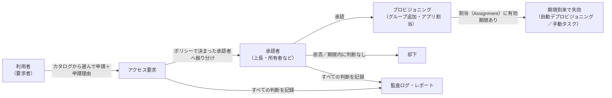
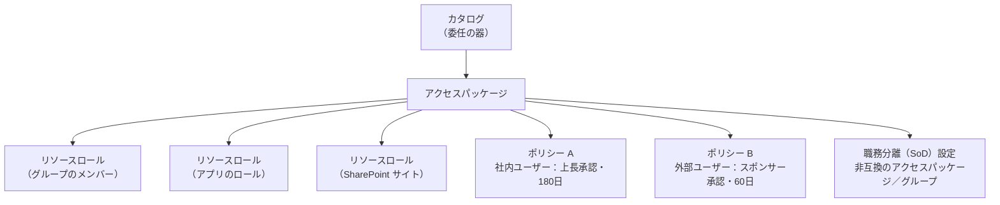

# 【勉強】IGA（アイデンティティガバナンス＆管理）— アクセス要求（アクセスリクエスト）と承認ワークフロー（2026-08-24）

## 今日のテーマ

「この権限が欲しい」という申請を利用者自身に出させ、決められた承認者を通して自動で権限を付与する仕組み。IGAでいう**アクセス要求（アクセスリクエスト）と承認ワークフロー**を学びます。

## 概要

先週まで学んだ JML（入社・異動・退職に連動した自動付与）は、「所属していれば当然もらえる権限」を扱うものでした。しかし現場の権限は、それだけでは足りません。「他部署の共有サイトを一時的に見たい」「本番環境の操作権限を今日だけ欲しい」といった、**例外的で個別の要求**が必ず発生します。

こうした要求をメールやチャットでの依頼と手作業で処理していると、誰が誰に何を許可したのか記録が残らず、付けた権限が外れないまま溜まっていきます。アクセス要求の機能は、この経路を**カタログから選んで申請し、決められた承認者が判断し、承認されたら自動でプロビジョニングされ、期限が来たら自動で外れる**という一本の流れに載せるものです。

つまり権限が付与される経路は二本あります。属性駆動の自動付与（JML）と、申請駆動のアクセス要求です。IGAではこの二本目に、承認・期限・監査記録という枷をはめます。

上の図は、申請から承認、プロビジョニング、期限による自動失効までの一連の流れを表しています。

## 押さえる要点

- **エンタイトルメント（Entitlement）** — 「あるシステム上でこれができる」という権限の最小単位。グループのメンバーシップやアプリのロールなどが該当します。アクセス要求では、これを利用者が理解できる単位に束ねてカタログに並べます。
- **束ねる単位には製品ごとの名前がある** — Microsoft Entra ID Governance の**エンタイトルメント管理**では、必要なリソース一式を束ねたものを**アクセスパッケージ**と呼びます。アクセスパッケージはセキュリティグループ、Microsoft 365 グループ／Teams、エンタープライズアプリケーション、SharePoint Online サイトのリソースロールを含められます（Microsoft Entra ロールや SAP IAG のビジネスロールもプレビューで対象）。SailPoint Identity Security Cloud では**エンタイトルメント／アクセスプロファイル／ロール**が要求対象になり、Okta Identity Governance ではアプリ、グループ、**エンタイトルメントバンドル**が対象です。
- **要求できる状態にするには明示的な有効化が必要な場合がある** — SailPoint ではエンタイトルメントの要求が既定で無効で、テナント単位の有効化と、エンタイトルメントごとの requestable 指定の2段構えが必要です。Okta のエンタイトルメントバンドルも、対象アプリで Governance Engine が有効になっていることが前提になります。「カタログに出てこない」の原因はたいていここです。
- **ポリシーが「誰が要求でき、誰が承認し、いつまで有効か」を決める** — Entra のエンタイトルメント管理では、アクセスパッケージに1つ以上の**ポリシー**を付け、要求できる対象者・承認プロセス・割当の有効期間を定義します。同じアクセスパッケージに、社員用と外部ユーザー用で別のポリシーを持たせることもできます。
- **多段階承認** — Entra では承認段階を1〜3段階まで設定できます。各段階では、その段階に指定された承認者のうち**1人が判断すれば次に進みます**（全員の承認は不要で、最初に判断した人の結果が採用されます）。承認者としてマネージャーやスポンサーを属性から自動解決させることもできます。なお承認者は**自分自身の要求は承認できません**。
- **フォールバック承認者と代理承認者は別物** — Entra では、`Manager` 属性からマネージャーを解決できなかったときに要求が回る先が**フォールバック承認者**、指定期間動きがないときに転送される先が**代理承認者（Alternate approver）**です。役割が違うので混同しないようにします。代理承認者を使うには要求のタイムアウトを**4日以上**にする必要があり、転送は要求開始から**1日以降**に行われます。
- **判断期限と自動処理** — Entra では「何日以内に判断するか」を設定し、期間内に承認されなければ**自動的に拒否**され、利用者は再申請が必要になります。SailPoint Identity Security Cloud では既定で**90日**承認が完了しない要求が自動的に拒否・失効し、`timeoutConfig` でより短い期限や「期限切れ時に自動承認」への変更ができます。
- **時間制限付きアクセス** — 承認された割当に有効期限を持たせるのが基本形です。SailPoint では期限到来時にソースに直結していれば自動でデプロビジョニングされ、直結していない場合はソース所有者に手動タスクが割り当てられます。開始日を指定して将来日付でのプロビジョニングも可能です。
- **申請と承認の理由（Justification）** — 監査で効いてくるのがここです。Entra では要求者に申請理由を必須にする設定、承認者に判断理由を必須にする設定がそれぞれあります。承認者の理由は他の承認者と要求者に見えます。
- **チャットからの承認** — Okta Identity Governance の Access Requests は、Okta の Web アプリだけでなく Slack や Microsoft Teams からの要求・承認に対応しています。承認を「わざわざ管理画面を開く作業」にしないための設計です。ただし Slack／Teams からの申請は後述の**要求タイプ（request types）が前提**で、条件（conditions）で管理するリソースを対象にするには Unified requester experience（Early Access）の有効化が必要です。

上の図は、Microsoft Entra ID Governance のエンタイトルメント管理における構成要素の入れ子関係を表しています。カタログという器の中にアクセスパッケージがあり、そこにリソースロールと複数のポリシーがぶら下がる形です。

## 設定のイメージ

Okta Identity Governance の Access Requests には、要求を組み立てる方式が2つあります。

- **条件（Conditions）** — アプリのプロファイルページから、「誰が要求できるか」「どのレベルのアクセスを要求できるか」「アクセス期間」「承認シーケンス」を定義する方式。要求者は End-User Dashboard でアプリのタイルを選んで申請します。Okta のドキュメントは、Access Requests が初めてならまず条件で始めることを推奨しています。
- **要求タイプ（Request types）** — 質問・タスク・タイマーといったステップで要求のライフサイクルを定義する構造化フロー。Jira や ServiceNow のような外部システムを絡めた自動処理も組み込めます。

条件方式の中核が**承認シーケンス**です。これは質問、Okta Workflows、承認、タスクを**直線的に並べたステップ列**で、「どの情報を誰に入力させ、誰が承認し、どの作業を完了させるか」を定義します。一方の要求タイプは、「この条件のときだけこのタスクを出す」といった条件分岐を組めるため、直線的とは限りません。同じ「ステップを並べる」という見た目でも、表現できる形が違う点に注意します。

Entra 側の設定は、管理センターで `ID Governance` → `エンタイトルメント管理` → `アクセスパッケージ` と進み、ポリシーの `Request` タブで「要求できるのは誰か（Self / Admin / Manager）」「申請理由を必須にするか」「承認は何段階か」を指定していく流れです。作業には Identity Governance 管理者などのロールが必要で、機能の利用には Microsoft Entra ID Governance または Microsoft Entra Suite のライセンスが必要になります（一部の機能は Microsoft Entra ID P2 でも動作します）。

## つまずきやすいところ・注意点

- **マネージャー属性が空だと承認先が決まらない** — 「上長承認」は `Manager` 属性を辿って承認者を決めています。人事連携が不完全でこの属性が空のユーザーがいると、承認先が決まらず要求が滞るおそれがあります。Entra がフォールバック承認者という仕組みを用意しているのはまさにこのためなので、必ず設定しておきます。
- **承認者が非アクティブだと要求が止まる** — Okta のドキュメントは、承認者に指定されたユーザーが Okta で Active 状態でないとタスクが未割り当てのままになり、要求の解決が停止しうると明記しています。退職者が承認者に残っていないかを定期的に点検する必要があります。
- **期限切れ時の既定動作が製品ごとに違う** — Entra は判断期限を過ぎた要求を自動拒否します。SailPoint も既定は90日で自動拒否ですが、設定によって「期限切れ時に自動承認」に変えることもできます。ここを確認せずに運用すると、誰も見ていない要求が通ってしまう構成になり得ます。
- **職務分離（SoD）の非互換設定は単方向** — Entra のエンタイトルメント管理では、アクセスパッケージAに「Bと非互換」と設定しても、それだけではBを持つ人がAを要求できなくなるだけです。逆方向も止めたいなら、Bの側にも「Aと非互換」を設定する必要があります。ドキュメントも「非互換の関係は単方向（unidirectional）」と明示しています。
- **例外を認めるなら例外用の入れ物を作る** — 本番と開発の両方の権限が同時に必要、といった例外が出たとき、SoD 設定を外すのではなく、両方の権限をまとめた専用のアクセスパッケージを作り、そのポリシーの有効期限を他より短くする、あるいはアクセスレビューの頻度を上げる。Entra のドキュメントが推奨しているのはこの方向です。例外を「設定を緩める」で処理しないのがガバナンスの考え方です。
- **アクセス要求とアクセスレビューは役割が違う** — アクセス要求は権限の**入口**を管理し、アクセスレビュー（8月6日の記事）は既に持っている権限を**定期的に棚卸し**します。入口を締めても期限とレビューがなければ権限は溜まり続けるので、両方を組み合わせて初めて意味を持ちます。

## 今日のまとめ

**ミニ辞書**

| 用語 | 意味 |
| --- | --- |
| アクセス要求（Access Request） | 利用者が必要な権限を自分で申請し、承認を経て付与を受ける仕組み |
| エンタイトルメント | あるシステム上の権限の最小単位。グループメンバーシップやアプリのロールなど |
| アクセスパッケージ | Entra のエンタイトルメント管理で、必要なリソース一式を束ねた要求単位 |
| カタログ | アクセスパッケージとリソースを入れる器。権限委任の単位になる |
| ポリシー | 誰が要求でき、誰が承認し、割当がいつ期限切れになるかを定めた規則 |
| 割当（Assignment） | 承認後、要求者にアクセスパッケージが結び付いた状態。通常は有効期限付き |
| 承認シーケンス | Okta の条件（conditions）で、質問・承認・タスクなどを直線的に並べた要求処理のステップ列 |
| フォールバック承認者 | マネージャー等を属性から解決できなかったときに要求が回る先 |
| 代理承認者 | 一定期間動きがないときに要求が転送される先 |
| 職務分離（SoD） | 兼務させてはいけない権限の組み合わせを禁止する統制 |

**理解度チェック**

1. アクセス要求による権限付与と、JML による自動付与は、それぞれどういう性質の権限を担当していますか。
2. Entra のエンタイトルメント管理で、承認者を「マネージャー」に設定しただけでは不十分な理由は何でしょうか。何を併せて設定すべきですか。
3. アクセスパッケージAとBを互いに要求できないようにしたい場合、設定は何か所必要ですか。

## 参考リンク

- [What is entitlement management?（Microsoft Entra ID Governance）](https://learn.microsoft.com/entra/id-governance/entitlement-management-overview)
- [Create an access package in entitlement management](https://learn.microsoft.com/entra/id-governance/entitlement-management-access-package-create)
- [Change approval and requestor information settings for an access package](https://learn.microsoft.com/entra/id-governance/entitlement-management-access-package-approval-policy)
- [Approve or deny access requests in entitlement management](https://learn.microsoft.com/entra/id-governance/entitlement-management-request-approve)
- [Configure separation of duties checks for an access package](https://learn.microsoft.com/entra/id-governance/entitlement-management-access-package-incompatible)
- [Access Request Overview（SailPoint Identity Security Cloud）](https://documentation.sailpoint.com/saas/help/requests/index.html)
- [Access Requests（Okta Identity Governance）](https://help.okta.com/oie/en-us/content/topics/identity-governance/access-requests/ar-overview.htm)
