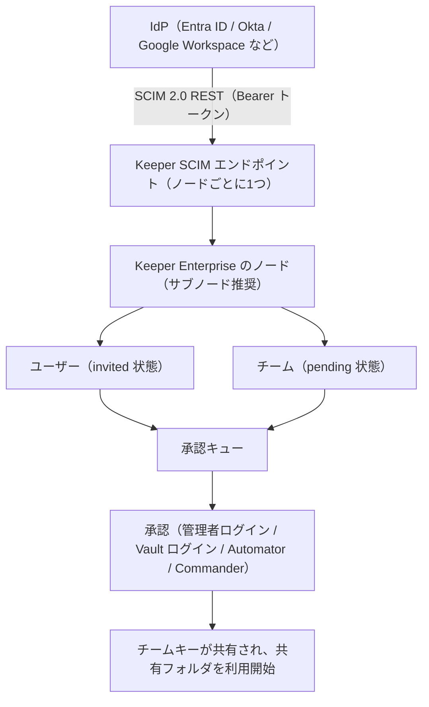
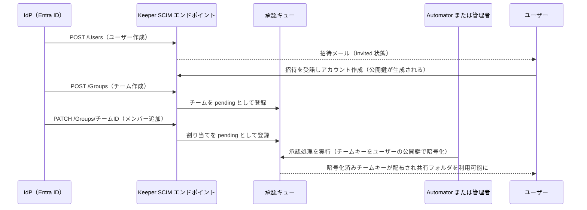

# 【勉強】Keeper — プロビジョニング（SCIM）（2026-08-25）

## 今日のテーマ

Keeper に対して IdP（Entra ID や Okta）からユーザーとチームを自動で作る「SCIM プロビジョニング」を学びます。Entra ID 編・Okta 編・Ping 編・Auth0 編と同じテーマの Keeper 版です。Keeper はゼロ知識（Zero-Knowledge）を前提としたパスワード管理製品なので、他製品にはない「承認」という手順が挟まります。そこが今日の山場です。

## 概要

SCIM（System for Cross-domain Identity Management）は、IdP と対象システムの間でユーザー情報をやり取りするための標準仕様です。Keeper は SCIM 2.0 に対応しており、JSON をやり取りする REST API としてエンドポイントを公開しています。

Keeper 側のエンドポイントは次の形です（実際に IdP へ設定する値は、Admin Console が表示する Tenant URL をそのままコピーします）。

```
https://keepersecurity.com/api/rest/scim/v2/<node_id>
```

`node_id` は Keeper Enterprise の「ノード」を指します。ノードは Keeper の中の組織単位（OU に相当する入れ物）で、SCIM 連携は 1 ノードにつき 1 つの IdP という対応になります。認証は Bearer トークンで、トークンは Keeper 側でノードに SCIM 連携を設定したときに生成されます。

サポートされる操作は次のとおりです。

- アカウントの作成
- グループ／チームの作成
- グループ／チームへのユーザー追加
- アカウントの削除／無効化
- アカウントの更新
- グループ／チームからのユーザー削除

全体像を図にすると次のようになります。IdP から届いた変更が、そのまま使える状態にはならず「承認キュー」を通る点に注目してください。



## 押さえる要点

**1. リソースは Users と Groups の2つ**

Keeper の SCIM エンドポイントは `Users` と `Groups` に対して GET / POST / PATCH / DELETE をサポートします。SCIM の Group が Keeper の「チーム」に対応します。`ServiceProviderConfig` の GET で、そのテナントが何に対応しているかを確認できます。

**2. DELETE は「削除」ではなく「ロック」**

`Users/DELETE` を投げても、Keeper はアカウントを削除せずロックします。保管庫のデータが消えることを防ぐためです。完全に削除したい場合は Admin Console か Keeper Commander（CLI／SDK）から明示的に操作します。退職者処理を SCIM に任せても、データは残るという前提で設計する必要があります。なお `Groups/DELETE` のほうは、対象ノードからチームを実際に削除します。ユーザーとチームで挙動が対称でない点に注意してください。

**3. ゼロ知識ゆえの「承認」**

ここが Keeper 固有です。SCIM で作られたユーザーは `invited`、チームは `pending` の状態で作られます。チームの共有フォルダを使うにはチームキー（Team Key）を各メンバーの公開鍵で暗号化して配る必要があり、これは鍵を持っている「ログイン済みの誰か」にしかできません。サーバーは平文の鍵を持たないので、サーバー側だけでは完結しないわけです。

承認の方法は4つあります。

- 管理者が Admin Console にログインする
- そのチームのメンバーの誰かが Web Vault やデスクトップアプリにログインする
- Keeper Automator（自社のクラウドまたはオンプレに自前でホストする常駐サービス。コンテナのほか Standalone Java や Windows サービスとしても導入できる）に任せる
- Keeper Commander の `team-approve` コマンドを実行する

Automator のバージョンについては、公式ドキュメント内で記述にゆれがあります。SCIM／Entra／Okta の各ページは「3.2 以降でチームとチーム割り当ての即時承認に対応」とし、「Team and User Approvals」ページは「3.3 以降でチーム作成・チームへのユーザー割り当て・ユーザー承認に対応」としています。導入時は実際のリリースノートで要件を確認するのが安全です。いずれにせよ、承認を自動化したいなら Automator の導入がほぼ必須と考えてよさそうです。

なお承認キューは、SCIM や AD Bridge によるプロビジョニングだけでなく、SSO Connect Cloud のデバイス承認にも使われます。

**4. ドメイン予約が前提**

セキュリティ上の制約として、プロビジョニングするメールアドレスのドメインがそのテナントに予約されていないと、Keeper は SCIM プロビジョニングを受け付けません。新しいドメインを使う場合は Keeper のアカウントマネージャーやサポートに予約を依頼します。追加ドメインについては、Keeper Commander CLI が DNS 検証によるドメイン予約に対応しているので、こちらで実施することもできます。

ユーザーからチームが使えるようになるまでの流れを時系列で見ておきます。



## 設定のイメージ（Entra ID の場合）

1. Entra 管理センターで「エンタープライズ アプリケーション」→「新しいアプリケーション」から `Keeper Password Manager & Digital Vault` を追加する
2. アプリの「プロビジョニング」で「自動」を選ぶ
3. Keeper Admin Console で対象ノードを選び「Add Method」→ SCIM →「Create Provisioning Token」でトークンを発行する
4. Tenant URL と Secret Token を Entra 側に貼り付けて保存する
5. Entra 側で「テスト接続」を実行し、成功したらプロビジョニング状態をオンにする
6. アプリの「ユーザーとグループ」で、対象のユーザー／グループを割り当てる
7. プロビジョニングを開始する

初回同期は 5 分程度待ちます。Microsoft 側の初回実行に 40 分ほどかかる場合もあります。待機後、Keeper Admin Console で「Sync」を押し、Users タブにユーザーが現れることを確認します。Entra の「オンデマンドプロビジョニング（Provision on demand）」を使えば特定ユーザーだけ即座に流し込めるので、検証時はこちらが便利です。

## つまずきやすいところ

- **ルートノードに SCIM を設定しない。** 公式ドキュメントはサブノードでの設定を明示的に推奨しています。またこれとは別に、ノードの親子関係は SCIM 連携に継承されません。あるノードに SCIM を設定しても、その配下のサブノードはその連携では制御されず、サブノードごとに独自のプロバイダを設定することになります。
- **メールアドレスは Keeper 全体で一意。** 同一テナントか別テナントかを問わず、そのメールのユーザーが既に存在するとプロビジョニングは失敗します。例外は「そのユーザーが既に対象ノードのメンバーである」場合だけで、このときは失敗せず IdP との紐づけが確立されます。手動で作った既存ユーザーがいる場合は、連携前に SCIM 用ノードへ移動しておきます。
- **ユーザー名にメールアドレスが入っているか確認する。** Okta のように userName に任意文字列を設定できる IdP では、メールとして不正だと拒否されます。形式上は正しいが実在しないメールだと、受け付けられても招待メールが届かず参加できません。
- **Admin Console で「Test」を押すタイミング。** トークンを保存する前にテストすると失敗します。先にトークンをコピーして Save してからテストします。
- **Okta ではグループの割り当てだけでは足りない。** Keeper の Okta アプリにグループを割り当てただけでは Keeper 側にチームは作られず、Okta の「Push Groups」への追加が必要です。
- **任意のロールは自動で付かない。** SCIM で作られたユーザーとチームは一律デフォルトロールに入り、SCIM 側から別のロールを指定することはできません。チーム単位でロールを割り当てる「Team-to-Role マッピング」を使うと、チームごとに異なるロール強制を効かせられます（管理者ロールには使えません）。
- **グループ名の重複は既定で通る。** 既定では同名グループの作成を受け付けます。一意性を強制したい場合は Keeper に依頼して、SCIM 連携にフラグを立ててもらう必要があります。
- **大規模テナントではページングとチューニング。** GET はデフォルトで先頭 1000 件しか返しません。`startIndex` と `count` を使います。メンバー数の多いグループでは `?excludedAttributes=members` で members を除外すると速くなります。一括処理には `/Bulk` エンドポイントがあり、上限は `ServiceProviderConfig` で確認できます（既定値の例は maxOperations が 1000、maxPayloadSize が 1048576 バイト）。

## 今日のまとめ

**ミニ辞書**

| 用語 | 意味 |
| --- | --- |
| ノード（Node） | Keeper Enterprise 内の組織単位。SCIM 連携は 1 ノードにつき 1 IdP |
| チーム（Team） | Keeper 側のグループ。SCIM の Group がこれに対応し、共有フォルダの割り当て先になる |
| 承認キュー | SCIM や AD Bridge で作られたチーム／ユーザーが、鍵の共有を待つ場所。SSO Connect Cloud のデバイス承認にも使われる |
| チームキー | チームの共有情報を復号するための鍵。各メンバーの公開鍵で暗号化して配布される |
| Automator | 承認処理を自動化する、自前でホストする Keeper のサービス |
| ドメイン予約 | 自社ドメインをテナントに紐づける手続き。SCIM 受け入れの前提条件 |

**理解度チェック**

1. SCIM で `Users/DELETE` を実行したとき、Keeper のアカウントはどうなるか。完全削除するにはどうするか。
2. SCIM でチームを作っただけでは、メンバーが共有フォルダを使えない。なぜか。暗号の仕組みと絡めて説明できるか。
3. Entra ID と Okta の 2 つの IdP から Keeper にプロビジョニングしたい。ノード構成はどう設計すべきか。

## 参考リンク

- [API Provisioning with SCIM | Keeper Documentation](https://docs.keeper.io/enterprise-guide/user-and-team-provisioning/automated-provisioning-with-scim)
- [Team and User Approvals | Keeper Documentation](https://docs.keeper.io/enterprise-guide/user-and-team-provisioning/approval-queue)
- [Microsoft Entra ID / Azure AD Provisioning | Keeper Documentation](https://docs.keeper.io/enterprise-guide/user-and-team-provisioning/azure-ad-provisioning-scim)
- [User and Team Provisioning | Keeper Documentation](https://docs.keeper.io/enterprise-guide/user-and-team-provisioning)
- [Okta Provisioning | Keeper Documentation](https://docs.keeper.io/enterprise-guide/user-and-team-provisioning/okta-integration-with-saml-and-scim)
- [Domain Reservation | Keeper Documentation](https://docs.keeper.io/enterprise-guide/domain-reservation)
- [Keeper Automator | Keeper Documentation](https://docs.keeper.io/sso-connect-cloud/device-approvals/automator)
