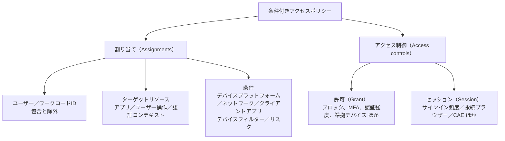
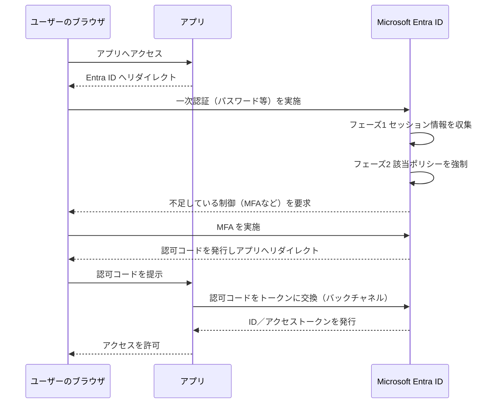

# 【勉強】Microsoft Entra ID — 条件付きアクセスとMFA（2026-08-26）

## 今日のテーマ

Microsoft Entra ID の**条件付きアクセス（Conditional Access）**を学びます。「誰が・何に・どんな状況でアクセスしようとしているか」を見て、その場でアクセスを許可・制限・拒否する仕組みです。今回はポリシーの構造、評価の順番、MFA と認証強度の関係までを押さえます。

## 概要 — 条件付きアクセスとは何か

条件付きアクセスは、一言でいえば**サインイン時に発火する if-then のルールエンジン**です。

- **if（割り当て）**: 経理部のユーザーが、給与アプリに、社外ネットワークからアクセスしたら
- **then（アクセス制御）**: MFA と準拠デバイスを要求する

インフラ出身の感覚に寄せると、L3 のファイアウォールが「送信元 IP・宛先・ポート」で通す／落とすを決めるのに対して、条件付きアクセスは「ユーザー・アプリ・デバイス・ネットワーク・リスク」というアイデンティティ側のシグナルで同じことをする、と捉えると入りやすいと思います。Microsoft はこれを**ゼロトラストのポリシーエンジン**と位置づけています。

重要な前提として、条件付きアクセスは**認証そのものを差し替える機能ではありません**。ユーザーの一次認証（パスワードなど）が終わった**後**に評価が走り、「その結果でよいか、追加で何を要求するか」を決めます。ここを取り違えると、後述する認証強度の挙動が理解できなくなります。

なお、利用には **Microsoft Entra ID P1** ライセンスが必要です（Microsoft 365 Business Premium にも含まれます）。リスクベースのポリシー（ユーザーリスク／サインインリスク）は Microsoft Entra ID Protection、つまり **P2** の機能です。ライセンスがないテナント向けには、オン／オフだけの簡易版として**セキュリティの既定値（Security defaults）**が用意されていますが、条件付きアクセスポリシーとは併用できません。

## 押さえる要点

### ポリシーの構成要素

ポリシーは大きく「割り当て」と「アクセス制御」に分かれます。

上の図は、1 つのポリシーが持つ設定項目の全体像です。ポリシーが有効になる最低条件は、**名前・ユーザーまたはグループ・ターゲットリソース・許可またはブロック**の 4 つです。

**許可（Grant）**で選べる制御は次のとおりです。

- ブロック
- 多要素認証を要求する
- 認証強度を要求する
- デバイスが準拠としてマークされていることを要求する（Intune）
- Microsoft Entra ハイブリッド参加済みデバイスを要求する
- 承認済みクライアントアプリを要求する（※ 2026 年 3 月上旬に廃止予定。新規ポリシーでは「アプリ保護ポリシーを要求する」を使う）
- アプリ保護ポリシーを要求する
- パスワードの変更を要求する
- 利用規約への同意を要求する
- リスクの修復を要求する

複数選んだときは「**選択したすべての制御を必須（AND）**」か「**いずれか 1 つを必須（OR）**」を選べます。既定は AND です。

**セッション（Session）**では、アクセスを許可したあとの振る舞いを制御します。アプリ強制の制限、Defender for Cloud Apps と連携する条件付きアクセスアプリ制御、サインイン頻度、永続的なブラウザーセッション、継続的アクセス評価（CAE）のカスタマイズなどが該当します。

### 評価は 2 フェーズで進む

条件付きアクセスの評価は、フェーズ 1（セッション情報の収集）とフェーズ 2（強制）の 2 段階です。フェーズ 1 では、レポート専用モードのポリシーも含めて評価対象になります。フェーズ 2 で**ブロックのポリシーが 1 つでも該当すれば、そこで止まってユーザーは拒否されます**。ブロックがなければ、満たされていない許可制御を、多要素認証 → 準拠デバイス → ハイブリッド参加済みデバイス → 承認済みクライアントアプリ → アプリ保護ポリシー → パスワード変更 → 利用規約 の順にユーザーへ要求していきます。

図のとおり、認証の開始と結果の受け渡しは**ユーザーのブラウザを経由するリダイレクト**で行われます。ただし OAuth 2.0 認可コードフローでブラウザ経由で戻るのはトークンそのものではなく**認可コード**で、アプリはそのコードを Entra ID のトークンエンドポイントへ**直接（バックチャネルで）**送ってトークンに交換します。「ブラウザ経由のフロントチャネル」と「アプリと Entra ID のバックチャネル」の 2 本がある、と押さえてください。そして条件付きアクセスの評価は、一次認証の後に入ります。

複数のポリシーが該当する場合、**すべてのポリシーを満たす必要があります**。あるポリシーが MFA を、別のポリシーが準拠デバイスを要求していれば、両方を満たさないとアクセスできません。1 つのポリシー内の割り当ては AND で結合されるため、条件を足すほどポリシーは「狭く」なります。

### MFA と認証強度の違い

ここが今日いちばん大事なところです。

「多要素認証を要求する」は、**何らかの MFA を通っていればよい**という制御です。SMS でもプッシュ通知でも FIDO2 でも構いません。

一方**認証強度（Authentication strengths）**は、「**どの方式の組み合わせなら通すか**」まで指定できます。組み込みで 3 つ用意されています。

| 認証強度 | 内容 |
| --- | --- |
| 多要素認証の強度（Multifactor authentication strength） | 「多要素認証を要求する」と同じ組み合わせ |
| パスワードレス MFA の強度（Passwordless MFA strength） | MFA を満たすがパスワードを使わない方式 |
| フィッシング耐性のある MFA の強度（Phishing-resistant MFA strength） | 認証方式とサインイン先の対話を必要とする方式のみ |

日本語版ドキュメントや管理センターの UI では訳語が揺れているので、英語名で覚えておくと迷いません。

「フィッシング耐性のある MFA の強度」が許可するのは、**Windows Hello for Business（またはプラットフォーム資格情報）、FIDO2 セキュリティキー、Microsoft Entra 証明書ベースの認証（多要素）**の組み合わせです。中間者型のフィッシング（AiTM）に強いのはこれらの方式なので、少なくとも管理者ロールにはこの強度を要求するのが Microsoft の推奨です。

なお、**同一ポリシー内で「多要素認証を要求する」と「認証強度を要求する」は併用できません**。組み込みの「多要素認証の強度」が前者と等価だからです。

もう一点。**外部認証方法（EAM: External authentication methods）を使っている場合、認証強度とは現時点で非互換**です。この場合は「多要素認証を要求する」の許可制御を使うよう案内されています。

## 設定のイメージ

管理者に対してフィッシング耐性のある MFA を要求する、という代表的なポリシーの手順です。

1. Microsoft Entra 管理センターに、少なくとも**条件付きアクセス管理者**でサインインする
2. **Entra ID** → **条件付きアクセス** → **ポリシー** → **新しいポリシー**
3. ポリシー名を付ける（命名規則を決めておくと後で助かります）
4. **割り当て** → **ユーザーまたはワークロード ID**
   - 包含: **ディレクトリロール** から対象の管理者ロールを選ぶ
   - 除外: **緊急アクセス用（break-glass）アカウント**を必ず入れる
5. **ターゲットリソース** → **リソース** → 包含で**すべてのリソース**
6. **アクセス制御** → **許可** → **アクセス権の付与** → **認証強度を要求する** → **フィッシング耐性のある MFA の強度**
7. **ポリシーの有効化**を **レポート専用** にして作成する
8. 影響を確認してから **オン** に切り替える

いきなりオンにせず、**レポート専用モード**と **What If ツール**で影響を見てから有効化する。この順番は必ず守ってください。

## つまずきやすいところ

**1. 自分を締め出す（ロックアウト）**

条件付きアクセスは強力なので、設定ミスで全管理者がサインインできなくなり得ます。緊急アクセス用アカウントをポリシーの除外に入れておくのが定石です。

**2. サービスアカウント／サービスプリンシパルには効かない**

ユーザーを対象にした条件付きアクセスは、**サービスプリンシパルの呼び出しをブロックしません**。ワークロード ID 向けの条件付きアクセスを別途使う必要があります。スクリプトで使っているユーザー型サービスアカウントは、マネージド ID への置き換えが推奨されています。

**3. ディレクトリロールを対象にする場合、組み込みロールしかサポートされない**

カスタムロールや管理単位（AU）スコープのロールには**強制されません**。ここは思い込みで穴を空けやすいところです。

**4. レガシ認証は MFA を通せない**

IMAP、POP、SMTP、EWS、MAPI over HTTP といった基本認証のクライアントは、MFA もデバイス状態も扱えないため、MFA や準拠デバイスを要求する許可制御では**ブロックされます**。Microsoft の分析では、パスワードスプレー攻撃の 99% 以上がレガシ認証プロトコル経由とされています。塞ぐのが基本ですが、業務システムが使っていないかは先に確認してください。

**5. 認証強度は一次認証を制限しない**

フィッシング耐性の強度を設定しても、ユーザーは**パスワードを入力できてしまいます**。その後にフィッシング耐性のある方式を求められる、という流れです。「パスワード入力画面が出るから設定が効いていない」は誤解です。

また、その強度を満たす方式を**まだ登録していないユーザー**は、登録できる方式がなければサインインをブロックされます。ポリシー適用前に登録を済ませておく計画が要ります。

**6. 「デバイスの状態」条件は非推奨**

現在は**デバイスのフィルター（Filter for devices）**を使います。両者は併用できません。

**7. サインイン頻度の既定値は 90 日のローリングウィンドウ**

短くすれば安全になる、とは限りません。頻繁な再認証は MFA 疲れを招き、かえってフィッシングの成功率を上げます。パスワード変更やデバイスの非準拠といったポリシー違反が起きればセッションは失効するので、既定は「セキュリティ状態が変わらないなら聞かない」という設計になっています。

**8. Azure の MFA 必須化は条件付きアクセスとは別枠**

Microsoft は 2024 年 10 月から Azure ポータル・Entra 管理センター・Intune 管理センターでの操作に（フェーズ 1。Microsoft 365 管理センターは 2025 年 2 月から）、2025 年 10 月 1 日から Azure CLI・Azure PowerShell・Azure モバイルアプリ・IaC ツール・REST API の**作成／更新／削除**操作に（フェーズ 2。**読み取り操作は対象外**）MFA を必須化しました。

これは**テナント側のポリシーの除外設定が効かない**システム側の強制で、緊急アクセス用アカウントも対象です。一方、**マネージド ID やサービスプリンシパルといったワークロード ID は対象外**です。ただしユーザーアカウントをサービスアカウント代わりに使っている場合は対象になるので、そこは事前に洗い出しておく必要があります。

## 今日のまとめ

**用語ミニ辞書**

- **条件付きアクセス（Conditional Access）**: 割り当て（if）とアクセス制御（then）からなる、サインイン時のポリシーエンジン。Entra ID P1 以上。
- **割り当て（Assignments）**: 誰が・何に・どんな条件で、を指定する部分。すべて AND で結合される。
- **許可制御（Grant controls）**: 通す条件（MFA、認証強度、準拠デバイスなど）またはブロック。
- **セッション制御（Session controls）**: 許可後のセッションの振る舞い（サインイン頻度、永続ブラウザーなど）。
- **認証強度（Authentication strengths）**: 許可する認証方式の組み合わせを指定する制御。組み込みは MFA／パスワードレス MFA／フィッシング耐性のある MFA の 3 つ。
- **レポート専用モード**: 実際には強制せず、適用結果だけをログに記録するモード。
- **継続的アクセス評価（CAE）**: アカウント無効化やパスワード変更などの重大イベントを、トークンの有効期限を待たずにほぼリアルタイムで反映する仕組み。CAE 対応セッションではトークンが長寿命化する代わりに、即時失効の対象になる。
- **セキュリティの既定値（Security defaults）**: ライセンス不要のオン／オフ式の基本保護。条件付きアクセスとは併用不可。

**理解度チェック**

1. 1 つのポリシー内で「MFA を要求」と「準拠デバイスを要求」を選び、「いずれか 1 つを必須」にした。ユーザーは何を満たせばアクセスできるか。また、別のポリシーが同じユーザーとアプリに対して「ブロック」を設定していたらどうなるか。
2. 「フィッシング耐性のある MFA の強度」を要求するポリシーを作った。ユーザーがパスワード入力画面に到達できるのはなぜか。
3. ユーザーを対象にした MFA 必須のポリシーを作れば、そのテナントのすべてのアクセスが MFA で守られると言えるか。言えないとしたら、どんな抜け道が残るか。

## 参考リンク

- [What is Conditional Access?](https://learn.microsoft.com/entra/identity/conditional-access/overview)
- [Build a Conditional Access policy](https://learn.microsoft.com/entra/identity/conditional-access/concept-conditional-access-policies)
- [Conditional Access: Grant](https://learn.microsoft.com/entra/identity/conditional-access/concept-conditional-access-grant)
- [Conditional Access: Session](https://learn.microsoft.com/entra/identity/conditional-access/concept-conditional-access-session)
- [Conditional Access: Conditions](https://learn.microsoft.com/entra/identity/conditional-access/concept-conditional-access-conditions)
- [Plan a Conditional Access deployment](https://learn.microsoft.com/entra/identity/conditional-access/plan-conditional-access)
- [Conditional Access authentication strengths](https://learn.microsoft.com/entra/identity/authentication/concept-authentication-strengths)
- [Require phishing-resistant MFA for administrators](https://learn.microsoft.com/entra/identity/conditional-access/policy-admin-phish-resistant-mfa)
- [Conditional Access adaptive session lifetime policies](https://learn.microsoft.com/entra/identity/conditional-access/concept-session-lifetime)
- [Continuous access evaluation](https://learn.microsoft.com/entra/identity/conditional-access/concept-continuous-access-evaluation)
- [Microsoft-managed Conditional Access policies](https://learn.microsoft.com/entra/identity/conditional-access/managed-policies)
- [Security defaults in Microsoft Entra ID](https://learn.microsoft.com/entra/fundamentals/security-defaults)
- [Mandatory multifactor authentication for Azure and admin portals](https://learn.microsoft.com/entra/identity/authentication/concept-mandatory-multifactor-authentication)
- [Block legacy authentication with Conditional Access](https://learn.microsoft.com/entra/identity/conditional-access/policy-block-legacy-authentication)
- [How Conditional Access authentication strengths work](https://learn.microsoft.com/entra/identity/authentication/concept-authentication-strength-how-it-works)
- [Conditional Access: Users and groups](https://learn.microsoft.com/entra/identity/conditional-access/concept-conditional-access-users-groups)
