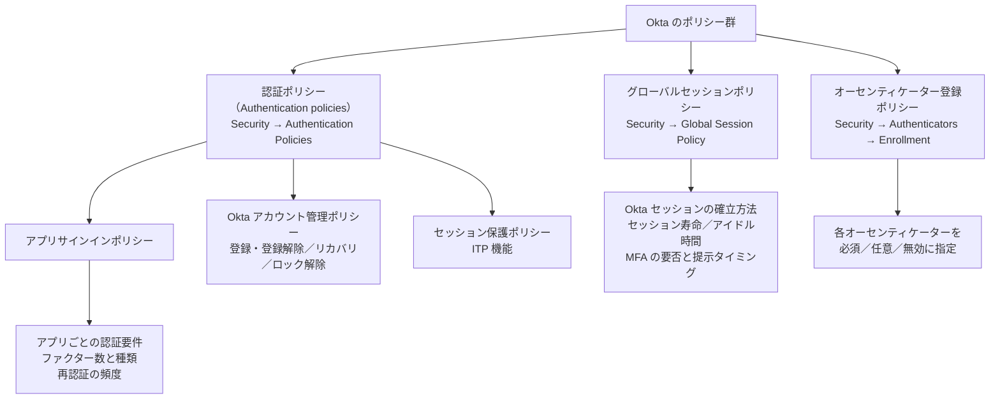
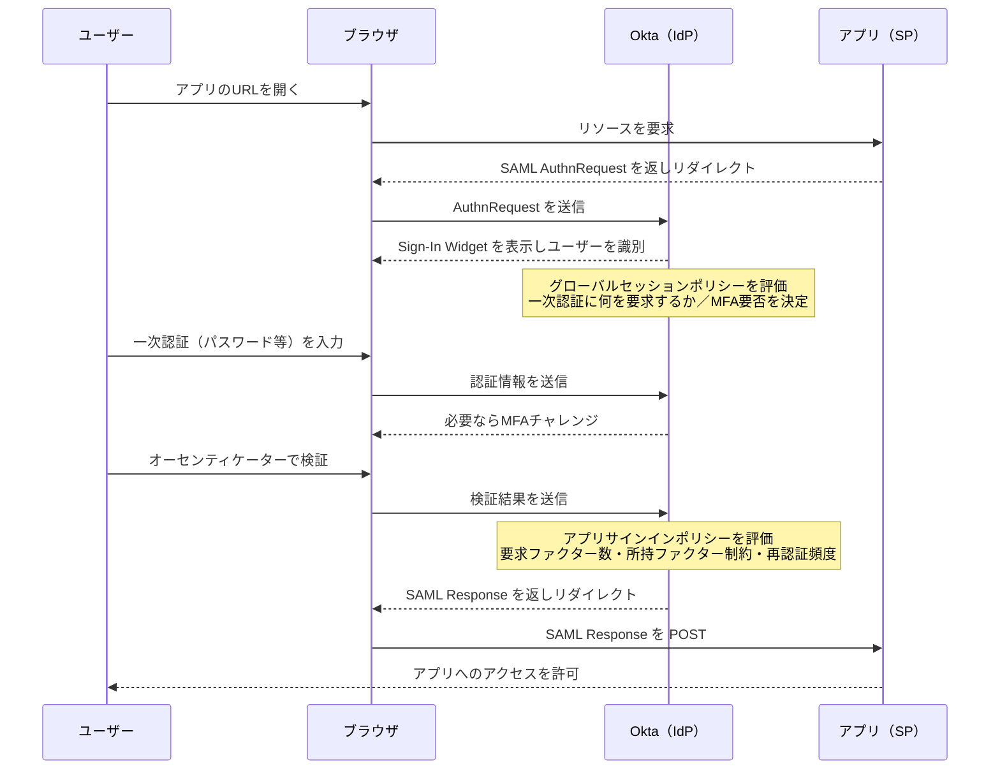

# 【勉強】Okta Workforce Identity Cloud — 認証ポリシーとMFA（2026-08-27）

## 今日のテーマ

Okta Identity Engine の**認証ポリシー**と**MFA**を学びます。昨日の Entra ID 編で見た条件付きアクセスが「1 つのポリシーエンジンで全部決める」設計だったのに対し、Okta は**グローバルセッションポリシー**と**アプリサインインポリシー**の 2 階層に役割を分けています。この分担を理解することが、Okta のポリシー設計を読み解く鍵になります。

## 概要 — 公式が挙げる 4 つのポリシー

公式の *Okta policies and rules* ページは、次の 4 つを挙げています（このほかにパスワードポリシーやデバイスアシュアランスポリシーなどもあるため、これで全種類というわけではありません）。なお公式の階層では、アプリサインインポリシー・Okta アカウント管理ポリシー・セッション保護ポリシーの 3 つは**「認証ポリシー（Authentication policies）」の下位区分**で、グローバルセッションポリシーだけが別系統です。

- **グローバルセッションポリシー（Global session policy）**: Okta がユーザーを識別した後、次の認証ステップに進むためのサインイン**コンテキスト**を与える。Okta セッションの寿命もここで決める。
- **アプリサインインポリシー（App sign-in policy）**: 要求されたアプリの文脈で、エンドユーザーの認証を強制する。
- **Okta アカウント管理ポリシー（Okta account management policy）**: オーセンティケーターの登録・登録解除、パスワードリカバリ、アカウントのロック解除時の認証要件を定義する。
- **セッション保護ポリシー（Session protection policy）**: セッション乗っ取りなどを示唆するコンテキスト変化を監視する（Identity Threat Protection）。

これに加えて、MFA の**登録**を管理する**オーセンティケーター登録ポリシー（Authenticator enrollment policy）**が別枠であります。「どの認証手段を使わせるか」（サインインポリシー）と「どの認証手段を登録させるか」（登録ポリシー）が別の画面になっているのは、最初に混乱しやすいポイントです。

上の図は、Okta の各ポリシーが管理コンソールのどこにあり、何を決めるかの対応表です。

### 貫いている概念 — アシュアランス（assurance）

これらのポリシーはすべて**アシュアランス**を強制します。アシュアランスとは、サインインしているユーザーがそのアカウントの本人であることの**確度**です。確度は、使われたオーセンティケーターの数と性質で測られます。知識ファクター（パスワードなど）と所持ファクター（Okta Verify、パスキーなど）の両方で認証できるユーザーは、片方だけのユーザーよりアシュアランスが高い、という考え方です。

Identity Engine は、**グローバルセッションポリシーとアプリサインインポリシーの両方**で指定されたアシュアランスレベルが満たされることを、アプリへのアクセス許可の条件とします。公式ドキュメントはこれを、従来モデル（組織にサインインしたかアプリ経由かでどちらか一方のポリシーを評価する）からの**変更点**として明記しています。

## 押さえる要点

### 1. グローバルセッションポリシーで決めること

`Security > Global Session Policy` で設定します。ルールの `IF` 条件には、ユーザーの IP（ネットワークゾーン）、アイデンティティプロバイダー、認証経路（Any / LDAP interface）、ビヘイビア（振る舞い検知）、リスクレベル（Low / Medium / High）を指定できます。`THEN` 側の主な項目は次のとおりです。

- **Establish the user session with**: セッション確立に何を使うか。`A password`（パスワード必須）か、`Any factor used to meet the Authentication Policy requirements`（アプリサインインポリシーが認めるオーセンティケーターでよい）。後者を選ぶとパスワードレスの土台になります。
- **Multifactor authentication (MFA) is**: MFA を必須にするか。
- **Users will be prompted for MFA**: MFA を必須にした場合の提示タイミング。`At every sign in`（毎回）、`When signing in with a new device cookie`（新しいデバイスクッキーのとき）、`After MFA lifetime expires for the device cookie`（MFA ライフタイム経過後）の 3 択。
- **Maximum Okta global session lifetime**: セッションの最大寿命。`No time limit` か `Set time limit`。
- **Maximum Okta global session idle time**: アイドル時間。最大寿命に関係なくこの時間で失効します。

デフォルトポリシーは全ユーザーに適用され、パスワード、IdP、またはアプリサインインポリシーが許可する任意のファクターでのアクセスを認めます。

### 2. アプリサインインポリシーで決めること

`Security > Authentication Policies` の `App sign-in` から設定します。API サービスアプリを除く新規アプリは、共有のデフォルトポリシーから始まります。このデフォルトポリシーは**「任意の 2 種類のファクターでアクセスを許可する」キャッチオールルール 1 本**を持っています。要件を厳しくするには、ルールを追加してキャッチオールより上に優先度を置きます。

`IF` 条件で使えるシグナルは、Entra ID の条件付きアクセスに近い品揃えです。

- ユーザータイプ／グループ所属／個別ユーザー
- **デバイスの状態**（`Registered` = Okta Verify に登録済み）、サードパーティ MDM の管理下か、**デバイスアシュアランスポリシー**の充足、デバイスプラットフォーム
- ユーザーの IP（ネットワークゾーン、動的ゾーン）
- リスクレベル
- Okta Expression Language（EL）によるカスタム式

`THEN` 側で、認証の強度を組み立てます。

- **User must authenticate with**: 1 ファクター（`Password`、`Possession factor`、`Any 1 factor type`）／2 ファクター（`Password + Another factor`、`Any 2 factor types`）／**認証メソッドチェーン**（複数の認証方法を指定した順序で要求する）。
- **Possession factor constraints**: 所持ファクターの性質を縛る。
  - `Phishing-resistant`: サインインサーバー（オリジン）を暗号的に検証する所持ファクターを要求する。**パスキー（FIDO2 WebAuthn）と Okta Verify の Okta FastPass** がこの要件を満たします。
  - `Hardware protection`: 認証に使う鍵がデバイスのセキュアハードウェアに保存されていることを要求する。Windows と Android では TPM、macOS と iOS では Secure Enclave を使います。
  - `Require user interaction`: ユーザーが物理的に居合わせていることの証明を要求する。外すと Okta Verify が証明書ベース認証で通り、物理的な立ち会いを証明せずにリソースにアクセスできてしまいます。
  - `Require PIN or biometric user verification`: 上を選ぶと現れる下位オプション。PIN または生体でユーザー自身を検証させます。
- **Prompt for authentication**: 再認証の頻度。`Every time user signs in to resource`（毎回。最も安全）、指定時間の経過後、`When an Okta global session doesn't exist`（Okta セッションが存在しないときだけ）。

### 3. MFA の「登録」は別ポリシー

`Security > Authenticators` の `Enrollment` タブで、グループ単位に各オーセンティケーターを **Optional / Required / Disabled** で指定します。少なくとも 1 つは Required にする必要があります。猶予期間（Grace period）は `None`（初回サインイン時に必須）、`End date`（指定日まで先延ばし可、1 日 1 回プロンプト）、`Skip count`（Early Access。指定回数までスキップ可）から選びます。猶予期間を使うには Sign-In Widget 7.28 以降が必要です。

適用中のポリシーが要求するオーセンティケーターをユーザーが未登録の場合、組織やアプリにアクセスしようとした時点で登録を促されます。このとき、**新しいオーセンティケーターの登録には、可能な場合は必ず 2 要素認証での検証が先に必要**です。この 2FA 要件は、適用されているポリシーに関係なく効きます。

## サインイン時の流れ

SAML でアプリにアクセスする場面を、2 つのポリシーがどこで効くかに注目して並べます。リダイレクトはすべてユーザーのブラウザ経由です。

この図の要点は、**Okta セッションを作る判断（グローバルセッションポリシー）とアプリに入れる判断（アプリサインインポリシー）が別々に評価される**ことです。既に Okta セッションを持っているユーザーがアプリを開いた場合でも、アプリサインインポリシーの要件は評価されます。

なお公式ドキュメントは、サインオンポリシーが認証シーケンスの途中で複数回評価されうる（`The sign-on policy may be evaluated multiple times during an authentication sequence`）と述べています。上の図は理解のために 1 回ずつに単純化したものです。

## つまずきやすいところ・注意点

- **セッションの寿命と再認証の頻度は別物**。公式ドキュメントは「グローバルセッションポリシーはセッション全体がどれだけ有効かを制御し、アプリサインインポリシーのルールが再認証の頻度を制御する」と明記しています。「MFA を求められる間隔が想定と違う」という相談は、片方だけを見ていることが原因になりがちです。
- **セッションのアイドル失効は Keep me signed in より強い**。グローバルセッションポリシーの `Maximum Okta global session idle time` に達すると、ユーザーがサインイン時に `Stay signed in` / `Keep me signed in` を選んでいたかどうかに関係なく、再認証が必要になります。
- **デフォルトの共有ポリシーを触ると影響範囲が広い**。共有デフォルトポリシーへの変更は、そのポリシーが割り当てられている**既存アプリと新規アプリの両方**に及びます。アプリ個別の要件は、ポリシーを分けるかクローンして持つのが安全です。
- **デフォルトポリシーのデフォルトルールは編集できる項目が限られる**。グローバルセッションポリシーの場合、`Establish the user session with`、`Multifactor authentication (MFA) is`、`Users will be prompted for MFA`、`Maximum Okta global session idle time` のみ編集できます。
- **Okta Verify がハードウェア保護を満たすかはデバイス依存**。セキュアハードウェアが存在しないデバイスでは Okta Verify はソフトウェア保存にフォールバックし、`Hardware protection` 要件を満たしません。管理コンソールの `secureHardwarePresent` デバイス属性で確認できます。
- **セキュリティ質問は認証フローに使わない**。公式ドキュメントは、セキュリティ質問をステップアップや追加検証に使う場合の前提としてグローバルセッションポリシーの一次ファクターが `A password` であることを挙げ、`Don't use security questions in any authentication flow` と明示しています。
- **登録ポリシーの猶予期間は無視されることがある**。アプリのアプリサインインポリシーが「サインイン前にオーセンティケーターの登録を要求する」構成になっている場合、猶予期間は無視されます。またセルフサービス登録（SSR）時に登録が必要なオーセンティケーターには、猶予期間を設定しないよう公式が注意喚起しています。
- **`Every time user signs in to resource` には 10 秒の猶予がある**。認証直後 10 秒間は再度プロンプトされません。「毎回」の挙動を検証するときに引っかかります。
- **ルールの優先順位は上から評価され、最初にマッチしたところで止まる**。制限の厳しいルールを上に置くのがベストプラクティスです。「全員」に当たるルールを上に置くと、下のルールは評価されません。

## 今日のまとめ

**重要用語のミニ辞書**

| 用語 | 意味 |
| --- | --- |
| グローバルセッションポリシー | Okta セッションの確立方法・寿命・MFA の要否と提示タイミングを決めるポリシー |
| アプリサインインポリシー | アプリごとに、認証に必要なファクターの数と性質、再認証の頻度を決めるポリシー |
| アシュアランス | サインインしているユーザーが本人であることの確度。オーセンティケーターの数と性質で測る |
| 所持ファクター（possession factor） | ユーザーが「持っている」もので認証する要素。Okta Verify、パスキー、メールなど |
| フィッシング耐性（phishing-resistant） | サインインサーバーのオリジンを暗号的に検証する性質。パスキーと Okta FastPass が満たす |
| ハードウェア保護 | 認証鍵をセキュアハードウェア（TPM / Secure Enclave）に保存すること |
| 認証メソッドチェーン | 複数の認証方法を、指定した順序でユーザーに要求する設定 |
| オーセンティケーター登録ポリシー | どのオーセンティケーターを必須／任意／無効にするかをグループ単位で決めるポリシー |

**理解度チェック**

1. 「あるアプリだけ 4 時間ごとに MFA を求めたい」という要件は、グローバルセッションポリシーとアプリサインインポリシーのどちらで実装しますか。その理由は何ですか。
2. アプリサインインポリシーで `Phishing-resistant` を要求すると、ユーザーが使える所持ファクターはどれになりますか。SMS や Okta Verify のプッシュ通知は満たしますか。
3. MFA を必須にするポリシーを作ったのに、対象ユーザーがまだそのオーセンティケーターを登録していません。ユーザーがアプリにアクセスしようとしたとき、何が起きますか。また、登録の際に追加で必要になる条件は何ですか。

## 参考リンク

- [Okta policies and rules](https://help.okta.com/oie/en-us/content/topics/identity-engine/policies/about-policies.htm)
- [Global session policies](https://help.okta.com/oie/en-us/content/topics/identity-engine/policies/about-okta-sign-on-policies.htm)
- [Add a global session policy rule](https://help.okta.com/oie/en-us/content/topics/identity-engine/policies/add-okta-sign-on-policy-rule.htm)
- [Global session policy evaluation](https://help.okta.com/oie/en-us/content/topics/identity-engine/policies/osop-evaluation.htm)
- [App sign-in policies](https://help.okta.com/oie/en-us/content/topics/identity-engine/policies/about-app-sign-on-policies.htm)
- [Add an app sign-in policy rule](https://help.okta.com/oie/en-us/content/topics/identity-engine/policies/add-app-sign-on-policy-rule.htm)
- [Authenticator enrollment policies](https://help.okta.com/oie/en-us/content/topics/identity-engine/policies/about-mfa-enrollment-policies.htm)
- [Create an authenticator enrollment policy](https://help.okta.com/oie/en-us/content/topics/identity-engine/policies/create-mfa-policy.htm)
- [Edit a global session policy](https://help.okta.com/oie/en-us/content/topics/identity-engine/policies/edit-global-session-policy.htm)
- [Authentication policies](https://help.okta.com/oie/en-us/content/topics/identity-engine/policies/about-authentication-policies.htm)
- [Phishing-resistant authentication](https://help.okta.com/oie/en-us/content/topics/identity-engine/authenticators/phishing-resistant-auth.htm)
- [Authentication method chain](https://help.okta.com/oie/en-us/content/topics/identity-engine/policies/authentication-method-chain.htm)
