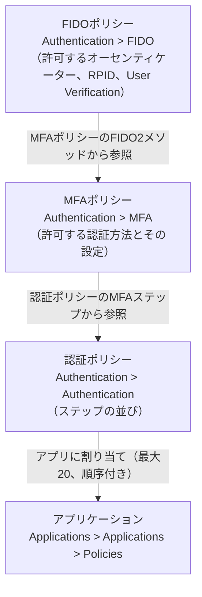
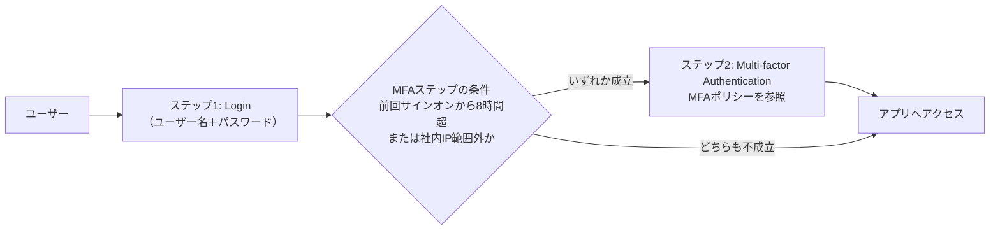

# 【勉強】Ping Identity — 認証ポリシーとMFA（2026-08-28）

## 今日のテーマ

PingOne の**認証ポリシー（authentication policy）**と**MFA ポリシー**を学びます。Entra ID 編（8/26）は条件付きアクセスという 1 枚のポリシーで全部を決める設計、Okta 編（8/27）はグローバルセッションポリシーとアプリサインインポリシーの 2 階層でした。PingOne はこのどちらとも違い、**FIDO ポリシー → MFA ポリシー → 認証ポリシー**という 3 段の入れ子になっています。今日はこの入れ子を上から下まで通して見ます。

## 概要 — 3 つのポリシーが入れ子になっている

PingOne の認証ポリシーは「ユーザーのアイデンティティをどう検証するか」を定義するものです。単一要素ならパスワードなど 1 つの証拠、多要素なら TOTP アプリ・FIDO2 生体認証・プッシュ通知・SMS/音声/メールの OTP といった証拠を要求します。

ここで大事なのは、**「どの認証方法を許すか」は認証ポリシーには書かれていない**という点です。認証方法の一覧と方法ごとの細かい設定は MFA ポリシーが持ち、FIDO2 の細部（どのオーセンティケーターを許すか、User Verification を必須にするか）はさらに FIDO ポリシーが持ちます。公式ドキュメントも、FIDO ポリシーを作る → それを MFA ポリシーに含める → その MFA ポリシーを認証ポリシーの MFA ステップに含める、という 3 段の手順で説明しています。

図は 3 つのポリシーの参照関係と、最終的にアプリへ割り当てられるまでの流れです。

## 押さえる要点

- **認証ポリシーは「ステップ」の並び。** 上から順にステップを実行します。1 番目にも選べるステップ種別は **Login**（ユーザー名＋パスワード）、**Identifier First**（先に識別子だけ聞く）、**Multi-factor Authentication**（Customer 環境）または **PingID Authentication**（Workforce 環境）、**External Identity Provider**（外部 IdP へ委譲）、**Windows Login Passwordless** です。**Progressive Profiling**（追加のプロフィール入力）と **Agreement Prompt**（利用規約同意）は 1 番目には置けないと明記されています。また、**1 番目のステップには population 条件とユーザー属性条件を付けられません**。2 ステップ構成で 1 番目を削除して 2 番目が繰り上がると、その条件は消えます。
- **MFA ステップには「いつ 2 要素目を求めるか」の条件が書ける。** 前回サインオンからの経過時間（Last sign-on older than）、CIDR で指定した範囲外の IP からのアクセス、特定 population への所属、ユーザー属性、そして IP レピュテーションが高リスク／ジオベロシティ異常／匿名ネットワーク検知です。**後ろ 3 つは PingOne Protect か PingOne for Customers Passwordless のライセンスが必要**と明記されています。複数のユーザー属性条件を並べた場合は OR 評価になります。
- **MFA ポリシーが許可できる認証方法**は、Authenticator App (TOTP)、Email、SMS、Voice、FIDO2、OATH Token、そして **Mobile applications**（PingOne MFA SDK を組み込んだ自社アプリ。Push / OTP）が Customer・Workforce 共通、**WhatsApp** が Customer 限定、**PingID mobile app**・**PingID desktop app**・**YubiKey OTP** が Workforce 限定です。ただし Mobile applications は Workforce ではシンガポール地域のみで、MFA ポリシー設定手順のページでは `(Customer only)` と書かれています。公式内で表現が揺れているので、実環境で確認してください。方法ごとに Passcode Failure Limit（多くは 1〜7）、Lock Duration、Passcode Lifetime（最大 30 分）、Passcode Length（6〜10 桁、既定 6）などを設定します。
- **かつて別項目だった Security Key と FIDO Biometrics は FIDO2 に統合済み。** 古い MFA ポリシーがこれらを使っている場合は、FIDO2 メソッドに置き換えて新しい FIDO ポリシーを参照させる必要があります。
- **FIDO ポリシーは環境作成時に Passkeys（既定）と Security key の 2 つが自動で作られます。** 主な設定は Relying Party ID（既定は PingOne のもの。公式の例示は `pingone.com` ですが地域で変わります。カスタムドメインや任意ドメインも指定可）、Discoverable Credentials（Discouraged / Preferred / Required）、Authenticator Attachment（Platform / Cross-platform / Both）、User Verification、Backup Eligibility（パスキーのようなクラウド同期クレデンシャルを許すか）、Attestation Request です。ユーザー名を入力しない usernameless 認証をやるなら Discoverable Credentials は Required、User Verification も Required が必要です。
- **アプリには認証ポリシーを最大 20 個まで、順序付きで割り当てられる。** ここが Okta と大きく違うところで、**上から順に試して、認証に失敗したら次のポリシーへフォールバック**します。「最初に条件に一致した 1 つだけを使う」方式ではありません。1 つも割り当てなければ、その環境の default authentication policy が使われます。なお同じ公式ページの前半には「The first policy in the list overrides any subsequent policies.」という逆に読める一文もあり、記述に揺れがあります。ここは詳細節のフォールバック説明を採りました。

## 設定のイメージ

Customer 環境で「普段はパスワードだけ、ただし社外 IP からのアクセスと前回サインオンから 8 時間以上経っている場合は MFA」を作るとしたら、こうなります。

1. **Authentication > MFA** で MFA ポリシーを作り、Allowed Authentication Methods で Authenticator App (TOTP) と FIDO2 を有効にする。FIDO2 の FIDO Policy には既定の Passkeys を指定。
2. **Authentication > Authentication** で **+ Add Policy**。1 番目のステップに **Login** を置く。
3. 2 番目のステップに **Multi-factor Authentication** を追加し、MFA Policy に手順 1 のポリシーを指定。
4. そのステップの条件に `Last sign-on older than = 8 hours` と `Accessing from IP out of range = 203.0.113.0/24`（社内レンジ）を設定。
5. **None or incompatible methods** を **Block** か **Bypass** から選ぶ。
6. **Applications > Applications** で対象アプリ → **Policies** タブ → 作ったポリシーを選択。

図は上の設定での判定の流れです。条件が成立しなければ MFA ステップは飛ばされます。

## つまずきやすいところ

- **Workforce と Customer で製品も画面も変わる。** シンガポール地域以外では、Workforce 環境を作るには **PingID サービス**を選ぶ必要があり、認証ポリシーの MFA ステップの名前も「PingID Authentication」になります。逆にシンガポール地域では Customer / Workforce とも手順が共通で、ステップ名は「Multi-factor Authentication」です。さらに、PingID レガシー管理ポータルから PingOne 管理コンソールへの機能移行が進行中で、移行期間中は設定が両方に分散します。認証ポリシーと許可 MFA 方法に限れば、**2025 年 1 月 7 日以降に作成された環境、または 2025 年 3 月 31 日以降に PingOne へ移行した PingID テナント**は PingOne 側（Authentication > MFA）で管理し、それ以外はレガシーポータル側です。関連ドキュメントには他の日付も出てくるので、手を動かす前に自分の環境がどれに当たるかを必ず確認してください。
- **Block と Bypass は認証ポリシー側の設定。** 「登録済みの MFA デバイスを持たないユーザーが来たとき」の挙動は MFA ポリシーではなく、**認証ポリシーの MFA ステップ**にある **None or incompatible methods** で決めます。Bypass を使うには、ユーザーが既に認証済み（Login ステップでのパスワード認証、または署名付き `login_hint_token`）である必要があります。既定値がどちらかは公式ドキュメントに明記が見つかりませんでした（要確認）。
- **PingOne 管理コンソール自身は、作った認証ポリシーの対象外。** 管理コンソールへのサインオンは **Settings > Administrator Security** のシステムポリシーが使われ、別のポリシーを割り当てることはできません。なお **2025 年 6 月 1 日をもって全 PingOne 管理者への MFA が必須化**され、無効化はできないと明記されています。
- **リスクスコアで分岐したいなら Protect のリスクポリシー側。** 認証ポリシーの MFA ステップに書ける条件は IP レピュテーション／ジオベロシティ／匿名ネットワークの真偽値的な 3 つだけです。「リスクレベルが High なら MFA」という汎用的なスコア分岐は、**Threat Protection > Risk Policies** で Mitigation ルールの Returned Action に **MFA** を選び、使う MFA ポリシーを指定する形で実現します。
- **PingFederate の認証ポリシーとは別物。** PingFederate 側は**任意設定**で、authentication selector が条件を評価して authentication source（IdP アダプターや IdP 接続）の系列へ分岐させるツリー構造です。再利用はパスの終端に authentication policy contract またはローカルアイデンティティプロファイルを置く形で行います。PingOne の「順序付きステップ＋アプリ側でのフォールバック」とはモデルが違うので、頭の中で混ぜないようにしてください。

## 今日のまとめ

**重要用語のミニ辞書**

| 用語 | 意味 |
| --- | --- |
| 認証ポリシー | ステップの並びでアイデンティティの検証方法を定義するもの。アプリに割り当てる |
| ステップ（Step Type） | Login / Identifier First / MFA / External Identity Provider など、認証ポリシーの構成単位 |
| Identifier First | 識別子を先に受け取り、Discovery rules に従って認証先の IdP を決めるステップ |
| MFA ポリシー | 許可する認証方法とその設定（失敗許容回数、ロック時間など）を持つポリシー |
| FIDO ポリシー | 許可する FIDO オーセンティケーターと WebAuthn の細部を定義するポリシー |
| Relying Party ID (RPID) | WebAuthn クレデンシャルを紐づけるドメイン。既定は PingOne のドメイン（例 `pingone.com`）、カスタムドメインや任意ドメインも指定可 |
| Discoverable Credentials | 認証器側に識別子を保存する方式。usernameless 認証には Required が必要 |
| None or incompatible methods | 使える MFA デバイスがないユーザーの扱い。Block（拒否）か Bypass（素通し） |
| default authentication policy | アプリにポリシーを割り当てなかったときに使われる、環境ごとの既定ポリシー |

**理解度チェック**

1. 「FIDO2 で許可するオーセンティケーターを絞りたい」とき、設定するのは FIDO ポリシー・MFA ポリシー・認証ポリシーのどれですか。残り 2 つはその設定とどう繋がりますか。
2. 1 つのアプリに認証ポリシーを 2 つ割り当てました。1 つ目のポリシーで認証に失敗したとき、何が起きますか。Okta のアプリサインインポリシーとどう違いますか。
3. 「リスクスコアが High のときだけ MFA を要求する」という要件は、認証ポリシーの MFA ステップの条件だけで実装できますか。できない場合、どこで設定しますか。

## 参考リンク

- [Authentication policies | PingOne](https://docs.pingidentity.com/pingone/authentication/p1_authenticationpolicies.html)
- [Adding an authentication policy | PingOne](https://docs.pingidentity.com/pingone/authentication/p1_add_an_auth_policy.html)
- [Adding a multi-factor authentication or PingID step | PingOne](https://docs.pingidentity.com/pingone/authentication/p1_add_mfa_step.html)
- [Adding a login authentication step | PingOne](https://docs.pingidentity.com/pingone/authentication/p1_add_login_auth_step.html)
- [Adding an identifier first authentication step | PingOne](https://docs.pingidentity.com/pingone/authentication/p1_add_identifier_first_auth.html)
- [Setting the default authentication policy | PingOne](https://docs.pingidentity.com/pingone/authentication/p1_set_default_auth_policy.html)
- [Authentication policies for applications | PingOne](https://docs.pingidentity.com/pingone/applications/p1_auth_policies_for_applications.html)
- [Applying authentication policies to an application | PingOne](https://docs.pingidentity.com/pingone/applications/p1_apply_auth_policy_to_applications.html)
- [MFA policies | PingOne](https://docs.pingidentity.com/pingone/authentication/p1_mfa_policies.html)
- [Configuring an MFA policy for strong authentication | PingOne](https://docs.pingidentity.com/pingone/strong_authentication_mfa/p1_creating_an_mfa_policy_for_strong_auth.html)
- [Configuring MFA settings | PingOne](https://docs.pingidentity.com/pingone/authentication/p1_configure_mfa_settings.html)
- [FIDO policies | PingOne](https://docs.pingidentity.com/pingone/authentication/p1_fido_policies.html)
- [Adding a FIDO policy | PingOne](https://docs.pingidentity.com/pingone/authentication/p1_creating_a_fido_policy.html)
- [Updating an existing MFA policy to use FIDO2 | PingOne](https://docs.pingidentity.com/pingone/strong_authentication_mfa/p1_updating_an_mfa_policy_to_fido2.html)
- [What is the difference between Workforce and Customer environments? | PingOne](https://docs.pingidentity.com/pingone/strong_authentication_mfa/p1_pid_what_is_the_difference.html)
- [Adding a risk policy | PingOne](https://docs.pingidentity.com/pingone/threat_protection_using_pingone_protect/p1_protect_adding_risk_policy.html)
- [PingOne administrators MFA requirement - FAQ](https://docs.pingidentity.com/pingone-admin-mfa-faq/p1_mfa_required_for_admins_faq.html)
- [Authentication policies | PingFederate](https://docs.pingidentity.com/pingfederate/13.0/administrators_reference_guide/pf_authentication_policies.html)（13.1 の同ページに置き換わっているため、最新版を参照するのが望ましい）
- [Moving PingID management to PingOne | PingOne](https://docs.pingidentity.com/pingone/strong_authentication_mfa/p1_move_pid_management_to_p1.html)
