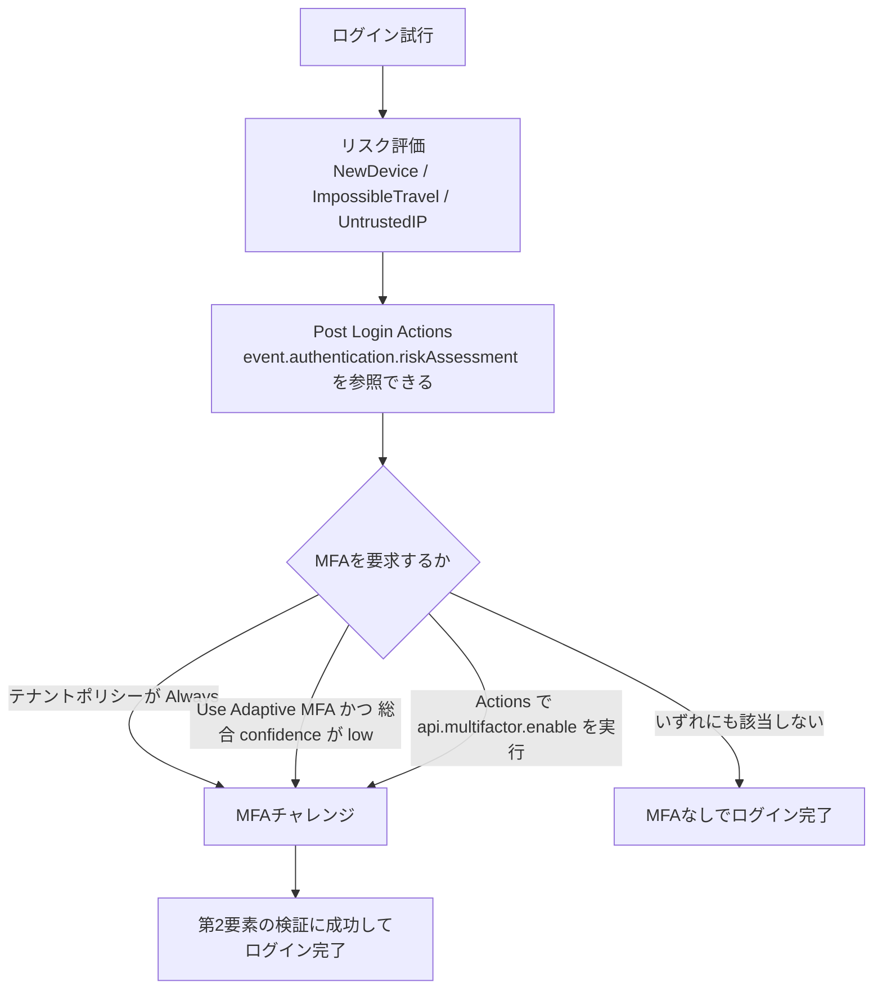
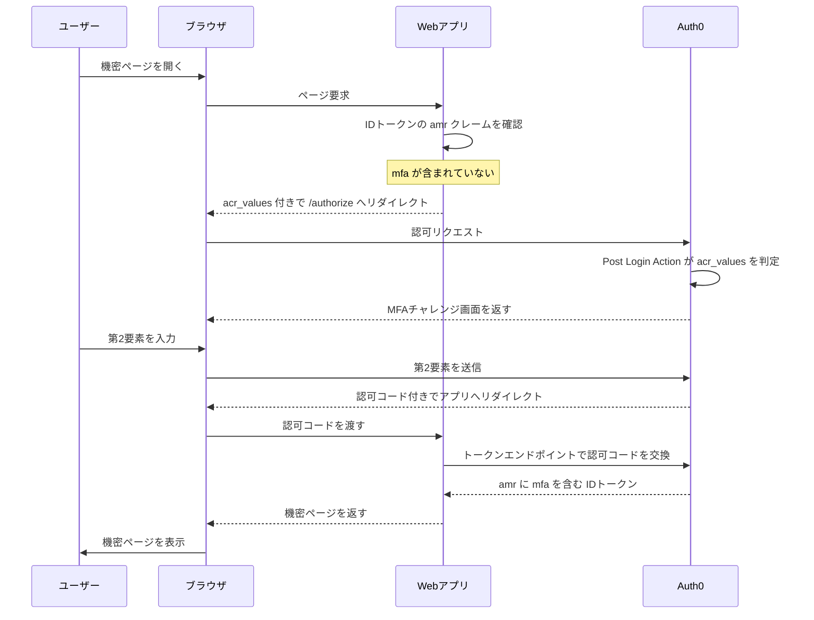

# 【勉強】Okta Customer Identity Cloud (Auth0) — 認証ポリシーとMFA（2026-08-31）

## 今日のテーマ

Auth0（Okta Customer Identity Cloud）で「いつMFAを求めるか」を決める仕組みを学びます。Entra ID編の条件付きアクセス、Okta WIC編・Ping編の認証ポリシーと同じテーマの、CIAM（顧客向けアイデンティティ）版です。

## 概要

Auth0のMFAは「どの要素（Factor）を使えるようにするか」と「いつ求めるか（ポリシー）」の2階建てになっています。Entra IDの条件付きアクセスやOktaの認証ポリシーが、管理画面のルール表で条件を細かく組み立てる方式だったのに対し、Auth0は管理画面では3択のポリシーを選ぶだけで、それより細かい条件は **Actions**（JavaScriptのコード）で書く、という設計です。

管理画面でGUIをぽちぽち組むのではなく、コードで書かせる。ここがAuth0らしいところで、インフラ出身の目線だと「設定ファイルで管理できる」と捉えると腑に落ちやすいと思います。

## 押さえる要点

### 1. 要素（Factor）は independent と dependent の2種類

Dashboard > Security > Multi-factor Auth で有効化します。

- **independent**（それ単体で第2要素として成立する）: WebAuthn with FIDO Security Keys（セキュリティキー）、One-time Password（OTP。認証アプリが出す時限コード）、Push Notification using Auth0 Guardian（専用アプリへのプッシュ通知）、Phone Message（SMS／音声通話）、Cisco Duo Security
- **dependent**（independentを1つ以上設定していないと有効化できない、補助的な要素）: WebAuthn with FIDO Biometrics（端末の生体認証）、Email、Recovery Code（リカバリコード）

テナントでMFAを必須にするには、independentな要素を **最低1つ** 有効化して設定する必要があります。dependentだけを有効にすることはできません。

なお Cisco Duo だけは扱いが特殊で、そのユーザーにとって唯一の要素である場合にのみ利用できます。他の要素と併用する構成にはできません。

> **Auth0 Guardian** … Auth0が提供するiOS／Android向けのMFAアプリ。プッシュ通知の承認と、アプリ内でのワンタイムパスワード生成の両方に使えます。プッシュが届かないときはアプリ内のOTPで代替できる、という二段構えです。

### 2. ポリシーは Never / Use Adaptive MFA / Always の3択

同じ画面の「Define policies」セクションで選びます。

| ポリシー | 挙動 |
| --- | --- |
| Never | MFAを求めない |
| Use Adaptive MFA | Auth0のリスク判定に基づいて、必要なときだけ求める |
| Always | すべてのログインで求める |

下の図が、MFAが要求される経路の全体像です。



### 3. Adaptive MFA は3つのリスク評価から信頼スコアを出す

Adaptive MFAは、ログインのたびに次の3つを評価し、総合的な confidence（信頼度）を算出します。信頼度が低い、つまりリスクが高いと判定されたときだけMFAを要求する、という考え方です。

- **NewDevice** … 既知の端末からのログインかどうか
- **ImpossibleTravel** … 物理的に移動不可能な場所からのログインかどうか
- **UntrustedIP** … 接続元IPが、Auth0が保持する低評価IPアドレスのリスト（deny list）に載っているかどうか

各評価および総合スコアは `low` / `medium` / `high` / `neutral` の値を持ち、Post Login Actions の `event.authentication.riskAssessment` から参照できます。「Auth0の総合判定は使わず、自分で条件を組みたい」という場合は、このオブジェクトを直接読んで判断します。

なお **Adaptive MFA の利用には Enterprise プランと Adaptive MFA アドオンが必要** です。無料テナントでは試せない点に注意してください。

### 4. 細かい条件は Actions で書く

「特定のアプリケーションにログインするときだけ」「特定の `user_metadata` を持つユーザーだけ」「社内IPレンジ以外からのアクセスのとき」といった条件は、Post Login トリガーの Action で書きます。

```javascript
exports.onExecutePostLogin = async (event, api) => {
  if (event.client.name === 'Admin Console') {
    api.multifactor.enable('any', { allowRememberBrowser: false });
  }
};
```

`allowRememberBrowser` は、ユーザーのブラウザを「信頼済み」として次回以降のMFAを省略するオプションです。**既定値は false**、`true` にすると30日間記憶されます。ただし7日以上ログインがないとMFA記憶用のCookieが失効するため、30日以内でも再度MFAを求められることがあります。Adaptive MFAを使う場合、端末を信頼済みとして記憶する期間（Device Trust Duration）は1〜365日の範囲で設定できます（既定30日）。

Actionsで自分で制御したいときは、**テナントのMFAポリシーを Never にしておく** のが定石です。こうしておくと「Actionsで明示的に要求したときだけMFAが走る」状態になり、挙動が読みやすくなります。

> 旧来の拡張ポイントである **Rules / Hooks** は、2024年11月18日に読み取り専用へ移行済みで、2026年11月18日に実行停止・削除が予定されています。今から書くなら Actions 一択です。

### 5. ステップアップ認証

すでにログイン済みのユーザーに対し、機密性の高い操作の直前だけ追加でMFAを求める仕組みです。

- アプリはIDトークンの **`amr`**（Authentication Methods Reference）クレームを見て、`mfa` が含まれているかを確認する
- 含まれていなければ、`acr_values=http://schemas.openid.net/pape/policies/2007/06/multi-factor` を付けて改めて `/authorize` へリダイレクトする
- Action側でこのパラメータを見て、MFAを要求する

流れを図にすると次のようになります。リダイレクトはすべてユーザーのブラウザを経由する点に注目してください。



### 6. Attack Protection は MFA とは別レイヤ

MFAと混同しやすいのですが、**Attack Protection** は「攻撃そのものを検知して止める」機能群で、MFAポリシーとは独立して動きます。

- **Bot Detection** … ボットやスクリプトによるログイン／サインアップ／パスワードリセットの多発を検知し、追加の検証ステップを挟む（クレデンシャルスタッフィング対策）
- **Brute-Force Protection** … 単一のIPアドレスから単一のユーザーアカウントを狙った試行を検知し、そのIPからの **当該ユーザーとしての** ログインをブロックする。対象ユーザーには通知が送られる
- **Suspicious IP Throttling** … 単一のIPアドレスから多数のアカウントを狙う高速な攻撃を抑制する
- **Breached Password Detection** … 漏洩済みの資格情報でのサインアップ／ログインを検知する

このうち Suspicious IP Throttling はすべての接続で既定で有効、Brute-Force Protection もテナント作成時点で既定で有効です。Bot Detection も既定で有効ですが、応答方法を設定していない場合は監視（Monitoring）モードで動きます。「有効にした覚えがないのに動いている」ものがある、と理解しておくとよいです。

MFAが「本人かどうかを追加で確かめる」のに対し、Attack Protectionは「そもそもこの試行を通してよいか」を見ています。役割が違うので、両方を設計に入れる必要があります。

## つまずきやすいところ

- **要素を有効化しただけではMFAは走らない。** ポリシー、またはActionsで「いつ求めるか」を決めて初めて動きます。「Guardianを有効にしたのに何も聞かれない」というのはたいていこれです。
- **ポリシーとActionsの二重管理。** Actionsで制御するならポリシーは Never に。両方で有効にすると、意図しない挙動の原因になります。
- **Adaptive MFA はプラン依存。** 検証用の無料テナントでは試せません。
- **Adaptive MFA は SAML の IdP-initiated フローでは非対応。** OIDCアプリケーションでの代替を検討することになります。
- **Adaptive MFA は未登録ユーザーへのemailチャレンジのためにメールアドレスを必要とする。** メールアドレスを持たないユーザーはトランザクションがブロックされます。
- **`allowRememberBrowser` の既定は false。** 「MFAをユーザーに飛ばされたくない」ならそのままで問題なく、逆に「毎回聞かれて煩わしい」という要望には `true` を検討します。
- **`amr` クレームが載るのはIDトークン。** アクセストークンではありません。ステップアップの判定をどちらで行うかを取り違えると動きません。

## 今日のまとめ

### ミニ辞書

| 用語 | 意味 |
| --- | --- |
| Factor（要素） | MFAで使う認証手段。単体で成立する independent と、補助的な dependent がある |
| Auth0 Guardian | Auth0提供のMFAアプリ。プッシュ通知の承認とOTP生成に対応 |
| Adaptive MFA | リスク評価に基づき、必要なときだけMFAを求めるポリシー |
| riskAssessment | Post Login Actions から参照できるリスク評価の結果オブジェクト |
| Actions | Auth0の拡張ポイント。ログイン等のトリガーでJavaScriptを実行する |
| amr | IDトークンのクレーム。どの認証方式を使ったかを示す。MFA済みなら `mfa` を含む |
| acr_values | 認可リクエストで「この認証強度を要求する」と伝えるOIDCのパラメータ |
| Attack Protection | ボット検知、ブルートフォース対策など、攻撃の検知・抑止を担う機能群 |

### 理解度チェック

1. テナントでMFAを必須にするには、最低限どの種類の要素を有効化する必要があるか。
2. Adaptive MFA が評価する3つのリスク評価の名前と、それぞれが何を見ているかを説明できるか。
3. Actionsで独自のMFA条件を書くとき、テナントのMFAポリシーはどれに設定しておくのが定石か。またその理由は。

## 参考リンク

- [Multi-factor Authentication - Auth0 Docs](https://auth0.com/docs/secure/multi-factor-authentication)
- [Enable Multi-Factor Authentication - Auth0 Docs](https://auth0.com/docs/secure/multi-factor-authentication/enable-mfa)
- [Multi-Factor Authentication Factors - Auth0 Docs](https://auth0.com/docs/secure/multi-factor-authentication/multi-factor-authentication-factors)
- [Auth0 Guardian - Auth0 Docs](https://auth0.com/docs/secure/multi-factor-authentication/auth0-guardian)
- [Adaptive MFA - Auth0 Docs](https://auth0.com/docs/secure/multi-factor-authentication/adaptive-mfa)
- [Enable Adaptive MFA - Auth0 Docs](https://auth0.com/docs/secure/multi-factor-authentication/adaptive-mfa/enable-adaptive-mfa)
- [Customize Adaptive MFA - Auth0 Docs](https://auth0.com/docs/secure/multi-factor-authentication/adaptive-mfa/customize-adaptive-mfa)
- [Customize Multi-Factor Authentication Pages - Auth0 Docs](https://auth0.com/docs/secure/multi-factor-authentication/customize-mfa)
- [Configure Step-up Authentication for Web Apps - Auth0 Docs](https://auth0.com/docs/secure/multi-factor-authentication/step-up-authentication/configure-step-up-authentication-for-web-apps)
- [Attack Protection - Auth0 Docs](https://auth0.com/docs/secure/attack-protection)
- [Bot Detection - Auth0 Docs](https://auth0.com/docs/secure/attack-protection/bot-detection)
- [Suspicious IP Throttling - Auth0 Docs](https://auth0.com/docs/secure/attack-protection/suspicious-ip-throttling)
- [Breached Password Detection - Auth0 Docs](https://auth0.com/docs/secure/attack-protection/breached-password-detection)
- [Preparing for Rules and Hooks End of Life - Auth0 Blog](https://auth0.com/blog/preparing-for-rules-and-hooks-end-of-life/)
