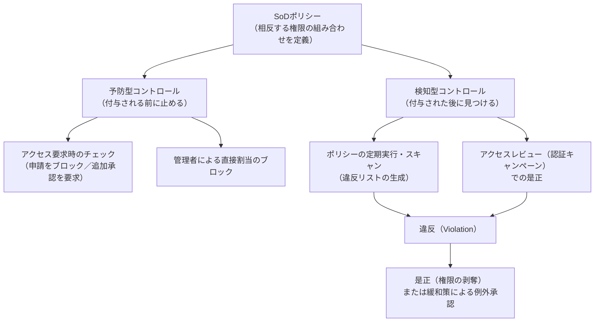
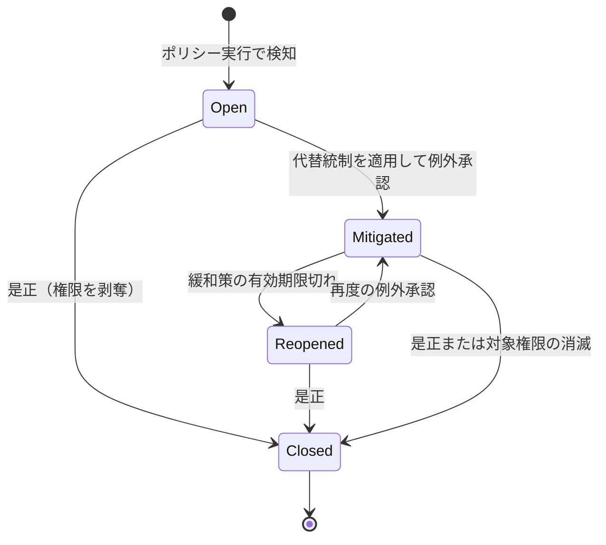

# 【勉強】IGA（アイデンティティガバナンス＆管理）— 職務分掌（SoD）ポリシーと違反の検知・是正（2026-09-01）

## 今日のテーマ

「請求書を作る人と、その支払いを承認する人は別であるべき」という業務ルールを、権限の組み合わせとしてシステムに実装する仕組み。IGAでいう**職務分掌（SoD：Separation of Duties）ポリシー**と、その違反の検知・是正を学びます。

## 概要

これまで学んだアクセスレビュー、JML、アクセス要求は、いずれも「一つひとつの権限が妥当か」を問うものでした。しかし不正リスクの多くは、個々の権限ではなく**組み合わせ**から生まれます。請求書の登録権限も支払い実行権限も、単体で見れば経理部門の誰かが持っていて当然の権限です。問題は、その両方を同じ人が持ったときに、架空請求を自分で作って自分で払えてしまう点にあります。

SoDは、この「単体では正常だが、揃うと危険な組み合わせ」を**あらかじめ定義しておき、システムに検査させる**機能です。SOX法をはじめとする内部統制の要求に応えるための、IGAの中核的なコントロールにあたります。

インフラ運用の感覚に引き寄せると、「開発環境の変更権限を持つ人が、本番環境へのデプロイ承認も持っていないか」を機械的に洗い出す仕組み、と考えると近いはずです。

制御には二つの効かせ方があります。権限が付く**前**に止める予防型（preventive）と、付いた**後**に見つける検知型（detective）です。どちらか一方では不十分で、両方を組み合わせるのが基本形です。



上の図は、SoDポリシーが予防型と検知型の二つの経路で効くことを表しています。これは製品横断の概念モデルで、どの経路をどこまで実装しているかは製品によって異なります（後述）。

## 押さえる要点

- **ポリシーの実体は「二つのリスト」** — SoDポリシーの表現方法は製品をまたいで似ています。相反する権限を List A / List B の二つに分けて定義し、**同じ人が両方のリストの権限を持っていたら違反**とみなす、という形です。SailPoint Identity Security Cloud では、1つのアクセスベースポリシーにつき各リスト最大50エンタイトルメント（各リストに最低1件必要）、テナント全体ではポリシー種別を問わず合計最大500ポリシーという上限があります。Okta Identity Governance のSODルールも二つのリスト構成で、各リストの上限は全エンタイトルメント合わせて50値です。

- **リストの評価条件を選べる製品がある** — Okta のSODルールでは、各リストに **Any one of**（リスト内のいずれか1つ以上を持てば該当）と **All of**（リスト内のすべてを持てば該当）を指定できます。「経理システムのどれか一つの登録権限」と「支払い実行権限のすべて」といった非対称な条件を書き分けられます。

- **予防型の実装は製品ごとにかなり違う** — Microsoft Entra ID Governance のエンタイトルメント管理では、アクセスパッケージに対して**非互換（incompatible）なアクセスパッケージやグループ**を指定します。指定されたパッケージの割当や、指定されたセキュリティグループのメンバーシップを既に持つユーザーは、そのアクセスパッケージを要求できなくなります。Okta では、SODルールに抵触するアクセス要求を**ブロックするか、条件付きで許可するか**を設定できます。

- **Entra の非互換設定は単方向である** — ここは間違えやすい点です。Entra で「Western Territory パッケージに Eastern Territory を非互換として追加」しても、逆方向（Eastern 側から Western を要求する経路）は塞がれません。**双方向に効かせるには、両方のアクセスパッケージにそれぞれ相手を非互換として登録する**必要があります。

- **違反には「是正」と「緩和」の二つの出口がある** — 検知された違反を、権限を剥奪して解消するのが是正（remediation）です。一方、業務上どうしても両方が必要な場合に、代替統制（mitigating control）を適用して例外として許容するのが緩和（mitigation）です。SailPoint では違反に対して緩和策を選び、コメントを付けて適用します。緩和策には有効日数を設定でき、期限が来れば違反が再びオープンになります。「例外を認めるが、永久には認めない」という設計です。

- **違反にも所有者と重要度がある** — SailPoint のSoDポリシーには、ポリシー所有者（Policy Owner）、共同所有者（Co-Owner）、そして違反への対応責任者である**違反所有者（Violation Owner）**を設定します。ポリシーにはリスク区分（Critical / High / Medium / Low）を付けられ、違反はポリシーと同じ区分を引き継ぎます。所有者と重要度が決まっていないと、違反リストは「誰も見ない一覧」になります。

- **検知は自動で走らせる** — SailPoint ではポリシーをアドホック実行するほか、頻度・時刻・通知先を指定してスケジュール実行できます。さらに違反の作成・緩和・再オープン・クローズに対応するイベントトリガーが用意されており、Slack通知やチケット起票につなげられます。

## 違反のライフサイクル

違反は一度検知して終わりではなく、状態を持って動きます。



上の図は、SailPoint Identity Security Cloud のSoD違反が取りうる状態と遷移を表しています。同製品は Open / Mitigated / Re-opened / Closed の4状態を持ち、それぞれに対応するイベントトリガーが用意されています。**Re-opened が Open とは別状態になっている**のがポイントで、「一度例外として認めたが期限が切れて戻ってきた違反」を、新規の違反と区別して扱えます。

## 設定のイメージ

Entra ID Governance で、アクセスパッケージ同士を非互換にする例です。管理センターでは **ID Governance > エンタイトルメント管理 > アクセスパッケージ** を開き、左メニューの **Separation of duties** から設定します。PowerShell では以下のように書けます（Microsoft.Graph.Identity.Governance モジュール 1.16.0 以降）。

```powershell
# $accessPackageId 側に、$incompatibleAccessPackageId を非互換として登録する
$incompatible1params = @{
  "@odata.id" = "https://graph.microsoft.com/v1.0/identityGovernance/entitlementManagement/accessPackages/" + $incompatibleAccessPackageId
}
New-MgEntitlementManagementAccessPackageIncompatibleAccessPackageByRef `
  -AccessPackageId $accessPackageId -BodyParameter $incompatible1params

# 逆方向も塞ぐため、相手側にも同じ登録を行う
$incompatible2params = @{
  "@odata.id" = "https://graph.microsoft.com/v1.0/identityGovernance/entitlementManagement/accessPackages/" + $accessPackageId
}
New-MgEntitlementManagementAccessPackageIncompatibleAccessPackageByRef `
  -AccessPackageId $incompatibleAccessPackageId -BodyParameter $incompatible2params
```

2回呼んでいるのが、先ほどの「単方向」への対処です。

なお Entra のエンタイトルメント管理を使うには、Microsoft Entra ID P2、Microsoft Entra ID Governance、または Enterprise Mobility + Security (EMS) E5 のいずれかのライセンスが必要です。

## つまずきやすいところ・注意点

- **既存の違反は予防型では消えない** — 予防型コントロールは、これから権限が付く経路を塞ぐだけです。ポリシーを作った時点で既に両方を持っている人はそのまま残ります。Entra ではその該当者一覧をCSVでダウンロードできるので、まず棚卸ししてから予防型を有効にする、という順序になります。

- **ルール作成前の申請やキャンペーンには効かない** — Okta では、SODルールを作成した後の新規アクセス要求とスケジュール済みキャンペーンには効きますが、作成前に提出された申請や既にアクティブなキャンペーンには影響しません。

- **Okta の同時申請には穴がある** — Okta はアクセス要求のSoD評価を、**申請者が申請を提出した時点の既存エンタイトルメント割当**に基づいて行います。そのため、短期間に複数の申請を出したり、複数の申請を同時にオープンにしていたりすると、警告が出ず、相反する権限の申請を止められません。公式ドキュメント自身が、承認前に同一申請者のオープンな申請をすべて確認すること、およびSoD違反をレビューする認証キャンペーンを定期的に回すことを推奨しています。予防型を入れたから検知型は不要、とはならない実例です。

- **例外を作る場合は、例外だと見える形にする** — Entra のドキュメントでは、本番環境と開発環境の両方が必要な例外的ケースに対し、双方のリソースロールを含む**専用の結合アクセスパッケージ**を作る方法が示されています。有効期限を他より短く設定したり、アクセスレビューの頻度を上げたりして監督を強めます。既存パッケージの非互換設定を外して済ませると、例外が例外として記録されません。

- **権限設計そのものが先** — SoDポリシーはエンタイトルメントを名指しして書きます。エンタイトルメントの棚卸しと命名が済んでいないと、そもそも「どれとどれが相反するか」を書けません。SoDは権限設計の完成度をそのまま映す機能です。

## 今日のまとめ

**重要用語のミニ辞書**

- **SoD（Separation of Duties／職務分掌）** — 相反する職務を一人に集中させない内部統制の原則。IAM上では「同時に持たせてはいけない権限の組み合わせ」として実装される。
- **予防型コントロール（preventive）** — 権限が付与される前に、要求や割当をブロックする制御。
- **検知型コントロール（detective）** — 付与された後に違反を洗い出す制御。定期スキャンやアクセスレビューが該当する。
- **違反（Violation）** — SoDポリシーに抵触している状態。オープン／緩和済み／再オープン／クローズといった状態を持つ。
- **是正（Remediation）** — 権限を剥奪して違反を解消すること。
- **緩和策・代替統制（Mitigating Control）** — 権限を残したまま、別の統制でリスクを下げて例外として許容する仕組み。有効期限を伴うのが通例。
- **非互換アクセスパッケージ（Incompatible Access Package）** — Entra ID Governance で、あるアクセスパッケージの要求を妨げる別のパッケージやグループの指定。単方向に効く。

**理解度チェック**

1. SoDポリシーが「二つのリスト」で表現されるのはなぜか。リストAとリストBに何を入れ、どういう条件で違反と判定されるかを説明できますか。
2. Entra ID Governance で、アクセスパッケージ A と B を相互に要求できないようにするには、設定を何回行う必要がありますか。それはなぜですか。
3. 予防型コントロールを入れたあとも、検知型コントロール（定期スキャンやアクセスレビュー）を回し続けなければならない理由を、二つ挙げられますか。

## 参考リンク

- [Separation of Duties Overview — SailPoint Identity Security Cloud](https://documentation.sailpoint.com/saas/help/sod/index.html)
- [Managing Policies（SoDポリシーの作成・上限・所有者・スケジュール実行） — SailPoint](https://documentation.sailpoint.com/saas/help/sod/manage-policies.html)
- [Handling Policy Violations（違反の確認・緩和・イベントトリガー） — SailPoint](https://documentation.sailpoint.com/saas/help/sod/policy-violations.html)
- [Configure separation of duties checks for an access package in entitlement management — Microsoft Learn](https://learn.microsoft.com/entra/id-governance/entitlement-management-access-package-incompatible)
- [Separation of duties — Okta Identity Governance](https://help.okta.com/oie/en-us/content/topics/identity-governance/sd/separation-of-duties.htm)
- [Create separation of duties rules — Okta Identity Governance](https://help.okta.com/oie/en-us/content/topics/identity-governance/sd/create-rules.htm)
