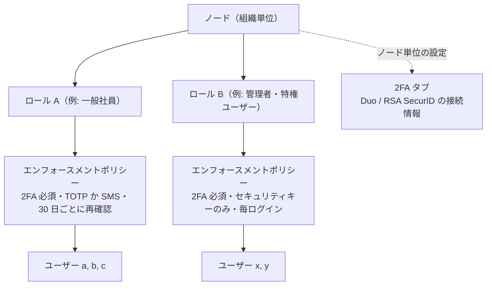
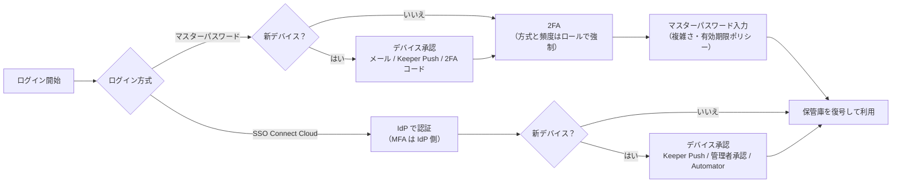

# 【勉強】Keeper — 認証ポリシーとMFA（エンフォースメントポリシー）（2026-09-04）

## 今日のテーマ

Keeper の「認証ポリシーと MFA」を学びます。Entra ID 編（条件付きアクセス）・Okta 編（認証ポリシー）・Ping 編・Auth0 編と同じテーマの Keeper 版です。ただし Keeper は IdP ではなくパスワード管理製品なので、「条件付きアクセス」のようなリスク評価エンジンは持ちません。代わりに、**ロールに紐づくエンフォースメントポリシー（Enforcement Policies）** で「誰に、どの強さのログインを要求するか」を決めます。ここが今日の中心です。

## 概要

Keeper Enterprise では、ユーザーはノード（組織単位）に所属し、ロールが割り当てられます。ロールには 2 つの顔があります。ひとつは管理権限（誰が Admin Console で何をできるか）、もうひとつが今日のテーマである**エンフォースメントポリシー**です。エンフォースメントポリシーは「そのロールのユーザーに何を強制し、何を禁止するか」の集合で、Admin Console の Roles → 該当ロール → Enforcement Policies から設定します。

ポリシーは大きく次のカテゴリに分かれます。

- Login Settings（マスターパスワードの複雑さ・有効期限、SSO ユーザーへのマスターパスワード許可など）
- Two-Factor Authentication（2FA の強制、方式の制限、再確認の頻度）
- Platform Restriction（Web Vault・ブラウザ拡張・モバイル・デスクトップ・Commander などの利用制限）
- Vault Features、Record Passwords、Creating and Sharing、Import and Export、KeeperFill、Account Settings
- Allow IP List（許可ネットワークからのみ保管庫へアクセス）
- そのほか Keeper Secrets Manager、KeeperPAM、Transfer Account など

認証に直接関係するのは Login Settings、Two-Factor Authentication、Allow IP List、そして Account Settings の中にあるログアウトタイマーやアカウント復旧の設定です。

構造を図にすると次のようになります。ポリシーは「ユーザーに直接」ではなく「ロール経由で」効く、という点を押さえてください。

## 押さえる要点

**1. 2FA の強制はロール単位**

Two-Factor Authentication ポリシーを有効にすると、そのロールのユーザーは Keeper プロファイルの初期設定時に 2FA 方式の登録を求められます。既存ユーザーにも適用され、次のログインで 2FA を有効にするよう強制されます。強制されたユーザーは 2FA を自分でオフにできませんが、方式の変更（Edit）はできます。ロールごとに別のポリシーを持てるので、「全社員は 2FA 必須、特権ユーザーはさらに厳しく」という段階付けが自然に作れます。

**2. 対応する 2FA 方式**

公式ドキュメントに挙げられている方式は次のとおりです。

- SMS／テキストメッセージ
- TOTP 生成アプリ（Google Authenticator、Microsoft Authenticator など）
- Duo Security（プッシュや SMS に対応）
- RSA SecurID
- Keeper DNA（Apple Watch や Wear OS といったスマートウォッチを使う方式）
- FIDO2 WebAuthn 対応のハードウェアセキュリティキー（YubiKey、Google Titan など）

TOTP（Time-based One-Time Password）は、共有シークレットと現在時刻から 30 秒程度で変わる 6 桁コードを作る標準方式です。Duo と RSA SecurID は、ユーザーが自分で有効化するだけでは使えず、管理者が Admin Console の 2FA タブで**ノード単位**に事前設定する必要があります。Duo は Duo 側で発行した連携用の資格情報を 2FA タブに貼り付けて有効化します。RSA SecurID はバックエンド連携のため、Keeper のエンジニアリングチームによる設定が必要とドキュメントに書かれています。

**3. セキュリティキーとバックアップ方式**

FIDO2 セキュリティキーを使う場合、以前は TOTP・SMS・Duo・RSA・Keeper DNA のいずれかをバックアップ方式として登録することが必須でした。2024 年 1 月以降はセキュリティキーを唯一の 2FA 方式として使えるようになっています（公式ドキュメントの一部には旧記述が残っているので注意）。管理者はロールのエンフォースメントポリシーで「セキュリティキーのみを 2FA 方式として許可する」ことや、キーの PIN 利用を必須にすることができます。特権ユーザーのロールにはこの設定が向きます。キーを単独運用するなら、紛失対策として複数のキーを登録しておくのが定石です。

**4. 再確認の頻度（トークン保持）**

Keeper は 2FA を「毎回のログイン」「12 時間ごと」「24 時間ごと」「30 日ごと」「このデバイスでは再確認しない」のどの頻度で求めるかを選べます。毎回が最も安全で、30 日以上は信頼できる管理下のデバイス向けです。Web Vault は毎回、モバイルは 30 日ごと、というようにプラットフォーム別に分けることもできます。頻度の設定にかかわらず、新しいデバイスからのログインでは必ず 2FA が要求されます。管理者はこの頻度と、ロール内で使える方式の一覧を、エンフォースメントポリシーから強制できます。

**5. マスターパスワードのポリシー**

Login Settings では、マスターパスワードの最小・最大文字数、必須の文字種、有効期限などを決められます。このポリシーは**マスターパスワードでログインするユーザーにだけ**効きます。SSO Connect Cloud でログインするユーザーはマスターパスワードを持たないため対象外です。逆に、SSO ユーザーにもマスターパスワードでのログインを許可する設定（IdP 障害時の予備）もここにあります。

**6. SSO ユーザーの「第二要素」はデバイス承認**

SSO Connect Cloud でログインするユーザーの一次認証と MFA は、IdP（Entra ID や Okta）側の責任です。では Keeper 側には何もないのかというと、そうではありません。新しいデバイスから初めてログインするときに**デバイス承認**が入ります。これはゼロ知識を保つため、ユーザーの暗号化されたデータキーを新デバイスへ安全に渡す手続きで、既存デバイスからの承認（Keeper Push）、管理者による承認、Keeper Automator による自動承認、Commander CLI からの承認などが用意されています。マスターパスワードでログインするユーザーは 2FA コードやメールでデバイス承認できますが、SSO ユーザーにはこの選択肢がありません。

ログイン方式ごとの流れを整理すると次のようになります。マスターパスワードユーザーの認証フローでは、デバイスの確認が先に行われ、その後に 2FA、最後にマスターパスワードという順序です。SSO ユーザーは IdP での認証が成功した後にデバイス承認が入ります。

**7. そのほかの認証まわりポリシー**

- ログアウトタイマー: Web・モバイル・デスクトップそれぞれに、無操作で自動ログアウトするまでの時間を分単位で設定できます。
- アカウント復旧: ユーザーによるアカウント復旧を無効化できます。SSO Connect Cloud を使う場合は無効化が推奨されています。復旧経路は IdP 側に寄せる、という考え方です。
- IP アドレス許可リスト: 指定ロールのユーザーが、許可されたネットワーク上のデバイスからだけ保管庫にアクセスできるようにします。

## 手順のイメージ

1. Admin Console で Roles を開き、対象ロールを選ぶ（なければ作成）。
2. Enforcement Policies を開き、Two-Factor Authentication で 2FA を必須にする。使わせる方式と再確認の頻度を選ぶ。特権ロールならセキュリティキーのみに絞る。
3. Login Settings でマスターパスワードの複雑さと有効期限を決める（SSO 中心の環境ではマスターパスワードユーザーが少ないので、対象者を確認しておく）。
4. Duo や RSA SecurID を使うなら、先にノードの 2FA タブで連携を有効にしておく。ここを忘れると、ロール側で方式を許可してもユーザーが選べません。
5. Account Settings でログアウトタイマーとアカウント復旧の可否を決める。
6. 必要なら Allow IP List を設定する。ただし、テレワークやモバイル回線の利用者を締め出さないか事前に確認する。

## つまずきやすいところ

- **ポリシーはロール経由。** ユーザーに直接付くものではないので、「ロールに入っていないユーザー」には何も効きません。ノードにデフォルトロールを用意して、SCIM で作られたユーザーが自動的に入るようにしておくと漏れが減ります（前回の SCIM 編と組み合わせて考えると効果的です）。
- **Duo / RSA はノード設定が先。** ロールの 2FA ポリシーとノードの 2FA タブは別の場所にあります。方式を許可したのに使えないときは、ノード側の設定を疑ってください。
- **SSO ユーザーに Keeper の 2FA を期待しない。** SSO ユーザーの MFA は IdP 側です。Keeper 側の守りはデバイス承認とアカウント復旧の無効化で作ります。
- **セキュリティキーの単独運用にはバックアップの設計が要る。** ロールで「キーのみ」を強制すると、バックアップ方式を持たない運用になります。キー紛失時に管理者がどう対応するか（予備キーの登録、新しいキーの登録手順）を先に決めておきましょう。
- **パスキーによるログイン。** Keeper は、マスターパスワード・SSO・2FA の代わりにデバイス固有のパスキー（Windows Hello や Touch ID）でログインする機能も提供しています。比較的新しい機能で、Roles → Enforcement Policies → Login Settings で許可・不許可を制御します。エンドユーザーに展開される前に、組織として使わせるかどうかを決めておくとよいでしょう。

## 今日のまとめ

**ミニ辞書**

- **エンフォースメントポリシー**: ロールに紐づく強制・禁止ルールの集合。Keeper における「認証ポリシー」の実体。
- **ノード**: Keeper Enterprise の組織単位。Duo / RSA のような外部 MFA 連携はノード単位で設定する。
- **TOTP**: 共有シークレットと時刻から短時間で変わるワンタイムコードを生成する標準方式。
- **FIDO2 / WebAuthn**: 公開鍵暗号でフィッシング耐性のある認証を行う標準。Keeper ではセキュリティキーを 2FA として使う。
- **デバイス承認**: 新しいデバイスにユーザーのデータキーを安全に渡すための承認手続き。SSO ユーザーにとって Keeper 側の実質的な第二要素。
- **Keeper Automator**: IdP 認証成功後のデバイス承認を自動化するオプションのサービス。自社のクラウドやオンプレミスに配置して運用する。

**理解度チェック**

1. Keeper で「営業部は 2FA を 30 日ごと、情シスはセキュリティキーのみを毎回」と分けたい。どこで、何を設定するか。
2. ロールで Duo を許可したのに、ユーザーの 2FA 設定画面に Duo が出てこない。最初に疑う場所はどこか。
3. SSO Connect Cloud でログインするユーザーに、マスターパスワードの複雑さポリシーは効くか。効かないなら、Keeper 側で代わりに何を設定して守るか。

## 参考リンク

- Multi-Factor (MFA) Authentication（Enterprise Guide）: https://docs.keeper.io/enterprise-guide/two-factor-authentication
- Enforcement Policies（Enterprise Guide）: https://docs.keeper.io/enterprise-guide/roles/enforcement-policies
- Roles, RBAC, and Permissions（Enterprise Guide）: https://docs.keeper.io/enterprise-guide/roles
- Security Keys（Enterprise Guide）: https://docs.keeper.io/enterprise-guide/roles/security-keys
- Device Approvals（SSO Connect Cloud）: https://docs.keeper.io/en/sso-connect-cloud/device-approvals
- Keeper Security Benchmarks and Recommended Security Settings: https://docs.keeper.io/enterprise-guide/recommended-security-settings
- Authentication Flow V3（ログインの順序）: https://docs.keeper.io/enterprise-guide/developer-tools/login-api
- Keeper Now Supports Hardware Security Keys as a Single 2FA Method（2024-01-16 ブログ）: https://www.keepersecurity.com/blog/2024/01/16/keeper-now-supports-hardware-security-keys-as-a-single-2fa-method/
