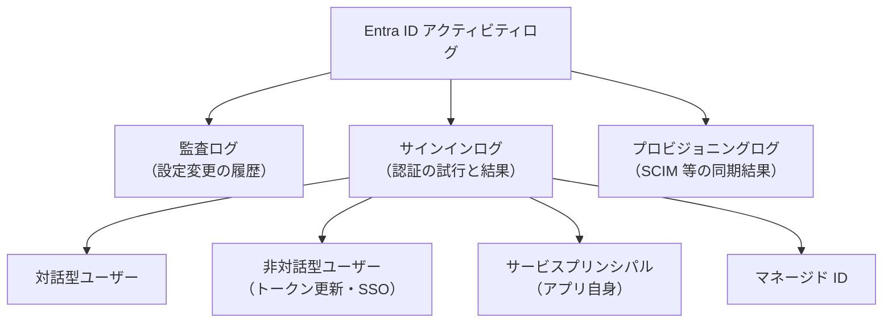
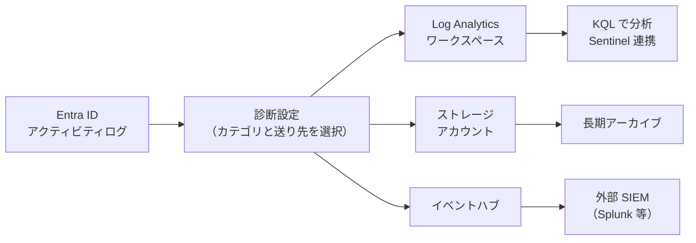

# 【勉強】Microsoft Entra ID — 運用・監査ログ（アクティビティログと診断設定）（2026-09-07）

## 今日のテーマ

Microsoft Entra ID の「運用・監査ログ」を学びます。Entra ID 編としては 概要 → SSO/フェデレーション → ユーザー/グループ管理 → プロビジョニング(SCIM) → 条件付きアクセスとMFA と進んできて、今日はそれらの設定が**実際にどう動いたかを後から確認する手段**、つまりアクティビティログの読み方と、外部に流して長期保存する方法を押さえます。

## 概要

Entra ID は、テナント内で起きたことを「アクティビティログ」として自動記録します。インフラの感覚でいえば、監査ログは「設定変更履歴（誰がいつ何を変えたか）」、サインインログは「認証サーバーのアクセスログ」に相当します。どちらもシステムが生成するもので、管理者でも改変・削除はできません。

ただし Entra ID 自身がログを保持する期間は短く、**Free で 7 日、P1/P2 でも 30 日**です。監査やインシデント調査で数か月前を遡る必要があるなら、「診断設定（Diagnostic settings）」で Azure 側や SIEM に流しておく設計が必須になります。ここが今日いちばん実務に効くポイントです。

## 押さえる要点

### 1. アクティビティログは大きく 3 種類

- **監査ログ（Audit logs）**: ユーザー・グループ・アプリ・ライセンス等への変更の履歴。「誰が管理者グループにこの人を追加したか」「アプリの設定を誰が変えたか」を答える。
- **サインインログ（Sign-in logs）**: 認証の試行と結果。「誰が・どのクライアントアプリで・どのリソースに」アクセスしたかが記録され、条件付きアクセスの評価結果（どのポリシーが適用され、結果がどうだったか）も見える。
- **プロビジョニングログ（Provisioning logs）**: SCIM などプロビジョニングサービスの動作記録。「ServiceNow にグループが作られたか」「Workday からユーザーが取り込まれたか」を追う（SCIM 編で触れたところです）。

### 2. サインインログは 4 つに分かれている

サインインログは 1 種類ではなく、「誰が認証したか」で 4 つのタブに分かれます。ここを知らないと「ユーザーはログインしていないのに、なぜサインインログが大量にあるのか」で混乱します。

- **対話型ユーザーサインイン**: ユーザーがパスワード入力や MFA 応答など、実際に操作したサインイン。
- **非対話型ユーザーサインイン**: ユーザーの代理でクライアントアプリや OS が行ったもの。リフレッシュトークンによるアクセストークン更新や、Entra 参加 PC での SSO などが典型。ユーザーには見えないバックグラウンドの動きで、同じユーザーについて短時間に大量に生成されることが多い。
- **サービスプリンシパルサインイン**: ユーザーが関与しない、アプリ自身による認証（証明書やクライアントシークレットを使うクライアントクレデンシャルフローなど）。
- **マネージドID サインイン**: Azure リソースのマネージド ID による認証。Azure 内部発なので IP アドレスは記録されない。



上の図は、アクティビティログの 3 分類と、サインインログがさらに 4 種類に分かれる構造を表しています。

### 3. 保持期間はライセンスで決まる（短い）

| ログ | Free | P1 | P2 |
|---|---|---|---|
| 監査ログ | 7 日 | 30 日 | 30 日 |
| サインインログ | 7 日 | 30 日 | 30 日 |
| リスクのあるサインイン（ID Protection） | 7 日 | 30 日 | 90 日 |

Free から P1/P2 に上げても、過去の消えたデータは戻りません。また Entra ID のログと Microsoft 365 の統合監査ログ（Purview）は別物で、保持期間も別管理です。

### 4. 見る・取り出す手段は 4 つ

- **管理センター**: Entra ID > Monitoring & health > Audit logs / Sign-in logs / Provisioning logs。最小権限ロールは **Reports Reader**。一回限りの調査ならこれが一番早い。グループやライセンスの画面から監査ログを開くと、そのカテゴリ（例: GroupManagement）にフィルタ済みの状態で表示されます。
- **ダウンロード**: 管理センターから CSV / JSON で。Free でも監査ログ・サインインログの閲覧とダウンロードは可能。
- **Microsoft Graph API**: `GET /v1.0/auditLogs/directoryAudits`、`GET /v1.0/auditLogs/signIns`。必要な権限は `AuditLog.Read.All`（サインインログ取得は P1/P2 が必要）。大量取得には向かず、ページングや性能の問題が出やすいと公式にも書かれています。
- **診断設定でエクスポート**: 長期保存・分析用。次で詳しく。

### 5. 診断設定（Diagnostic settings）で外部に流す

Entra ID の「Diagnostic settings」で、送りたいログのカテゴリと送り先を選びます。設定には **Security Administrator** ロールと Azure サブスクリプションが必要で、Log Analytics での分析は P1/P2 ライセンスが前提です。送り先は 3 つです。

- **Log Analytics ワークスペース**: KQL で検索・集計する。Microsoft Sentinel のデータコネクタもこれで自動的に有効になる。管理センターや Graph API で起きるスロットリング（HTTP 429）を避けたいときにも推奨されている。
- **ストレージアカウント**: 安価に長期アーカイブする。コンプライアンス目的。
- **イベントハブ**: Splunk などの外部 SIEM にストリーミングする。



図は、診断設定を経由してログが 3 つの送り先に振り分けられる流れを示しています。1 つの診断設定で複数の送り先を同時に選べますし、診断設定を複数作ることもできます。

## 手順や設定のイメージ

### 診断設定を作る

1. 管理センターに Security Administrator 以上でサインインする。
2. Entra ID > Monitoring & health > **Diagnostic settings** を開く（Audit logs / Sign-in logs 画面の **Export Settings** からも入れる）。
3. **+ Add diagnostic setting** を選び、名前を付ける（作成後は名前を変更できない）。
4. カテゴリを選ぶ。カテゴリ名は `AuditLogs`、`SignInLogs`（対話型のみ）、`NonInteractiveUserSignInLogs`、`ServicePrincipalSignInLogs`、`ManagedIdentitySignInLogs`、`ProvisioningLogs` など（公式ページには `NonInteractiveUserSIgnInLogs` と大文字の誤植があるが、同じカテゴリを指す）。**`SignInLogs` だけ選ぶと非対話型・サービスプリンシパルは流れない**ので注意。
5. 送り先（Log Analytics / ストレージ / イベントハブ）にチェックを入れ、サブスクリプションと対象リソースを選び、保存する。送り先リソースは事前に作っておく必要がある。

### Log Analytics での KQL 例

Log Analytics に流すと、サインインログは `SigninLogs` テーブルに入ります。失敗理由の集計はこう書けます。

```kusto
SigninLogs
| where ResultType != 0
| summarize Count = count() by ResultDescription, ResultType
| sort by Count desc
```

`ResultType` が `0` なら成功、それ以外はエラーコードです（例: `50126` は資格情報の検証失敗、`50074` は強力な認証が必要、`53003` は条件付きアクセスによるブロック）。

### Graph API の例

```http
GET https://graph.microsoft.com/v1.0/auditLogs/signIns?$filter=conditionalAccessStatus eq 'failure'
```

条件付きアクセスで失敗したサインインだけを抜く例です。日付フィルタを付けないとタイムアウトしやすいので、`createdDateTime ge ...` を組み合わせるのが定石です。

## つまずきやすいところ・注意点

- **30 日しか残らないことを設計時に忘れる。** 「何か起きたら見ればいい」では、気づいた時点で消えていることがある。テナント作成直後に診断設定を組むのが安全側。
- **Log Analytics では 1 回のサインインが複数行になる。** 管理センターは同じ Correlation ID のリクエストをまとめて最終結果だけ見せますが、Log Analytics には途中の MFA 失敗なども個別の行として入ります。`CorrelationId` でグループ化し、最後のレコードを最終結果として扱うのが正しい読み方です。
- **サービスプリンシパルサインインはまとめて表示される。** 同じアプリ・同じ結果・同じ IP・同じリソースのサインインは 1 行に集約され、展開すると個々の時刻が見えます。件数を数えるときは展開後の値を見ること。
- **条件付きアクセスの詳細は権限が別。** サインインログを読めても、`appliedConditionalAccessPolicies` を見るには Security Reader / Conditional Access Administrator 等のロール（アプリなら `Policy.Read.ConditionalAccess` 等）が追加で必要です。
- **Graph API で「premium license がない」エラーが出る。** サインインログ取得は P1/P2 が前提。`AuditLog.Read.All` だけだと間欠的に失敗することがあり、`Directory.Read.All` も併せて付与するのが公式の推奨です。
- **`SignInLogs` カテゴリは対話型のみ。** 非対話型やサービスプリンシパルのログが SIEM に届いていない、という事故の原因になりやすい。

## 今日のまとめ

### ミニ辞書

- **アクティビティログ**: 監査ログ・サインインログ・プロビジョニングログの総称。
- **監査ログ（Audit logs）**: テナント内の設定変更の履歴。
- **サインインログ（Sign-in logs）**: 認証の試行と結果。対話型・非対話型・サービスプリンシパル・マネージド ID の 4 種類。
- **非対話型サインイン**: ユーザー操作なしに、アプリや OS が代理で行う認証（トークン更新など）。
- **診断設定（Diagnostic settings）**: ログを Log Analytics・ストレージ・イベントハブへ送る設定。
- **Log Analytics / KQL**: Azure Monitor のログ基盤と、その検索言語。
- **Reports Reader**: アクティビティログ閲覧の最小権限ロール。
- **Correlation ID**: 1 回のサインインに紐づく複数リクエストを束ねる ID。

### 理解度チェック

1. P1 ライセンスのテナントで、3 か月前の管理者ロール付与を誰が行ったか調べたい。Entra ID の管理センターだけで調べられるか。調べられないなら、事前に何をしておくべきだったか。
2. 「ユーザーは 1 回しかログインしていないのに、サインインログに 20 件ある」と相談された。まず確認すべきタブと、その理由を説明せよ。
3. 診断設定で `SignInLogs` と `AuditLogs` だけを Log Analytics に送っている。アプリのクライアントシークレット認証の失敗を Log Analytics で調べられるか。

## 参考リンク

- [What is Microsoft Entra monitoring and health?](https://learn.microsoft.com/entra/identity/monitoring-health/overview-monitoring-health)
- [What are Microsoft Entra audit logs?](https://learn.microsoft.com/entra/identity/monitoring-health/concept-audit-logs)
- [What are Microsoft Entra sign-in logs?](https://learn.microsoft.com/entra/identity/monitoring-health/concept-sign-ins)
- [What are non-interactive user sign-ins in Microsoft Entra?](https://learn.microsoft.com/entra/identity/monitoring-health/concept-noninteractive-sign-ins)
- [What are service principal sign-ins in Microsoft Entra?](https://learn.microsoft.com/entra/identity/monitoring-health/concept-service-principal-sign-ins)
- [Microsoft Entra data retention](https://learn.microsoft.com/entra/identity/monitoring-health/reference-reports-data-retention)
- [How to access activity logs in Microsoft Entra ID](https://learn.microsoft.com/entra/identity/monitoring-health/howto-access-activity-logs)
- [Configure Microsoft Entra diagnostic settings for activity logs](https://learn.microsoft.com/entra/identity/monitoring-health/howto-configure-diagnostic-settings)
- [What are the identity logs you can stream to an endpoint?](https://learn.microsoft.com/entra/identity/monitoring-health/concept-diagnostic-settings-logs-options)
- [Integrate Microsoft Entra logs with Azure Monitor logs](https://learn.microsoft.com/entra/identity/monitoring-health/howto-integrate-activity-logs-with-azure-monitor-logs)
- [Analyze Microsoft Entra activity logs with Log Analytics](https://learn.microsoft.com/entra/identity/monitoring-health/howto-analyze-activity-logs-log-analytics)
- [How to analyze activity logs with Microsoft Graph](https://learn.microsoft.com/entra/identity/monitoring-health/howto-analyze-activity-logs-with-microsoft-graph)
- [List signIns - Microsoft Graph v1.0](https://learn.microsoft.com/graph/api/signin-list?view=graph-rest-1.0)
- [Queries for the SigninLogs table](https://learn.microsoft.com/azure/azure-monitor/reference/queries/signinlogs)
- [Microsoft Entra security operations for user accounts](https://learn.microsoft.com/entra/architecture/security-operations-user-accounts)
