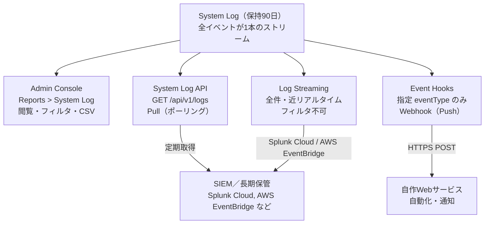

# 【勉強】Okta Workforce Identity Cloud — 運用・監査ログ（System Log と Log Streaming）（2026-09-08）

## 今日のテーマ

Okta Workforce Identity Cloud の運用・監査ログの中核である **System Log** を理解し、「見る（Admin Console）」「取る（System Log API）」「流す（Log Streaming／Event Hooks）」の3つの出口を使い分けられるようになる。昨日の Entra ID 編（アクティビティログと診断設定）と同じテーマの Okta 版です。

## 概要

Okta では、テナント（Org）内で起きた出来事がほぼすべて **System Log** という1本のイベントストリームに記録されます。ユーザーのサインイン、MFA の成功／失敗、管理者による設定変更、SCIM プロビジョニングの結果、API トークンの作成など、ユーザー操作と管理操作が区別なく同じ場所に並ぶのが特徴です。Entra ID が「サインインログ」「監査ログ」「プロビジョニングログ」とログの種類を分けているのに対し、Okta は「1本のログを `eventType` で切り分ける」という設計になっています。

保持期間は **90日** です。それより古いイベントは Admin Console でも API でも返ってきません。監査要件で1年以上の保管が必要なら、外部（SIEM やストレージ）へ出し続ける仕組みを最初から組んでおく必要があります。

## 押さえる要点

- **System Log は1本のストリーム**：Admin Console の **Reports > System Log** で閲覧し、フィルタ・時間範囲・CSV ダウンロードができる。CSV は件数上限がある（上限値はサポート記事に依存するため、要確認）。
- **イベントは階層化された `eventType` を持つ**：`user.session.start`（サインイン）、`user.authentication.auth_via_mfa`（MFA 認証）、`user.lifecycle.create`（ユーザー作成）、`system.api_token.create`（API トークン作成）のように `親.サブ.アクション` の構造。`sw`（starts with）演算子で `user.authentication.` 配下をまとめて取る、といった使い方ができる。
- **イベントオブジェクトの主要フィールド**：`actor`（誰が）、`target`（何に対して。配列）、`client`（IP・地理情報・UserAgent）、`outcome`（`result` が SUCCESS/FAILURE など）、`debugContext`（イベント固有の詳細）、`published`（発生時刻）、`uuid`、`severity`、`transaction`（1リクエストに紐づくイベントを束ねる ID）。
- **フィルタは SCIM 風の式**：`filter=eventType eq "user.session.start" and outcome.result eq "FAILURE"` のように書く。`published` は `filter` では使えず、`since` / `until` パラメータで範囲を絞る。
- **外部連携の出口は3つ**：System Log API（自分で取りに行く・Pull）、Log Streaming（Okta が全件を近リアルタイムで送る・Push・フィルタ不可）、Event Hooks（指定した eventType だけを Webhook で送る・Push・選別可能）。

3つの出口の関係を図にすると次のようになります。



## 手順や設定のイメージ

### 1. Admin Console で調べる

**Reports > System Log** を開き、時間範囲を指定して、検索欄に式を直接書くか **Advanced Filters** で組み立てます。たとえば「直近24時間で MFA に失敗したイベント」なら次のような式になります。

```
eventType eq "user.authentication.auth_via_mfa" and outcome.result eq "FAILURE"
```

### 2. System Log API で取得する

エンドポイントは `GET /api/v1/logs` です。主なクエリパラメータは次の通りです。

| パラメータ | 役割 |
|---|---|
| `since` / `until` | `published` の時間範囲（ISO 8601）。`since` 省略時は `until` の7日前 |
| `filter` | SCIM 風の式フィルタ |
| `q` | キーワード検索（大文字小文字を区別しない） |
| `limit` | 1リクエストの件数。既定100、最大1,000 |
| `sortOrder` | `ASCENDING` / `DESCENDING` |
| `after` | ページング用カーソル。**自分で組み立てず、レスポンスの `Link: <...>; rel="next"` ヘッダをそのまま使う**。`since` とは同時指定不可 |

```bash
curl -s -H "Authorization: SSWS ${OKTA_API_TOKEN}" \
  "https://${OKTA_ORG}.okta.com/api/v1/logs?since=2026-09-07T00:00:00Z&limit=1000&filter=eventType%20eq%20%22user.session.start%22"
```

`until` を空にして `ASCENDING` で取り続けると「ポーリングクエリ」となり、新着イベントを継続的に受け取るストリームとして使えます。`until` を指定した「有界クエリ」はページ数が有限で、最後のページには `next` リンクが付きません。

### 3. Log Streaming を設定する

**Reports > Log Streaming > Add Log Stream** からウィザードで作成します。対象は **AWS EventBridge** と **Splunk Cloud** です。

- AWS EventBridge：ストリーム名、Event Source 名、12桁の AWS アカウント ID、リージョンを入力。AWS 側でパートナーイベントソースを関連付ける
- Splunk Cloud：ストリーム名、Splunk Edition、Splunk Cloud インスタンスのドメイン、HEC（HTTP Event Collector）トークンを入力

Log Streaming は**全イベントを送る**方式で、イベントの絞り込みや過去分の再送（リプレイ）はできません。絞りたい場合は受け側（EventBridge ルールや Splunk 側）で行います。配信はベストエフォート（at least once）で、順序の入れ替わりや重複が起こり得るため、受け側では `uuid` で重複排除する前提で設計します。

## つまずきやすいところ・注意点

- **90日で消える**：Entra ID の既定保持（サインインログ30日など、ライセンス依存）と数字が違うので混同しない。長期保管は Log Streaming か API ポーリングで外部に出す。
- **`after` を自作しない**：ページングのカーソルはシステム生成。`Link` ヘッダの `next` URL をそのまま叩く。
- **`filter` に `published` は書けない**：時間範囲は `since`/`until` で指定する。
- **Log Streaming は選別できない**：「サインイン失敗だけ Slack に通知したい」なら Event Hooks（eventType を選べる）か、SIEM 側でルールを書く。
- **API 操作もログに残る**：API トークン経由の操作も `actor` に紐づいて System Log に記録される。逆に言うと、`system.api_token.create` は侵害後の永続化手口として監視対象にすべきイベント。ただしエンドユーザーの Okta Mobile サインインでも同じ eventType が記録されることがあるので、`actor` が管理者かどうかで偽陽性を除く。
- **`transaction.id` で追う**：1回のリクエストから複数イベントが出るとき、`transaction.id` が同じものを束ねると流れが読める。

## 今日のまとめ

### 重要用語ミニ辞書

- **System Log**：Okta のすべての監査・アクティビティイベントを記録する単一のログ。保持90日
- **eventType**：`user.session.start` のような階層構造のイベント種別文字列
- **actor / target / outcome**：「誰が／何に／結果どうだったか」を表すイベントの3本柱
- **Log Streaming**：System Log を AWS EventBridge / Splunk Cloud へ全件・近リアルタイムで送る機能
- **Event Hooks**：指定した eventType 発生時に外部 URL へ Webhook を送る機能（非同期）
- **有界クエリ／ポーリングクエリ**：`until` を指定して過去範囲を取り切るか、`until` なし＋ASCENDING で新着を追い続けるかの違い

### 理解度チェック

1. 監査要件で「サインイン失敗を2年分保管」と言われた。System Log だけで満たせるか？満たせないなら、どの機能を組み合わせるか。
2. 「MFA 失敗だけを自社の通知サービスに送りたい」。Log Streaming と Event Hooks のどちらが適切か、理由とともに答える。
3. System Log API で `filter=published gt "2026-09-01T00:00:00Z"` と書いたが期待通りに動かない。何が間違いか。

## 参考リンク

- System Log（Okta Help Center）: https://help.okta.com/en-us/content/topics/reports/reports_syslog.htm
- System Log filters and search: https://help.okta.com/en-us/content/topics/reports/syslog-filters.htm
- System Log query（Okta Developer）: https://developer.okta.com/docs/reference/system-log-query/
- System Log API（OpenAPI リファレンス）: https://developer.okta.com/docs/api/openapi/okta-management/management/tags/systemlog
- Event Types: https://developer.okta.com/docs/reference/api/event-types/
- Log streaming: https://help.okta.com/en-us/content/topics/reports/log-streaming/about-log-streams.htm
- Add an AWS EventBridge log stream: https://help.okta.com/en-us/content/topics/reports/log-streaming/add-aws-eb-log-stream.htm
- Add a Splunk Cloud log stream: https://help.okta.com/oie/en-us/content/topics/reports/log-streaming/add-splunk-log-stream.htm
- Event hooks concepts: https://developer.okta.com/docs/concepts/event-hooks/
- Access and Export Okta System Log Events（Okta Support）: https://support.okta.com/help/s/article/Exporting-Okta-Log-Data
