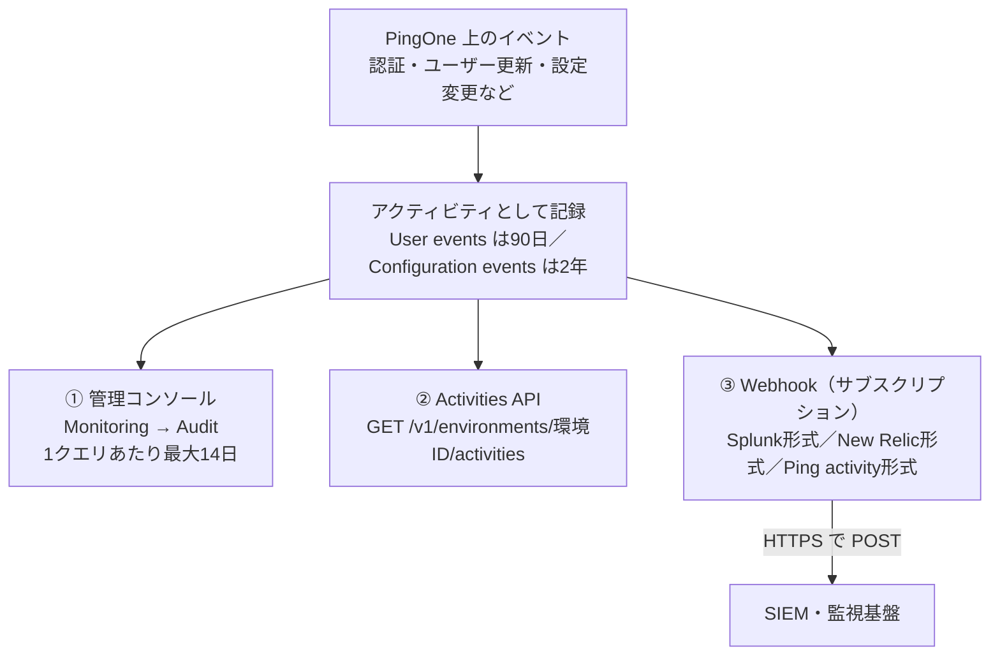
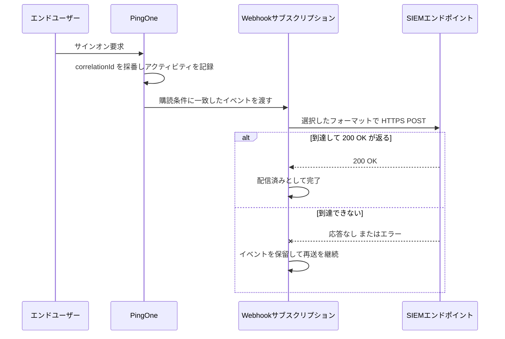

# 【勉強】Ping Identity — 運用・監査ログ（Audit と Webhooks）（2026-09-09）

## 今日のテーマ

PingOne の**監査ログ**を学びます。Entra ID 編（9/7）は監査ログとサインインログを診断設定で Log Analytics や Event Hubs に流す設計、Okta 編（9/8）は System Log API と Log Streaming でした。PingOne も「コンソールで見る／API で引く／SIEM へ流す」という三本柱は同じですが、呼び名が **Audit・Activities・Webhooks** と変わります。今日はこの三つの出口と、保持期間・クエリ範囲という運用上の制約を押さえます。

## 概要 — PingOne では監査イベントを「アクティビティ」と呼ぶ

PingOne では、サインオンやユーザー作成、設定変更といった出来事が 1 件ずつ**アクティビティ（activity）**として記録されます。Okta の System Log イベント、Entra ID の監査ログエントリに相当するものです。

記録されたアクティビティには出口が三つあります。管理コンソールの **Audit** ページ、REST の **Activities API**、そして SIEM へ push する **Webhook** です。どれも同じアクティビティを見ているだけで、別々のログが三種類あるわけではありません。



図は、1 本のアクティビティの流れが三つの出口に分かれる様子です。

## 押さえる要点

### 1. 管理コンソールの Audit レポート

管理コンソールの **Monitoring → Audit** で、**Audit Parameters** に条件を入れて **Run** を押すとレポートが出ます。指定できるのは次の項目です。

- **Time Range** — **Specific**（日付範囲を直接指定）か **Relative**（現在からの相対期間）を選びます。
- **Filter Type** — **Resource ID**、**Correlation ID**、**Event type**、**User ID (Actor)**、**Username (Actor)**、**Client (Actor)**、**Resource population**、**Resource type**、**Population**、**User**、**Application** から選びます。Filter Type を選ばないと **Secondary Filter Type** は使えません。
- **Selected Fields** — 結果一覧に出す列を選びます。**Timestamp**、**Event name**、**Description**、**Client**、**User identity**、**Population**、**Resource type** です。
- **Time Zone** — 結果一覧の表示タイムゾーン。

この一覧は公式ドキュメントの一覧表に基づくものですが、掲載ページのスクリーンショットが古い版のため、UI 上のラベルは実環境で確認してください。

ここで大事なのが **Actor と Resource の区別**です。Actor は「誰が操作したか」、Resource は「何に対して操作したか」を指します。管理者が別のユーザーを無効化した場合、Actor は管理者、Resource はそのユーザーです。フィルタがこの 2 軸に分かれているので、「この管理者が何をしたか」と「このユーザーに何が起きたか」を別々に追えます。インフラのログだと同じ行に混ざっている情報が、PingOne では最初から分離されている、と考えると掴みやすいはずです。

なお、**Selected Fields を 1 つも選ばないと、レポートは空の Details 列だけになります**。公式ドキュメントにも明記されている挙動で、最初に詰まりやすい箇所です。

### 2. 保持期間とクエリ範囲

- **User events は 90 日**保持されます。ユーザーの作成・削除、認証、ユーザーレコードの更新など、エンドユーザーの活動に関わるものです。
- **Configuration events は 2 年**保持されます。システム設定・ポリシー・アプリケーション・統合に対する設定変更です。
- **1 回のクエリで指定できる期間は最大 14 日**です。直近 14 日以内のデータは即時に返り、それより古い期間はリクエスト方式となって取得に時間がかかる、という趣旨の記載が公式にあります。

長期保管が要るなら、90 日以内に外へ吸い出す仕組みが必須になります。Okta の System Log が 90 日、Entra ID のサインインログが Microsoft Entra ID P1／P2 で 30 日・Free で 7 日だったのと同じ発想で、「コンソールは調査用、長期保管は外部」という前提で設計します。

### 3. アクティビティの中身

Audit レポートの **Details** 列にある **View** リンクを開くと、そのアクティビティの JSON が見られます。公式ドキュメントのサンプルをもとに、構造がわかるよう簡略化した例が次の形です。

```json
{
  "id": "9xxxxxxx-...",
  "recordedAt": "2021-04-06T16:27:34.783Z",
  "createdAt": "2021-04-06T16:27:34.803Z",
  "correlationId": "fxxxxxx-...",
  "actors": {
    "client": { "id": "...", "name": "PingOne Admin Console", "type": "CLIENT" },
    "user":   { "id": "...", "name": "user@example.com", "type": "USER" }
  },
  "action": { "type": "USER.ACCESS_ALLOWED", "description": "User Access Allowed" },
  "resources": [ { "type": "USER", "id": "...", "name": "user@example.com" } ],
  "result": { "status": "SUCCESS", "description": "Passed role access control" }
}
```

読むうえで効くのは次の 3 つです。

- **`action.type`** — `USER.ACCESS_ALLOWED` のように「リソース種別.動作」の形。フィルタの Event type はこれを指します。
- **`correlationId`** — PingOne が HTTP リクエストを受け取ったときに採番する ID です。1 回のサインオンでも複数のアクティビティが出るので、これで束ねて追跡します。障害調査ではここが起点になります。
- **`result.status`** — 成功／失敗の判定。理由は `description` に入ります。

API から取る場合のエンドポイントは `https://api.pingone.com/v1/environments/{environmentID}/activities` で、個別のアクティビティは末尾に `/{activityID}` を付けて取得します。ただし `api.pingone.com` は北米リージョンのホスト名です。EU なら `api.pingone.eu`、アジア太平洋なら `api.pingone.asia` のようにリージョンごとに変わるので、自分の環境のホスト名を確認してから叩いてください。

### 4. Webhook（サブスクリプション）で SIEM へ流す

PingOne の Webhook は**サブスクリプション**とも呼ばれ、条件に一致したイベントを PingOne 側から外部へ push します。管理コンソールの **Webhooks** ページで作成します。押さえるべき設定は次のとおりです。

- **フォーマットは 3 種類** — **Splunk 向け形式**、**New Relic 向け形式**、そして **Ping activity 形式**です。Ping activity 形式は汎用 JSON で、Activities API が返すのと同じ形です。送り先が Splunk / New Relic の形式をそのまま受けられないときはこれを使います。
- **監視するイベント種別を選ぶ** — User Created、User Deleted のように、対象イベントを絞ります。
- **Include IP address / Include User Agent** — エンドユーザーの IP アドレスと User Agent を含めるかどうか。**IP は PingOne から見えたクライアントアドレス**なので、間にプロキシがあるとプロキシの IP になります。User Agent はクライアントが提示した文字列がそのまま記録されます。
- **Payload Limit** — 1 ペイロードのサイズ（KB）またはイベント数で制限できます。**指定しない場合の既定は 1 ペイロードあたり最大 500 イベント**です。
- **証明書** — 接続を保護するために証明書を追加できます。対応形式は PKCS7（.p7b）と PEM（.cer、.crt、.pem）、鍵長 2048 ビット以上、SHA-256 以上のエンコーディングが要件です。
- **カスタムヘッダー** — Splunk の HTTP Event Collector に送る場合は、HEC で発行されたトークンをカスタムヘッダーに入れます。

配信は次の流れになります。



図は Webhook 1 件の配信と、失敗時に再送へ回る分岐です。**送り先が落ちている間、PingOne は条件に一致したイベントを溜めて、200 OK が返るまで再送を続けます。**

### 5. オンプレの PingFederate は別の世界

同じ Ping でも、オンプレの PingFederate はクラウドとまったく別の仕組みです。

- **`<pf_install>/pingfederate/log/audit.log`** — SSO、SLO、OAuth、WS-Trust STS、SCIM インバウンドプロビジョニングのトランザクションを記録するセキュリティ監査ログ。
- **`<pf_install>/pingfederate/log/admin.log`** — 管理者が行った操作の記録。管理 API 利用者の操作は `admin-api.log` に別途記録されます。
- 出力項目やフォーマットは **`<pf_install>/pingfederate/server/default/conf/log4j2.xml`** で調整します。CEF 形式、Splunk 向け形式、データベース出力にも対応します。

要するに PingFederate は「サーバーのファイルログを log4j2 で整形して外へ出す」という、インフラ出身なら馴染みのある形です。PingOne の感覚で管理画面を探しても見つからないので、最初に切り分けておくと迷いません。

## つまずきやすいところ・注意点

- **14 日の壁。** 90 日分を 1 クエリで指定することはできません。API で期間を分割してページングしながら回すのが基本です。
- **90 日と 2 年の非対称。** 「監査ログは 2 年残る」と覚えると事故ります。長期に残るのは設定変更側だけで、認証やユーザー操作は 90 日です。
- **Selected Fields を選び忘れると空レポート。** バグに見えますが仕様です。
- **IP アドレスはプロキシのものになり得る。** 送信元 IP で条件を組むときは、経路上に何がいるかを先に確認してください。
- **Webhook の「再送の打ち切り」は製品で違う。** 200 OK が返るまで再送を続けること自体は現行 PingOne の公式ドキュメントに明記されています。一方、**何日で打ち切るか**は、旧製品の **PingOne for Enterprise** については「7 日間再送したのちイベントを破棄し、その間リトライ間隔は最大 15 分まで延びる」と明記がありますが、現行 **PingOne（Cloud Platform）** の上限は今回の調査で公式の記述を確定できませんでした。**要確認**として扱い、送り先の長時間停止を前提にした設計はしないでください。
- **PingOne と PingOne for Enterprise はドキュメントが別。** 検索すると両者が混ざって出てきます。URL に `pingoneforenterprise` が入っていたら旧製品の話です。監査ログに限らずハマる落とし穴です。
- **Audit まわりは変化中。** 公式ドキュメントには early access 機能として「Audit report」のページが別に用意されています（内容は今回未確認）。UI や項目が変わる可能性があるので、手順書を作るときはバージョンを添えておくと安全です。

## 今日のまとめ

**重要用語のミニ辞書**

| 用語 | 意味 |
| --- | --- |
| アクティビティ（activity） | PingOne における監査イベント 1 件。Okta の System Log イベントに相当 |
| Actor | そのイベントを起こした主体。ユーザーまたはクライアント |
| Resource | そのイベントの操作対象。ユーザー、ポリシー、アプリケーションなど |
| Correlation ID | PingOne が HTTP リクエスト受信時に採番する ID。関連イベントを束ねる |
| Webhook（サブスクリプション） | 条件に一致したイベントを PingOne から外部へ push する仕組み |
| Ping activity 形式 | Webhook の汎用 JSON 形式。Activities API の返却形式と同じ |
| User events / Configuration events | 保持期間が異なる 2 系統。それぞれ 90 日 / 2 年 |

**理解度チェック**

1. 過去 60 日分のサインオン履歴を管理コンソールの Audit レポートで確認したい。1 回のクエリで完了しますか。できない場合、その理由は何ですか。
2. ある管理者が「自分は何も触っていない」と言っている。この主張を確かめるには、Filter Type のどれを使いますか。また Actor と Resource のどちらで絞りますか。
3. 送り先の SIEM を 3 時間メンテナンスで停止する。その間に発生したイベントはどうなりますか。また、この判断をするときに製品名のどこを確認すべきですか。

## 参考リンク

- [PingOne Platform logging and reporting | PingOne](https://docs.pingidentity.com/pingone/getting_started_with_pingone/p1_logging_reporting_overview.html)
- [Audit | PingOne](https://docs.pingidentity.com/pingone/monitoring/p1_reporting.html)
- [Running an audit report | PingOne](https://docs.pingidentity.com/pingone/monitoring/p1_running_audit_report.html)
- [Audit parameters | PingOne](https://docs.pingidentity.com/pingone/monitoring/p1_auditparameters.html)
- [Obtaining logging data from PingOne | Use Cases](https://docs.pingidentity.com/solution-guides/customer_use_cases/htg_obtain_logging_data_p1.html)
- [Webhooks | PingOne](https://docs.pingidentity.com/pingone/integrations/p1_webhooks.html)
- [Creating or editing a webhook | PingOne](https://docs.pingidentity.com/pingone/integrations/p1_create_webhook.html)
- [Troubleshooting webhooks | PingOne](https://docs.pingidentity.com/pingone/integrations/p1_troubleshooting_webhooks.html)
- [Monitoring activity with Splunk | PingOne](https://docs.pingidentity.com/pingone/developer_tools/p1_monitor_activity_splunk.html)
- [Adding a certificate | PingOne](https://docs.pingidentity.com/pingone/settings/p1_addcertificate.html)
- [IP address and domain reference | PingOne](https://docs.pingidentity.com/pingone/developer_tools/p1_ip_address_domain_reference.html)
- [Subscriptions | PingOne for Enterprise](https://docs.pingidentity.com/pingoneforenterprise/pingone_for_enterprise/p14e_subscriptions.html)
- [Security audit logging | PingFederate Server](https://docs.pingidentity.com/pingfederate/12.3/administrators_reference_guide/pf_security_audit_logging.html)
- [Administrator audit logging | PingFederate Server](https://docs.pingidentity.com/pingfederate/12.3/administrators_reference_guide/pf_admin_audit_loggin.html)
- [PingFederate log files | PingFederate Server](https://docs.pingidentity.com/pingfederate/12.3/administrators_reference_guide/pf_pf_log_files.html)
- [Log4j 2 logging service and configuration | PingFederate Server](https://docs.pingidentity.com/pingfederate/12.3/administrators_reference_guide/pf_log4j_2_loggin_service_and_config.html)
- [Microsoft Entra ID のデータ保持期間 | Microsoft Learn](https://learn.microsoft.com/ja-jp/entra/identity/monitoring-health/reference-reports-data-retention)
