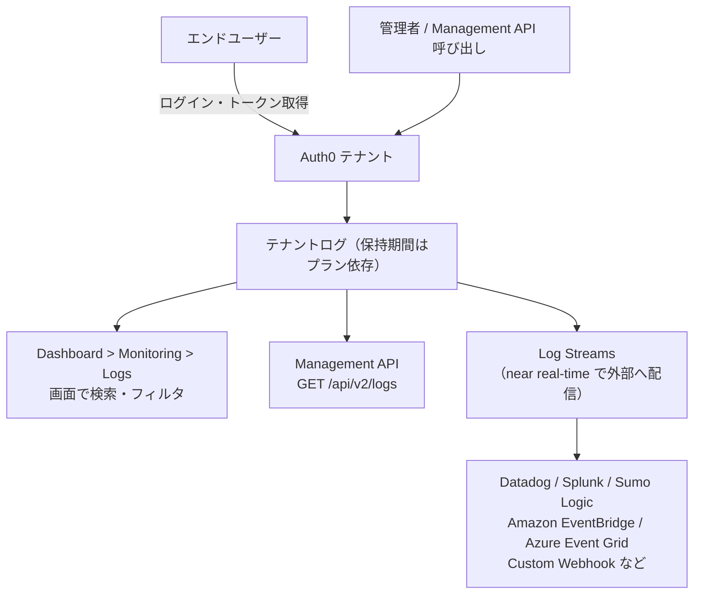
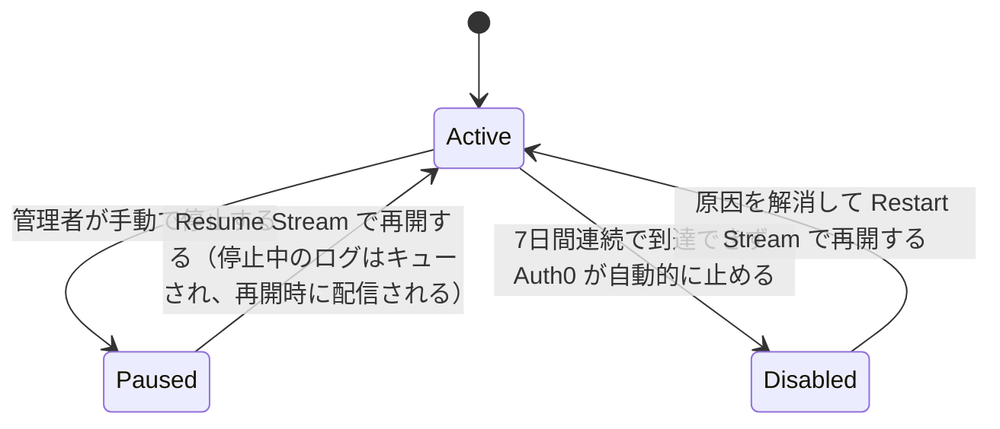

# 【勉強】Okta Customer Identity Cloud (Auth0) — 運用・監査ログ（テナントログと Log Streams）（2026-09-10）

## 今日のテーマ

Auth0 の「テナントログ」に何が記録され、それをどこから見て、どうやって外部の SIEM やログ基盤へ流すのかを押さえます。Entra ID 編（アクティビティログと診断設定）、Okta Workforce 編（System Log と Log Streaming）、Ping 編（Audit と Webhooks）と同じテーマの Auth0 版です。

## 概要

Auth0 のログは「テナントログ（tenant logs）」と呼ばれ、テナント内で起きた出来事がひとまとめに記録されます。認証まわりのイベント（ログイン成功・失敗、サインアップ、トークン交換、ログアウトなど）と、管理系の操作（Management API 経由の設定変更）が同じログストリームに混ざって入る、というのが Auth0 の特徴です。Entra ID のようにサインインログと監査ログが別テーブルに分かれているわけではありません。

用語をひとつ。**テナント**とは Auth0 における顧客ごとの区画で、`your-tenant.us.auth0.com` のようなドメインを持つ単位です。ログはこのテナント単位で溜まります。

ログの取り出し口は3つあります。



上の図が、テナントログの発生から取り出しまでの全体像です。

## 押さえる要点

### 1. 保持期間はプランで決まる。しかも短い

Auth0 のログ保持期間はサブスクリプションによって次のとおりです。

| プラン | 保持期間 |
| --- | --- |
| Starter | 1日 |
| B2C Essentials | 5日 |
| B2C Professional | 10日 |
| B2B Essentials | 5日 |
| B2B Professional | 10日 |
| Enterprise | 30日 |

最長の Enterprise でも30日です。監査要件で年単位の保存を求められることがほとんどなので、**Auth0 のログは「外に出す前提」で設計する**、というのが最初に頭に入れておくべき点です。

### 2. イベントはコードで表される

Auth0 のログは `type` フィールドに短いコードが入ります。代表的なものだけ挙げます。

- `s` … ログイン成功 / `f` … ログイン失敗
- `fp` … パスワード誤り / `fu` … メールアドレスまたはユーザー名が無効
- `ss` … サインアップ成功 / `fs` … サインアップ失敗
- `slo` … ログアウト成功 / `flo` … ログアウト失敗
- `seacft` … 認可コードとアクセストークンの交換に成功 / `feacft` … 同・失敗
- `seccft` … Client Credentials Grant によるアクセストークン取得に成功
- `ssa` … サイレント認証成功 / `fsa` … 同・失敗
- `sapi` … Management API の更新系操作（POST / DELETE / PATCH / PUT）の成功。GET は対象外で、シークレットを返す GET は `mgmt_api_read` という別コードになる
- `sscim` / `fscim` … SCIM 操作の成功・失敗
- `limit_wc` … 同一 IP から単一アカウントへのログイン失敗が既定で10回に達し、IP がブロックされた（ブルートフォース保護の閾値は 1〜100 の範囲で変更可能）
- `limit_mu` … 同一 IP から異なるユーザー名でのログイン失敗が24時間で100回、あるいは同一 IP から1分間に50回のサインアップ試行があり、IP がブロックされた（Suspicious IP Throttling の閾値も変更可能なので、この数字は既定値と理解しておく）
- `gd_enrollment_complete` … MFA の初回登録が完了した

コード体系にはゆるい規則性があります。先頭の `s` が success、`f` が failure です。全コードとスキーマは Tenant Log Catalog にまとまっています。

### 3. Dashboard で見る

`Dashboard > Monitoring > Logs` を開くと直近のログが並びます。検索欄には Lucene のサブセットが使え、`connection:*pass*` のようなクエリを打てます。ドロップダウンから「Failed Login」などのフィルタや日付範囲も指定できます。

### 4. Management API で取り出す

`GET /api/v2/logs` は1リクエストにつき最大100件を返します。取得方法は2種類あり、性格がまったく違います。

**チェックポイント方式**は、`from`（起点となる `log_id`）と `take` を指定して、その ID より新しいログを順に引く方式です。並び順が発生時刻ではなく `log_id` である点が肝で、Auth0 側の処理遅延で後から差し込まれたレコードを取りこぼさないようになっています。ページングに上限がなく、外部システムへのエクスポートにはこちらが推奨されます。2回目以降のリクエストは、レスポンスの `Link` ヘッダーにある `next` の URL をそのまま使います。

```bash
curl -H "Authorization: Bearer ${MGMT_API_TOKEN}" \
  "https://YOUR_TENANT.us.auth0.com/api/v2/logs?from=LOG_ID&take=100"
```

**検索条件方式**は Dashboard が使っている方式で、`q`・`page`・`per_page`・`sort` を指定します。調査用途向きですが、**ページングできるのは1,000件まで**という制限があります。

```bash
curl -G -H "Authorization: Bearer ${MGMT_API_TOKEN}" \
  --data-urlencode 'q=type:f AND date:[2026-09-01 TO *]' \
  --data-urlencode 'sort=date:-1' \
  --data-urlencode 'per_page=100' \
  "https://YOUR_TENANT.us.auth0.com/api/v2/logs"
```

このほか、単一ログを引く `/api/v2/logs/{id}` と、特定ユーザーのログを引く `/api/v2/users/{user_id}/logs` があります。

### 5. Log Streams で外部へ流す

継続的にログを外へ出す仕組みが Log Streams です。Auth0 Marketplace 経由で Datadog、Splunk、Sumo Logic、Amazon EventBridge、Azure Event Grid、Elastic、Segment、Slack などに対応し、対応先がなければ **Custom Webhook** で任意の HTTP エンドポイントへ POST できます。

Custom Webhook を作るときの設定項目は、Payload URL、Authorization Token（任意。リクエストの `Authorization` ヘッダーに入る値）、Content Type、Content Format（JSON lines / arrays / objects）、Filter by Event Category、Starting Cursor です。設定場所は `Dashboard > Monitoring > Streams` から Create Stream。自己署名証明書のエンドポイントはサポートされません。

配信の挙動には決まりがあります。Auth0 は **at least once**（少なくとも1回）の配信を保証します。逆に言えば同じイベントが2回届きうるので、受け側は冪等に作る必要があります。

イベント1件ごとの配信は最大3回試行されます。3回目でも到達できなければ、そのログはエラーとして Health ビューに表示されます。エラーになったログは問題が解消するまで繰り返し再送されますが、**7日間連続でサーバーに到達できないとストリームそのものが自動的に止められ、復旧は手動**になります。

ストリーム側の状態は次のように動きます。



この図は、ログストリーム自体がとる状態です。**自分で止めた Paused と、Auth0 に止められた状態とは別物**である点に注意してください。Paused の間のログはキューされるので再開すれば流れてきますが、自動停止のほうはそうとは限りません。

> ⚠️ 要確認：Auth0 の公式ドキュメントは、この自動停止を Log Streams のページでは "automatically pause the stream"、Check Log Stream Health のページでは **Disabled** ステータスと書いており、用語が揃っていません。ステータス名としては Disabled（復帰は Restart Stream）が正しいと読めますが、実機の Dashboard で表示を確認しておきたいところです。

**フィルタと PII 難読化**も Log Streams の機能です。イベントカテゴリ単位（Login - Success、Management API - Success など）で送る・送らないを選べます。PII については、マスキング（値をアスタリスクに置換）と xxHash（高速な非暗号学的ハッシュ）の2方式で、`email`、`phone`、`username`、`first_name`、`last_name`、`address` などのフィールドを難読化できます。

## つまずきやすいところ・注意点

- **リアルタイムではない。** 公式に「Auth0 はテナントのリアルタイムログを提供しない」と明記されています。到着順のインデックス化に努めてはいるものの遅延はあり得ます。ログを認証フローのクリティカルパスやリアルタイム判断に使うのは非推奨です。
- **時系列に並んでいない。** 既定ではログは発生順に表示されるとは限りません。時系列で扱いたければ、受け側のストリーム処理でソートを実装します。
- **検索は1,000件の壁がある。** 大量に引くならチェックポイント方式へ。
- **検索フィールドは大文字小文字を区別し、トークナイズされない。** `description:rule` は `Create a rule` にマッチしません。`description:*rule` のようにワイルドカードを使うか、`description:"Username invalid"` のように完全一致で書きます。`.raw` 拡張も使えません。
- **ワイルドカードには制約がある。** `?` は使えません。前方一致（`user_name:j*`）は問題ありませんが、後方一致など他の用途ではリテラル部分が3文字以上必要です（`name:*usa` は可、`name:*sa` は不可）。
- **ストリームが止まっていた分は、作り直しで拾える場合がある。** 受信側の障害で取りこぼしたときは、ストリームを削除して Starting Cursor に日時を指定し直せば拾えます。ただし**保持期間内に限る**ので、Starter プランなら1日以内に気づく必要があります。なお、自分で Paused にしていただけならログはキューされているので、Resume するだけで配信されます。削除・再作成が唯一の手段ではありません。
- **クエリが長すぎると 414 Request-URI Too Large が返る。** 条件を絞ります。

## 今日のまとめ

**ミニ辞書**

- **テナントログ** … Auth0 テナントで発生した認証イベントと管理操作の記録。認証系と管理系が同じログに入る。
- **ログタイプコード** … `s`、`f`、`seacft` のようにイベント種別を表す短い文字列。`type` フィールドに入る。
- **チェックポイント方式** … `log_id` を起点に新しいログを順に引く取得方法。ページング無制限で、外部エクスポート向け。
- **Log Streams** … テナントログを外部サービスへ near real-time で配信する仕組み。
- **at least once** … 少なくとも1回は届けるという配信保証。重複は起こりうる。
- **Starting Cursor** … ストリームの配信開始位置を過去の日時に指定する設定。

**理解度チェック**

1. Enterprise プランの保持期間は何日か。監査で1年分の保存を求められた場合、どういう設計になるか。
2. 大量のログを外部の SIEM に継続的にエクスポートしたい。Management API のどちらの方式を使うべきで、それはなぜか。
3. Custom Webhook の受け側を実装するとき、Auth0 の配信保証を踏まえてどんな作りにしておくべきか。

## 参考リンク

- [Logs — Auth0 Docs](https://auth0.com/docs/deploy-monitor/logs)
- [Log Data Retention — Auth0 Docs](https://auth0.com/docs/deploy-monitor/logs/log-data-retention)
- [View Logs — Auth0 Docs](https://auth0.com/docs/deploy-monitor/logs/view-log-events)
- [Retrieve Logs Using the Management API — Auth0 Docs](https://auth0.com/docs/deploy-monitor/logs/retrieve-log-events-using-mgmt-api)
- [Log Search Query Syntax — Auth0 Docs](https://auth0.com/docs/deploy-monitor/logs/log-search-query-syntax)
- [Log Streams — Auth0 Docs](https://auth0.com/docs/customize/log-streams)
- [Log Stream Filters — Auth0 Docs](https://auth0.com/docs/customize/log-streams/event-filters)
- [Create Custom Log Streams Using Webhooks — Auth0 Docs](https://auth0.com/docs/customize/log-streams/custom-log-streams)
- [Check Log Stream Health — Auth0 Docs](https://auth0.com/docs/customize/log-streams/check-log-stream-health)
- [Tenant Log Catalog — Auth0 Docs](https://auth0.com/docs/tenant-logs)
