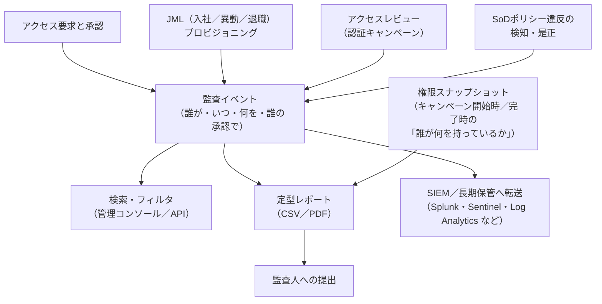
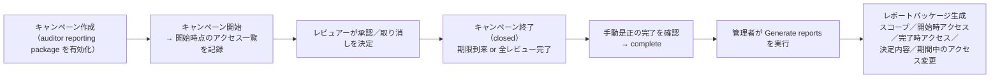

# 【勉強】IGA（アイデンティティガバナンス＆管理）— 監査証跡と監査対応レポート（Audit Trail・保持期間）（2026-09-11）

## 今日のテーマ

「誰が・いつ・誰の承認で・どの権限を得て・いつ失ったか」を、あとから証明できる形で残す仕組み。IGAの**監査証跡（Audit Trail）と監査対応レポート**を学びます。今週のEntra ID・Okta・Ping・Auth0で見てきた「運用・監査ログ」のIGA編です。

## 概要

IdP（Entra ID や Okta）の監査ログは「誰がいつサインインしたか」「誰が設定を変えたか」といった**システム上の出来事**を記録します。IGAの監査証跡はそれと重なりつつ、問い方が違います。監査人（内部監査、外部の会計監査人）が聞くのは次のような質問です。

- この人が財務システムの管理者権限を持っているのは、誰が承認したのか。
- 退職者のアカウントは、退職日から何日で無効化されたのか。
- 四半期ごとのアクセスレビューは実施され、否認された権限は本当に剥奪されたのか。
- 職務分掌（SoD）ルールに違反した状態は、いつ検知され、どう是正されたのか。

つまりIGAの監査証跡は、これまで5回にわたって学んだ**アクセスレビュー・JML・アクセス要求・SoD**の各プロセスが「ルールどおりに回っていた」ことを、**イベントの記録**と**その時点の権限スナップショット**の両方で示すものです。ログサーバーのsyslogを保存しておくだけでは答えられない質問に答えるための機能、と考えると位置づけが掴めます。

上の図は、IGAの各プロセスが監査イベントを生み、それが検索・定型レポート・外部転送の3つの出口から使われる構造を表しています。右下の「権限スナップショット」は監査対応で特に重要なので、後で詳しく触れます。

## 押さえる要点

**1. 監査イベントには「行為者・対象・行為・結果・承認者」が揃っている必要がある**
IGAのイベントは、IdPの監査ログより「文脈」が多く記録されます。たとえば Entra ID のエンタイトルメント管理では、要求から付与までの各ステップが `EntitlementManagement` カテゴリの監査レコードとして個別に残ります。要求（`User requests access package assignment`）→ 承認（`Approve access package assignment request`）→ 付与（`Fulfill access package assignment`）という一連の流れが、別々のレコードとしてつながる形です。SailPoint Identity Security Cloud（ISC）も同様に、ほぼすべての操作を監査イベントとして記録し、`ACCESS_REQUEST`・`CERTIFICATION`・`PROVISIONING`・`SOD_POLICY` などの type で分類しています。

**2. 「イベントの記録」と「その時点の権限一覧」は別物**
監査人が最終的に見たいのは「レビュー完了時点で、このシステムに誰がアクセスできたか」という**状態**です。イベントログから状態を復元するのは手間がかかるため、IGA製品はスナップショットを取る機能を持ちます。Okta Identity Governance の**監査人向けレポートパッケージ（Auditor reporting package）**はこの典型で、キャンペーン終了後に「キャンペーン開始時点のリソースアクセス」「完了時点のリソースアクセス」「その間のアクセス変更」「レビュアーの決定内容」を一式で生成します。

**3. 定型レポートは「監査人の質問」に対応している**
各製品が用意する定型レポートは、監査でよく聞かれる質問にそのまま対応しています。

| 監査人の質問 | Entra ID Governance | Okta Identity Governance | SailPoint ISC |
|---|---|---|---|
| レビューは実施され、結果は適用されたか | アクセスレビュー履歴レポート（Review History、CSV） | Past Campaign Details / Summary レポート | 認証キャンペーンのレポート（Campaign Status／Certification Sign Off など） |
| 誰が申請し、誰が承認したか | 監査ログ（EntitlementManagement カテゴリ） | Past Access Requests レポート | Search の Access Request Activity レポート |
| SoD違反はあるか | 職務の分離設定（互換性のないアクセスパッケージ）と Additional access の一覧 | Separation of duties レポート | Violation Reports |
| 今、誰が何を持っているか | アクセスパッケージの割り当て一覧（Download） | User entitlements レポート | Search（identities）の結果ダウンロード |

**4. 保持期間は製品ごとに大きく違う**
ここがインフラ出身者にとって一番の落とし穴です。Entra ID の監査ログは既定で**30日**（P1／P2。Free は7日）しか保持されません。長期保存には Azure Monitor（Log Analytics）やストレージアカウントへの転送が必要で、Microsoft の公式ドキュメントもその手順を前提に書かれています。SailPoint ISC は監査データを**1年＋当月**保持し、最長5年まではサポートへの申請で取り出せます。Okta Identity Governance の Past Campaign Details レポートのデータは**3年**保持されます。監査対応では「監査期間（多くは1年）を通じて証跡が残っているか」が問われるため、30日で消える製品はそのままでは要件を満たしません。

**5. 監査証跡自体の完全性**
証跡が改ざん・削除できないことも監査の観点です。SIEMや別アカウントのストレージへ転送しておくことは、長期保持だけでなく「IGA管理者自身が証跡を消せない」状態を作る意味でも有効です。

## 手順や設定のイメージ

Entra ID Governance で「アクセスレビューの履歴レポート」を作る場合の流れです。

1. Microsoft Entra 管理センターに Identity Governance 管理者以上でサインインする。
2. **ID ガバナンス > アクセス レビュー > レビュー履歴（Review History）** を開く。
3. **新しいレポート** を選び、レビューの開始日・終了日、含めるレビュー種別（グループ、アプリ、Entra ロール、Azure ロール、アクセスパッケージ）と結果（承認・拒否・未レビュー）を指定して作成する。
4. 生成されたレポートは **30日間** CSV でダウンロードできる。列には、レビュー対象者、レビュアー、決定、理由（Justification）、結果を適用した人と日時（AppliedByName／AppliedByUPN／AppliedDate）、システムの推奨（AccessRecommendation）などが含まれる。

Okta Identity Governance で監査人向けレポートパッケージを使う場合は、リソースキャンペーンの作成時に **Create auditor reporting package** を有効にしておきます。キャンペーンが終了し、手動の是正がすべて完了して「complete」になったあと、管理者が **Identity Governance > Access Certifications > Reporting** で **Generate reports** を実行すると、Okta が一式を生成します。あとから有効化しても遡っては作れないため、監査対象のキャンペーンでは最初から有効にしておく運用が必要です。なお「期間中のアクセス変更」レポートは90日分のウィンドウに限られ、キャンペーンが90日を超える場合は最後の90日が対象になります。

この図は、Okta の監査人向けレポートパッケージが「開始時」と「完了時」の2回スナップショットを取り、管理者の操作を経て差分と決定内容をセットで出力するまでの時系列を表しています。

## つまずきやすいところ・注意点

- **「監査ログがある」と「監査に使える」は別。** 30日で消えるログは、年次監査の証跡にはなりません。IGA導入時に、SIEMや Log Analytics への転送と保持期間の設計を最初から含める必要があります。
- **レポートは「その時点」のデータ。** Okta の Past Campaign Details は「ソースデータが日中に定期的に更新される」ため、直前の変更が反映されていないことがあります。Entra の履歴レポートも「作成した時点の決定」を抜き出したものです。
- **手動是正が終わらないとレポートが作れない。** Okta の監査人向けレポートパッケージは、キャンペーンが「complete」になってから Generate reports で生成します。取り消し決定の反映先が手動プロビジョニングのアプリだと、担当者が是正完了を確認するまで待ちになります。
- **スコープによって出ないレポートがある。** Okta では、キャンペーンにサービスアカウントやリソースコレクションを含めると、リソースアクセス系の3レポートは生成されません。
- **役割（ロール）の要件を確認する。** Okta の IGA レポートは super admin・org admin・read-only admin・mobile admin・reports admin で参照できます。Entra の履歴レポートは、アクセスレビューを閲覧できるロールであれば作成できますが、最小権限の設計では Security Reader や Global Reader のような読み取り系ロールの利用も選択肢です。
- **SoD違反レポートは「検知型」の証跡。** 違反が「いつ検知され、いつ是正されたか」を示すのが目的で、違反が0件であることを保証するものではありません（前回のSoD記事の予防型／検知型の区別を思い出してください）。

## 今日のまとめ

### ミニ辞書

- **監査証跡（Audit Trail）**: 権限の付与・変更・剥奪と、その承認・判断を時系列で追える記録。イベントの記録と、ある時点の権限一覧（スナップショット）の両方を含む。
- **監査人向けレポートパッケージ（Auditor reporting package）**: Okta Identity Governance で、認証キャンペーン終了後に開始時／完了時のアクセス一覧・決定内容・期間中の変更を一式で出力する機能。
- **レビュー履歴レポート（Review History）**: Entra ID Governance で、指定期間・種別のアクセスレビューの決定内容をCSVで出力する機能。作成後30日間ダウンロード可能。
- **保持期間（Retention）**: 監査データがシステム内に残る期間。Entra ID 監査ログは既定30日（Free は7日）、SailPoint ISC は1年＋当月、Okta の過去キャンペーンレポートは3年。
- **SIEM転送**: 長期保持と、証跡を運用者自身が改変できない状態を作るために、監査ログを外部の集約基盤へ送ること。

### 理解度チェック

1. 「イベントの記録」だけでは監査人の質問に答えにくいのはなぜか。IGA製品はそれをどう補っているか。
2. Entra ID の監査ログを年次監査の証跡として使うために、追加で必要な設計は何か。
3. Okta の監査人向けレポートパッケージを使うとき、キャンペーン作成時に必ずしておくべき設定と、レポートが生成されるタイミングの条件を説明せよ。

## 参考リンク

- SailPoint: Audit Reports and Monitoring — https://documentation.sailpoint.com/saas/help/common/audit-reports.html
- SailPoint: Downloading Reports from the Search Interface — https://documentation.sailpoint.com/saas/help/search/downloading_search_results.html
- Okta: Identity Governance Reports — https://help.okta.com/en-us/content/topics/identity-governance/iga-reports.htm
- Okta: Auditor reporting package — https://help.okta.com/en-us/content/topics/identity-governance/auditor-reporting/auditor-report-pkg.htm
- Okta: Generate the auditor reporting package — https://help.okta.com/en-us/content/topics/identity-governance/auditor-reporting/generate-auditor-report-pkg.htm
- Okta: Past Campaign Details report — https://help.okta.com/en-us/content/topics/identity-governance/campaign-details.htm
- Microsoft Learn: How long does Microsoft Entra ID store reporting data? — https://learn.microsoft.com/entra/identity/monitoring-health/reference-reports-data-retention
- Microsoft Learn: Configure separation of duties checks for an access package — https://learn.microsoft.com/entra/id-governance/entitlement-management-access-package-incompatible
- Microsoft Learn: Create and manage downloadable access review history report — https://learn.microsoft.com/entra/id-governance/access-reviews-downloadable-review-history
- Microsoft Learn: View reports and logs in entitlement management — https://learn.microsoft.com/entra/id-governance/entitlement-management-reports
- Microsoft Learn: Archive logs and reporting on entitlement management in Azure Monitor — https://learn.microsoft.com/entra/id-governance/entitlement-management-logs-and-reporting
- Microsoft Learn: Microsoft Entra audit log categories and activities — https://learn.microsoft.com/entra/identity/monitoring-health/reference-audit-activities
