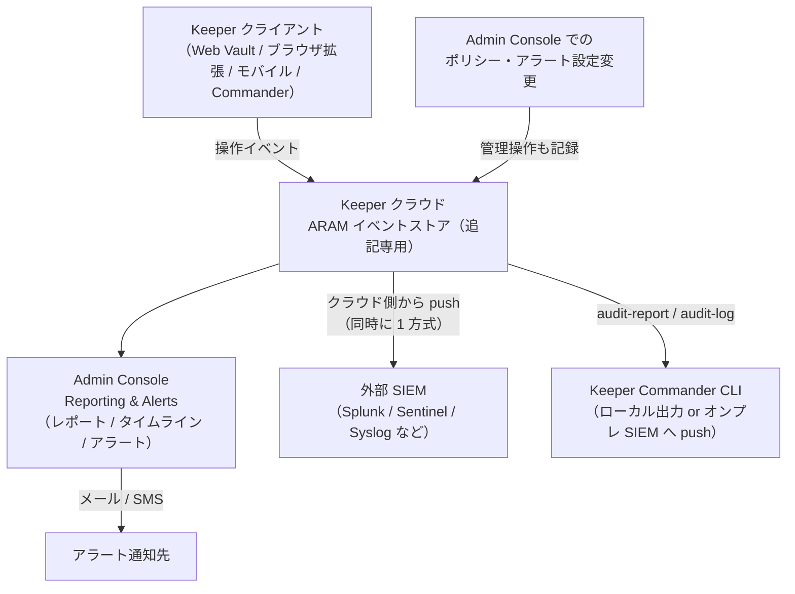
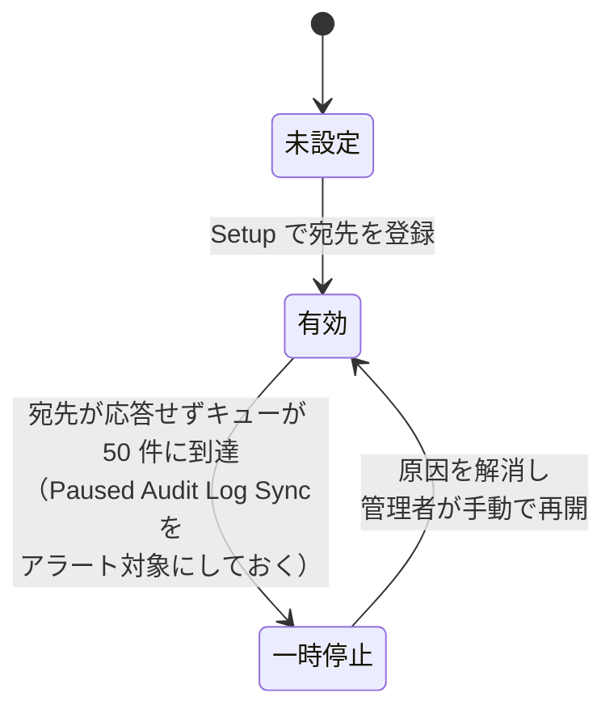

# 【勉強】Keeper — 運用・監査ログ（ARAM と SIEM 連携）（2026-09-14）

## 今日のテーマ

Keeper の運用・監査ログ、すなわち **ARAM（Advanced Reporting & Alerts Module）** を中心に、「誰が・いつ・何をしたか」をどう記録し、どう外部（SIEM）へ流し、どうアラートを組むかを学びます。Entra ID 編（アクティビティログと診断設定）、Okta 編（System Log と Log Streaming）、Ping 編（Audit と Webhooks）、Auth0 編（テナントログと Log Streams）と同じ「運用・監査ログ」テーマの Keeper 版です。

## 概要

Keeper はパスワード／シークレット管理の製品なので、監査ログの主役は「認証イベント」だけではありません。**レコード（保存された認証情報）の閲覧・更新・共有**、**管理者によるポリシー変更**といった、金庫の中身に対する操作が記録の中心になります。

Keeper のイベントログ機能は、契約プランによって 2 段階に分かれます。

- **標準（Business／Enterprise に含まれる）**: Admin Console の「Reporting & Alerts」に、組み込みレポートとして **Recent Activity**（直近 1,000 件）と **All Security Events** が表示される。Recent Activity に含まれるイベント種別は、公式ドキュメントの Event Types 節では 16 種類とされている（同じページの別の節には「200+ 種別」とも書かれており、公式内で記述が揺れている点は要確認）。
- **ARAM（有償アドオン）**: 200 種類以上のイベント種別を対象に、**カスタムレポートの保存**、**アラート**（メール／SMS）、**外部 SIEM への自動ストリーミング**が使える。Commander CLI の `audit-report` などの高度なレポートコマンドも ARAM が前提。

公式ドキュメントは ARAM を「追記専用（append-only）で改変不可能な監査システム」と説明しています。どの権限レベルの管理者であっても、イベントを修正・抑止・削除する API・コンソール機能・CLI は存在しないとされ、しかも**管理者がポリシーやアラート設定を変更した行為そのものが、実行者を紐づけた監査イベントとして記録**されます。「監視対象を変えようとしたこと自体が記録される」という設計です。

さらに、独立したコピーが必要な顧客向けに、イベントをほぼリアルタイムで外部 SIEM に流す仕組みがあります。顧客管理の SIEM に届いた時点で、そのデータは Keeper の管理者権限の外に出るため、フォレンジックやコンプライアンス用の「2 つ目の改変不能な記録」になります。

下の図は、ARAM を中心としたイベントの流れと、3 つの出口（Admin Console・SIEM ストリーミング・Commander CLI）の関係を表しています。



## 押さえる要点

### 1. レポート（Reporting & Alerts ダッシュボード）

- ダッシュボードには「トップ 5 イベント」、組み込みレポート 2 本、保存したカスタムレポートが並ぶ。
- **Add Custom Report** でフィルタを組み、**Apply** でプレビュー、**Save** で保存。結果は **JSON / CSV / Syslog** 形式でエクスポートできる。
- **Timeline Chart** は 24 時間・7 日・30 日のイベント推移をグラフ表示し、行をクリックするとその期間のイベント一覧が開く。
- 注意点として、**端末側で発生したイベントがレポートに反映されるまで最大 15 分**かかる。「今操作したのに出ない」と焦らないこと。
- IP アドレスからの **Geolocation（地理位置）** は付与されるが、モバイル回線・プロキシ・VPN 経由では不正確になると公式が明記している。位置情報を根拠に断定的な判断をしないこと。

### 2. アラート

- **Add Alert** で名前とフィルタ条件を指定し、通知先としてメールアドレス／電話番号（SMS）を 1 つ以上登録する。通知先は**社外のアドレスでもよい**。
- 「イベントを起こした本人」が最初の通知先として用意されているが、既定は**オフ**。本人通知（メールのみ）が必要なら明示的にオンにする。
- アラートは既定で**スロットリング（抑制）**される。`Every Occurrence` でも、同時刻に発生した同種イベントは 1 通にまとめられる（例: レコードを一括削除しても通知は 1 通）。`Once Per Time Period`（例: 1 時間に 1 通）や、一時停止（Pause）による蓄積も選べる。
- この重複排除の副作用として「届かないイベントがある」ことを公式が認めており、**アラートは検知の入口、正確な記録は ARAM レポートか SIEM 側で取る**という役割分担が前提になっている。
- 送信履歴は **Alerts Sent** タブで確認できる。

公式の「Recommended Alerts」では、少なくとも次のカテゴリを推奨しています。

| カテゴリ | 代表イベント | なぜ重要か |
|---|---|---|
| 管理ポリシー変更 | Node／Role／Team の作成・削除、Changed Role Policy、Set 2FA Configuration、Created／Deleted／Paused Alert、License reached maximum | 検知そのものを止められる操作を含む。「Policy Change」カテゴリを全部選ぶことを推奨 |
| ユーザー管理・セキュリティ | Invited／Created／Deleted／Locked User、Disabled 2FA By Admin、Device Approved、Transferred vault、Granted Admin Permission | Deleted User は金庫の中身も消える。Granted Admin Permission は権限昇格の監視 |
| BreachWatch | 高リスクパスワード検出／無視／解消 | **既定ではロールポリシーで ARAM への送信がオフ**。Role > Enforcement Policies > Vault Features で有効化が先 |
| 管理コンソールログイン | Console Login | 管理者数が少なければ全件通知も現実的 |

Keeper のイベントは**毎月追加される**ため、イベント種別一覧を定期的に見直すことも推奨されています。

### 3. 外部 SIEM ログ（クラウド側 push）

- Admin Console の **External Logging** から **Setup** を押し、宛先に応じた数個の属性を入れるだけで有効化できる。
- 対応先（公式一覧）: AWS S3、Microsoft Sentinel（Azure Marketplace 経由／Azure Monitor 経由）、CrowdStrike Falcon Next-Gen SIEM、Datadog、Devo、Elastic、Exabeam、Google Security Operations（Chronicle）、Logz.io、IBM QRadar、ServiceNow ITSM、Splunk、Sumo Logic、Syslog。
- **同時に有効化できる外部同期の方式は 1 つだけ**（公式: "Only one method of the external sync can be active at a time"）。複数の SIEM に流したい場合の回避策として、SIEM 側での転送や Commander の `audit-log` の併用が考えられる（これは筆者の設計案で、公式に書かれた手順ではない）。
- イベントは **Keeper のサーバーから宛先のコレクターへ送信**される。そのため、自社ネットワーク内のコレクターで受けるなら、公式の「Firewall Configuration」に載っているリージョン別の送信元 IP（US／EU／AU／US GovCloud／CA／**JP・Tokyo** など）を許可する必要がある。
- Syslog 宛先は **TCP 514 または 6514（TLS）**。TLS では、**証明書の Subject 名がサーバーのドメイン名と一致し、CA からのフルチェーンを含む有効な署名済み証明書**が必須で、自己署名証明書は拒否される。
- 宛先が応答しなくなり**キューが 50 件に達すると、外部ログは自動で一時停止されることがある**。その場合、原因を直した後に**手動で再開**しなければならない。公式は、停止に気づけるよう「**Paused Audit Log Sync**」イベントにアラートを設定することを推奨している。

外部ログの状態遷移を図にすると次のようになります。停止したまま気づかないと、SIEM 側の記録に穴が空きます。



### 4. Commander CLI によるレポート

Admin Console でできないことは **Keeper Commander CLI** で補います。主なコマンド（`help <command>` で詳細が見られます）:

- `audit-report`（要 ARAM）: アドホックな監査レポート。`--report-type` で `raw`（生イベント）／`hour`／`day`／`week`／`month`（集計）／`span`（発生回数の表）／`dim`（ある列の取り得る値一覧）を切り替える。`--created`（`today`、`last_30_days`、`"between ... and ..."` など）、`--event-type`、`--username`、`--record-uid`、`--ip-address`、`--geo-location`、`--device-type` でフィルタし、`--format` で `table`／`csv`／`json` を選ぶ。
- `audit-log`: ARAM のイベントをローカルに取り込み、`--target` で `splunk`／`sumo`／`syslog`／`syslog-port`／`azure-la`／`json` に出力する。**Keeper クラウドから宛先へ直接届かない（オンプレ・閉域）場合の代替経路**。エクスポートの進捗状態（どこまで送ったか）を Keeper のレコードに保存するので、繰り返し実行すると前回の続きから取得する。初回は全履歴を走査するため時間がかかる。`--anonymize` でユーザー名・メールを enterprise user id に置き換えられる。
- `user-report`: ユーザーの最終ログイン等の状況レポート。
- `action-report`（要 ARAM）: 「N 日ログインしていない」「招待のまま」「ロック中」などのユーザーを抽出し、`--apply-action` で lock／delete／transfer／move を適用できる（`-n` でドライラン）。
- `compliance-report`（要 Compliance Reports アドオン）: レコードへのアクセス権限のレポート。`aging-report`（要 ARAM ＋ Compliance Reports）: パスワードが一定期間更新されていないレコードのレポート。

なお、公式リファレンスの正式なオプション名は `--columns`（複数形）ですが、公式の例では `--column` と単数形で書かれています（前方一致で動作します）。また、以下の例は OS のシェルから `keeper <コマンド>` として呼ぶか、Commander の対話シェルに 1 行で貼り付ける想定です。

```bash
# 直近 5,000 件の生イベントを表示
audit-report --report-type raw --limit 5000

# 利用可能なイベント種別の一覧
audit-report --report-type dim --column audit_event_type

# 今日のイベント種別ごとの件数を 1 時間単位で集計
audit-report --report-type hour --aggregate occurrences --column audit_event_type --created today

# 特定ユーザーが過去 30 日に作成・更新したレコード UID
audit-report --report-type=span --event-type=record_add --event-type=record_update --username=user@mydomain.com --column=record_uid --created=last_30_days

# 全イベントを JSON でローカルに出力（状態保存用レコードを指定）
audit-log --record BhRRhjeL4armInSMqv2_zQ --target=json
```

### 5. Compliance Reports（隣接アドオン）

ARAM は「何が起きたか（イベント）」の記録ですが、**Compliance Reports** は「今、誰がどのレコードにどんな権限を持っているか」の**現在状態のスナップショット**を出すアドオンです。SOX などの定期的なアクセス権監査向けで、レコードの **Title・Type・URL** だけを Enterprise 公開鍵で暗号化して保持し、「Run Compliance Reports」権限を持つ管理者のコンソール上で Enterprise 秘密鍵により復号します（ゼロ知識を維持）。1 レポートあたりユーザー 5,000 人・レコード 1,000 件が上限で、超える場合はノード単位などに分割します。

## 手順や設定のイメージ

1. **プランの確認**: Admin Console の Secure Add-Ons（または担当営業）で ARAM が有効か確認する。無ければ組み込みの Recent Activity（直近 1,000 件）と All Security Events の 2 本しか使えない。
2. **BreachWatch イベントの流入を有効化**: Role > Enforcement Policies > Vault Features で「Send BreachWatch events to Reporting & Alerts …」をオン。
3. **推奨アラートの作成**: Reporting & Alerts > Alerts > Add Alert。まず「Policy Change」カテゴリ全件、次に Deleted User／Granted Admin Permission／Disabled 2FA By Admin、そして「Paused Audit Log Sync」。頻度は `Once Per Time Period` から始めてノイズを見る。
4. **SIEM 連携**: Reporting & Alerts > External Logging > Setup で宛先を選び、必要属性を入力。自社受信の場合はリージョンの送信元 IP を許可。Syslog/TLS なら正規証明書を用意。
5. **Commander で検証**: `audit-report --report-type dim --column audit_event_type` で種別を確認し、SIEM 側の受信件数と `audit-report --report-type day --aggregate occurrences` の集計を突き合わせる。

## つまずきやすいところ・注意点

- **ARAM 無しで見えるのは組み込みレポート 2 本だけ。** Recent Activity の 1,000 件は組み込みレポートの表示上限であり、カスタムレポート・アラート・SIEM 連携は ARAM が必要。Keeper 側のイベント保持期間は今回参照した公式ページに記載がなく、要確認。
- **アラートを記録代わりに使う。** 重複排除で届かないイベントがあると公式が明記している。記録は ARAM レポートか SIEM 側で取る。
- **外部ログの一時停止に気づかない。** キュー 50 件で自動停止されることがあり、再開は手動。「Paused Audit Log Sync」アラートは最初に組む。
- **同時に有効化できる外部同期方式は 1 つ。** 複数宛先が要件なら、回避策（SIEM 側転送や `audit-log` 併用）を設計段階で検討する。
- **Syslog/TLS で自己署名証明書を使う。** Keeper 側が接続を拒否する。
- **15 分の反映遅延**を障害と誤認する。
- **`enterprise_id` を無視して複数テナントを 1 つのコレクターに入れる。** テナント判別用に `enterprise_id` を使うことが公式に示されている。

## 今日のまとめ

### ミニ辞書

| 用語 | 意味 |
|---|---|
| ARAM | Advanced Reporting & Alerts Module。200 種以上のイベントを対象に、カスタムレポート・アラート・SIEM ストリーミングを提供する有償アドオン |
| Recent Activity | 全 Business／Enterprise プランに含まれる組み込みレポート（もう 1 本は All Security Events）。直近 1,000 件 |
| External Logging | Keeper クラウドから外部 SIEM へイベントを push する機能。同時に有効化できる方式は 1 つ |
| Paused Audit Log Sync | 外部ログの一時停止を検知するために、公式がアラート設定を推奨しているイベント |
| audit-report / audit-log | Commander CLI のコマンド。前者はアドホック集計、後者はローカル取り込みと SIEM push |
| Compliance Reports | レコードへのアクセス権限の「現在状態」を出す別アドオン。ゼロ知識を保ったまま Title・Type・URL を復号して表示 |
| enterprise_id | イベント JSON に含まれるテナント識別子。1 つの SIEM で複数 Keeper テナントを区別する |

### 理解度チェック

1. ARAM 契約なしの Keeper Enterprise で、Admin Console から確認できるイベントレポートの範囲はどこまでか。ARAM を付けると何が増えるか。
2. 「アラートを設定してあるので、全件記録は SIEM に流さなくてよい」という判断はなぜ危険か。公式ドキュメントの記述を根拠に説明せよ。
3. 自社データセンター内の Syslog サーバーで Keeper のイベントを受けたい。ネットワーク・証明書・運用（停止検知）の 3 点で、事前に何を用意すべきか。

## 参考リンク

- Advanced Reporting, Alerts & SIEM（Enterprise Guide）: https://docs.keeper.io/enterprise-guide/event-reporting
- Recommended Alerts: https://docs.keeper.io/enterprise-guide/recommended-alerts
- Syslog（SIEM push 設定）: https://docs.keeper.io/enterprise-guide/event-reporting/syslog
- Firewall Configuration（送信元 IP と自動一時停止）: https://docs.keeper.io/enterprise-guide/event-reporting/firewall
- Compliance Reports: https://docs.keeper.io/enterprise-guide/compliance-reports
- Commander CLI — Reporting Commands: https://docs.keeper.io/keeperpam/commander-cli/command-reference/reporting-commands
