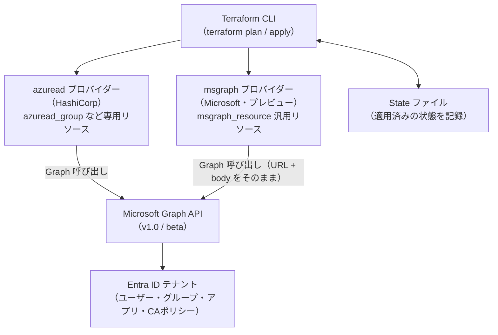
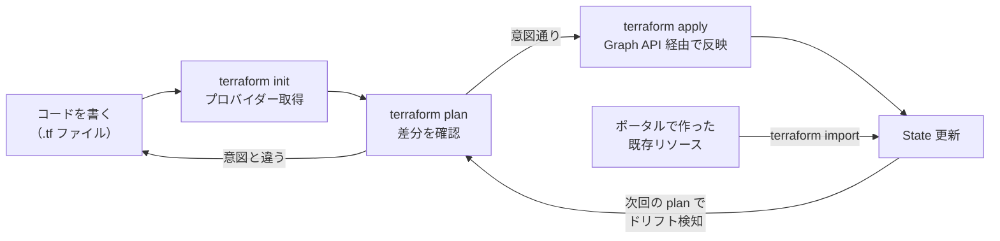

# 【勉強】Microsoft Entra ID — Terraform による IaC（azuread / msgraph プロバイダー）（2026-09-15）

## 今日のテーマ

Microsoft Entra ID のグループ・アプリ登録・条件付きアクセスといったテナント設定を、Terraform でコード管理（IaC）する方法を学びます。これまでポータルで手作業していた設定を「宣言的なコード」に置き換える考え方と、Entra ID 向けの2つの Terraform プロバイダーの違いを押さえます。

## 概要

IaC（Infrastructure as Code）は、インフラの構成をコードとして記述し、ツールに「あるべき状態」を宣言して適用させる手法です。サーバーやネットワークで使ってきた Terraform は、Entra ID のようなアイデンティティ基盤にもそのまま使えます。

Entra ID を Terraform で扱うプロバイダー（Terraform が特定のサービスと会話するためのプラグイン）は、現在2つあります。

- **`azuread` プロバイダー（HashiCorp 公式）**: Azure AD 時代からある定番。ユーザー、グループ、アプリ登録、サービスプリンシパル、条件付きアクセスポリシーなどが、`azuread_group` のような専用リソースとして用意されています。内部では Microsoft Graph API を呼び出しています。
- **`msgraph` プロバイダー（Microsoft 公式・プレビュー）**: Microsoft Graph REST API の上に置かれた「薄い層」で、`msgraph_resource` という汎用リソース1つに Graph のエンドポイント URL と JSON ボディを渡して使います。Graph の v1.0 と beta の両方を同じ設定ファイル内で参照でき、PIM や SharePoint など Graph で扱えるものなら何でも対象にできるのが売りです。ただし 2026年9月時点で公式ドキュメントに PREVIEW と明記されています。

どちらも最終的には Microsoft Graph API を叩いてテナントを変更する、という構造は同じです。



上の図は、2つのプロバイダーがどちらも Microsoft Graph API 経由で Entra ID を操作していることを表しています。

## 押さえる要点

- **専用リソース vs 汎用リソース**: `azuread` は `azuread_group { display_name = ... }` のように属性名が Terraform 流に整理されていて読みやすい反面、プロバイダーが対応していない新機能は使えません。`msgraph` は Graph API のプロパティ名（`displayName`、`securityEnabled` など）をそのまま書くので、Graph のリファレンスがそのまま設定書になります。
- **認証方法**: `azuread` プロバイダーは、Azure CLI のログイン情報、マネージド ID、サービスプリンシパル（クライアントシークレット／クライアント証明書／OIDC）の各方式に対応しています（OIDC 方式はプロバイダードキュメントの Argument Reference と専用ガイドに記載があります）。HashiCorp は、手元で動かすときは Azure CLI、CI/CD で非対話に動かすときはサービスプリンシパルかマネージド ID を推奨しています。`ARM_CLIENT_ID` や `ARM_TENANT_ID` のような環境変数からも設定を読み込めます。
- **必要な権限はリソースごとに違う**: たとえば `azuread_conditional_access_policy` をサービスプリンシパルで扱うには、Graph のアプリケーション権限 `Policy.ReadWrite.ConditionalAccess` と `Policy.Read.All` が必要です。ユーザーとして実行する場合は「条件付きアクセス管理者」または「グローバル管理者」のディレクトリロールが必要です。「Terraform を動かす ID に何の権限を付けるか」は、ポータル操作と同じく最小権限で設計します。
- **State（ステート）ファイル**: Terraform は適用済みの状態を State に記録し、次回の `plan` で「コードと実際の差分（ドリフト）」を計算します。Entra ID のリソースも同じで、State の保管場所（Azure Storage などのリモートバックエンド）とアクセス制御が運用の要になります。
- **既存リソースの取り込み（import）**: すでにポータルで作ってあるポリシーやグループは、`terraform import` で State に取り込んでからコード管理に移行します。条件付きアクセスポリシーの場合、`/identity/conditionalAccess/policies/<ポリシーID>` という Graph のパス形式の ID を指定します。

## 手順や設定のイメージ

### 1. プロバイダーの宣言（azuread）

```hcl
terraform {
  required_providers {
    azuread = {
      source  = "hashicorp/azuread"
      version = "~> 3.1.0"
    }
  }
}

provider "azuread" {
  tenant_id = "00000000-0000-0000-0000-000000000000"
}
```

### 2. グループを作ってメンバーを追加する（azuread）

```hcl
data "azuread_user" "members" {
  for_each            = toset(["user01@contoso.com", "user02@contoso.com"])
  user_principal_name = each.key
}

resource "azuread_group" "ops" {
  display_name     = "Ops-Team"
  security_enabled = true
}

resource "azuread_group_member" "ops" {
  for_each         = data.azuread_user.members
  group_object_id  = azuread_group.ops.id
  member_object_id = each.value.id
}
```

`data` ブロックは既存のユーザーを「読むだけ」、`resource` ブロックは Terraform が「作って管理する」対象です。なお、`azuread_group_member` でメンバーを管理する場合、同じグループの `azuread_group` 側で `members` 属性を併用してはいけません。両方が同じメンバー一覧を管理しようとして競合し、メンバーが消える原因になります（HashiCorp ドキュメントの Warning）。

### 3. 条件付きアクセスポリシーをコードで書く（azuread）

```hcl
resource "azuread_conditional_access_policy" "require_mfa" {
  display_name = "CA001-Require-MFA-All-Users"
  state        = "enabledForReportingButNotEnforced"

  conditions {
    client_app_types = ["all"]

    applications {
      included_applications = ["All"]
    }

    users {
      included_users  = ["All"]
      excluded_groups = [azuread_group.breakglass.id] # 緊急用アカウントのグループ（別途定義）
    }
  }

  grant_controls {
    operator          = "OR"
    built_in_controls = ["mfa"]
  }
}
```

`state` は `enabled`、`disabled`、`enabledForReportingButNotEnforced`（レポート専用モード）の3つから選びます。まずレポート専用で影響を確認し、問題なければ `enabled` に変えて再度 `apply` する、という流れがコードだと明示的に残ります。

### 4. 同じことを msgraph プロバイダーで書く

```hcl
terraform {
  required_providers {
    msgraph = {
      source = "microsoft/msgraph"
    }
  }
}

provider "msgraph" {}

resource "msgraph_resource" "group" {
  url = "groups"
  body = {
    displayName     = "Ops-Team"
    mailEnabled     = false
    mailNickname    = "ops-team"
    securityEnabled = true
  }
}
```

`url` には Graph のエンドポイント（`groups`）、`body` には Graph の POST ボディをそのまま書きます。`api_version` を指定しなければ v1.0 が使われます。公式ドキュメントは「v1.0 で使えない、または必要なプロパティが beta にしかない場合を除き、常に v1.0 を選ぶ」ことを推奨しています。

### 5. 実行の流れ

```bash
terraform init -upgrade          # プロバイダーのダウンロード
terraform plan -out main.tfplan  # 差分の確認（まだ何も変えない）
terraform apply main.tfplan      # 確認した plan をそのまま適用
```



この図は、コードの記述から init・plan・apply を経て State が更新され、既存リソースは import で State に合流する流れを表しています。

## つまずきやすいところ・注意点

- **State に秘密情報が入る**: Terraform の仕様として、`azuread_user` の `password` や、アプリ登録に紐づくシークレットのように設定に書いた値は State に記録されます。State ファイルは Git に置かず、暗号化されたリモートバックエンドに保管し、アクセスを絞ってください。
- **条件付きアクセスの API レート制限**: `azuread_conditional_access_policy` は 1 秒あたり 1 リクエストという厳しい制限の対象です。Terraform は自動で待って再試行しますが、ポリシーを大量に変更するときは並列度を下げるか、タイムアウトを延ばす必要があります。
- **ロックアウトのリスク**: 条件付きアクセスをコードで一括変更すると、書き間違い一つで全員がサインインできなくなる可能性があります。緊急用アカウント（ブレークグラス）を必ず除外し、`state = "enabledForReportingButNotEnforced"` で先に影響を見る運用にします。
- **ポータルでの手動変更＝ドリフト**: 誰かがポータルで直した設定は、次の `plan` で「差分」として出てきて、`apply` すると元に戻されます。IaC 管理下のリソースは「コードを直す」ルールをチームで共有しないと、変更が消えて混乱します。
- **反映の遅延**: Graph 側のレプリケーション遅延で、作った直後のオブジェクトを参照する操作（例: 作成直後のマネージド ID をグループ所有者に追加）が失敗することがあります。公式クイックスタートも「少し待って再度 apply する」と案内しています。
- **`msgraph` はプレビュー**: 本番運用の中核に置くのはまだ慎重に。`azuread` で足りないものだけ `msgraph` で補う、という併用が現実的です。

## 今日のまとめ

### 重要用語のミニ辞書

- **IaC（Infrastructure as Code）**: インフラや設定をコードで宣言し、ツールに適用させる手法。再現性とレビュー可能性が得られる。
- **プロバイダー**: Terraform が特定のサービス（Entra ID、Azure、AWS など）の API と会話するためのプラグイン。
- **State**: Terraform が「自分が管理しているリソースの現在の状態」を記録したファイル。差分計算の基準。
- **ドリフト**: コード（あるべき状態）と実際の設定がずれること。手動変更で発生する。
- **import**: すでに存在するリソースを State に取り込み、Terraform 管理下に置く操作。
- **サービスプリンシパル**: アプリやツールが Entra ID にサインインするための ID。CI/CD で Terraform を動かすときの実行主体になる。

### 理解度チェック

1. `azuread` プロバイダーと `msgraph` プロバイダーは、どちらも最終的に何の API を呼び出していますか。また、設定の書き方はどう違いますか。
2. サービスプリンシパルで `azuread_conditional_access_policy` を管理するとき、必要な Graph のアプリケーション権限は何ですか。
3. 条件付きアクセスポリシーを新しくコードで作るとき、いきなり `enabled` にせず、まず何という状態で適用すべきですか。その理由も説明してください。

## 参考リンク

- Terraform for Microsoft Graph resources（Microsoft Learn）: https://learn.microsoft.com/graph/templates/terraform/overview-terraform-for-graph
- Quickstart: Create and deploy your first Terraform configuration with Microsoft Graph resources（Microsoft Learn）: https://learn.microsoft.com/graph/templates/terraform/quickstart-create-terraform
- Configure Azure Virtual Desktop role-based access control using Terraform（Microsoft Learn、azuread_group の使用例）: https://learn.microsoft.com/azure/developer/terraform/configure-avd-rbac
- Azure Active Directory (Entra ID) Provider ドキュメント（HashiCorp）: https://registry.terraform.io/providers/hashicorp/azuread/latest/docs
- azuread_conditional_access_policy リソース（HashiCorp）: https://registry.terraform.io/providers/hashicorp/azuread/latest/docs/resources/conditional_access_policy
- terraform-provider-msgraph（Microsoft、GitHub）: https://github.com/microsoft/terraform-provider-msgraph
