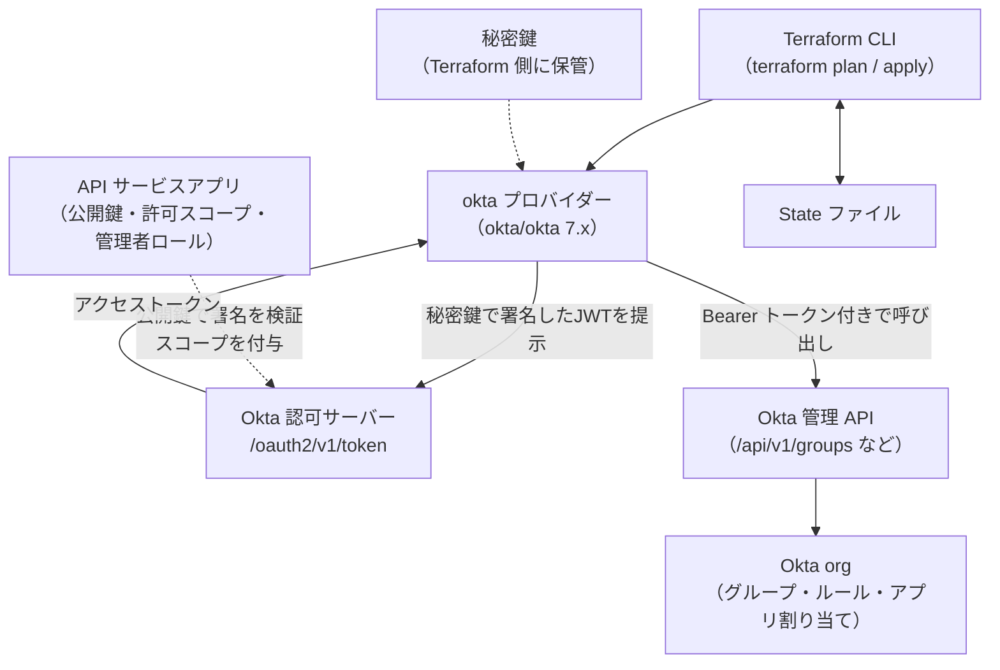
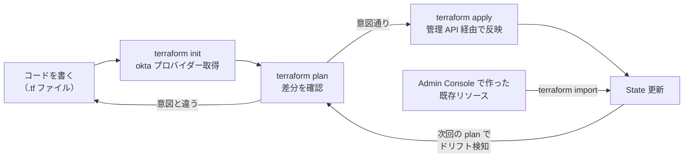

# 【勉強】Okta Workforce Identity Cloud — Terraform による IaC（okta プロバイダーと API サービスアプリ）（2026-09-16）

## 今日のテーマ

Okta Workforce Identity Cloud のグループ・グループルール・アプリ割り当てといった org の設定を、Terraform でコード管理（IaC）する方法を学びます。昨日の Entra ID 編と同じテーマで、今日は Okta 公式の `okta` プロバイダーと、Terraform に org を触らせるための「API サービスアプリ」の作り方を押さえます。

## 概要

Okta 向けの Terraform プロバイダーは、Okta 社が自社で保守している `okta/okta` です（かつての `oktadeveloper/okta` はサポート終了）。2026年8月24日にメジャーバージョン 7.0.0 が公開されています。7.0.0 には `okta_trusted_origin` の `scopes` がブロック形式に変わるなどの破壊的変更が含まれるため、アップグレード前に CHANGELOG の BREAKING CHANGES を確認してください。なお 2026年9月時点の README には「v6.14.0 にはアップグレードしないこと（6.x 系の推奨は v6.15.0）」という注意書きがあります。バージョン固定（`version = "~> 7.0.0"` など）を必ず書く習慣がここでも効きます。

Entra ID 編では「azuread か msgraph か」というプロバイダーの選択がありましたが、Okta ではプロバイダーは事実上1つです。代わりに Okta で最初につまずくのは「Terraform に何の資格情報を渡すか」です。選択肢は2つあります。

- **API トークン（SSWS）**: 管理者ユーザーが発行する静的トークン。設定は簡単ですが、発行した管理者の権限をそのまま引き継ぐため、公式は「レガシー方式」と位置づけています。
- **OAuth 2.0（API サービスアプリ＋公開鍵／秘密鍵）**: Okta 上に「API サービスアプリ」という機械同士の通信専用アプリを作り、Terraform はその秘密鍵を使って OAuth 2.0 の Client Credentials フローでアクセストークンを取得します。触れる範囲を **スコープ** で絞れるため、公式が推奨する方式です。（このほか、別の手段で取得済みのアクセストークンをそのまま渡す `access_token` 引数もあります。）



上の図は、Terraform が秘密鍵でトークンを取得し、API サービスアプリに許可されたスコープの範囲で Okta 管理 API を呼び出す構造を表しています。

## 押さえる要点

- **API サービスアプリ**: Admin Console の Applications から「API Services」タイプのアプリ統合として作成します。クライアント認証方式を「Public key / Private key」にして鍵ペアを登録し、公開鍵は Okta に、秘密鍵は Terraform 側（環境変数やシークレット管理）に置きます。プロバイダーは秘密鍵として PKCS#1（`BEGIN RSA PRIVATE KEY`）と PKCS#8（`BEGIN PRIVATE KEY`）の暗号化されていない形式を受け付け、鍵本文でもファイルパスでも指定できます。
- **スコープと管理者ロールは別物**: API サービスアプリには「Okta API Scopes」タブで `okta.groups.manage` のようなスコープを Grant します。スコープは「どの種類のオブジェクトに何をしてよいか」の許可です。それとは別に、管理者ロール（公式ガイドの例では Organization Administrator や Super Administrator）をアプリに割り当てないと、スコープがあっても API 呼び出しが拒否されます。スコープ＝API の入口、管理者ロール＝Okta 内での実権限、と分けて覚えると整理しやすいです。スコープの付与にはスーパー管理者権限が必要です。
- **最小権限**: 公式ガイドは「楽だから全部のスコープを付ける」のではなく、そのプロジェクトで管理するリソースに必要なスコープだけを付けるよう求めています。読むだけなら `okta.groups.read`、作成・変更・削除するなら `okta.groups.manage` です。
- **プロバイダー設定は環境変数優先**: `OKTA_ORG_NAME`、`OKTA_BASE_URL`、`OKTA_API_CLIENT_ID`、`OKTA_API_PRIVATE_KEY_ID`、`OKTA_API_PRIVATE_KEY`、`OKTA_API_SCOPES` が用意されており、`provider "okta" {}` と空で書けば環境変数から読み込まれます。`api_token` と OAuth 系の引数（`client_id`、`private_key`、`scopes`）は同時に指定できません。
- **`base_url` は `okta.com` か `oktapreview.com`**: `dev-123456.oktapreview.com` なら `org_name = "dev-123456"`、`base_url = "oktapreview.com"` と分けて書きます。本番と Preview（検証）org を切り替える基準になる引数です。
- **レート制限対策の引数が最初から用意されている**: `max_retries`（既定 5）、`min_wait_seconds`（既定 30）、`max_wait_seconds`（既定 300）、`backoff`（既定 true）に加え、org 全体のレート制限枠のうち何％まで使うかを決める `max_api_capacity`（1〜100）があります。Okta の管理 API は1分単位のバケットで制限されるため、大量のリソースを扱うときはここを調整します。

## 手順や設定のイメージ

### 1. プロバイダーの宣言

```hcl
terraform {
  required_providers {
    okta = {
      source  = "okta/okta"
      version = "~> 7.0.0"
    }
  }
}

# 資格情報は環境変数（OKTA_ORG_NAME / OKTA_BASE_URL / OKTA_API_CLIENT_ID /
# OKTA_API_PRIVATE_KEY_ID / OKTA_API_PRIVATE_KEY / OKTA_API_SCOPES）から読み込む
provider "okta" {}
```

```bash
export OKTA_ORG_NAME="dev-123456"
export OKTA_BASE_URL="oktapreview.com"
export OKTA_API_CLIENT_ID="0oa..."
export OKTA_API_PRIVATE_KEY_ID="<kid>"
export OKTA_API_PRIVATE_KEY="$(cat ./terraform-key.pem)"
export OKTA_API_SCOPES="okta.groups.manage,okta.apps.read"
```

### 2. グループとグループルールを作る

```hcl
resource "okta_group" "ops" {
  name        = "Ops-Team"
  description = "運用チーム（Terraform 管理）"
}

# 部署属性が Ops のユーザーを自動でグループに入れるルール
resource "okta_group_rule" "ops" {
  name              = "rule-ops-team"
  status            = "ACTIVE"
  group_assignments = [okta_group.ops.id]
  expression_type   = "urn:okta:expression:1.0"
  expression_value  = "user.department == \"Ops\""
}
```

`okta_group_rule` の `expression_value` には Okta Expression Language の条件式を書きます。Admin Console のグループルール画面で「IF」に書く条件と同じものです。Okta 側が `status` を `INVALID` と判定したルールは、プロバイダーが削除して作り直す（force/replace）挙動になる点はドキュメントに明記されています。

### 3. グループをアプリに割り当てる

```hcl
data "okta_app" "example_saml" {
  label = "Example SAML App"
}

resource "okta_app_group_assignment" "ops_to_example" {
  app_id   = data.okta_app.example_saml.id
  group_id = okta_group.ops.id
}
```

`data` ブロックで既存アプリを「読むだけ」で参照し、`resource` でグループ割り当てを Terraform 管理下に置く形です。ただし `data "okta_app"` の `label` は部分一致検索なので、似た名前のアプリが複数あると別のアプリを掴む可能性があります。確実にしたいときは `id` で指定します。

### 4. 既存リソースの取り込み（import）

```bash
terraform import okta_group.ops <group_id>
terraform import okta_group_rule.ops <group_rule_id>
```

Okta の公式ガイドは、Terraform 1.5 で追加された `import` ブロックの利用も案内しています。いずれの方法でも Okta 側のオブジェクト ID が必要なので、先に Admin Console か API で ID を調べます。

### 5. 実行の流れ



この図は、コードの記述から init・plan・apply を経て State が更新され、既存リソースは import で State に合流する流れを表しています。Entra ID 編と同じ形です。

## つまずきやすいところ・注意点

- **グループメンバーの二重管理**: `okta_group_memberships`（1グループに複数ユーザー）と `okta_user_group_memberships`（1ユーザーを複数グループへ）は役割が違います。`okta_group_memberships` は既定では「自分が入れたユーザー」だけを追跡し、そのユーザーが抜けたときだけドリフトと見なします。グループ全員を追跡するには `track_all_users = true` が必要ですが、これを `okta_group_rule` が自動追加するグループに付けると、ルールが入れたユーザーを Terraform が「余計なメンバー」と見なして外し、次のルール評価で再追加される、というループになりえます。ルールで入れるグループはルールに任せ、手動割り当てのグループだけ memberships で管理する、と分けるのが安全です。また `okta_group_rule` の `remove_assigned_users`（既定 `false`）は、リソースを destroy したときにルールで入ったユーザーをグループから外すかどうかを決めます。
- **`retain_assignment` の落とし穴**: `okta_app_group_assignment` で `retain_assignment = true` にすると、`destroy` しても Okta 側の割り当ては残り、State からだけ消えます。同じグループを複数箇所で割り当てているときの保護用で、本当に消すには Console か API から削除が必要です。
- **秘密鍵と State の扱い**: 秘密鍵は `.tf` に直書きせず、環境変数やシークレット管理（HashiCorp Vault など）から渡します。State には Okta のオブジェクト ID や設定値が入るため、公式ガイドも「公開リポジトリに置かず、他のインフラの State と同様に保護する」よう求めています。
- **Console での手動変更＝ドリフト**: Terraform 管理下のリソースを Admin Console で直すと、次の `plan` で差分として現れ、`apply` で元に戻されます。逆に、`plan` で「自分は変えていないのに差分が出る」場合は、Okta 側が apply 後に自動で値を変えているケース（ポリシーへの Everyone グループの自動付与、priority 重複の自動調整など）があります。公式のレート制限ガイドは、これを毎回 apply が走って API 呼び出しが無駄になる原因として説明しており、コード側を Okta の実際の値に合わせて直すのが対処です。
- **まず Preview org で**: `base_url = "oktapreview.com"` の検証 org で試してから本番に持ち込む運用が現実的です。同じコードを `org_name` と `base_url` だけ差し替えて流せるのが IaC の利点です。

## 今日のまとめ

### 重要用語のミニ辞書

- **API サービスアプリ**: 人ではなくプログラム（Terraform など）が Okta API を呼ぶためのアプリ統合。OAuth 2.0 Client Credentials フローで認可される。
- **スコープ**: API サービスアプリに付ける「どのオブジェクトに何をしてよいか」の許可。`okta.groups.manage` など。
- **管理者ロール**: Okta 内の実権限。スコープとは別に API サービスアプリへ割り当てが必要。
- **SSWS（API トークン）**: 管理者が発行する静的トークンによる旧来の認証方式。発行者の権限を引き継ぐ。
- **グループルール**: ユーザー属性の条件式でグループへ自動割り当てする仕組み。Terraform では `okta_group_rule`。
- **ドリフト**: コード（あるべき状態）と実際の org 設定のずれ。手動変更や Okta 側の自動変更で発生する。

### 理解度チェック

1. API トークン（SSWS）方式と、API サービスアプリ＋秘密鍵の OAuth 2.0 方式では、Terraform に与える権限の絞り方がどう違いますか。公式がどちらを推奨しているかも答えてください。
2. API サービスアプリに `okta.groups.manage` スコープを Grant しただけでは API 呼び出しが拒否されることがあります。何が足りないでしょうか。
3. `okta_group_rule` で自動割り当てしているグループを、同時に `okta_group_memberships` でも管理すると何が起きますか。どう設計すべきでしょうか。

## 参考リンク

- Terraform overview（Okta Developer）: https://developer.okta.com/docs/guides/terraform-overview/main/
- Enable Terraform access for your Okta org（Okta Developer）: https://developer.okta.com/docs/guides/terraform-enable-org-access/main/
- Control Terraform access to Okta（Okta Developer）: https://developer.okta.com/docs/guides/terraform-design-access-security/main/
- Manage groups with Terraform（Okta Developer）: https://developer.okta.com/docs/guides/terraform-manage-groups/main/
- Import existing Okta objects into Terraform（Okta Developer）: https://developer.okta.com/docs/guides/terraform-import-existing-resources/main/
- Optimize Terraform access to Okta APIs（Okta Developer）: https://developer.okta.com/docs/guides/terraform-design-rate-limits/main/
- Okta Provider ドキュメント（Terraform Registry）: https://registry.terraform.io/providers/okta/okta/latest/docs
- okta_group_rule リソース（Terraform Registry）: https://registry.terraform.io/providers/okta/okta/latest/docs/resources/group_rule
- okta_group_memberships リソース（Terraform Registry）: https://registry.terraform.io/providers/okta/okta/latest/docs/resources/group_memberships
- okta/terraform-provider-okta（GitHub、CHANGELOG・docs）: https://github.com/okta/terraform-provider-okta
