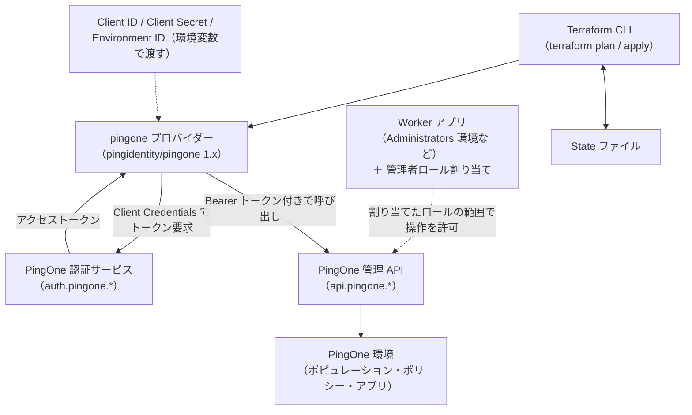
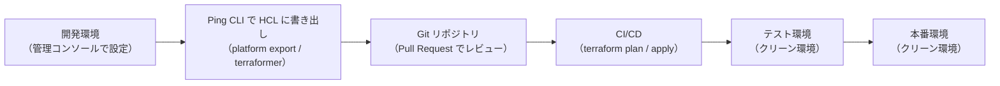

# 【勉強】Ping Identity — Terraform による IaC（pingone プロバイダーと Worker アプリ）（2026-09-18）

## 今日のテーマ

PingOne の環境・ポピュレーション・パスワードポリシーといった設定を Terraform でコード管理（IaC）する方法を学びます。Entra ID 編・Okta 編と同じテーマの Ping 版で、今日は Ping Identity 公式の `pingone` プロバイダーと、Terraform に PingOne を触らせるための「Worker アプリ」の作り方、そして Ping が公式に推奨する「コンソールで作って、コードに書き出して昇格する」進め方を押さえます。

## 概要

PingOne 向けの Terraform プロバイダーは、Ping Identity 社が自社で保守している `pingidentity/pingone` です。GitHub のリリース一覧では 2026年9月14日公開の v1.22.0 が最新です（2026年9月18日時点。リポジトリのトップに出る「Latest」バッジは v1.20.0 のままなので、Releases ページで確認します）。main ブランチのドキュメントも `>= 1.22, < 1.23` を例示しています。Terraform CLI は 1.4 以上が要件です。Okta 編と同じく、`version` による固定は必ず書きます。

Ping の IaC で最初に覚える言葉は **Worker アプリ**（Worker application）です。PingOne では、人間ではなくプログラムが管理 API を叩くための OAuth 2.0 クライアントを「Worker」というアプリケーションタイプで作ります。Terraform はこの Worker アプリの Client ID／Client Secret を使って Client Credentials フロー（ユーザーの関与なしにクライアント自身の資格情報でアクセストークンを得るフロー）でトークンを取得し、PingOne の管理 API を呼び出します。

Okta 編では「スコープと管理者ロールは別物」でしたが、PingOne では権限の実体は **管理者ロール**（Environment Admin、Identity Data Admin、Organization Admin など）だけです。Worker アプリに割り当てたロールの範囲でしか Terraform は操作できません。



上の図は、Terraform が Worker アプリの資格情報でトークンを取得し、Worker アプリに割り当てられた管理者ロールの範囲で PingOne 管理 API を呼び出す構造を表しています。

## 押さえる要点

- **Worker アプリの作成場所**: 公式の Getting started では、管理コンソールで **Administrators** 環境（どの環境でもよいと明記あり）を開き、Applications から「Worker」タイプのアプリを追加し、有効化トグルを ON にします。**Roles** タブで管理者ロールを設定し、**Configuration** タブの General から Client ID・Client Secret・Environment ID をコピーします。
- **プロバイダーへ渡す値は4つ**: `client_id`、`client_secret`、`environment_id`（Worker アプリが属する環境の ID）、`region_code`。すべて環境変数 `PINGONE_CLIENT_ID`、`PINGONE_CLIENT_SECRET`、`PINGONE_ENVIRONMENT_ID`、`PINGONE_REGION_CODE` で渡せるので、`provider "pingone" {}` と空で書くのが基本形です。`client_id`・`client_secret`・`environment_id` は3つセットで指定する必要があります。
- **`region_code` はテナントのドメインで決まる**: `NA`（`.com`）、`EU`（`.eu`）、`AP`（`.asia`）、`AU`（`.com.au`）、`CA`（`.ca`）、`SG`（`.sg`）の6種類です。日本の案件では `.asia` の AP テナントか、`.com` の NA テナントかを最初に確認します。この値で API と認証サービスのエンドポイントが決まるため、間違えると別リージョンに接続しようとして失敗します。
- **トークンを外で取る方式もある**: `client_id` の代わりに `api_access_token`（環境変数 `PINGONE_API_ACCESS_TOKEN`）で、別の手段で取得済みのアクセストークンを渡せます。`api_access_token` と `client_id` は同時に指定できません。
- **環境作成時の「生得ロール」**: Terraform で `pingone_environment` を作る Worker アプリには、公式は **Organization Admin** ロールの割り当てを推奨しています（環境の作成・昇格・読取・更新・削除の権限を含むためです）。環境を作ると、その Worker アプリには新環境スコープの **Environment Admin**・**Identity Data Admin**・**Client Application Developer** が自動で付きます（公式はこれを birthright roles と呼びます）。逆に、他の管理者はこの Worker アプリより権限が低くなり、Worker アプリのシークレットを見られなくなる（`Actor does not have permissions to access worker application client secrets`）ことがあります。
- **危険な `global_options`**: プロバイダーには `global_options { population { contains_users_force_delete = true } }` という、ユーザーを含むポピュレーションを強制削除するオプションがあります。`SANDBOX` 環境限定ですが、本番データのある環境では絶対に `true` にしないよう公式が警告しています。
- **推奨は「コンソールで開発、コードで昇格」**: Ping の公式ベストプラクティスは、ユースケースの開発は管理コンソールで行い、出来上がった設定を Terraform HCL として書き出して Git に入れ、CI/CD でテスト・本番環境へ昇格させる進め方です。書き出しには **Ping CLI** の `pingcli platform export`（`import {}` ブロック付きの HCL を生成）や、**Ping CLI Terraformer** プラグインの `pingcli-terraformer export`（環境固有値の変数化や依存関係の参照化まで行う）が用意されています。



上の図は、Ping が推奨する「開発環境で作った設定を Terraform に書き出し、Git と CI/CD を通してテスト・本番へ昇格する」流れを表しています。

## 手順や設定のイメージ

### 1. プロバイダーの宣言と資格情報

```hcl
terraform {
  required_providers {
    pingone = {
      source  = "pingidentity/pingone"
      version = "~> 1.22"
    }
  }
}

# 値は環境変数から読む。HCL には書かない
provider "pingone" {}
```

```shell
export PINGONE_CLIENT_ID="<Worker アプリの Client ID>"
export PINGONE_CLIENT_SECRET="<Worker アプリの Client Secret>"
export PINGONE_ENVIRONMENT_ID="<Worker アプリが属する環境の ID>"
export PINGONE_REGION_CODE="AP"   # .asia テナントの場合。.com なら NA
terraform init
terraform plan
```

### 2. パスワードポリシーとポピュレーションを定義する

公式ベストプラクティスに沿って、環境作成時に自動生成される「Passphrase」などの初期ポリシーには依存せず、依存先も自分で定義します。

```hcl
resource "pingone_password_policy" "corp" {
  environment_id = var.environment_id
  name           = "corp-password-policy"

  excludes_commonly_used_passwords = true
  excludes_profile_data            = true
  not_similar_to_current           = true

  history = {
    count          = 6
    retention_days = 365
  }
}

resource "pingone_population" "employees" {
  environment_id     = var.environment_id
  name               = "employees"
  description        = "正社員"

  # 旧来の password_policy_id は非推奨。password_policy.id を使う
  password_policy = {
    id = pingone_password_policy.corp.id
  }

  lifecycle {
    prevent_destroy = true   # ユーザーを抱えるので誤削除を防ぐ
  }
}
```

### 3. Worker アプリ自体も Terraform で管理し、シークレットを定期ローテーションする

Terraform 用の Worker アプリとは別に、たとえば SIEM 連携用の Worker アプリを作り、30日ごとにシークレットを更新する例です（`time_rotating` は HashiCorp の `time` プロバイダーのリソースです）。

```hcl
resource "pingone_application" "siem_worker" {
  environment_id = var.environment_id
  name           = "siem-log-collector"
  enabled        = true

  oidc_options = {
    type                       = "WORKER"
    grant_types                = ["CLIENT_CREDENTIALS"]
    token_endpoint_auth_method = "CLIENT_SECRET_BASIC"
  }
}

resource "time_rotating" "siem_worker_secret" {
  rotation_days = 30
}

resource "pingone_application_secret" "siem_worker" {
  environment_id = var.environment_id
  application_id = pingone_application.siem_worker.id

  regenerate_trigger_values = {
    "rotation_rfc3339" : time_rotating.siem_worker_secret.rotation_rfc3339,
  }
}
```

Worker アプリへの管理者ロール割り当ては `pingone_application_role_assignment` リソースで行います。

### 4. 既存設定の取り込み

すでにコンソールで作った設定は、`terraform import` か `import {}` ブロックで State に取り込めます。たとえばグループへのロール割り当ては `<environment_id>/<group_id>/<role_assignment_id>` という複合 ID で指定します。

```hcl
import {
  to = pingone_group_role_assignment.example
  id = "<environment_id>/<group_id>/<role_assignment_id>"
}
```

## つまずきやすいところ・注意点

- **`region_code` の取り違え**: 接続先エンドポイントそのものが変わるので、最初に疑う項目です。テナントの URL 末尾（`.com` / `.eu` / `.asia` / `.com.au` / `.ca` / `.sg`）を見て決めます。
- **`environment_id` は「Worker アプリの環境」**: リソース側の `environment_id`（対象環境）と混同しやすいです。プロバイダー設定の `environment_id` は Worker アプリが置かれている環境（Administrators 環境など）で、各リソースの `environment_id` は操作対象の環境です。
- **ロール重複エラー**: すでに組織スコープで持っているロールを、Terraform で環境スコープに再度割り当てようとすると `UNIQUENESS_VIOLATION` `May not assign duplicate Role` になります。ユーザーへのロールは直接付けず、グループ経由で付けるのが公式の推奨です。
- **初期設定（ブートストラップ設定）への依存**: 新規環境には既定のブランディングテーマ、`Single_Factor` サインオンポリシー、サンプルのパスワードポリシー、既定の MFA デバイスポリシーなどが自動で入ります。これらの中身は時期によって変わりうるので、`data` ソースで参照して依存するのではなく、必要なものは `resource` として自分で定義します。テスト・本番は「クリーン環境」に作るのが推奨です。
- **データを持つリソースの破壊**: `pingone_schema_attribute`（削除で属性データが消える）、`pingone_population`、`pingone_environment` は `lifecycle { prevent_destroy = true }` で守ります。`PRODUCTION` タイプの環境は API 側で削除が拒否されますが、`SANDBOX` には制限がありません。
- **シークレットのローテーション**: Worker アプリのシークレットは定期ローテーションが公式推奨です。ただし `pingone_application_secret` の `previous` 属性は PingOne 側で期限切れ・削除されるとドリフトになるため、v1.21.1 のリリースノートで `lifecycle.ignore_changes` を使う回避策がドキュメント化されています。
- **CHANGELOG の見方**: リポジトリ直下の `CHANGELOG.md` の最新エントリは 1.15.0（2026年1月28日）で止まっており、1.16.0 以降の変更は `release-notes/vX.Y.Z/` ディレクトリと GitHub の Releases ページに移っています。最新の変更内容は Releases ページで追います。
- **公式ドキュメントの鮮度差**: Ping の Best practices ページ（最終更新 2025年3月）のサンプルは `pingone_population` の `password_policy_id` を使っていますが、現行のリソースドキュメントではこの属性は非推奨（Deprecated）で、`password_policy = { id = ... }` に置き換わっています。ガイド系のページとリソースのリファレンスで記述が食い違うことがあるので、HCL を書くときはリファレンス側を優先します。

## 今日のまとめ

### 重要用語ミニ辞書

- **Worker アプリ**: PingOne で、人ではなくプログラムが管理 API を使うための OAuth 2.0 クライアント。Okta の API サービスアプリに相当。
- **Client Credentials フロー**: ユーザーの関与なしに、クライアント自身の ID とシークレットでアクセストークンを取得する OAuth 2.0 のフロー。
- **管理者ロール（Environment Admin / Identity Data Admin / Organization Admin など）**: PingOne での権限の単位。ユーザー・グループ・Worker アプリ・接続（ゲートウェイ）に、ロールに応じて組織・環境・ポピュレーション（一部はアプリケーション）のスコープで割り当てる。
- **生得ロール（birthright roles）**: Terraform で環境を作った Worker アプリに、新環境スコープで自動付与される Environment Admin・Identity Data Admin・Client Application Developer。
- **`region_code`**: テナントのリージョン（NA / EU / AP / AU / CA / SG）。API と認証のエンドポイントを決める。
- **Ping CLI / Ping CLI Terraformer**: 稼働中の PingOne 設定を読み取り、Terraform HCL を生成するコマンドラインツールとそのプラグイン。
- **ブートストラップ設定**: 環境作成時に PingOne が自動投入する既定のポリシーやテーマ。Terraform では依存先にしない。

### 理解度チェック

1. `provider "pingone"` に必要な4つの値は何で、それぞれ対応する環境変数名は何ですか。`region_code` はどうやって決めますか。
2. Terraform で新しい PingOne 環境を作ったあと、他の管理者が Worker アプリのシークレットを見られなくなるのはなぜですか。どう解消しますか。
3. Ping が「開発はコンソール、昇格はコード」を推奨する理由と、その流れで使うツールを説明してください。

## 参考リンク

- pingidentity/terraform-provider-pingone（GitHub リポジトリ・README）: https://github.com/pingidentity/terraform-provider-pingone
- 同リポジトリ Releases（v1.22.0、2026-09-14）: https://github.com/pingidentity/terraform-provider-pingone/releases
- 同リポジトリ docs/resources/population.md（`password_policy_id` 非推奨の記載）: https://github.com/pingidentity/terraform-provider-pingone/blob/main/docs/resources/population.md
- 同リポジトリ docs/index.md（プロバイダースキーマ）: https://github.com/pingidentity/terraform-provider-pingone/blob/main/docs/index.md
- 同リポジトリ docs/resources/application.md（Worker アプリの例）: https://github.com/pingidentity/terraform-provider-pingone/blob/main/docs/resources/application.md
- Terraform Registry: pingidentity/pingone: https://registry.terraform.io/providers/pingidentity/pingone/latest/docs
- Ping Identity — Terraform Getting started（PingOne）: https://developer.pingidentity.com/terraform/products/pingone/getting_started.html
- Ping Identity — PingOne Best practices: https://developer.pingidentity.com/terraform/products/pingone/best_practices.html
- Ping Identity — Admin Role Management Considerations: https://developer.pingidentity.com/terraform/products/pingone/develop_with_terraform/admin_roles.html
- Ping Identity — Exporting Terraform configuration（Ping CLI / Terraformer）: https://developer.pingidentity.com/terraform/develop_with_terraform/exporting_configuration.html
