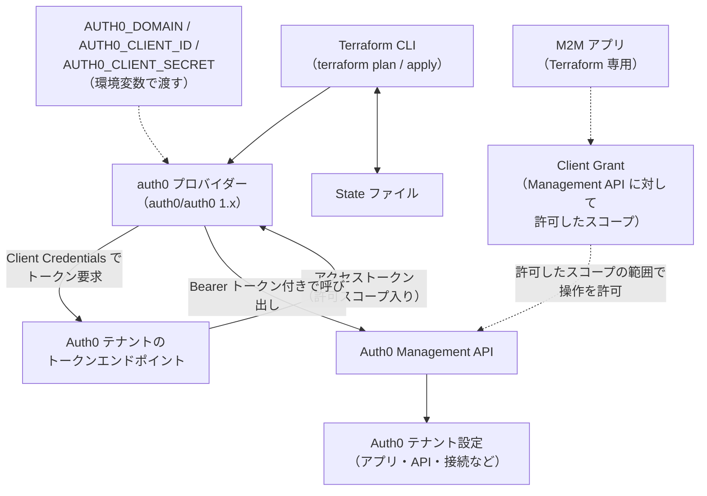
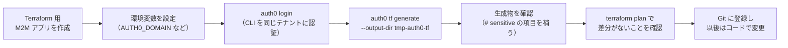

# 【勉強】Okta Customer Identity Cloud (Auth0) — Terraform による IaC（auth0 プロバイダーと M2M アプリ）（2026-09-24）

## 今日のテーマ

Auth0 テナントのアプリケーション・API・接続（Connection）といった設定を Terraform でコード管理（IaC）する方法を学びます。Entra ID 編・Okta 編・Ping 編と同じテーマの Auth0 版です。今日は Auth0 公式の `auth0` プロバイダー、Terraform に Auth0 を操作させるための **M2M（Machine to Machine）アプリ**、そして既存テナントから HCL を自動生成する `auth0 tf generate` を押さえます。

## 概要

Auth0 向けの Terraform プロバイダーは、Auth0 自身が保守している `auth0/auth0` です（ソースは GitHub の `auth0/terraform-provider-auth0`）。GitHub の Releases ページでは v1.58.0 が最新で、公開日時は 2026年9月22日（UTC）と表示されています（2026年9月24日時点。一度リリースされたものが再リリースされた経緯があるとの情報もあり、日付は要確認）。リリースの頻度が高いので、`version` による固定は必ず書きます。

このプロバイダーは、裏側で **Auth0 Management API**（テナント設定を読み書きするための管理用 REST API）を呼び出します。人間の管理者がダッシュボードで行う操作を、Terraform が API 経由で代行するイメージです。

Terraform が Management API を呼ぶための「身分証」が **M2M アプリ** です。Auth0 では、ユーザーが関与せずプログラム同士で通信するアプリを「Machine to Machine Application」という種類で作ります。Terraform はこの M2M アプリの Client ID／Client Secret を使って Client Credentials フロー（ユーザーの関与なしに、クライアント自身の資格情報でアクセストークンを得る OAuth 2.0 のフロー）でトークンを取得します。

権限の考え方は Ping 編・Okta 編と少し違います。Auth0 では M2M アプリを Management API に「認可」し、そのとき許可した **スコープ**（`read:clients`、`create:users` のような操作単位の権限）の範囲でしか Terraform は操作できません。この「どのアプリに、どの API の、どのスコープを許すか」の設定を **Client Grant** と呼びます。



上の図は、Terraform が M2M アプリの資格情報でトークンを取得し、Client Grant で許可されたスコープの範囲で Management API を呼び出してテナント設定を変更する構造を表しています。

## 押さえる要点

- **M2M アプリの作り方**: 公式 Quickstart では、ダッシュボードの Applications で「Create Application」を押し、名前（例: 「Terraform Provider Auth0」）を付けて「Machine to Machine Application」を選びます。次の画面で Auth0 Management API を選び、スコープを許可して「Authorize」を押します。最後に Settings タブから Domain・Client ID・Client Secret をコピーします。
- **Quickstart は「All」で全スコープを許可している**: 手早く試すための手順です。業務のテナントでは、Terraform で管理する対象に必要なスコープだけを許可する方が安全です。公式ガイドにも、全スコープを許可したくない場合は Auth0 CLI の `auth0 apis scopes list` の出力から必要なスコープを絞り込む方法が載っています。
- **プロバイダーへの資格情報の渡し方は主に3通り**（ほかに Auth0 CLI のキーリングからトークンを取る `cli_login` などもあります）:
  1. `domain` ＋ `client_id` ＋ `client_secret`（環境変数 `AUTH0_DOMAIN`、`AUTH0_CLIENT_ID`、`AUTH0_CLIENT_SECRET`）
  2. `domain` ＋ `client_id` ＋ `client_assertion_private_key` ＋ `client_assertion_signing_alg`（Private Key JWT。シークレットの代わりに秘密鍵で署名した JWT で認証する方式。環境変数 `AUTH0_CLIENT_ASSERTION_PRIVATE_KEY`、`AUTH0_CLIENT_ASSERTION_SIGNING_ALG`）
  3. `api_token`（取得済みの Management API トークンを直接渡す。環境変数 `AUTH0_API_TOKEN`）。`api_token` と `client_id`＋`client_secret` の両方を指定すると `api_token` が優先されます。
- **HCL に資格情報を書かない**: 公式ドキュメントは、資格情報を Terraform の設定ファイルに直接書くと公開リポジトリにコミットしたときに漏えいする危険があるとして、環境変数を使うよう案内しています。`provider "auth0" {}` と空で書くのが基本形です。
- **カスタムドメインを使っている場合は `audience`**: テナントにカスタムドメインを設定し、`domain` にそのドメインを指定する場合は、`audience`（環境変数 `AUTH0_AUDIENCE`）で Management API の audience を明示する設定があります。
- **v1 系でリソースが分割された**: v0.x から v1 への移行で、次のように設定の置き場所が変わりました（公式 MIGRATION_GUIDE）。古いブログ記事のサンプルは v0.x 形式のことがあるので注意します。
  - アプリの認証方式（`token_endpoint_auth_method`）とシークレット・公開鍵 → `auth0_client_credentials` リソースで管理する
  - `auth0_client` の `client_secret` 属性 → リソースからは削除され、`auth0_client` の **data ソース**で読む
  - API（リソースサーバー）の `scopes` → `auth0_resource_server_scope`（1スコープずつ）または `auth0_resource_server_scopes`（まとめて）で管理する
- **既存テナントの取り込みは `auth0 tf generate`**: Auth0 CLI（v1.1.0 以上）の `auth0 tf generate` が、稼働中のテナントを読み取って Terraform の設定ファイルを自動生成します。この機能は公式ガイドで **experimental（実験的）** と明記されています。



上の図は、すでにダッシュボードで作り込んだテナントを、`auth0 tf generate` を使って Terraform 管理に移行する流れを表しています。

## 手順や設定のイメージ

### 1. プロバイダーの宣言と資格情報

```hcl
terraform {
  required_providers {
    auth0 = {
      source  = "auth0/auth0"
      version = "~> 1.58"
    }
  }
}

# 値は環境変数から読む。HCL には書かない
provider "auth0" {}
```

```shell
export AUTH0_DOMAIN="<テナント>.jp.auth0.com"   # 例。テナントのドメインをそのまま入れる
export AUTH0_CLIENT_ID="<M2M アプリの Client ID>"
export AUTH0_CLIENT_SECRET="<M2M アプリの Client Secret>"
terraform init
terraform plan
```

### 2. 自社 API と、それを呼ぶ M2M アプリを定義する

バックエンドのバッチ処理が自社 API を呼ぶ、という構成をコードで表す例です。「API を定義する → スコープを定義する → M2M アプリを作る → Client Grant で許可する」の4段階になります。

```hcl
# 自社 API（Auth0 では「リソースサーバー」と呼ぶ）
resource "auth0_resource_server" "orders_api" {
  name        = "Orders API"
  identifier  = "https://api.example.com/orders"   # これが audience になる
  signing_alg = "RS256"
}

# API のスコープ（v1 系では別リソースで管理する）
resource "auth0_resource_server_scopes" "orders_api" {
  resource_server_identifier = auth0_resource_server.orders_api.identifier

  scopes {
    name        = "read:orders"
    description = "注文の参照"
  }
  scopes {
    name        = "write:orders"
    description = "注文の登録"
  }
}

# API を呼ぶバッチ用の M2M アプリ
resource "auth0_client" "order_batch" {
  name     = "order-batch"
  app_type = "non_interactive"   # M2M アプリの app_type
}

# 認証方式は auth0_client_credentials で管理する
resource "auth0_client_credentials" "order_batch" {
  client_id             = auth0_client.order_batch.id
  authentication_method = "client_secret_post"
}

# どのアプリに、どの API の、どのスコープを許すか
resource "auth0_client_grant" "order_batch" {
  client_id = auth0_client.order_batch.id
  audience  = auth0_resource_server.orders_api.identifier
  scopes    = ["read:orders"]   # 必要最小限だけ
}
```

### 3. 既存テナントから HCL を自動生成する

```shell
# 1. Terraform 用 M2M アプリの資格情報を環境変数に設定（上と同じ）
# 2. Auth0 CLI を同じテナントに認証する
auth0 login
# 3. 生成（既存ディレクトリと混ざらないよう別フォルダに出す）
auth0 tf generate --output-dir tmp-auth0-tf
```

公式ガイドによると、次のファイルが作られます。

- `auth0_main.tf`: 生成に使ったプロバイダーのバージョン指定
- `auth0_import.tf`: 既存リソースを State に取り込むための `import {}` ブロック
- `auth0_generated.tf`: テナントのリソースを表す HCL 本体
- `terraform`: 生成用に固定バージョンでダウンロードされる Terraform のバイナリ

## つまずきやすいところ・注意点

- **シークレットは書き出されない**: `auth0 tf generate` は、シークレットや鍵のような機密値をエクスポートできません。生成された `auth0_generated.tf` では、該当する項目が `null # sensitive` のようにコメント付きで出力されます。同じテナントに戻すだけなら問題になりにくいですが、別テナントに適用するときは値を補う必要があります。
- **CLI とプロバイダーは同じテナントに向ける**: 公式ガイドは、Auth0 CLI と Terraform プロバイダーを同じドメインに認証することを必須としています。CLI の認証には、プロバイダー用とは別の M2M アプリを使うことが推奨されています（ユーザーとしてログインしても構いません）。
- **State ファイルに機密値が入る**: `data "auth0_client"` で `client_secret` を読むと、その値は State に保存されます。State はリモートバックエンドで暗号化・アクセス制御し、Git には入れません。
- **古いサンプルの `token_endpoint_auth_method`**: v1 系の `auth0_client` にはこの属性がありません。ネットで拾った HCL がエラーになったら、まず v0.x の書き方でないかを疑い、MIGRATION_GUIDE と照らし合わせます。
- **シークレットのローテーション**: v0.x にあった `client_secret_rotation_trigger` は廃止されました。公式ガイド「Zero downtime client credentials rotation」は Private Key JWT を例に、①新しい鍵を生成し、**先にシステム側の設定に「次の鍵」として追加しておく** → ②Terraform で `auth0_client_credentials` の `private_key_jwt { credentials { ... } }` に新しい公開鍵を追加して apply（現用と次の2つが並ぶ） → ③古い鍵を削除して apply、という順で停止時間なしに入れ替える手順を示しています。Auth0 側で新しい鍵が有効になる時点で、システムがすでにその鍵を持っていることが停止しない理由です。
- **Deploy CLI との使い分け**: Auth0 には YAML やディレクトリ形式でテナント設定をエクスポート／インポートする **Auth0 Deploy CLI**（`a0deploy`）もあります。ほかのインフラと同じ仕組みで状態管理したいなら Terraform、Auth0 だけを手軽にファイル化したいなら Deploy CLI、という選び方になります。同じリソースを両方から管理すると設定を上書きし合うので、どちらか一方に寄せます。

## 今日のまとめ

### 重要用語ミニ辞書

- **Management API**: Auth0 テナントの設定（アプリ、API、接続、ユーザーなど）を操作する管理用 REST API。Terraform プロバイダーはこれを呼ぶ。
- **M2M アプリ（Machine to Machine Application）**: ユーザーが関与せず、プログラムが API を呼ぶための Auth0 アプリ。Terraform 版では `app_type = "non_interactive"`。Okta の API サービスアプリ、PingOne の Worker アプリに相当。
- **Client Credentials フロー**: クライアント自身の ID とシークレット（または署名付き JWT）でアクセストークンを取得する OAuth 2.0 のフロー。
- **リソースサーバー（Resource Server）**: Auth0 に登録した「保護対象の API」。`identifier` がトークンの audience になる。
- **Client Grant**: 「このアプリに、この API の、このスコープを許す」という許可設定。`auth0_client_grant` で管理する。
- **Private Key JWT**: シークレットを共有する代わりに、クライアントが秘密鍵で署名した JWT を送って認証する方式。
- **`auth0 tf generate`**: 稼働中のテナントから Terraform の設定ファイルと `import` ブロックを自動生成する Auth0 CLI のコマンド（experimental）。

### 理解度チェック

1. `provider "auth0"` に資格情報を渡す3つの方法と、それぞれの環境変数名を挙げてください。`api_token` と `client_id`＋`client_secret` を両方指定するとどうなりますか。
2. バッチ処理用の M2M アプリに自社 API の `read:orders` だけを許可したいとき、どのリソースをどの順で定義しますか。
3. `auth0 tf generate` で生成した設定を別テナントに適用する前に、必ず確認すべきことは何ですか。

## 参考リンク

- auth0/terraform-provider-auth0（GitHub リポジトリ・README）: https://github.com/auth0/terraform-provider-auth0
- 同リポジトリ Releases（v1.58.0）: https://github.com/auth0/terraform-provider-auth0/releases
- 同リポジトリ docs/index.md（プロバイダースキーマ・環境変数）: https://github.com/auth0/terraform-provider-auth0/blob/main/docs/index.md
- 同リポジトリ Quickstart（M2M アプリの作成）: https://github.com/auth0/terraform-provider-auth0/blob/main/docs/guides/quickstart.md
- 同リポジトリ Auto-generating Terraform config from Auth0 tenant: https://github.com/auth0/terraform-provider-auth0/blob/main/docs/guides/generate_terraform_config.md
- 同リポジトリ Zero downtime client credentials rotation: https://github.com/auth0/terraform-provider-auth0/blob/main/docs/guides/client_secret_rotation.md
- 同リポジトリ MIGRATION_GUIDE（v0.x → v1 の変更点）: https://github.com/auth0/terraform-provider-auth0/blob/main/MIGRATION_GUIDE.md
- Terraform Registry: auth0/auth0: https://registry.terraform.io/providers/auth0/auth0/latest/docs
- Terraform Registry: auth0_client_grant: https://registry.terraform.io/providers/auth0/auth0/latest/docs/resources/client_grant
- Auth0 CLI: auth0 terraform generate: https://auth0.github.io/auth0-cli/auth0_terraform_generate.html
- Auth0 Docs: Auth0 Deploy CLI: https://auth0.com/docs/deploy-monitor/deploy-cli-tool
