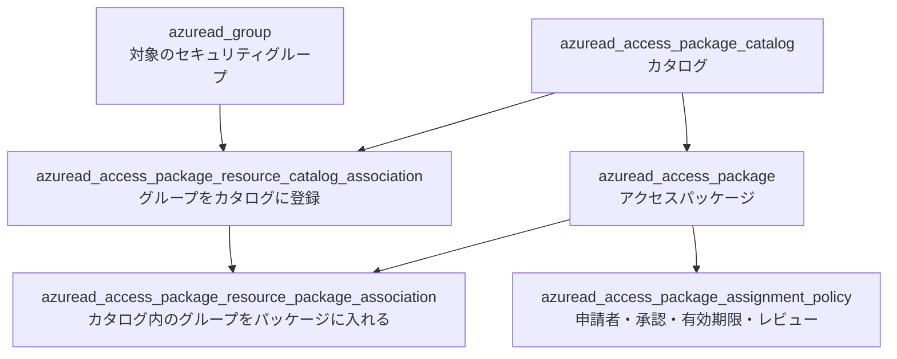
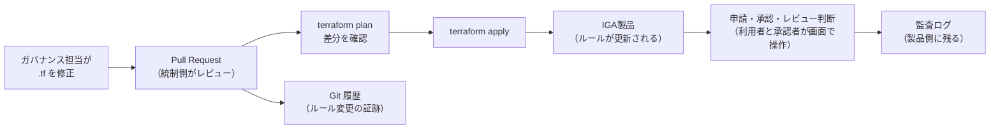

# 【勉強】IGA（アイデンティティガバナンス＆管理）— ガバナンス設定のコード化（Terraform で扱うアクセスパッケージとキャンペーン）（2026-09-25）

## 今日のテーマ

アクセスパッケージ、承認ルール、アクセスレビューのキャンペーンといった「ガバナンスのルール」を Terraform でコード管理（IaC）する方法を学びます。Entra ID 編・Okta 編・Ping 編・Auth0 編に続く、「Terraform による IaC」のIGA編です。

## 概要

これまでのIaC編では、IdP の**アプリ・グループ・ポリシー**をコードにしました。IGA で同じことをすると、対象は「誰が・何を・どの承認を経て・どれだけの期間持てるか」という**ルールの定義**になります。

ここで最初に押さえたいのは、IGA には性質の違う2種類のデータがあることです。

- **設定（ルール）**: カタログ、アクセスパッケージ、割り当てポリシー（承認段数・有効期限）、レビューキャンペーンの定義、申請条件など。変更頻度は低く、変更そのものが監査対象になる。**コード化に向いている**。
- **運用データ（結果）**: 個々の申請、承認／却下の決定、レビューの判断、実際の割り当て。日々大量に発生し、担当者が画面で操作する。**コード化には向いていない**。

インフラの感覚で言えば、前者は「ファイアウォールのルールセット」、後者は「セッションテーブル」です。ルールセットは Git で管理してレビューを通しますが、セッションテーブルを Git に入れる人はいません。

設定をコードにすると、ルールの変更が Pull Request として残ります。「誰が・いつ・誰のレビューを経て承認ルールを変えたか」が Git の履歴で説明できるので、前回学んだ監査証跡を補強できます。

## 押さえる要点

### 製品ごとの対応状況（2026年9月時点）

- **Microsoft Entra ID Governance**: HashiCorp の `azuread` プロバイダーに「Identity Governance」カテゴリのリソースがあり、エンタイトルメント管理（アクセスパッケージの仕組み）を専用リソースで書けます。
  - `azuread_access_package_catalog`: カタログ（アクセスパッケージとリソースを入れる箱）
  - `azuread_access_package_resource_catalog_association`: グループやアプリをカタログに登録する
  - `azuread_access_package`: アクセスパッケージ本体
  - `azuread_access_package_resource_package_association`: カタログ内のリソースをパッケージに入れる
  - `azuread_access_package_assignment_policy`: 誰が申請できるか、承認段数、有効期限、割り当てのレビュー
  - サービスプリンシパルで実行する場合は、アプリケーション権限 `EntitlementManagement.ReadWrite.All` が必要です。
  - アクセスレビュー（アクセスパッケージ以外を対象にするもの）には `azuread` の専用リソースがありません。必要なら、Entra ID 編で紹介した `msgraph` プロバイダー（プレビュー）の `msgraph_resource` で Graph の `identityGovernance/accessReviews/definitions` を直接扱います。この API の権限は `AccessReview.ReadWrite.All` です。なお、アクセスレビュー定義の更新は Graph 上 PUT（オブジェクト全体の送信）で行う API のため、`msgraph_resource` の既定の更新方法（PATCH）ではなく `update_method = "PUT"` を指定する必要があると考えられます（**要確認**）。
- **Okta Identity Governance（OIG）**: Okta 公式の `okta` プロバイダーに OIG 用リソースが追加されています。
  - `okta_campaign`（アクセスレビューのキャンペーン）、`okta_entitlement`／`okta_entitlement_bundle`（エンタイトルメントとその束）、`okta_request_condition`（申請条件）、`okta_label`（ラベル）、`okta_resource_owner`（リソースオーナー）など。`okta_label` と `okta_resource_owner` は CHANGELOG 上 6.13.0 で追加されたので、使うならそれ以降のバージョンが必要です。
  - 公式ガイドの前提: OIG の契約、スーパー管理者ロールを持つユーザー、Terraform 1.8.5 以上、`okta` プロバイダー 6.2.0 以上。
  - **GA（一般提供）の OIG 機能だけ**が対象で、Beta や EA（早期提供）の機能は Terraform で扱えません。
- **SailPoint Identity Security Cloud（ISC）**: 今回の調査では、SailPoint 公式の Terraform プロバイダーは確認できませんでした（コミュニティ製のプロバイダーは GitHub などに存在します。**要確認**）。SailPoint 公式の手段は **Configuration Hub**（画面）と **SaaS Configuration API**（エンドポイント名から SP-Config とも呼ばれる）で、テナントの設定オブジェクトをバックアップ（エクスポート）し、別テナントへデプロイ（インポート）できます。「コードで宣言して差分を適用する」Terraform とは考え方が異なり、「設定のスナップショットを持ち運ぶ」仕組みです。

### Entra ID のリソースの関係

Entra ID では、ポータルで1画面にまとまっている設定が、Terraform では5つのリソースに分かれます。この分かれ方は、エンタイトルメント管理の内部構造をそのまま映しています。



ポイントは、グループをいきなりパッケージに入れることはできず、**先にカタログへ登録し、その登録（association）をパッケージに紐づける**二段構えになっていることです。

## 手順や設定のイメージ

### 1. Entra ID: 承認付き・90日期限のアクセスパッケージ

```hcl
resource "azuread_group" "sales_app_users" {
  display_name     = "SalesApp-Users"
  security_enabled = true
}

resource "azuread_group" "sales_managers" {
  display_name     = "Sales-Managers"
  security_enabled = true
}

resource "azuread_access_package_catalog" "sales" {
  display_name = "Sales"
  description  = "営業部門向けのアクセス"
}

# 1段目: グループをカタログに登録
resource "azuread_access_package_resource_catalog_association" "sales_app" {
  catalog_id             = azuread_access_package_catalog.sales.id
  resource_origin_id     = azuread_group.sales_app_users.object_id
  resource_origin_system = "AadGroup"
}

resource "azuread_access_package" "sales_app" {
  catalog_id   = azuread_access_package_catalog.sales.id
  display_name = "営業アプリ利用"
  description  = "営業アプリの利用者グループへの参加"
}

# 2段目: カタログに登録したグループをパッケージに入れる
resource "azuread_access_package_resource_package_association" "sales_app" {
  access_package_id               = azuread_access_package.sales_app.id
  catalog_resource_association_id = azuread_access_package_resource_catalog_association.sales_app.id
  access_type                     = "Member"
}

resource "azuread_access_package_assignment_policy" "sales_app" {
  access_package_id = azuread_access_package.sales_app.id
  display_name      = "社員向け（承認あり）"
  description       = "上長グループの承認で90日間付与"
  duration_in_days  = 90

  requestor_settings {
    scope_type = "AllExistingDirectoryMemberUsers"
  }

  approval_settings {
    approval_required                = true
    requestor_justification_required = true
    approval_stage {
      approval_timeout_in_days = 14
      primary_approver {
        object_id    = azuread_group.sales_managers.object_id
        subject_type = "groupMembers"
      }
    }
  }

  assignment_review_settings {
    enabled                        = true
    review_frequency               = "quarterly"
    duration_in_days               = 14
    review_type                    = "Manager"
    access_review_timeout_behavior = "removeAccess"
  }
}
```

これまでの記事で学んだ概念が、そのまま属性名になっています。

- `requestor_settings.scope_type`: 誰が申請できるか（アクセス要求編）
- `approval_settings`: 承認段数、承認者、理由の必須化（アクセス要求編）
- `duration_in_days`: 割り当ての有効期限
- `assignment_review_settings`: 割り当ての定期レビュー。`review_frequency` は `weekly`／`monthly`／`quarterly`／`halfyearly`／`annual`、未回答時の動作 `access_review_timeout_behavior` は `keepAccess`／`removeAccess`／`acceptAccessRecommendation` から選びます（アクセスレビュー編）

### 2. Okta: アクセスレビューのキャンペーン

公式ガイドのサンプルを短くしたものです（必須ブロックの `schedule_settings`・`resource_settings`・`reviewer_settings`・`notification_settings`・`remediation_settings` は残しています）。キャンペーンを管理するには、Terraform 用の API サービスアプリに `okta.governance.accessCertifications.manage` と `okta.governance.accessCertifications.read` のスコープを付与しておきます。

```hcl
resource "okta_campaign" "sales_review" {
  name          = "営業アプリの月次アクセスレビュー"
  campaign_type = "RESOURCE"

  schedule_settings {
    type             = "ONE_OFF"
    start_date       = "2026-10-01T00:00:00.000Z"
    duration_in_days = 21
    time_zone        = "Asia/Tokyo"
  }

  resource_settings {
    type                 = "APPLICATION"
    include_entitlements = true
    target_resources {
      resource_id                          = "<アプリのID>"
      resource_type                        = "APPLICATION"
      include_all_entitlements_and_bundles = true
    }
  }

  principal_scope_settings {
    type = "USERS"
  }

  reviewer_settings {
    type                   = "USER"
    reviewer_id            = "<レビュー担当者のユーザーID>"
    self_review_disabled   = true
    justification_required = true
  }

  notification_settings {
    notify_reviewer_when_review_assigned      = true
    notify_reviewer_at_campaign_end           = false
    notify_reviewer_when_overdue              = true
    notify_reviewer_during_midpoint_of_review = false
    notify_review_period_end                  = false
  }

  remediation_settings {
    access_approved = "NO_ACTION"
    access_revoked  = "NO_ACTION"
    no_response     = "NO_ACTION"
  }
}
```

`self_review_disabled = true`（自分の権限を自分でレビューさせない）のような統制上の要件が、コード上で目に見える形になります。アプリのエンタイトルメント（`okta_entitlement`）を扱う場合は、事前に管理コンソールでそのアプリの **Entitlement management** を有効にしておく必要があります。

### 3. 変更の流れ

設定はコードで、運用データは製品の画面で、と役割を分けたときの流れです。



ルール変更の証跡は Git に、運用の証跡は製品の監査ログに残ります。監査対応では両方を突き合わせて説明することになります。

## つまずきやすいところ・注意点

- **運用データまでコード化しない**: Okta プロバイダーには `okta_request_v2`（申請の作成）や `okta_review`（既存レビューの再割り当て）のような「操作」に近いリソースもあります。便利ですが、申請や判断を Terraform の state に持たせると、ガバナンスの意味（本人が申請し、承認者が判断する）が崩れかねません。まずは「ルール定義だけをコードにする」と線を引くのが無難です。
- **Terraform 実行者そのものが強い特権になる**: `EntitlementManagement.ReadWrite.All` を持つサービスプリンシパルや、OIG のスコープを持つ API サービスアプリは、承認ルールそのものを書き換えられます。SoD 編の考え方で言えば「ルールを作る人」と「承認する人」の分離が必要です。資格情報の保管、実行できるパイプラインの限定、Pull Request の必須レビューを最初に設計します。
- **`okta_campaign` は変更＝作り直し**: プロバイダーの実装では、`okta_campaign` のすべての属性が「変更すると削除して再作成（replace）」の扱いです。CHANGELOG の 6.8.0 に「Support for updating resource `okta_campaign`」とありますが、その場で更新できるわけではありません。名前や期間を少し直しただけでもキャンペーンが作り直されるので、進行中のキャンペーンを Terraform 管理下で触るときは特に注意します。
- **Entra ID にも作り直し（replace）になる属性がある**: `azuread_access_package_resource_catalog_association` の `catalog_id`・`resource_origin_id`、`azuread_access_package_resource_package_association` の `access_type` などは、変更すると既存リソースの削除と再作成になります。`plan` に `must be replaced` と出ていないかを必ず確認します。
- **画面からの変更がドリフトになる**: IGA の設定は業務部門のカタログ所有者やアクセスパッケージ管理者も触れます。コード管理するカタログと、画面で運用するカタログを分けるなど、「どれを誰が管理するか」を先に決めておきます。
- **実行中のレビューはすぐには変わらない**: Graph のドキュメントによると、アクセスレビュー定義（accessReviewScheduleDefinition）の更新は**今後のインスタンスにのみ**適用され、実行中のインスタンスは更新できません。コードを変えても、進行中のレビューには反映されない点に注意します。
- **Okta は GA 機能だけ・バージョン差に注意**: Beta／EA の OIG 機能は対象外です。プロバイダーは 2026年8月に 7.0.0 が出ており、破壊的変更を含みます。古いバージョンのサンプルをそのまま使わず、利用するバージョンのドキュメントと CHANGELOG を確認します。
- **申請シーケンスは読み取りと削除のみ**: `okta_request_sequence` は、ドキュメント上「読み取りと削除」ができるリソースです。承認の流れ（シーケンス）そのものを Terraform で新規作成するものではありません。

## 今日のまとめ

### 重要用語のミニ辞書

- **設定と運用データの分離**: IGA の「ルール定義」はコード化し、「申請・承認・レビュー判断」は製品の画面で扱う、という線引き。
- **カタログ（Catalog）**: Entra ID のエンタイトルメント管理で、アクセスパッケージとその中身になるリソース（グループ、アプリ、SharePoint サイト）をまとめる入れ物。
- **リソースのカタログ登録／パッケージ登録**: Entra ID で、リソースをまずカタログに登録し、その登録をアクセスパッケージに紐づける二段構えの関係。Terraform ではそれぞれ別リソースになる。
- **okta_campaign**: Okta Identity Governance のアクセスレビュー（認証キャンペーン）を Terraform で定義するリソース。
- **Configuration Hub／SaaS Configuration API（SP-Config）**: SailPoint ISC の設定オブジェクトをバックアップし、別テナントにデプロイする仕組み。宣言的な Terraform とは別のアプローチ。

### 理解度チェック

1. IGA のデータを「設定」と「運用データ」に分けるとき、アクセスパッケージの割り当てポリシーとレビュー担当者の判断は、それぞれどちらに入るか。また、なぜ後者をコード化しないほうがよいのか。
2. Entra ID でグループをアクセスパッケージに含めるには、どの2つの association リソースが必要か。それぞれ何と何を結びつけるか。
3. Terraform 用のサービスプリンシパルに `EntitlementManagement.ReadWrite.All` を付与するとき、SoD の観点で追加すべき統制を2つ挙げよ。

## 参考リンク

- Okta Developer: Manage Okta Identity Governance Resources using Terraform — https://developer.okta.com/docs/guides/terraform-oig-resources/main/
- Okta Terraform Provider（GitHub・リソースドキュメントと CHANGELOG）— https://github.com/okta/terraform-provider-okta
- Terraform Registry: okta_campaign — https://registry.terraform.io/providers/okta/okta/latest/docs/resources/campaign
- HashiCorp terraform-provider-azuread（GitHub・Identity Governance リソースのドキュメント）— https://github.com/hashicorp/terraform-provider-azuread
- Terraform Registry: azuread_access_package_assignment_policy — https://registry.terraform.io/providers/hashicorp/azuread/latest/docs/resources/access_package_assignment_policy
- Microsoft Learn: Create definitions（accessReviewScheduleDefinition）— https://learn.microsoft.com/graph/api/accessreviewset-post-definitions?view=graph-rest-1.0
- Microsoft Learn: Update accessReviewScheduleDefinition — https://learn.microsoft.com/graph/api/accessreviewscheduledefinition-update?view=graph-rest-1.0
- SailPoint: Using the SailPoint Configuration Hub — https://documentation.sailpoint.com/saas/help/confighub/index.html
- SailPoint Developer Community: SaaS configuration — https://developer.sailpoint.com/docs/extensibility/configuration-management/saas-configuration/
