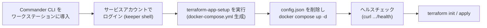
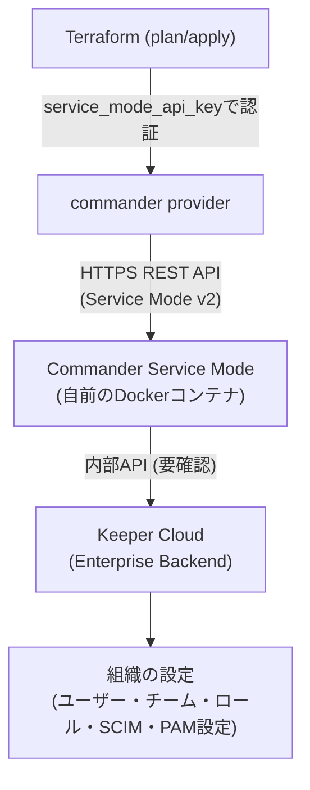

# 【勉強】Keeper — Terraform による IaC（Commander provider編）（2026-09-27）

## 今日のテーマ

Keeper のエンタープライズ設定（ユーザー・チーム・ロール・SCIM 連携など）を Terraform でコード化する方法を学びます。Entra ID 編（azuread / msgraph プロバイダー）、Okta 編（okta プロバイダーと API サービスアプリ）、Ping 編（pingone プロバイダーと Worker アプリ）、Auth0 編（auth0 プロバイダーと M2M アプリ）、IGA 編（ガバナンス設定のコード化）と同じ「Terraform による IaC」テーマの Keeper 版です。

## 概要

Keeper には用途の異なる Terraform プロバイダーが複数公開されています。混同しやすいので、まず整理します。

- **`Keeper-Security/secretsmanager`（KSM provider）**: Keeper Vault に保存済みのシークレット（パスワードや鍵など）を Terraform の実行時に「読み取って使う」ためのプロバイダー。ゼロ知識暗号化のまま、DB のパスワードなどを Terraform 経由で他リソースに注入する用途で使う。
- **`Keeper-Security/commander`（Commander provider）**: Keeper の**エンタープライズ管理コンソールそのもの**（組織のユーザー、チーム、ロール、ノード、SCIM 連携、PAM 設定など）を Terraform のリソースとして宣言的に管理するためのプロバイダー。今日はこちらが本題です。

Commander provider は、Terraform から直接 Keeper クラウドを叩くのではなく、**Keeper Commander の「Service Mode」という REST API サーバーを経由**します。このサーバーはユーザー自身が Docker コンテナとして自分の環境に立てるもので、Terraform はそのローカル（または社内ネットワーク上の）REST API に対して認証・操作を行います。

## 押さえる要点

- **前提条件**: 管理者権限を持つ Keeper Enterprise／MSP アカウントのサービスアカウント、Keeper Commander CLI（`keepercommander`）、Docker、Terraform 1.0 以上が必要です。
- **セットアップの中心はCommander CLI側**: Terraform 側の `provider` ブロックを書く前に、Commander CLI のシェル内で `terraform-app-setup` コマンドを実行し、Service Mode 用の `docker-compose.yml` を生成します。このとき、ポート番号（デフォルト 8900）、外部公開用の ngrok／Cloudflare 設定、レート制限や IP 制限などの Advanced Security オプションを対話的に選びます。
- **認証**: `provider "commander"` ブロックには Service Mode の URL と API キーを指定します（`COMMANDER_SERVICE_MODE_URL` / `COMMANDER_SERVICE_MODE_API_KEY` の環境変数でも指定可能）。
- **代表的なリソース**: `commander_enterprise_user`、`commander_enterprise_team`、`commander_enterprise_role`、`commander_enterprise_node`、`commander_enterprise_scim` のほか、`commander_pam_configuration` や `commander_secrets_manager`、`commander_epm_policy`、各種レコード（Classic/新形式の両方）のリソースが用意されています。
- **MSP環境での注意**: `managed_company` を指定するリソース（配下の管理対象企業を操作）と、指定しないリソース（ログイン中のアカウント自体を操作）を同じ `terraform apply` に混在させると、Terraform が並列実行してしまい競合する可能性があります。`depends_on` で明示的に依存関係を張ることが推奨されています。

## 手順や設定のイメージ

Service Mode の起動までの流れです。



Service Mode が起動したら、Terraform 側は次のように書きます。

```hcl
provider "commander" {
  service_mode_url     = "http://localhost:8080/api/v2/"
  service_mode_api_key = "XXXXXXXXXXXXXX"
  timeout              = 60
}

resource "commander_enterprise_team" "backend" {
  name = "Backend Developers"
  node = "Engineering"
  users = ["alice@example.com", "bob@example.com"]
  roles = ["Developer"]
}
```

全体の構成要素の関係は次のとおりです。



## つまずきやすいところ・注意点

- **KSM providerとの取り違え**: 「Keeper の Terraform」と検索すると、シークレットを読み取るだけの KSM provider（`secretsmanager`）の情報も一緒に出てきます。組織のユーザーやチームを管理したいのか、Vault 内のシークレットを他のリソースに注入したいのかで、選ぶプロバイダーが違う点に注意してください。
- **Service Modeは自分で立てるコンポーネント**: Commander provider は Keeper のマルチテナント SaaS に直接つながるわけではなく、間に自前で構築・運用する Service Mode サーバーが挟まります。この Docker コンテナの可用性やアップデートは利用者側の運用対象になります。
- **config.json の削除を忘れない**: `terraform-app-setup` 実行後、ローカルの Commander 設定ファイル（`~/.keeper/config.json`）を削除してから Docker を起動する手順になっています。残したままだと想定通りに動かない可能性があります。
- **バージョンは執筆時点のもの**: 本記事の `commander` provider は v1.4.0（2026-09-24 公開）、`secretsmanager` provider は v1.3.0（2026-04-24 公開）の情報に基づいています。Terraform Registry の情報は更新されるため、実際に使う際は最新版のドキュメントを確認してください。

## 今日のまとめ

**ミニ辞書**

- **Service Mode**: Keeper Commander を REST API サーバーとして常駐させる動作モード。Commander provider の通信先になる。
- **KSM（Keeper Secrets Manager）**: Vault 内のシークレットをアプリケーションや CI/CD、IaC ツールに安全に取り出すための仕組み、およびそのための Terraform provider（`secretsmanager`）。
- **Ephemeral resource**: Terraform 1.10 以降で使える、tfstate に書き込まれない一時的なリソース。シークレットを扱う際に状態ファイルへの永続化を避けられる。

**理解度チェック**

1. Commander provider が Terraform からの操作を受け付けるために、事前にどのようなコンポーネントを自分で構築しておく必要があるでしょうか。
2. KSM provider（secretsmanager）と Commander provider は、それぞれ何を管理対象にしている違うプロバイダーでしょうか。
3. MSP 環境で `managed_company` を使うリソースと使わないリソースを混在させるとき、なぜ `depends_on` が必要になるのでしょうか。

## 参考リンク

- [Terraform Provider for Commander | Keeper Documentation Portal](https://docs.keeper.io/keeperpam/secrets-manager/integrations/terraform-provider-commander)
- [Terraform Provider for KSM | Keeper Documentation Portal](https://docs.keeper.io/keeperpam/secrets-manager/integrations/terraform)
- [Keeper-Security/commander provider | Terraform Registry](https://registry.terraform.io/providers/Keeper-Security/commander/latest/docs)
- [Keeper-Security/secretsmanager provider | Terraform Registry](https://registry.terraform.io/providers/Keeper-Security/secretsmanager/latest/docs)
- [GitHub - Keeper-Security/terraform-provider-commander](https://github.com/Keeper-Security/terraform-provider-commander)
