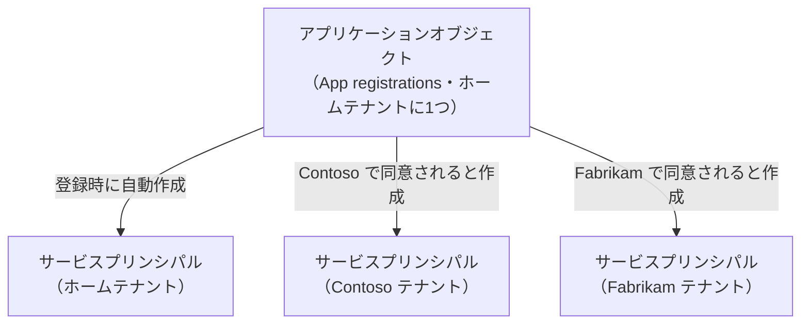
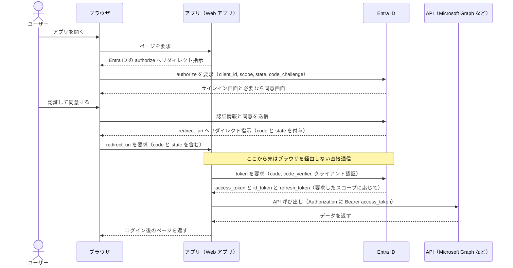

# 【勉強】Microsoft Entra ID — OIDC／OAuth 2.0 とアプリ登録・同意（2026-09-29）

## 今日のテーマ

Entra ID に「アプリ」を載せるときの土台を学びます。アプリ登録（アプリケーションオブジェクト）とサービスプリンシパルの関係、OpenID Connect（OIDC）／OAuth 2.0 の認可コードフロー、そして「同意（Consent）」の仕組みです。これまでの Entra ID 編で扱った SAML 型の SSO とは違い、OIDC／OAuth 2.0 は最近の Web アプリ・SPA・モバイルアプリ・API 連携の主役になるプロトコルです。

## 概要

まず用語を整理します。OAuth 2.0 は「アプリに、ユーザーの代わりに API を呼ぶ権限（認可）を渡す」ための仕組みです。OIDC は OAuth 2.0 の上に「ユーザーが誰か（認証）」を伝える **ID トークン**を足した仕組みで、Entra ID では OIDC を「OAuth 対応アプリ間の SSO を実現する認証プロトコル」として提供しています。インフラの言葉に置き換えると、OAuth 2.0 が「合鍵（アクセストークン）を発行する仕組み」、OIDC が「その合鍵に身分証（ID トークン）を添える仕組み」です。

Entra ID がアプリを扱うときは、アプリを次の2つのオブジェクトで表現します。

- **アプリケーションオブジェクト**: アプリの「設計図」。アプリを登録したテナント（ホームテナント）に1つだけ存在し、どうやってトークンを発行するか、どのリソースにアクセスするか、何ができるかを定義します。管理画面では **App registrations** に出てきます。
- **サービスプリンシパル**: 設計図から作られる、各テナント内での「実体（インスタンス）」。そのテナントで、アプリが実際に何をでき、誰が使え、どのリソースにアクセスできるかを決めます。管理画面では **Enterprise applications** に出てきます。

プログラミングで言えば、アプリケーションオブジェクトが「クラス」、サービスプリンシパルが「インスタンス」です。

下の図は、1つのマルチテナントアプリ（複数の組織が使う SaaS など）が、利用する組織ごとにサービスプリンシパルを持つ様子です。公式の例では各組織の管理者が同意していますが、アプリの設計によっては個々のユーザーの同意でも作られます。



## 押さえる要点

- **登録すると両方できる（ただし例外あり）**: ポータルでアプリを登録すると、アプリケーションオブジェクトとサービスプリンシパルが自動で作られます。Microsoft Graph API で登録する場合は、サービスプリンシパルの作成が別のステップになります。
- **削除・復元の非対称性**: アプリケーションオブジェクトを削除すると、ホームテナントのサービスプリンシパルも消えます。しかし、App registrations 画面からアプリを復元しても、サービスプリンシパルは復元されません。一時的に止めたいだけなら、削除せずアプリを「無効化（deactivate）」する方法があります。
- **サービスプリンシパルの3種類**: Application（アプリのインスタンス）、Managed identity（資格情報の管理が不要になる特殊なもの。アプリケーションオブジェクトを持たない）、Legacy（アプリ登録の仕組みができる前の古いアプリ）があります。
- **委任されたアクセス許可とアプリケーションのアクセス許可**: アプリが API を呼ぶ権限には2種類あります。委任されたアクセス許可（スコープ）は「サインインしたユーザーの代わりに」動くもので、ユーザー本人がアクセスできる範囲を超えられません。アプリケーションのアクセス許可（アプリロール）は「ユーザーなしでアプリ自身として」動くもので、たとえば Graph の `Files.Read.All` を付ければテナント内の全ファイルを読めます。後者に同意できるのは原則として管理者だけです。
- **同意（Consent）**: 権限をアプリに与える承認のプロセスです。ユーザー同意は、サインイン時に権限の一覧が表示されて本人が承認するもの。管理者同意は、管理者が組織全体（または特定ユーザー）の代わりに承認するもので、同意済みの権限については、ユーザーに同意画面が出なくなります（管理者が未同意の権限を追加で要求した場合などを除く）。高権限のアクセス許可は管理者同意が必要です。
- **ユーザー同意の設定**: 管理者は「ユーザー同意を無効にする」「検証済み発行元のアプリまたは自テナントに登録されたアプリで、管理者が選んだ低影響の権限だけ許可する」「権限が管理者同意を要しないすべてのアプリを許可する」の組み込みオプションから選べます。ユーザーが同意できないときは、**管理者同意ワークフロー**（ユーザーが承認申請を出し、指定レビュアーが承認する）を使えます。
- **テナント全体への管理者同意は慎重に**: 公式ドキュメントでも、発行元とアプリが要求する権限の理由を理解できないなら同意しないよう警告されています。

## 手順や設定のイメージ

### 1. OIDC の入口は「メタデータ URL」

OIDC 対応の IdP は、エンドポイント一覧と署名鍵の場所を返す公開 URL（Discovery ドキュメント）を持っています。アプリ側ライブラリは、通常これを読んで設定を自動で済ませます。

```bash
curl https://login.microsoftonline.com/common/v2.0/.well-known/openid-configuration
```

返ってくる JSON には `authorization_endpoint`、`token_endpoint`、`jwks_uri`（署名検証用の公開鍵）、`userinfo_endpoint` などが入っています。パスの `{tenant}` 部分には、`common`（個人アカウントと職場・学校アカウント）、`organizations`（職場・学校アカウントのみ）、`consumers`（個人アカウントのみ）、または特定のテナント ID／ドメイン名を入れ、サインインを許可する範囲を決めます。

### 2. 認可コードフロー（PKCE 付き）の流れ

Web アプリがユーザーをサインインさせて API を呼ぶまでの流れです。重要なのは、**ユーザーのブラウザが、アプリと Entra ID の間の橋渡し役（リダイレクトの中継）になる**点です。アプリと Entra ID が直接話すのは、最後のトークン取得の1回だけです。



上の図のポイントを補足します。

- **認可コードは短命**: `/authorize` から返る `code` は通常約1分で失効します。これをアプリが `/token` に持ち込んで、アクセストークンに交換します。
- **PKCE（ピクシー）**: `code_challenge`（`code_verifier` から作ったハッシュ）を最初に送り、コード交換時に元の `code_verifier` を示す仕組みです。コードが途中で盗まれても、元の値を知らない攻撃者は交換できません。Entra ID では全アプリタイプで推奨されており、SPA では必須です。
- **`state`**: リクエストとレスポンスを結び付ける値で、CSRF（他サイトからの不正リクエスト）対策になります。アプリは戻ってきた値が一致することを確認します。
- **トークンの中身はスコープ次第**: `id_token` は `openid` スコープを要求したときだけ、`refresh_token` は `offline_access` スコープを要求したときだけ返ります。
- **クライアント認証**: Web アプリのような機密クライアントは、クライアントシークレットか証明書で自分を証明します。証明書のほうが安全なので推奨されています。SPA やネイティブアプリのような公開クライアントは、シークレットや証明書を使ってはいけません。

### 3. アプリ登録の主な設定項目

Entra 管理センターの **Entra ID > App registrations** で新規登録し、次を設定します。

1. 名前と、サインインできるアカウントの種類（単一テナントか、マルチテナントか）
2. **Authentication** で、プラットフォーム（Web、SPA、モバイル／デスクトップなど）とリダイレクト URI を登録
3. 資格情報（シークレットまたは証明書）を追加（機密クライアントの場合）
4. 必要な API のアクセス許可を追加し、必要に応じて管理者同意を付与

登録後に、アプリに紐づくサービスプリンシパルを CLI で確認する例です。

```bash
az ad sp list --filter "appId eq '<アプリケーション(クライアント)ID>'"
```

PowerShell の場合は `Get-MgServicePrincipal -Filter "appId eq '<アプリケーション(クライアント)ID>'"` でも確認できます。

## つまずきやすいところ・注意点

- **App registrations と Enterprise applications の混同**: 前者がアプリケーションオブジェクト、後者がサービスプリンシパルです。「割り当て」「ユーザーの同意状況」「サインインログ」は Enterprise applications 側で見るものです。
- **アプリケーション ID とオブジェクト ID は別物**: アプリケーション ID（クライアント ID）はグローバルなアプリを識別する ID で、複数テナントのサービスプリンシパルでも共通です。一方、オブジェクト ID は各オブジェクトごとの ID です。Graph API などで扱うときは、どちらを指定する場面か確認しましょう。
- **ID トークンが返らないエラー**: 認可エンドポイントから直接 ID トークンを受け取る構成（インプリシット／ハイブリッド）では、アプリ登録の Authentication で「ID tokens」を有効にしないと `unsupported_response` 系のエラーになります。ただし新規には認可コードフロー＋PKCE を使うのが推奨で、インプリシットフローは推奨されません。
- **リダイレクト URI は完全一致が原則**: リクエストの `redirect_uri` は、登録済みの値と（URL エンコードを除いて）完全に一致する必要があります。SPA は種類を `spa` にしないと、トークン交換で CORS エラー（ブラウザが別オリジンへのリクエストを拒否するエラー）になります。
- **SPA のリフレッシュトークンは24時間**: `spa` リダイレクト URI に発行されたリフレッシュトークンは24時間で失効し、以後は再度の認証が必要です。
- **他人が管理する API のトークンを解析しない**: Microsoft サービス向けのトークンは JWT として検証できない形式や暗号化された形式があり得るため、アプリ側で中身に依存してはいけません。
- **サインアウトは2段階**: ログアウト URI へのリダイレクトと、アプリ自身のセッション破棄の両方が必要です。片方だけだと、ユーザーがログインしたままになります。

## 今日のまとめ

### ミニ辞書

- **アプリケーションオブジェクト**: アプリの設計図（ホームテナントに1つ）。
- **サービスプリンシパル**: 各テナントでのアプリの実体。権限や割り当てはこちらに紐づく。
- **委任されたアクセス許可**: ユーザーの代わりに動く権限（スコープ）。
- **アプリケーションのアクセス許可**: ユーザーなしでアプリ自身として動く権限（アプリロール）。
- **同意（Consent）**: アプリへの権限付与をユーザーまたは管理者が承認すること。
- **認可コードフロー**: 短命のコードを経由してトークンを受け取る、推奨されるフロー。
- **PKCE**: 認可コードの横取りを防ぐ仕組み。
- **ID トークン**: 誰がサインインしたかを表す JWT（OIDC で追加）。
- **アクセストークン**: API を呼ぶための Bearer トークン。

### 理解度チェック

1. アプリケーションオブジェクトを削除したあと、App registrations から復元したとき、ホームテナントのサービスプリンシパルはどうなりますか。
2. 認可コードフローで、ユーザーのブラウザを経由しない通信はどの部分ですか。また、それはなぜ安全上重要ですか。
3. 「ユーザーなしで夜間バッチが Graph を呼ぶ」場合、委任されたアクセス許可とアプリケーションのアクセス許可のどちらを使いますか。また、同意できるのは誰ですか。

## 参考リンク

- [Application and service principal objects in Microsoft Entra ID](https://learn.microsoft.com/en-us/entra/identity-platform/app-objects-and-service-principals)
- [OpenID Connect on the Microsoft identity platform](https://learn.microsoft.com/en-us/entra/identity-platform/v2-protocols-oidc)
- [Microsoft identity platform and OAuth 2.0 authorization code flow](https://learn.microsoft.com/en-us/entra/identity-platform/v2-oauth2-auth-code-flow)
- [Overview of permissions and consent in the Microsoft identity platform](https://learn.microsoft.com/en-us/entra/identity-platform/permissions-consent-overview)
- [Overview of user and admin consent](https://learn.microsoft.com/en-us/entra/identity/enterprise-apps/user-admin-consent-overview)
