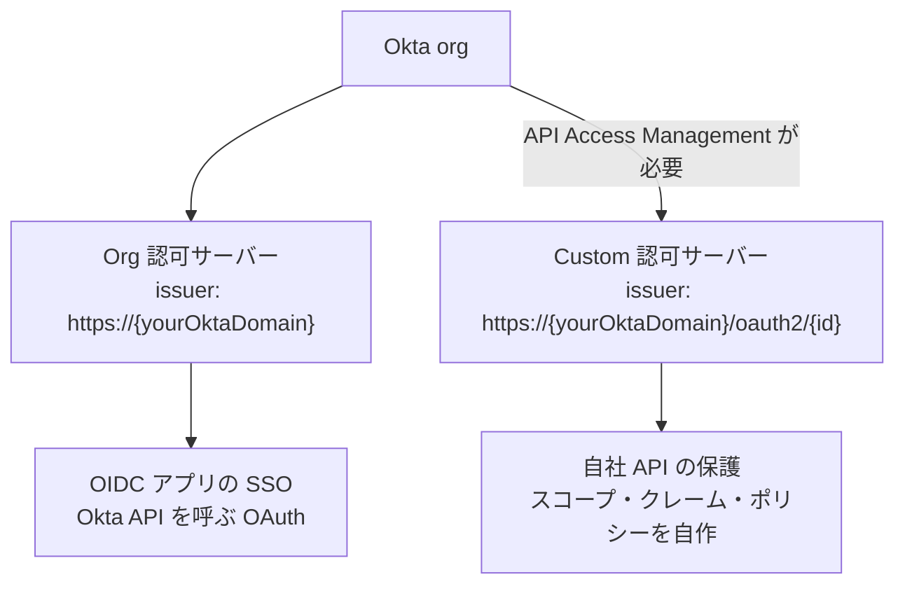
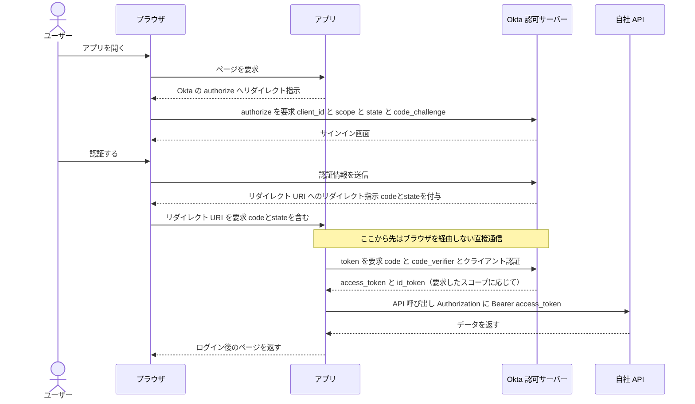

# 【勉強】Okta Workforce Identity Cloud — OIDC／OAuth 2.0 と認可サーバー（Org／Custom・アクセスポリシー）（2026-09-29）

## 今日のテーマ

Okta Workforce Identity Cloud（以下 Okta）で OIDC／OAuth 2.0 を扱うときの土台を学びます。「認可サーバー（Authorization Server）」が2種類（Org と Custom）あること、OIDC アプリ連携の作り方、そして Custom 認可サーバーで API を守るための「スコープ・クレーム・アクセスポリシー」です。SAML 型の SSO とは別系統の、API 連携やモダンなアプリの主役になる仕組みです。

## 概要

OAuth 2.0 は「アプリに、ユーザーの代わりにリソース（API）へアクセスする権限を渡す」ための認可の仕組みです。OIDC（OpenID Connect）はその上に「誰がサインインしたか」を伝える **ID トークン**を足した仕組みで、SSO を実現します。インフラの言葉なら、OAuth 2.0 が「合鍵（アクセストークン）の発行ルール」、OIDC が「合鍵に添える身分証（ID トークン）」です。

OAuth 2.0 には4つの役割が登場します。クライアント（トークンを要求するアプリ）、リソースサーバー（守られる API やデータ）、リソースオーナー（データの持ち主であるユーザー）、そして認可サーバー（本人確認をしてトークンを発行する主体）です。Okta はこのうち認可サーバーの役割を担います。

Okta の認可サーバーには2種類あります。

- **Org 認可サーバー**: どの Okta org にも組み込まれている認可サーバーです。Okta 自身がリソースサーバーとなる場面（OIDC アプリの SSO、OAuth 2.0 で Okta API を呼ぶ場面）で使います。issuer は `https://{yourOktaDomain}` です。
- **Custom 認可サーバー**: 自社の API を守るためのサーバーです。API Access Management の契約（または Okta Integrator Free Plan の org）が前提です。issuer は `https://{yourOktaDomain}/oauth2/{authorizationServerId}` です。スコープ、クレーム、アクセスポリシーを自分で定義できます。

上の図は、1つの org の中に用途の違う2種類の認可サーバーがあり、どちらを使うかで得意なことが変わる関係を表しています。

## 押さえる要点

- **Org 認可サーバーはカスタマイズが限定的**: 自由なカスタムクレームとカスタムスコープは Custom 認可サーバーが前提です。Org 認可サーバーではカスタムスコープを定義できず、クレームの追加も ID トークンの groups クレーム程度に限られます（公式ページ間で記述に差があるため、細部は実環境で確認してください）。また、Org 認可サーバーが OIDC アプリ向けに発行するトークンの有効期限は固定で、ID トークンとアクセストークンが60分、リフレッシュトークンが90日です。Custom 認可サーバーでは、アクセストークンとリフレッシュトークンの有効期限をアクセスポリシーのルールで設定できます（ID トークンは60分固定）。
- **default 認可サーバー**: Okta Integrator Free Plan の org と API Access Management の契約者には、名前が `default` の Custom 認可サーバーが最初から用意されています。削除はできませんが、無効化や名前の変更は可能です。
- **推奨フローは認可コード＋PKCE**: Okta は、Web・SPA・ネイティブのいずれのアプリでも「認可コードフロー＋PKCE」を推奨しています。サーバー間（マシン間）通信は Client Credentials フローで、この場合はアクセストークンのみが発行されます。
- **アクセストークンと ID トークンの役割**: アクセストークンは「API を呼んでよいか」を API 側が判断するためのもの、ID トークンは「ユーザーが誰か」をアプリに伝えるものです。
- **アクセスポリシーとルール**: Custom 認可サーバーでは、アクセスポリシーを特定のクライアント（OIDC アプリ）に紐づけ、その中のルールで「どの付与タイプ・どのユーザー・どのスコープ・トークン有効期限にするか」を決めます。ポリシーもルールも優先順位順に評価され、最初に一致したものが適用されて、以降の評価は行われません。一致するポリシーがなければ認証は失敗します。
- **スコープの設計**: 公式は、汎用的な管理者スコープではなく `com.okta.product1.admin` のような名前空間付きのスコープを推奨しています。ポリシーへの「All Clients」割り当ても、必要な場合を除き避けるよう勧めています。

## 手順や設定のイメージ

### 1. OIDC アプリ連携を作る

管理コンソールでアプリ連携を作成し、サインイン方式に「OIDC - OpenID Connect」を選びます。アプリケーションの種類は Web アプリケーション、SPA、ネイティブアプリケーションから選びます。主な設定項目は次のとおりです。

1. **サインインリダイレクト URI**: Okta が認証レスポンスと ID トークンを返す宛先です。絶対 URI で指定します。ワイルドカードはサインイン側でのみ、かつ設定で許可した場合に限り使えますが、推奨されません。
2. **サインアウトリダイレクト URI**: セッション終了後にユーザーを戻す宛先です。
3. **クライアント認証**: クライアントシークレット、公開鍵／秘密鍵、または「なし」（SPA やネイティブ向け）から選びます。「なし」を選ぶ場合、PKCE は必須です。
4. **割り当て（Assignments）**: 全員に許可するか、特定グループに限定するかを選びます。

### 2. Custom 認可サーバーでスコープ・クレーム・ポリシーを作る

管理コンソールの **Security > API** から認可サーバーを選び、次を設定します。

1. **Scopes**: API ごとの権限（スコープ）を追加します。
2. **Claims**: **Claims > Add Claim** でトークンに載せる項目を追加します。トークンの種類（ID トークンかアクセストークン）を選び、値は Okta Expression Language（例: `user.email` のようなユーザー属性）またはグループフィルターで指定します。式は最大1024文字で、Token Preview タブで結果を確認できます。
3. **Access Policies**: **Add Policy** で対象クライアントを指定して作成し、**Add Rule** で付与タイプ、ユーザー、スコープ、アクセストークンの有効期限を設定します。

### 3. 認可コードフロー（PKCE）の流れ

Web アプリがユーザーをサインインさせて API を呼ぶ流れです。**ユーザーのブラウザがアプリと Okta の間の中継役（リダイレクトの運び役）を務める**点が重要です。アプリと Okta が直接通信するのは、コードをトークンに交換するときだけです。

補足として、PKCE は最初に `code_challenge`（`code_verifier` のハッシュ）を送り、コード交換時に元の `code_verifier` を示す仕組みです。認可コードが途中で盗まれても、元の値を知らない攻撃者はトークンに交換できません。Okta は、この仕組みが認可コードの注入攻撃を防ぐため「すべての OAuth クライアントに最適」と説明しています。

## つまずきやすいところ・注意点

- **Org と Custom の取り違え**: 自社 API を守りたいのに Org 認可サーバーを使うと、カスタムスコープや自由なクレームを使えません（groups クレーム程度に限られます）。トークンの `iss`（発行者）と、API 側が検証する issuer が一致しているかも確認します。
- **ポリシーの「最初に一致したものだけ」**: 優先順位の高いルールが広く一致すると、意図した下位のルールに到達しません。アクセスポリシーのルールは許可リストとして働くので、意図しないスコープを許すルールが混ざっていないか点検します。
- **ポリシー未割り当てだと失敗する**: クライアントに一致するポリシーがなければ、認証は失敗しエラーが返ります。新しいアプリを追加したら、ポリシーへの紐づけを忘れないようにします。
- **All Clients は避ける**: 便利ですが、意図しないアプリにまで同じ権限が広がります。
- **ライセンス**: Custom 認可サーバーは API Access Management の契約が前提です。検証環境で動いても本番で使えるとは限らないため、契約範囲を確認します。

## 今日のまとめ

### ミニ辞書

- **認可サーバー**: 本人確認をしてトークンを発行する主体。Okta には Org と Custom がある。
- **Org 認可サーバー**: 全 org に組み込み。OIDC アプリの SSO や Okta API 向け。
- **Custom 認可サーバー**: 自社 API 保護用。スコープ・クレーム・ポリシーを定義できる（API Access Management が必要）。
- **スコープ**: アプリに与える権限の単位。
- **クレーム**: トークンに含まれる、ユーザーやアプリに関する項目。
- **アクセスポリシー／ルール**: どのクライアントに、どの条件でトークンを発行するかを決める。優先順位順に評価され、最初の一致のみ適用。
- **PKCE**: 認可コードの横取り・注入を防ぐ仕組み。

### 理解度チェック

1. 自社 API 用にカスタムスコープと自由なクレームを使いたいとき、Org と Custom のどちらの認可サーバーを使いますか。理由も答えてください。
2. 認可コードフローで、ブラウザを経由せずに行われる通信はどこですか。
3. アクセスポリシーに一致するルールが複数あるとき、どれが適用されますか。一致するポリシーが1つもない場合はどうなりますか。

## 参考リンク

- [Authorization servers | Okta Developer](https://developer.okta.com/docs/concepts/auth-servers/)
- [OAuth 2.0 and OpenID Connect overview | Okta Developer](https://developer.okta.com/docs/concepts/oauth-openid/)
- [API Access Management | Okta Developer](https://developer.okta.com/docs/concepts/api-access-management/)
- [Configure an access policy | Okta Developer](https://developer.okta.com/docs/guides/configure-access-policy/main/)
- [Customize tokens returned from Okta with custom claims | Okta Developer](https://developer.okta.com/docs/guides/customize-tokens-returned-from-okta/main/)
- [OIDC app integration wizard fields | Okta Help Center](https://help.okta.com/oie/en-us/content/topics/apps/apps_app_integration_wizard_oidc.htm)
- [OpenID Connect & OAuth 2.0 API | Okta Developer](https://developer.okta.com/docs/api/openapi/okta-oauth/guides/overview)
