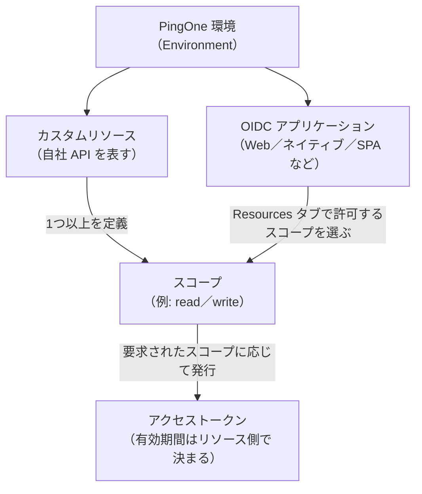
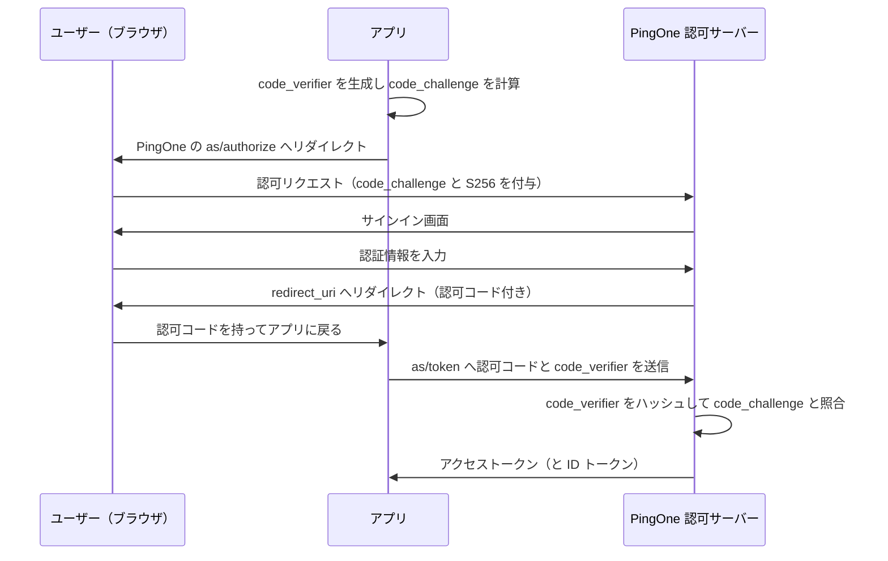

# 【勉強】Ping Identity — OIDC／OAuth 2.0 とアプリ・カスタムリソース（PKCE・スコープ）（2026-09-30）

## 今日のテーマ

Ping Identity の SaaS である PingOne で OIDC／OAuth 2.0 を扱うための土台を学びます。具体的には、OIDC アプリケーションの主要な設定項目（グラントタイプ・PKCE・トークンエンドポイント認証方式）と、自社 API を守るための「カスタムリソース」と「スコープ」です。Entra ID 編・Okta 編と同じテーマの Ping 版です。

## 概要

OAuth 2.0 は「アプリに、ユーザーの代わりに API へアクセスする権限（アクセストークン）を渡す」ための仕組みで、OIDC（OpenID Connect）はその上に「誰がサインインしたか」を示す ID トークンを足して SSO を実現する仕組みです。インフラの言葉なら、アクセストークンが「合鍵」、ID トークンが「合鍵に添える身分証」です。

PingOne では、環境（Environment）ごとに認可サーバー（トークンを発行する主体）が用意されています。アプリは次のエンドポイントを使います。`{envID}` は環境 ID です。

- 認可エンドポイント: `https://auth.pingone.com/{envID}/as/authorize`
- トークンエンドポイント: `https://auth.pingone.com/{envID}/as/token`

上記は公式ワークフローで使われるホスト名の例です（公式では `{authPath}` と表記）。リージョンやカスタムドメインの設定によってホスト名は変わるため、自環境の値は管理コンソールで確認してください（要確認）。

OIDC Discovery（アプリが認可サーバーの設定を自動取得する仕組み）の URL は、OpenID Provider の issuer 値に `/.well-known/openid-configuration` を付けた形式です（OIDC Discovery 1.0 の仕様どおり）。

PingOne の「守られる側」は**リソース**という単位で表されます。アプリは「どのリソースのどのスコープが欲しいか」を要求し、PingOne がそれに応じたアクセストークンを出します。



上の図は、アプリにスコープを割り当てることで、アプリがどのリソースにアクセスできるかが決まる関係を表しています。

## 押さえる要点

- **グラントタイプ（トークンの取り方）**: PingOne は Authorization code、Implicit、Client credentials、Device authorization、CIBA、Refresh token、Token exchange をサポートします。Web アプリの基本は Authorization code で、認可コードの有効期限は10分です。
- **PKCE（Proof Key for Code Exchange）**: 認可コードを横取りされても悪用できなくする仕組みです。アプリが毎回ランダムな `code_verifier` を作り、そのハッシュ（`code_challenge`）を認可リクエストに付け、トークン交換時に元の値を提示します。PKCE 強制は Authorization code グラントにだけ適用され、設定値は Optional、Required、S256_required の3つです。`plain` 方式は許可されていても避けるよう公式が書いています。
- **トークンエンドポイント認証方式**: アプリ自身が誰かを PingOne に示す方法です。CLIENT_SECRET_POST、CLIENT_SECRET_BASIC、CLIENT_SECRET_JWT（HS256／384／512 で署名）、PRIVATE_KEY_JWT（RS256／384／512 で署名）の4種類に加え、コンソールでは「None」も選べます。秘密を持てないアプリ（PKCE を使う公開クライアント）は None を使います。
- **カスタムリソース**: Audience（省略するとリソース名になる）、アクセストークン有効期間（既定は1時間）、属性マッピング、スコープを持ちます。
- **リフレッシュトークン**: アクセストークン期限切れ後に再サインインなしで更新するための券です。既定の有効期間は30日、ローリング期間は180日です。
- **offline_access スコープ**: リフレッシュトークングラントを使うアプリにこのスコープを追加すると、リクエストでスコープを指定したときだけリフレッシュトークンが返ります。追加しないと、毎回リフレッシュトークンが返ります。

## 手順や設定のイメージ

**① 認可コード＋PKCE の流れ**

ポイントは、認可コードもブラウザ経由で戻ってくることと、トークン交換だけはアプリが PingOne と直接通信することです。



この図は、認可コードはユーザーのブラウザを経由して渡り、code_verifier は最後のトークン交換でアプリから PingOne へ直接送られることを表しています。

認可リクエストの例です（公式の PKCE ワークフローより）。

```
GET https://auth.pingone.com/{envID}/as/authorize
  ?response_type=code
  &client_id={appID}
  &redirect_uri={redirect_uri}
  &scope=openid
  &code_challenge={codeChallenge}
  &code_challenge_method=S256
```

トークン交換の例です。

```
POST https://auth.pingone.com/{envID}/as/token
Content-Type: application/x-www-form-urlencoded

grant_type=authorization_code
&code={authCode}
&redirect_uri={redirect_uri}
&client_id={appID}
&code_verifier={codeVerifier}
```

**② コンソールでの設定の流れ**

1. Applications > Resources でカスタムリソースを作成し、名前・Audience・アクセストークン有効期間・スコープを設定する。
2. Applications > Applications で OIDC アプリを開き、Configuration タブでグラントタイプ、PKCE Enforcement、Redirect URIs、Token Endpoint Authentication Method を設定する。
3. Resources タブで、手順1で作ったスコープにチェックを入れる。
4. Policies タブで認証ポリシーを選び、アプリを有効化（トグル）する。

## つまずきやすいところ・注意点

- **アクセストークンの有効期間はアプリではなくリソースで決まる**: 既定値を変えたい場合は、カスタムリソースを作り、そのスコープをアプリに追加する必要があります。
- **複数リソースのスコープを同時に要求するには条件がある**: 「Request scopes to access multiple resources」を有効にし、対象リソース間でアクセストークン有効期間、sub 属性のマッピング、同名属性のマッピングを揃え、スコープ名を一意にします。揃っていないとエラーになります。
- **Redirect URI にフラグメント（`#`）は使えない**: 登録値との不一致はエラーの定番原因です。
- **2027年3月の切り替えに備える**: 2027年3月2日以降、リフレッシュトークンは不透明（opaque）トークンのみになり、JWT 形式は廃止されます。2027年3月1日までに既存アプリの更新が必要と公式が案内しています。同日以降、UserInfo エンドポイント・PingOne API・カスタムリソース向けのアクセストークンには、ヘッダーに `typ` が値 `at+jwt` で常に含まれ、`x5t` ヘッダーの設定も廃止されます（常に付与）。リソース側の検証ロジックの確認が必要です。
- **公式の PKCE 例は公開クライアント前提**: API ドキュメントは、PKCE フローの例ではアプリの tokenEndpointAuthMethod を NONE にする必要があると書いています。

## 今日のまとめ

**ミニ辞書**

- **認可サーバー**: 本人確認のうえでトークンを発行する主体（PingOne 環境内にある）。
- **リソース／スコープ**: 守られる API とその中の操作単位。アプリは必要なスコープだけを要求する。
- **PKCE**: 認可コードの横取りを防ぐ仕組み。code_challenge と code_verifier の組で使う。
- **opaque リフレッシュトークン**: 中身を読めない文字列だけのリフレッシュトークン。JWT と違いデジタル署名が不要。

**理解度チェック**

1. PKCE の code_verifier は、認可リクエストとトークン交換のどちらで PingOne に送られますか。
2. アクセストークンの有効期間を既定の1時間から変えたいとき、どこで何を作る必要がありますか。
3. リフレッシュトークンを「必要なときだけ」受け取りたい場合、アプリにどのスコープを追加しますか。

（答え: 1 はトークン交換。2 はカスタムリソースで、有効期間を設定してスコープをアプリに追加する。3 は offline_access。）

## 参考リンク

- [Grant types | PingOne](https://docs.pingidentity.com/pingone/applications/p1_grant_types.html)
- [PKCE enforcement | PingOne](https://docs.pingidentity.com/pingone/applications/p1_pkce_enforcement.html)
- [PKCE parameters | PingOne Platform APIs](https://developer.pingidentity.com/pingone-api/foundations/authentication-concepts/authorization-flow-by-grant-type/pkce-parameters.html)
- [Token endpoint authentication methods | PingOne](https://docs.pingidentity.com/pingone/applications/p1_token_endpoint_authentication_methods.html)
- [Adding a custom resource | PingOne](https://docs.pingidentity.com/pingone/applications/p1_adding_custom_resource.html)
- [Customizing access token lifetime | PingOne](https://docs.pingidentity.com/pingone/applications/p1_customizing_access_token_lifetime.html)
- [Refresh tokens | PingOne](https://docs.pingidentity.com/pingone/applications/p1_refresh_tokens.html)
- [Editing an application - OIDC | PingOne](https://docs.pingidentity.com/pingone/applications/p1_edit_application_oidc.html)
- [Discovery document URI | PingOne](https://docs.pingidentity.com/pingone/integrations/p1_discovery_document_uri.html)
