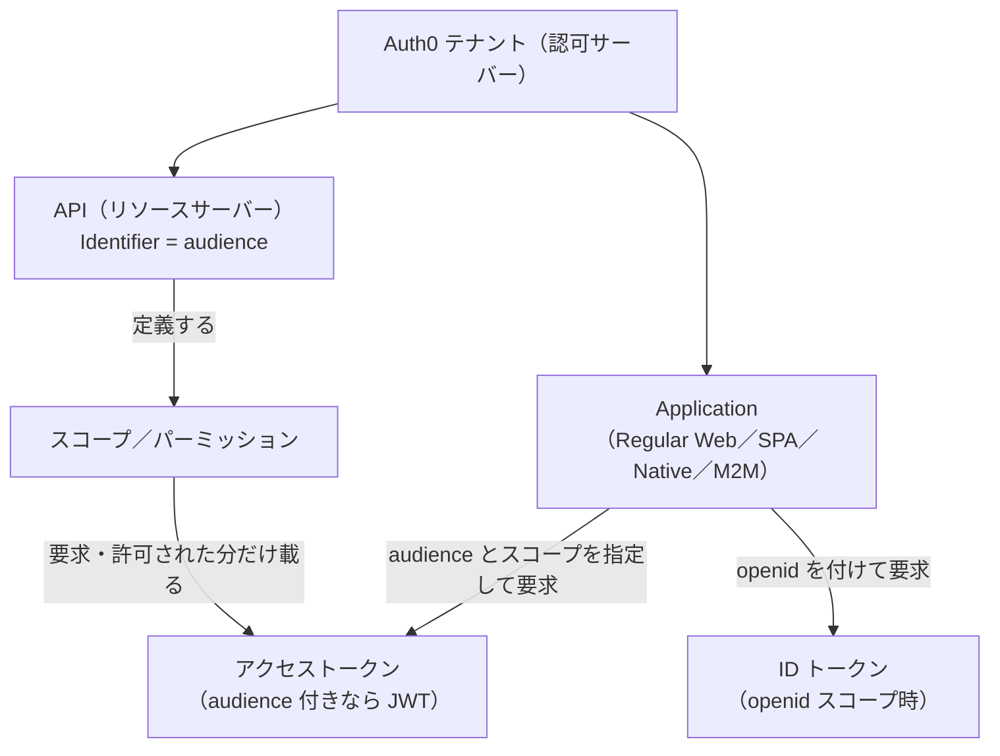
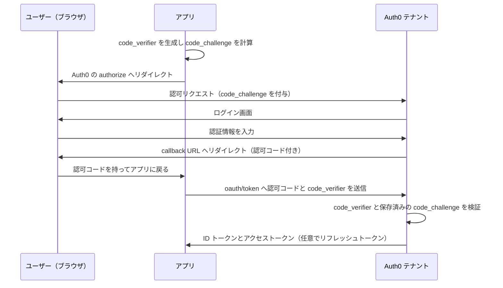

# 【勉強】Okta Customer Identity Cloud (Auth0) — OIDC／OAuth 2.0 とアプリケーション・API（audience・スコープ・リフレッシュトークン）（2026-10-01）

## 今日のテーマ

Auth0（Okta Customer Identity Cloud）で OIDC／OAuth 2.0 を扱うための土台を学びます。具体的には、アプリケーションの種類と使うフロー、自社 API を表す「API（リソースサーバー）」と audience、スコープ、リフレッシュトークンです。Entra ID 編・Okta 編・Ping 編と同じテーマの Auth0 版です。なお、Auth0 のテナントは M2M アプリでの Terraform 管理（9/24 の記事）で触れましたが、今日は「ユーザーがサインインするアプリ」側のフローが中心です。

## 概要

OAuth 2.0 は「アプリに、ユーザーの代わりに API へアクセスする権限（アクセストークン）を渡す」仕組みです。OIDC（OpenID Connect）はその上に「誰がサインインしたか」を示す ID トークンを足して SSO を実現します。インフラの言葉なら、アクセストークンが「合鍵」、ID トークンが「合鍵に添える身分証」です。

Auth0 のテナントは認可サーバー（トークンを発行する主体）として動きます。アプリが使う主なエンドポイントは次のとおりです。`{yourDomain}` は自分のテナントのドメインです。

- 認可エンドポイント: `https://{yourDomain}/authorize`
- トークンエンドポイント: `https://{yourDomain}/oauth/token`
- UserInfo エンドポイント: `https://{yourDomain}/userinfo`

Auth0 側の登場人物は大きく2つです。**Application**（トークンを欲しがるアプリ）と、**API**（Auth0 が守る自社 API を登録したもの。OAuth 2.0 用語ではリソースサーバー）です。アプリは API の識別子（Identifier）を **audience** パラメーターで指定して、「この API 向けのトークンをください」と要求します。



この図は、アプリが audience とスコープを指定して要求し、Auth0 が API の定義に沿ってトークンを発行する関係を表しています。

## 押さえる要点

- **アプリケーションタイプは4種類**: Regular Web App、Single Page App、Native App、Machine to Machine です。Regular Web App と M2M は秘密情報を安全に持てる「機密（confidential）クライアント」（既定。認証方式を None にすると機密扱いではなくなります）、SPA と Native は持てない「公開（public）クライアント」に分類されます。
- **使うフローはタイプで決まる**: Regular Web App は Authorization Code フロー、SPA と Native は Authorization Code フロー＋PKCE、M2M は Client Credentials フローです。SPA でアクセストークンが不要な場合に限り Implicit フロー（Form Post）も選べますが、トークンが必要なら公式は PKCE を推奨しています。
- **トークンエンドポイント認証方式**: 機密クライアントは Basic、Post、Private Key JWT などでクライアント自身を証明し、公開クライアントは None（認証なし）になります。
- **audience を付けるかで中身が変わる**: audience を省略すると、`/userinfo` 用の不透明（opaque）トークンが返ります。自社 API 向けのアクセストークンは JWT です。毎回 audience を書きたくない場合は、テナント設定で既定の audience を決められます。
- **スコープ**: `openid` は OIDC（ID トークンや `/userinfo`）を使うために必要で、ID トークンの `sub` などが返ります。`profile` は name や picture など、`email` は email と email_verified です。リクエストにスコープがなければ、Actions で後から追加しようとしても該当クレームはトークンから取り除かれます。
- **有効期間の既定値**: 自社 API のアクセストークンは86400秒（24時間、API ごとの設定で最大2592000秒）、アプリの ID トークンは36000秒（10時間）です。
- **API 側の主な設定**: Identifier（作成後は変更不可）、JWT 署名アルゴリズム（HS256 または RS256。RS256 を推奨）、JWT プロファイル（Auth0 または RFC 9068）、RBAC の有効化、Allow Skipping User Consent、Allow Offline Access などがあります。

## 手順や設定のイメージ

**① Authorization Code＋PKCE の流れ**

ポイントは、認可コードもブラウザ経由で戻ってくることと、トークン交換だけはアプリが Auth0 と直接通信することです。



この図は、認可コードはユーザーのブラウザを経由して渡り、code_verifier は最後のトークン交換でアプリから Auth0 へ直接送られることを表しています。

認可リクエストの例です。

```
GET https://{yourDomain}/authorize
  ?response_type=code
  &client_id={clientId}
  &redirect_uri={callbackUrl}
  &scope=openid profile email offline_access
  &audience={apiIdentifier}
  &code_challenge={codeChallenge}
  &code_challenge_method=S256
  &state={state}
```

トークン交換の例です。

```
POST https://{yourDomain}/oauth/token
Content-Type: application/x-www-form-urlencoded

grant_type=authorization_code
&client_id={clientId}
&code={authorizationCode}
&code_verifier={codeVerifier}
&redirect_uri={callbackUrl}
```

実際には Auth0 の SDK が code_verifier の生成から交換まで代行します。手で組み立てるのは、仕組みの理解や調査のときだけです。

**② ダッシュボードでの設定の流れ**

1. Applications > APIs で API を作成し、Identifier（audience に使う値）、署名アルゴリズムを決める。
2. API のスコープ（権限）を定義し、必要なら RBAC を有効化する。
3. Applications > Applications でアプリを作成し、タイプを選ぶ。
4. Allowed Callback URLs、Allowed Logout URLs、Allowed Web Origins を設定する。

## つまずきやすいところ・注意点

- **audience を付け忘れると JWT にならない**: 自社 API が受け取るトークンが「JWT ではなく不透明な文字列」になり、署名検証に失敗します。最初に疑うのはここです。
- **リフレッシュトークンには2つの条件**: 認可リクエストに `offline_access` スコープを付けることと、API 側で Allow Offline Access を有効にすることの両方が必要です。
- **リフレッシュトークンローテーション**: 有効にすると、交換のたびに新しいリフレッシュトークンが出て古いものは無効になります。古いトークンの再利用を検知すると、そこから派生した全トークン（トークンファミリー）が無効化され、ユーザーは再ログインが必要になります。ログにはコード `ferrt` が残ります。
- **同意画面の出方**: サードパーティアプリは常にユーザーの同意が必要です。ファーストパーティアプリは、API 側の Allow Skipping User Consent で同意画面を省略できます。ただしコールバックが localhost やカスタム URI スキームだと、省略設定にしてもログイン確認が出ることがあります。ファーストパーティ／サードパーティの区分は作成時に決まり、後から変えられません。
- **署名アルゴリズムと API 識別子は作成後に変えられない**: 作り直しになるので、最初に RS256 を選ぶのが無難です。

## 今日のまとめ

**ミニ辞書**

- **audience**: トークンの宛先となる API の識別子。Auth0 の API の Identifier と同じ値を使う。
- **機密／公開クライアント**: 秘密情報を安全に持てるか否かの分類。持てないアプリは PKCE で代替する。
- **オフラインアクセス（offline_access）**: ユーザーが画面にいないときもリフレッシュトークンで更新できるようにするためのスコープ。
- **トークンファミリー**: 1本のリフレッシュトークンから、ローテーションで次々に派生したトークンの集まり。

**理解度チェック**

1. SPA のアプリが使うべきフローは何ですか。また、そのときトークンエンドポイント認証方式はどうなりますか。
2. 自社 API に渡したトークンが JWT でなく不透明な文字列だった場合、まず確認する認可リクエストのパラメーターは何ですか。
3. リフレッシュトークンを受け取るために必要な設定を、アプリ側と API 側で1つずつ挙げてください。

（答え: 1 は Authorization Code＋PKCE で、認証方式は None。2 は audience。3 はアプリ側の認可リクエストに offline_access スコープ、API 側で Allow Offline Access を有効にする。）

## 参考リンク

- [Authorization Code Flow with PKCE](https://auth0.com/docs/get-started/authentication-and-authorization-flow/authorization-code-flow-with-pkce)
- [Authorization Code Flow](https://auth0.com/docs/get-started/authentication-and-authorization-flow/authorization-code-flow)
- [Client Credentials Flow](https://auth0.com/docs/get-started/authentication-and-authorization-flow/client-credentials-flow)
- [Which OAuth 2.0 flow should I use?](https://auth0.com/docs/get-started/authentication-and-authorization-flow/which-oauth-2-0-flow-should-i-use)
- [API Settings](https://auth0.com/docs/get-started/apis/api-settings)
- [Application Settings](https://auth0.com/docs/get-started/applications/application-settings)
- [Confidential and Public Applications](https://auth0.com/docs/get-started/applications/confidential-and-public-applications)
- [OpenID Connect Scopes](https://auth0.com/docs/get-started/apis/scopes/openid-connect-scopes)
- [Get Access Tokens](https://auth0.com/docs/secure/tokens/access-tokens/get-access-tokens)
- [Get Refresh Tokens](https://auth0.com/docs/secure/tokens/refresh-tokens/get-refresh-tokens)
- [Refresh Token Rotation](https://auth0.com/docs/secure/tokens/refresh-tokens/refresh-token-rotation)
- [User Consent and Third-Party Applications](https://auth0.com/docs/get-started/applications/confidential-and-public-applications/user-consent-and-third-party-applications)
