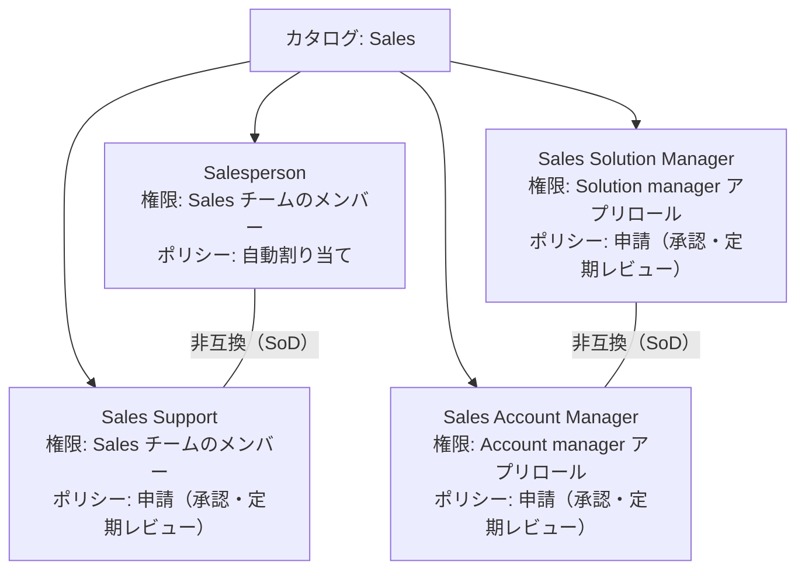

# 【勉強】IGA（アイデンティティガバナンス＆管理）— ロール設計（組織ロールをアクセスパッケージ／ロールで表現する）（2026-10-05）

## 今日のテーマ

「ロール設計」を学びます。IGA で「誰に何を持たせるか」を決める土台になる考え方で、これまでの申請・レビュー・SoD・JML の各回が、すべてこの設計の上に乗っています。

## 概要

これまでの IGA の回では、アクセスレビュー、アクセス要求、職務分掌（SoD）、ライフサイクル管理（JML）を見てきました。どれも「何を」配るかが決まっていて初めて動きます。その「何を」を、個別の権限（グループ、アプリの権限）の羅列ではなく、**役割（ロール）単位でまとめて定義する**のがロール設計です。

インフラの感覚に置き換えると、サーバーごとに sudoers を1行ずつ書く運用をやめて、「Web 運用担当」「DB 運用担当」といった**ロールを先に定義し、人にはロールだけ割り当てる**運用に変えることに近いです。

Microsoft の公式ドキュメントは、RBAC（ロールベースアクセス制御）を次のように説明しています。ユーザーに職種やプロジェクトといった属性を持たせ、その属性に応じて必要なツールやデータへのアクセスを与える枠組みです。異動で属性が変われば、前の職務にだけ必要だったアクセスは自動的に閉じます。

押さえたい点は、ロールを使うと**付与（入社時・異動時）、申請、レビュー、SoD のすべての単位が揃う**ことです。権限がバラバラのままだと、レビュー担当者は「この人がこのグループにいる理由」を毎回調べることになります。ロール単位なら「営業担当ロールの人か」で判断できます。

## 押さえる要点

### 用語の整理

- **組織ロール（ビジネスロール）**: 「営業担当」「経理担当」のような、業務上の役割。人事の視点で決まる。
- **権限（エンタイトルメント）**: アプリ内の具体的な権限。製品によって呼び方が違い、Entra ID では「リソースロール」（グループのメンバー、アプリのアプリロールなど）、SailPoint では entitlement と呼びます。
- **ロールマイニング**: 既存の権限割り当てから「同じ部署の人はだいたいこの権限を持っている」というパターンを見つけ、ロール候補を作る手法。

### Microsoft Entra ID Governance: アクセスパッケージでロールを表す

Microsoft は、**組織ロールをアクセスパッケージで表現する**方法を公式に案内しています。ロールモデルの概念と、エンタイトルメント管理（Entitlement management）の機能は次のように対応します。

- ロールの権限のまとまり → リソースロールを含めたアクセスパッケージ
- ロールの有効期間の制限 → ポリシーの有効期限
- 属性（部署など）に基づく自動付与 → **自動割り当てポリシー**
- 申請して承認されたら付与 → 申請ポリシー（承認付き）
- ロールメンバーの再認定 → ポリシー内の定期アクセスレビュー
- ロール間の職務分掌 → アクセスパッケージを**非互換（incompatible）**に設定

公式の例では、営業部門の4つのロールが、1つのカタログ内の4つのアクセスパッケージになります。

上の図は、ロール定義をそのままアクセスパッケージに写した構造です。非互換に設定すると、一方の割り当てを持つユーザーは他方を申請できず、管理者が直接割り当てることもできません。ただし非互換の設定は**片方向**です。図の線は、両方のパッケージで相手を非互換に設定した（双方向にした）ものとして描いています。

自動割り当てポリシーについて、公式ドキュメントから押さえたい点です。

- 属性ベースの規則を書くと、属性が変わったときに割り当てが自動で追加・削除されます。動きは動的グループに似ています。
- 作成できるのは **Identity Governance Administrator** 以上です。カタログオーナーやアクセスパッケージマネージャーは作成できません。
- 1つのアクセスパッケージにつき、自動割り当てポリシーは**原則1つ**にします。複数にする場合は、対象ユーザーが重ならないことが条件です。
- 1つのポリシーの規則が対象にできるのは、**最大15,000ユーザー**です。
- スコープから外れたユーザーのアクセスを、一定時間（時間・日単位）残す設定があります。異動直後に業務を引き継ぐ猶予として使えます。
- 規則の評価や属性変更の反映には、数分かかることがあります。
- ライセンスは Microsoft Entra ID Governance か Microsoft Entra Suite が必要です。
- 裏では、ポリシーごとに動的セキュリティグループが自動で作られます。このグループは手動で変更しないよう公式が注意しています。

### Okta Identity Governance: エンタイトルメントとバンドル

Okta では、アプリの権限を**エンタイトルメント**として Okta 上に保持し、それを**エンタイトルメントバンドル**にまとめます。バンドルは、複数のエンタイトルメントを一度に付与するための単位です。ユーザーは Access Requests（アクセス要求）でバンドルをセルフサービスで申請でき、申請は承認者に回ります。Okta は、この仕組みでアプリの権限管理にグループを使わずに済む、と説明しています。なお、バンドルを管理コンソールから直接ユーザーに割り当てることはできません。付与は、ユーザーの申請か Okta Identity Governance API で行います（エンタイトルメント単体は、ポリシーまたは個別に割り当てられます）。

筆者の理解では、Entra は「ロール＝1つのパッケージで、自動割り当て・申請・レビューの方法まで持つ」構造で、Okta は権限のまとめ方（バンドル）を軸にして申請につなぐ構造です。公式がこの違いを明言しているわけではないので、設計を比べるときの目安として読んでください。

### SailPoint Identity Security Cloud: ロールの種類

SailPoint ISC の公式ドキュメントでは、ロールは、エンタイトルメントとアクセスプロファイルを束ねたアクセスのまとまりと説明されています。

- **標準ロール**: エンタイトルメントとアクセスプロファイルをまとめる。
- **ダイナミックロール**: ロールディメンション（属性に応じた区分）で、1つのロールの中でも属性ごとに付与内容を変えられる。入社時に属性から与える「生まれつきのアクセス（birthright access）」を表せる、と公式は説明している。
- メンバーの決め方: 条件による**自動割り当て**と、アクセス要求による付与。
- 各ロールには、エンタイトルメントかアクセスプロファイルを最低1つ含めることになっています（公式の表現は should です）。
- ロールを使うには **Provisioning** が必要です。

## 手順や設定のイメージ

Entra で組織ロールを表す流れです。Microsoft の移行手順の要点を、順番に並べ直しました。

1. ロールが使うアプリを Entra ID に接続する（複数ロールのアプリは、アプリのマニフェストにロールを載せる）。
2. 規則で使う属性（部署など）が Entra ID にあることを確認する。HR システムや Entra Connect から取り込む。
3. 管理を委任する単位でカタログを作り、グループやアプリを登録する。
4. ロールごとにアクセスパッケージを作り、リソースロールを紐づける。
5. すでにロールを持つ人は、直接割り当てで移行する。
6. 自動割り当て、申請、レビュー、非互換の各ポリシーを足す。

## つまずきやすいところ・注意点

- **ロールの作りすぎ**: ロールの数が権限の数に近づくと、ロール設計の意味がなくなります。まず共通部分（Sales チームのメンバーなど）を土台のロールにし、追加の権限は別のロールとして重ねます。
- **属性が揃っていない**: 自動割り当ては、部署などの属性が正しく入っている前提です。HR 側のデータが汚れていると、誤った付与・剥奪が自動で起きます。
- **自動割り当て用の動的グループに触らない**: Entra が裏で作るグループは、他の用途に流用しないでください。
- **Entra の memberOf 演算子**: 自動割り当てポリシーの規則で `memberOf` を使っている場合、2026年11月3日以降はポリシーが隔離（quarantine）され、割り当ての追加・削除が止まります。公式は、その日までに別の属性ベースの規則へ作り直すよう案内しています。
- **ロールの変更は反映に時間がかかる**: SailPoint では、属性変更時はイベントベースでロール割り当てが調整され、そうでない場合は Apply Changes で identity processing を起動します。エンタイトルメントなどの削除を反映するには、Role change propagation を有効にし、ロールが enabled である必要があります。ロール変更を反映する処理は、テナントのタイムゾーンで毎日18:00に実行されると公式に書かれています。

## 今日のまとめ

### ミニ辞書

- **RBAC**: 役割に応じてアクセスを与える考え方。
- **ロールマイニング**: 既存の割り当てからロール候補を見つける手法。
- **アクセスパッケージ（Entra）**: リソースロールと、付与・期限・承認・レビューのルールをまとめた単位。
- **エンタイトルメントバンドル（Okta）**: 複数のエンタイトルメントをまとめて付与する単位。
- **ダイナミックロール（SailPoint）**: 属性ごとに付与内容を変えられるロール。
- **Birthright access**: 入社時に属性から自動で与える基本のアクセス。

### 理解度チェック

1. 「営業担当」ロールを Entra のアクセスパッケージで作り、部署が「Sales」の人に自動で付与するとき、使うポリシーの種類は何ですか。また、そのポリシーを作れる最小の管理ロールは何ですか。
2. 「Sales Solution Manager」と「Sales Account Manager」を同じ人が持てないようにするには、Entra で何を、どの向きで設定しますか。
3. ロールの数が増えすぎると、どんな問題が起きますか。

## 参考リンク

- [Govern access by migrating an organizational role model to Microsoft Entra ID Governance](https://learn.microsoft.com/entra/id-governance/identity-governance-organizational-roles)
- [Configure an automatic assignment policy for an access package in entitlement management](https://learn.microsoft.com/entra/id-governance/entitlement-management-access-package-auto-assignment-policy)
- [Change resource roles for an access package in entitlement management](https://learn.microsoft.com/entra/id-governance/entitlement-management-access-package-resources)
- [Configure incompatible access packages in entitlement management](https://learn.microsoft.com/entra/id-governance/entitlement-management-access-package-incompatible)
- [Configure dynamic membership groups with the memberOf attribute](https://learn.microsoft.com/entra/identity/users/groups-dynamic-rule-member-of)
- [Entitlement Management（Okta Help Center）](https://help.okta.com/en-us/content/topics/identity-governance/em/entitlement-mgt.htm)
- [Entitlement Bundles（Okta Help Center）](https://help.okta.com/en-us/content/topics/identity-governance/em/entitlement-bundles.htm)
- [Roles（SailPoint Identity Security Cloud）](https://documentation.sailpoint.com/saas/help/access/roles.html)
