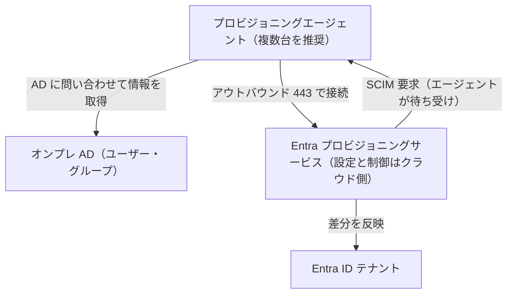
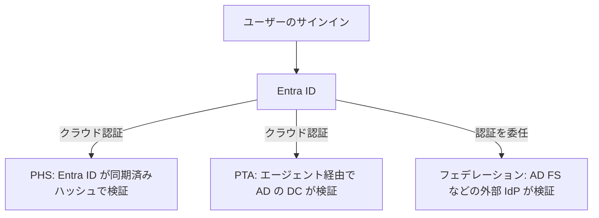

# 【勉強】Microsoft Entra ID — ハイブリッドID（Connect Sync・Cloud Sync・パスワードハッシュ同期）（2026-10-07）

## 今日のテーマ

オンプレミスの Active Directory（AD）にいるユーザーを Entra ID に「同期」する仕組み、つまりハイブリッドIDを学びます。同期ツールの Microsoft Entra Connect Sync と Microsoft Entra Cloud Sync の違い、そしてパスワードハッシュ同期（PHS）がどう動くかが中心です。これまでの Entra ID 編（SAML、SCIM、OIDC など）は「クラウド側にいる ID」の話でしたが、今日は「その ID がどこから来るのか」を扱います。

## 概要

多くの企業では、従業員のアカウントの原本が AD にあります。Microsoft 365 などのクラウドを使うには、そのアカウントを Entra ID にも用意しなければなりません。そこで、AD のユーザー・グループ・連絡先を Entra ID に複製し続ける同期ツールを使います。インフラ屋さんの言葉で言えば「AD → Entra ID の一方向レプリケーション」です（一部の書き戻し機能を除く）。

同期ツールは現在 2 種類あります。

- **Microsoft Entra Connect Sync**: オンプレミスのサーバーに同期エンジンをインストールして動かす従来型です。設定もオンプレミス側のサーバーに保存されます。
- **Microsoft Entra Cloud Sync**: 同期の設定と制御をクラウド側（Entra のプロビジョニングサービス）が持ち、オンプレミスには軽量な「プロビジョニングエージェント」だけを置く新しい方式です。

Microsoft の公式ドキュメントでは Cloud Sync を推奨しており、Connect Sync は「Cloud Sync が機能面で同等になった後に廃止される」と記載されています（廃止時期は未確定）。なお、Azure AD Connect V1 は 2022 年 8 月 31 日にサポート終了済みです。

## 押さえる要点

- **構成の違い**: Connect Sync は 1 台のサーバーがアクティブに同期するため、そのサーバーが止まると同期が止まります（スタンバイ用のステージングモードのサーバーを別途置く運用）。Cloud Sync は複数のエージェントを導入でき、1 台が落ちても他が処理を続ける自動フェイルオーバーになります（FAQ では常にアクティブなのは 1 台で、負荷分散は前提にしないとされています）。公式は高可用性のため 3 台を推奨しています。
- **Cloud Sync の通信**: エージェントは Entra 側へ外向き（アウトバウンド）の通信だけを行います。主に 443 番ポートです（証明書失効リスト取得に 80、443 が使えないときの状態報告用に任意で 8080）。受信用のポート開放は要りません。
- **Cloud Sync の得意分野**: 接続されていない複数の AD フォレスト（M&A 後など）を 1 つのテナントに同期できます。Entra ID から AD へのグループプロビジョニングも Cloud Sync だけの機能です。
- **Connect Sync が必要になりやすい場面**: 公式の比較表では、高度な同期ルール、フォレスト間参照、複数ドメインの属性マージ、ADFS 連携の構成などが Connect Sync のみ対応とされています。
- **サインイン方式は同期ツールとは別の選択**: PHS、パススルー認証（PTA）、フェデレーション（AD FS など）のどれを使うかは、同期技術とは独立した判断だと公式に書かれています。ただし Cloud Sync の比較表では PTA の構成や AD FS 連携のセットアップは Cloud Sync の対象外（別ツールで構成。PTA と Seamless SSO は移行後も動作）です。PHS は両方のツールで使えます。

下の図は Cloud Sync の構成です。エージェントは Azure Service Bus への常時アウトバウンド接続でクラウドからの SCIM 要求を待ち受け、AD への問い合わせ結果を返します。



### パスワードハッシュ同期（PHS）の仕組み

PHS は「パスワードそのもの」ではなく「ハッシュのさらにハッシュ」を送ります。公式の説明を要約すると次の流れです。

1. 2 分ごとに、同期エージェントが DC（ドメインコントローラー）から AD のパスワードハッシュ（MD4）を DC 間レプリケーションと同じ仕組みで取得する。
2. 取得したハッシュにユーザーごとのソルトを加え、PBKDF2（HMAC-SHA256 を 1,000 回）で加工し、TLS で Entra ID に送る。
3. サインイン時は、入力されたパスワードを同じ手順で加工し、Entra ID が保存した値と一致するかで認証する。

元の MD4 ハッシュは送られないため、Entra ID 側の値を盗まれてもオンプレミスで使い回すパス・ザ・ハッシュ攻撃には使えない、と説明されています。

下の図は、サインイン方式 3 種類の「認証する場所」の違いです。



## 設定のイメージ

Cloud Sync を導入する大まかな手順です。

1. クラウド専用（オンプレから同期されていない）の Hybrid Identity Administrator アカウントを用意する。オンプレが止まっても管理を続けるための保険です。
2. Entra にカスタムドメインを追加し、AD 側は IdFix ツールで属性の不備を洗い出しておく。
3. ドメイン参加済みの Windows Server（2016〜2025）にエージェントをインストールする。実行アカウントは gMSA（パスワード自動管理のサービスアカウント）で、インストール時に Domain/Enterprise Admin の資格情報で作られる。
4. Entra 管理センターで構成を作り、スコープ（OU やグループ）と PHS の有効化を設定する。

次は、PHS 対象ユーザーのパスワード有効期限の扱い（PasswordPolicies 属性）を確認する例です（Connect Sync の PHS ドキュメントの記載で、Cloud Sync で同じ挙動かは要確認）。

```powershell
Connect-MgGraph -Scopes "User.ReadWrite.All"
(Get-MgUser -UserId "<UPN or Object ID>" -Property PasswordPolicies).PasswordPolicies
```

## つまずきやすいところ・注意点

- **エージェントサーバーは最重要資産**: 公式は Control Plane（旧 Tier 0）相当の保護を求めています。NTLM は無効にし、特権アカウントには MFA を求めます。Windows Server Core へのインストールは非対応です。
- **PHS の既定動作**: PHS 対象ユーザーのクラウド側パスワードは、既定で「有効期限なし」になります。クラウド側でも期限を効かせたい場合は CloudPasswordPolicyForPasswordSyncedUsersEnabled 機能を使います。
- **アカウント状態の反映遅延**: PHS では、オンプレで無効化したアカウントがクラウドで使えなくなるまでに最大 30 分程度の遅れがあるとされています。パスワード期限切れ・ロックアウト・サインイン時間の制限をサインイン時に即時反映したい場合は PTA が選択肢です。
- **accountExpires は同期されない**: AD 側で期限切れになったアカウントが Entra ID では有効のまま残ります。
- **PHS は他方式とも併用が推奨**: PTA や AD FS を使う場合も、障害時の切替先と ID Protection の漏洩資格情報検出のために PHS を有効にすることが推奨されています（漏洩資格情報レポートは Entra ID P2 が必要）。PHS への切替は自動ではなく手動で、事前に PHS を有効にしておくことが前提です。
- **スケール上限**: 公式の比較表には Cloud Sync の上限としてドメインあたり 15 万オブジェクト、グループ 5 万メンバーとあります。Connect Sync より小さい値なので、導入前に最新の記載を確認してください。
- **ドキュメント間の食い違い（要確認）**: 同期間隔について、概要ページは 2 分ごと、FAQ は PHS が 2〜5 分、ユーザー・グループは約 10〜20 分としています。デバイス同期は、公式ページ上は Cloud Sync で別途有効化すれば対応とされますが（デバイスライトバックは非対応）、取得できた比較表の版により記載が異なったため、実環境で確認してください。

## 今日のまとめ

**ミニ辞書**

- **ハイブリッドID**: オンプレ AD とクラウドの Entra ID を連携させて 1 つの ID として使う構成。
- **Connect Sync**: オンプレのサーバーで動く従来型の同期ツール。
- **Cloud Sync / プロビジョニングエージェント**: 設定をクラウドに置き、軽量エージェントで AD とつなぐ新方式。
- **PHS（パスワードハッシュ同期）**: パスワードのハッシュを加工して Entra ID に同期し、クラウド側で認証する方式。
- **PTA（パススルー認証）**: パスワード検証をオンプレの DC に任せる方式。
- **gMSA**: パスワードを自動管理するグループ管理サービスアカウント。

**理解度チェック**

1. Cloud Sync が Connect Sync より高可用性を作りやすいのはなぜですか。
2. オンプレで無効化した AD アカウントを、サインイン時に即座にクラウドで拒否したい場合、PHS と PTA のどちらが向いていますか。その理由も説明してください。
3. PTA や AD FS を使っているのに、PHS も有効にしておくことが推奨されるのはなぜですか。

## 参考リンク

- [What is Microsoft Entra Cloud Sync?](https://learn.microsoft.com/en-us/entra/identity/hybrid/cloud-sync/what-is-cloud-sync)
- [Migrate from Microsoft Entra Connect to Cloud Sync: Decision Guide](https://learn.microsoft.com/en-us/entra/identity/hybrid/cloud-sync/connect-to-cloud-sync-decision-guide)
- [Prerequisites for Microsoft Entra Cloud Sync](https://learn.microsoft.com/en-us/entra/identity/hybrid/cloud-sync/how-to-prerequisites)
- [Microsoft Entra Cloud Sync FAQ](https://learn.microsoft.com/en-us/entra/identity/hybrid/cloud-sync/reference-cloud-sync-faq)
- [Implement password hash synchronization with Microsoft Entra Connect Sync](https://learn.microsoft.com/en-us/entra/identity/hybrid/connect/how-to-connect-password-hash-synchronization)
- [Choose the right authentication method for your Microsoft Entra hybrid identity solution](https://learn.microsoft.com/en-us/entra/identity/hybrid/connect/choose-ad-authn)
- [Microsoft Entra Connect Sync: Understand and customize synchronization](https://learn.microsoft.com/en-us/entra/identity/hybrid/connect/how-to-connect-sync-whatis)
- [Introduction to Microsoft Entra Connect V2](https://learn.microsoft.com/en-us/entra/identity/hybrid/connect/whatis-azure-ad-connect-v2)
