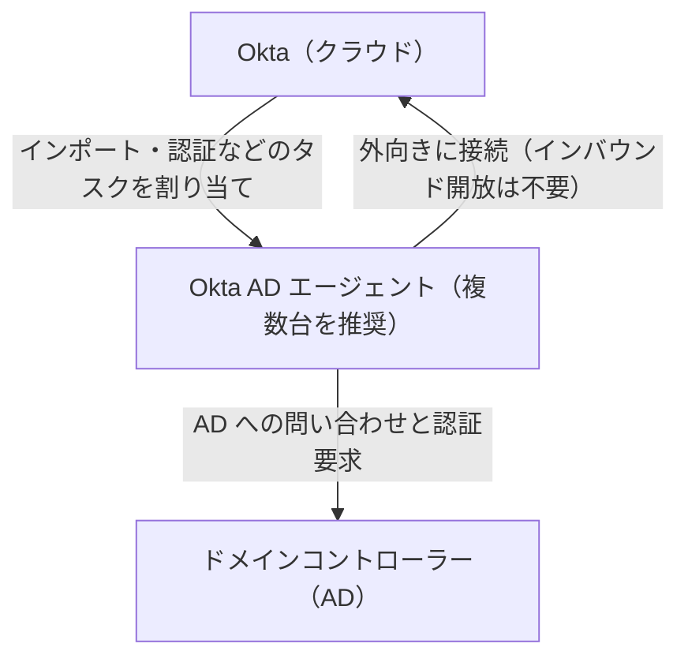
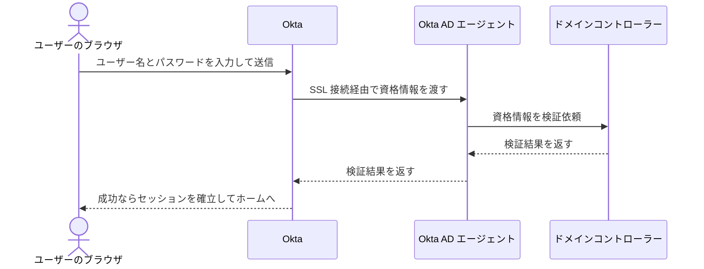

# 【勉強】Okta Workforce Identity Cloud — Active Directory 連携（Okta AD エージェント・委任認証・インポート）（2026-10-08）

## 今日のテーマ

オンプレミスの Active Directory（AD）と Okta Workforce Identity Cloud をつなぐ「AD 連携」を学びます。中心は、Okta AD エージェント、Delegated Authentication（委任認証）、AD からのインポートです。Entra ID 編のハイブリッドID（Connect Sync・Cloud Sync）と同じ立ち位置のテーマで、「ID の原本が AD にあるとき、Okta にどう取り込み、パスワードをどこで検証するか」を扱います。

## 概要

（本記事の委任認証・インポート設定・インストール手順は、公式ヘルプのうち Classic Engine 向けの記述に基づく部分があります。）

多くの企業ではアカウントの原本が AD にあります。Okta で SSO を提供するには、そのユーザーとグループを Okta に用意する必要があります。Okta は、AD のあるネットワーク内に **Okta AD エージェント**（Windows サービスとして動く小さなソフトウェア）を置き、そこを窓口にして AD とやり取りします。

- **ユーザー・グループのインポート**: AD から Okta へ取り込みます（フルインポートと増分インポートがあります）。
- **認証の委任（Delegated Authentication）**: サインイン時のパスワード検証を AD に任せます。Okta Classic Engine のドキュメントでは、AD を Okta に統合すると既定で有効と説明されています。
- **Okta から AD への書き込み（Provision to Directory）**: ユーザー・パスワード・グループを Okta から AD へ反映する機能も別にあります（今日は深追いしません）。

インフラの言葉に置き換えると、AD エージェントは「社内ネットワークからクラウドへ向けて張るリバースプロキシ的な中継役」です。公式 FAQ には「エージェントはアウトバウンドのみで、ファイアウォールのインバウンドを開ける必要はない」と明記されています。

下の図は全体の構成です。エージェントがファイアウォールの内側から Okta へ外向きに接続し、DC（ドメインコントローラー）への問い合わせを中継します。

## 押さえる要点

- **エージェントの前提条件**（公式の前提条件ページより）: Windows Server 2016 / 2019 / 2022 / 2025、.NET 4.6.2 以降、2 CPU・8 GB RAM 以上。ホストは AD ドメインのメンバーサーバーが推奨で、DC に入れる必要はありません。ユーザーと同じ AD フォレストに置きます。一方、FAQ はエージェントサーバーに 16 GB 以上の RAM を推奨しています。ページ間で数字が違うため、実際の設計では最新の記載を確認してください。
- **サービスアカウント**: 既定は OktaService で、既存のドメインユーザーや管理されたサービスアカウント（エージェント 3.6.0 以降）、インストーラーで gMSA（パスワード自動管理のアカウント）の指定も可能です。必要な権限は機能で変わり、インポートだけなら読み取りですが、パスワード設定やグループ書き込みには委任が要ります。
- **冗長化**: 各ドメインに 2 台以上（冗長化ページ）、ユーザーが 3 万人を超える環境は 3 台以上（前提条件ページ）を推奨しています。エージェントは Okta に定期メッセージを送り、120 秒受信がないと「利用不可」としてキューから外されます。タスクの割り当てはランダムで、ユーザーに近い場所に置いても速くはなりません。同一ドメイン内のエージェントは同じバージョンに揃えることが前提条件ページに書かれています（混在すると最古のエージェントの水準で動きます）。
- **インポート設定**: User OU / Group OU（Early Access）や LDAP フィルター（ユーザーの既定は `sAMAccountType=805306368`、グループは `objectCategory=group`）で対象を絞ります。フィルターの変更はユーザーやグループの非アクティブ化につながり得るため、事前にテストが推奨されています。インポートの実行頻度は設定できます（時刻指定の可否は確認したページに記載がなく、要確認）。
- **ユーザー名の形式**: UPN、メールアドレス、SAM アカウント名＋ドメイン、Okta Expression Language によるカスタムから選びます。**最初のインポート前に決めてください**。後から変えると既存ユーザーにエラーが出る可能性があると公式に警告されています。
- **「AD が Okta ユーザーのソース」設定**: 既定で有効で、AD が属性の正となり Okta 側のプロファイルは編集できなくなります。

## 手順や設定のイメージ

Okta Admin Console での導入の流れです（公式のインストール手順より）。

1. エージェントを入れるサーバー上で Admin Console にサインインし、**Directory > Directory Integrations > Add Directory > Add Active Directory** を開く。
2. 要件を確認して **Set Up Active Directory** を押し、エージェントをダウンロードする。
3. インストーラーでドメインとサービスアカウントを選ぶ（gMSA の場合はアカウント名の末尾に `$` を付け、パスワードは空にする）。必要ならプロキシも指定する。
4. 組織の URL を入力し、表示されたアクティベーションコードをブラウザで入力して **Allow Access** を押す。
5. インポート対象の OU、ユーザー名形式、属性を選んで完了する。

SSL/TLS の信頼エラーが出る場合、公式は okta.com を SSL プロキシのバイパス対象にするか、証明書ピンニングを無効にするよう案内しています。

次の図は、サインイン時の Delegated Authentication の流れです。パスワードはブラウザから Okta に届き、エージェント経由で DC が検証します。

## つまずきやすいところ・注意点

- **委任認証では AD が検証の正**: 公式ページは AD を「資格情報検証の最終的な正」と説明しています。パスワード変更や無効化は即座に Okta へ反映されます。エージェントや DC に届かないときの挙動は、今日確認したページには記載がなく**要確認**です。だからこそ冗長化が重要です。
- **「Access this computer from the network」**: エージェントを入れたサーバーで、ドメインユーザーにこのセキュリティポリシーを割り当てないと委任認証が動きません。インフラ出身の方には馴染み深い設定ですが、見落としやすい点です。
- **JIT（Just-In-Time）との関係**: 「Create and update users on login」は初回の AD 委任認証サインイン時に Okta プロファイルを作成する機能で、委任認証が前提です。選択した OU の外のユーザーはサインインできません。
- **グループの扱い**: 配布グループ（DG）はインポート時のみ同期され、JIT では対象外です。配布グループのメンバーシップは、ユーザーとグループが同一ドメインにある場合のみ同期されます。「Skip users during import」を選ぶと DG・USG のメンバーシップは取り込まれません。ユニバーサルセキュリティグループのドメイン間メンバーシップは、双方向の信頼がある場合に限られます。
- **パスワード同期は別物**: AD パスワード同期エージェント（AD→Okta）は DC への追加インストールが要る別機能です。公式ページには「委任認証が有効だと Okta にパスワードは同期されない」という記述と、「前提条件に委任認証が有効」という記述が並んでおり、矛盾して読めます。**要確認**として、まずは委任認証を基本に理解してください。
- **ポート番号は今日の調査では未確認**: エージェントの外向き通信が使うポートは、確認したページに具体的記載がありませんでした。FW 設計の前に Okta のネットワーク要件ページで確認してください。
- **自動インストールは不可**: FAQ に「エージェントのインストールを自動化する方法はない」とあります。IaC 派のインフラ屋さんには少し残念なポイントです。

## 今日のまとめ

**ミニ辞書**

- **Okta AD エージェント**: AD と Okta をつなぐ、外向き接続専用の中継ソフトウェア。
- **Delegated Authentication**: パスワード検証を AD の DC に任せる方式。
- **JIT**: 初回サインイン時に Okta ユーザーを作成・更新する機能。
- **User / Group Filter**: インポート対象を LDAP フィルターで絞る設定。
- **gMSA**: パスワードが自動管理されるサービスアカウント。

**理解度チェック**

1. エージェントがアウトバウンド専用であることは、ファイアウォール設計にどう効きますか。
2. エージェントを 1 台しか置かないと、委任認証でどんな問題が起き得ますか。
3. ユーザー名形式を最初のインポート後に変更してはいけないのはなぜですか。

## 参考リンク

- [Active Directory integration prerequisites](https://help.okta.com/oie/en-us/content/topics/directory/ad-agent-prerequisites.htm)
- [Multiple Okta Active Directory agents](https://help.okta.com/oie/en-us/content/topics/directory/ad-agent-multiple-agents.htm)
- [Install the Okta Active Directory agent](https://help.okta.com/en-us/Content/Topics/Directory/ad-agent-new-integration.htm)
- [Configure Active Directory import and account settings](https://help.okta.com/en-us/content/topics/directory/ad-agent-configure-import.htm)
- [Supported Active Directory integration features](https://help.okta.com/oie/en-us/Content/Topics/directory/ad-feature-support.htm)
- [Delegated authentication with Active Directory](https://help.okta.com/en-us/content/topics/directory/directory_ad_delegated_authentication.htm)
- [Synchronize passwords from Active Directory to Okta](https://help.okta.com/en-us/content/topics/directory/installing_configuring_active_directory_password_sync_agent.htm)
- [Active Directory integration FAQ](https://help.okta.com/oie/en-us/content/topics/directory/directory_faq_okta_and_ad_groups.htm)
